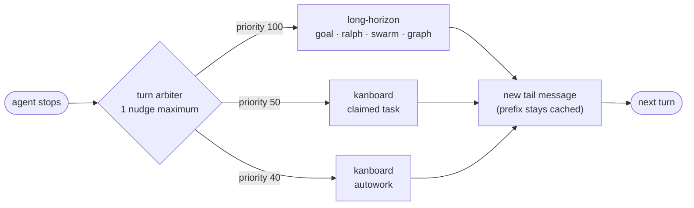

<p align="center">
  
</p>

<h1 align="center">UniPi</h1>

<p align="center">
  <b>Extensions that make the Pi coding agent finish long work, remember it and show it.</b>
</p>

<p align="center">
  <a href="https://www.npmjs.com/package/@pi-unipi/unipi"></a>
  <a href="https://github.com/Neuron-Mr-White/unipi/actions/workflows/ci.yml"></a>
  <a href="./LICENSE"></a>
  
</p>

<p align="center">
  <a href="docs/guide/getting-started.md">Getting started</a> ·
  <a href="docs/README.md">Docs</a> ·
  <a href="docs/architecture/README.md">Architecture</a> ·
  <a href="docs/reference/commands.md">Commands</a> ·
  <a href="docs/story/unicrab.md">Meet Unicrab</a> ·
  <a href="CHANGELOG.md">Changelog</a>
</p>

## Install

```bash
pi install npm:@pi-unipi/unipi
```

UniPi needs [Pi](https://www.npmjs.com/package/@earendil-works/pi-coding-agent)
`0.87.1` or later. This command installs 21 extension packages. Each package
also works alone.

<p align="center">
  
</p>

The glance footer frames the input box. It shows the git branch, the mode, the
context use and the model. After each turn, the strip below it shows turns,
steps, wall time, tool time, time to first token, tokens per second and cache
hits.

## Why UniPi

Pi is a small coding agent for the terminal. It reads files, edits files and
runs commands. UniPi adds the parts that a long session needs.

| UniPi gives you | How | Proof in the code |
|---|---|---|
| **Work that finishes** | `/unipi:goal` keeps one objective until a separate verifier agrees that it is true. | 50 turns by default (200 maximum). A pause after 8 turns without progress or 5 `not_met` verdicts. |
| **One driver for each turn** | A turn arbiter selects one continuation when the agent stops. | 1 nudge for each stop. Priorities: goal 100, board claims 50, autowork 40. |
| **Compaction with no model call** | The default `vcc` method rebuilds the summary from the full session history with fixed rules. | 0 LLM calls. The summary cannot grow from an earlier summary. |
| **A warm prompt cache** | Changing state goes into new tail messages. The system prompt and tool list stay the same. | Rules from a study of 8,019 requests. |
| **Parallel hands** | A lead model gives work to a lower-cost sidekick, to subagents or to background tasks. | Up to 8 subagents at once. 1 persistent sidekick for each session. |
| **A board for deferred work** | Kanboard keeps tasks in Markdown files, with a web UI and a terminal UI. | One Rust binary writes every change and checks every transition rule. |
| **Memory between sessions** | Facts and decisions go to Markdown files and to a MemPalace index. | Four memory types: preference, decision, pattern and summary. |
| **Hang detection** | Watchdog asks a small judge model about long tool calls. | 2 agreeing checks at confidence 0.8 or more before a kill. |

## Kanboard

Kanboard is a task board for each project. You and the agent use the same
board. The agent claims a task, works it, and sends it to review with a
summary. You approve it or send it back with a note.

<p align="center">
  
</p>

The dashboard shows what needs you across all projects. You can approve a
review or answer a blocked question in one click.

<p align="center">
  
</p>

- Run `/unipi:kanboard open` to open the board in your browser.
- Run `/unipi:kanboard-add <title>` to add a task without an agent turn.
- Run `/unipi:kanboard-do <request>` to give the agent a budget of tasks and
  board writes.
- Run `/unipi:kanboard-autowork start` to let the agent work every ready task.

The screenshots use demo data. Read the [Kanboard README](packages/kanboard/README.md).

## Harness architecture

UniPi adds these mechanisms to the Pi harness. Each page gives the problem, a
diagram, the limits from the source, and the files to read.

| Mechanism | Problem it solves |
|---|---|
| [Event bus](docs/architecture/event-bus.md) | 21 packages must work together without import-time coupling. |
| [Turn arbiter](docs/architecture/turn-arbiter.md) | Several packages want to continue the run when the agent stops. Only one may act. |
| [Prefix cache](docs/architecture/prefix-cache.md) | One changed byte in the request prefix makes the provider bill the full context again. |
| [Compaction](docs/architecture/compaction.md) | A summary must keep the live task, and it must not grow at each compaction. |
| [Long-horizon](docs/architecture/long-horizon.md) | Multi-turn work needs one driver, a separate judge and hard budgets. |
| [Delegation](docs/architecture/delegation.md) | Work goes to other models and processes. Each one needs a known context boundary. |
| [Harness messages](docs/architecture/harness-messages.md) | Text from the harness reaches the model as user text. The user must see where it came from. |
| [Watchdog](docs/architecture/watchdog.md) | A timer cannot tell a hung command from a slow build. |



## Packages

| Area | Packages |
|---|---|
| Finish long work | [Long-Horizon](packages/long-horizon/README.md) · [Workflow](packages/workflow/README.md) · [Kanboard](packages/kanboard/README.md) |
| Keep context | [Compactor](packages/compactor/README.md) · [Memory](packages/memory/README.md) |
| Work in parallel | [Fusion](packages/fusion/README.md) · [Subagents](packages/subagents/README.md) · [Background Tasks](packages/background-tasks/README.md) · [BTW](packages/btw/README.md) |
| Reach outside | [Web API](packages/web-api/README.md) · [MCP](packages/mcp/README.md) · [Notify](packages/notify/README.md) |
| Stay safe | [Watchdog](packages/watchdog/README.md) · [Skill Registry](packages/skill-registry/README.md) · [Ask User](packages/ask-user/README.md) |
| See and control | [Footer](packages/footer/README.md) · [Info Screen](packages/info-screen/README.md) · [Input Shortcuts](packages/input-shortcuts/README.md) · [Command Enchantment](packages/autocomplete/README.md) |
| Maintain | [Utility](packages/utility/README.md) · [Updater](packages/updater/README.md) · [Core](packages/core/README.md) |

The [docs index](docs/README.md#packages) gives one line and the npm name for
each package.

## Meet Unicrab


Unicrab is the UniPi mascot. It started as the author's pet crab. Now it says
hello when Pi starts and leaves hints above the input box. Press `Alt+H` for the
next hint.

Read [The making of Unicrab](docs/story/unicrab.md): from a real crab, to pixel
art, to a terminal character that is 7 columns wide.

<p align="center">
  
</p>

## Docs

- [Getting started](docs/guide/getting-started.md)
- [Commands](docs/reference/commands.md) · [Agent tools](docs/reference/tools.md) · [Shortcuts](docs/reference/shortcuts.md) · [Settings](docs/reference/settings.md) · [Glossary](docs/reference/glossary.md)
- [Architecture](docs/architecture/README.md)
- [All docs](docs/README.md)

The docs use STE-flavored English
([ASD-STE100](https://www.asd-ste100.org/)): short sentences, active voice and
one meaning for each word. The [style guide](docs/contributing/docs-style.md)
gives the rules.

## Development

```bash
git clone https://github.com/Neuron-Mr-White/unipi.git
cd unipi
npm install
npm run typecheck
npm test
```

To add a package:

1. Create `packages/<name>/` with a `package.json` and an `index.ts`.
2. Import events and constants from `@pi-unipi/core`.
3. Emit `MODULE_READY` when the package loads.
4. Add the package to `packages/unipi/index.ts` and to the root
   `package.json`.
5. Run `npm run typecheck` and `npm test`.

Packages talk over events and shared state holders. Import from
`@pi-unipi/core`, not from a peer package. The
[event bus page](docs/architecture/event-bus.md) explains the rules.

## Contributing

1. Fork the repository.
2. Create a branch.
3. Make your change.
4. Run `npm run typecheck` and `npm test`.
5. Open a pull request.

Keep one job in each package. For docs, follow the
[style guide](docs/contributing/docs-style.md).

## License

MIT © Neuron Mr White
