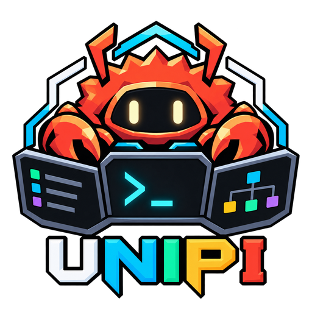
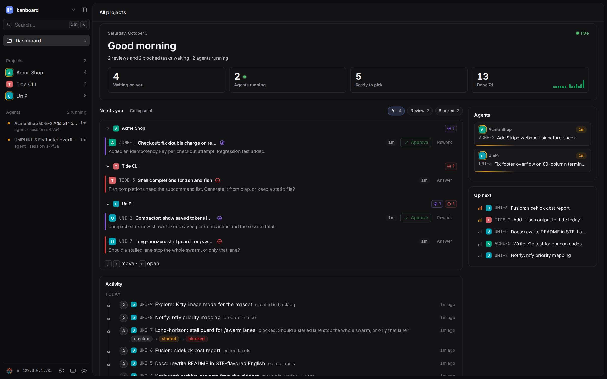
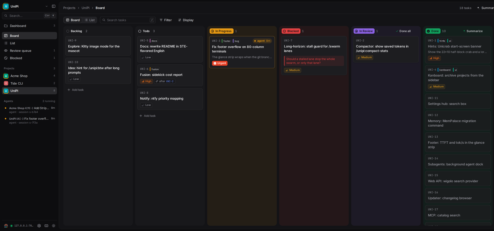
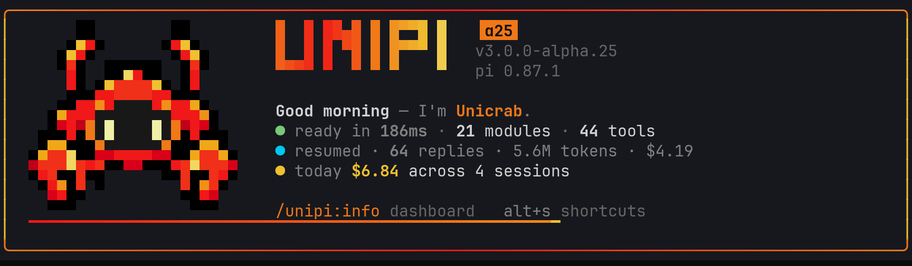
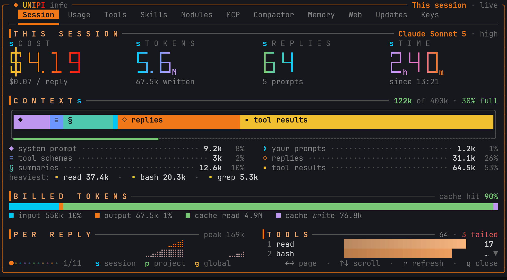
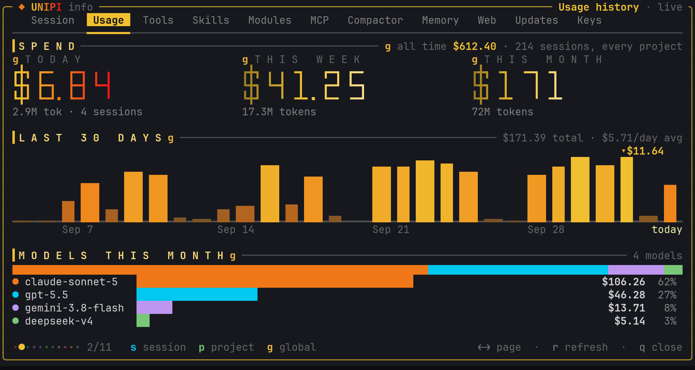
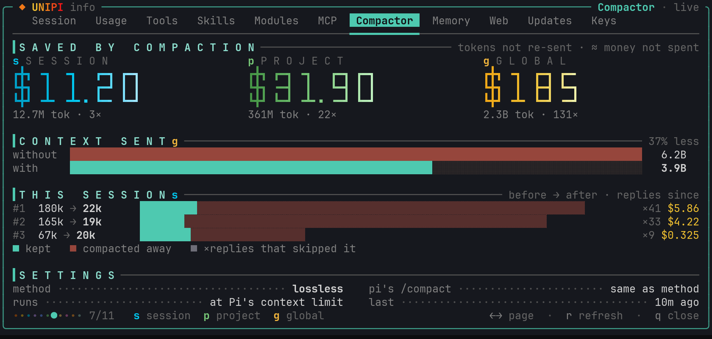

<p align="center">
  
</p>

<h1 align="center">UniPi</h1>

<p align="center">
  <b>Extensions that make the Pi coding agent finish long work, remember it and show it.</b>
</p>

<p align="center">
  <a href="https://www.npmjs.com/package/@pi-unipi/unipi"></a>
  <a href="https://github.com/Neuron-Mr-White/unipi/actions/workflows/ci.yml"></a>
  <a href="./LICENSE"></a>
  
</p>

<p align="center">
  <a href="docs/guide/getting-started.md">Getting started</a> ·
  <a href="docs/README.md">Docs</a> ·
  <a href="docs/architecture/README.md">Architecture</a> ·
  <a href="docs/reference/commands.md">Commands</a> ·
  <a href="docs/story/unicrab.md">Meet Unicrab</a> ·
  <a href="CHANGELOG.md">Changelog</a>
</p>

## Install

```bash
pi install npm:@pi-unipi/unipi@alpha
```

> [!NOTE]
> **UniPi 3 is in alpha.** This README describes v3, published under the npm
> `alpha` tag. Plain `pi install npm:@pi-unipi/unipi` still installs the stable
> 2.x line ([2.x README](https://github.com/Neuron-Mr-White/unipi/tree/main#readme)).
> To update an alpha install: `pi update npm:@pi-unipi/unipi@alpha`. To go back
> to stable: `pi install npm:@pi-unipi/unipi@latest`.

UniPi needs [Pi](https://www.npmjs.com/package/@earendil-works/pi-coding-agent)
`0.87.1` or later. This command installs 21 extension packages. Each package
also works alone.

> [!TIP]
> **Windows:** web reads use a native module that needs the Microsoft Visual
> C++ 2015-2022 runtime. Most Windows installs have it; slimmed images such as
> tiny11 do not. Without it UniPi still loads and web reads fall back to plain
> fetch. To install it, run
> `winget install Microsoft.VCRedist.2015+.x64` or download
> [vc_redist.x64.exe](https://aka.ms/vs/17/release/vc_redist.x64.exe).
> `/unipi:doctor` reports whether it is missing.

<p align="center">
  
</p>

This screenshot shows one turn in a demo session:

- **Simple mode** (the default) shows each tool call as one line.
- **Memory** finds the test setup from an earlier session and saves a new fact
  for later sessions.
- **The glance footer** frames the input box. It shows the git branch, the
  mode, the context use and the model. The strip below it shows tokens in and
  out, cost, speed, turns, time and cache hits. It fits itself to the window:
  on a narrow screen the less important parts drop out first.

## Why UniPi

Pi is a small coding agent for the terminal. It reads files, edits files and
runs commands. UniPi adds the parts that a long session needs.

| UniPi gives you | How |
|---|---|
| **Memory between sessions** | Facts and decisions go to Markdown files and to a MemPalace index. |
| **Two models as one** | Fusion pairs a lead model with a sidekick model. |
| **Work that finishes** | `goal`, `ralph`, `swarm` and `graph` modes keep the agent on a long task. |
| **A warm prompt cache** | Changing state goes into new tail messages. The prefix stays the same. |
| **One driver for each turn** | A turn arbiter selects one continuation when the agent stops. |
| **Compaction with no model call** | The default `vcc` method rebuilds the summary from the full session history. |
| **Parallel hands** | Subagents and background tasks work while the lead continues. |
| **A board for deferred work** | Kanboard keeps tasks in Markdown files, with a web UI and a terminal UI. |
| **Hang detection** | Watchdog asks a small judge model about long tool calls. |
| **A short transcript** | Simple mode shows one line for each tool call. Ctrl+O expands it. |
| **A view of the session** | `/unipi:info` shows cost, context use, spend history and what compaction saved. |
| **A recap at the end** | The `summarize` skill gives the answer first, then open items, in plain words. |

## Proof

Each feature below exists because published results support it. The numbers
come from the linked sources. They are not UniPi benchmarks.

| Feature | Benchmark | Source |
|---|---|---|
| **Memory** | 96.6% recall@5 on LongMemEval, with raw semantic search and 0 API calls. | [MemPalace](https://github.com/MemPalace/mempalace) · [LongMemEval](https://arxiv.org/abs/2410.10813) |
| **Fusion** | Frontier-level FrontierCode score at up to 60% lower cost. | [Devin Fusion](https://cognition.com/blog/devin-fusion) |
| **Fusion with two frontier models** | 69.0% on DRACO for two frontier models together. The best single model scored 65.3%. | [OpenRouter Fusion](https://openrouter.ai/blog/announcements/fusion-beats-frontier/) · [Mixture-of-Agents](https://arxiv.org/abs/2406.04692) |
| **Goal** | HumanEval pass@1 went from 80% to 91% with a loop on test feedback. | [Reflexion](https://arxiv.org/abs/2303.11366) · [Self-authored verification](https://arxiv.org/abs/2607.24300) |
| **Ralph** | Six repositories overnight for $297 in API cost (a reported hackathon result). | [Ralph loop](https://ghuntley.com/ralph/) · [YC hackathon report](https://paddo.dev/blog/ralph-wiggum-autonomous-loops/) |
| **Swarm** | 90.2% higher than a single agent on Anthropic's research eval. | [Anthropic multi-agent research](https://www.anthropic.com/engineering/multi-agent-research-system) |
| **Graph** | Up to 3.7× lower latency, 6.7× lower cost and about 9% higher accuracy than ReAct. | [LLMCompiler (ICML 2024)](https://arxiv.org/abs/2312.04511) |
| **Prefix cache** | Up to 90% lower cost and 85% lower latency for long prompts. | [Anthropic prompt caching](https://claude.com/blog/prompt-caching) · [Modular handbook](https://handbook.modular.com/inference-optimization/prefix-caching/) · [our cache study](docs/deepseek-cache-rate-research.md) |

Long work matters more each year. METR measured that the length of software
tasks that agents can finish doubles about every 7 months
([METR](https://metr.org/blog/2025-03-19-measuring-ai-ability-to-complete-long-tasks/)).
UniPi gives these longer runs memory, budgets and a verifier.

Two notes on the sources. OpenRouter's Fusion uses a panel of models and a
judge. UniPi Fusion uses a lead and a sidekick. The Ralph numbers are a
reported result, not a controlled benchmark.

The [architecture pages](docs/architecture/README.md) show how each mechanism
works in UniPi, with the limits from the source.

## Kanboard

Kanboard is a task board for each project. You and the agent use the same
board. The agent claims a task, works it, and sends it to review with a
summary. You approve it or send it back with a note.

<p align="center">
  
</p>

The dashboard shows what needs you across all projects. You can approve a
review or answer a blocked question in one click.

<p align="center">
  
</p>

- Run `/unipi:kanboard open` to open the board in your browser.
- Run `/unipi:kanboard-add <title>` to add a task without an agent turn.
- Run `/unipi:kanboard-do <request>` to give the agent a budget of tasks and
  board writes.
- Run `/unipi:kanboard-autowork start` to let the agent work every ready task.

The screenshots use demo data. Read the [Kanboard README](packages/kanboard/README.md).

## See your session: `/unipi:info`

Pi starts. Unicrab says hello and gives you three facts: how fast Pi got
ready, the session you came back to, and what you spent today. Then it goes
away. It does not take your keys, so you can type your first prompt at once.

<p align="center">
  
</p>

Run `/unipi:info` when you want the full picture. The first page is about
**this session**. It answers the questions you ask during long work:

- **What did this cost?** Cost, tokens, replies and time, in large digits.
- **What fills my context?** A bucket shows each part in its own colour:
  system prompt, tool schemas, summaries, your prompts, replies and tool
  results. The edge of the bucket shows how full the window is. It turns
  amber at 70% and red at 90%.
- **Which tool output is the heaviest?** The page names the three largest.
- **Which tools failed?** Each tool gets a bar, and failures show in red.

<p align="center">
  
</p>

The other pages answer the questions that come later:

| Page | It shows |
|---|---|
| Usage | Spend today, this week and this month, a 30-day chart, and the share of each model. |
| Compactor | Tokens that compaction kept out of your requests, and the money that saved. |
| Tools · Skills · Modules | What Pi loaded, where it came from, and what each UniPi module adds. |
| MCP · Memory · Web · Updates · Keys | The state of each module. |

<table>
  <tr>
    <td></td>
    <td></td>
  </tr>
</table>

A small letter before a number tells you its scope: **`s`** is this session,
**`p`** is this project and **`g`** is every project on this machine. Numbers
from one project never show in another.

How the Compactor page counts: each compaction makes the context smaller.
Every reply after it sends that smaller context. The page multiplies the
tokens removed by the number of replies that followed. Then it prices them at
the rate you paid for context. A free model saves tokens but no money.

Keys: `←`/`→` or `1`–`9` change the page, `r` refreshes it, `q` closes it.
`/unipi:info usage` opens one page. The dashboard opens at once on cached
numbers, then updates them in the background. The screenshots use demo data.
Read the [Info Screen README](packages/info-screen/README.md).

## Harness architecture

UniPi adds these mechanisms to the Pi harness. Each page gives the problem, a
diagram, the limits from the source, and the files to read.

| Mechanism | Problem it solves |
|---|---|
| [Event bus](docs/architecture/event-bus.md) | 21 packages must work together without import-time coupling. |
| [Turn arbiter](docs/architecture/turn-arbiter.md) | Several packages want to continue the run when the agent stops. Only one may act. |
| [Prefix cache](docs/architecture/prefix-cache.md) | One changed byte in the request prefix makes the provider bill the full context again. |
| [Compaction](docs/architecture/compaction.md) | A summary must keep the live task, and it must not grow at each compaction. |
| [Long-horizon](docs/architecture/long-horizon.md) | Multi-turn work needs one driver, a separate judge and hard budgets. |
| [Delegation](docs/architecture/delegation.md) | Work goes to other models and processes. Each one needs a known context boundary. |
| [Harness messages](docs/architecture/harness-messages.md) | Text from the harness reaches the model as user text. The user must see where it came from. |
| [Watchdog](docs/architecture/watchdog.md) | A timer cannot tell a hung command from a slow build. |


## Packages

| Area | Packages |
|---|---|
| Finish long work | [Long-Horizon](packages/long-horizon/README.md) · [Workflow](packages/workflow/README.md) · [Kanboard](packages/kanboard/README.md) |
| Keep context | [Compactor](packages/compactor/README.md) · [Memory](packages/memory/README.md) |
| Work in parallel | [Fusion](packages/fusion/README.md) · [Subagents](packages/subagents/README.md) · [Background Tasks](packages/background-tasks/README.md) · [BTW](packages/btw/README.md) |
| Reach outside | [Web API](packages/web-api/README.md) · [MCP](packages/mcp/README.md) · [Notify](packages/notify/README.md) |
| Stay safe | [Watchdog](packages/watchdog/README.md) · [Skill Registry](packages/skill-registry/README.md) · [Ask User](packages/ask-user/README.md) |
| See and control | [Footer](packages/footer/README.md) · [Info Screen](packages/info-screen/README.md) · [Input Shortcuts](packages/input-shortcuts/README.md) · [Command Enchantment](packages/autocomplete/README.md) |
| Maintain | [Utility](packages/utility/README.md) · [Updater](packages/updater/README.md) · [Core](packages/core/README.md) |

The [docs index](docs/README.md#packages) gives one line and the npm name for
each package.

## Meet Unicrab


Unicrab is the UniPi mascot. It started as the author's pet crab. Now it says
hello when Pi starts and leaves hints above the input box. Press `Alt+H` for the
next hint, or run `/unipi:hint` to read all 127 of them.

After an update, the first hint tells you what is new in that release.

Read [The making of Unicrab](docs/story/unicrab.md): from a real crab, to pixel
art, to a terminal character that is 7 columns wide.

<p align="center">
  
</p>

## What's new

The recent releases, in short. The [changelog](CHANGELOG.md) has the details.

| Release | What changed for you |
|---|---|
| alpha.36 | One work tray for background tasks and subagents (press ↓ on an empty input); nothing spins under the editor any more. `/unipi:visualize-progress` shows a long run live. Dream (off by default, `/unipi:dream`) learns from past sessions. Typed commands show as normal messages, and you get one "finished" notification per run. |
| alpha.29 | Plan mode plans with you: it asks before it submits, blocks only edits outside the plan, and the review shows a summary beside the steps. Notify can alert on any prompt the agent waits on (Input Needed). |
| alpha.27 | The footer shows tokens in and out and the session cost under the input. It fits narrow and short windows. Each part of the stats line, the frame badges and the rainbow can be turned off in `/unipi:settings` → Footer. The classic footer is gone. |
| alpha.25 | The Unicrab splash at startup. A new `/unipi:info`: this session, the context bucket, compaction savings and `s`/`p`/`g` scope tags. Prompts that UniPi sends for you (goal, summarize, answer) show as a UniPi panel, not as your own message. |
| alpha.24 | The `summarize` skill and `/unipi:summarize [focus]`. Long work ends with a short recap: the answer first, then findings, open items and questions. |

## Docs

- [Getting started](docs/guide/getting-started.md)
- [Commands](docs/reference/commands.md) · [Agent tools](docs/reference/tools.md) · [Shortcuts](docs/reference/shortcuts.md) · [Settings](docs/reference/settings.md) · [Glossary](docs/reference/glossary.md)
- [Architecture](docs/architecture/README.md)
- [All docs](docs/README.md)

The docs use STE-flavored English
([ASD-STE100](https://www.asd-ste100.org/)): short sentences, active voice and
one meaning for each word. The [style guide](docs/contributing/docs-style.md)
gives the rules.

## Development

```bash
git clone https://github.com/Neuron-Mr-White/unipi.git
cd unipi
npm install
npm run typecheck
npm test
```

To add a package:

1. Create `packages/<name>/` with a `package.json` and an `index.ts`.
2. Import events and constants from `@pi-unipi/core`.
3. Emit `MODULE_READY` when the package loads.
4. Add the package to `packages/unipi/index.ts` and to the root
   `package.json`.
5. Run `npm run typecheck` and `npm test`.

Packages talk over events and shared state holders. Import from
`@pi-unipi/core`, not from a peer package. The
[event bus page](docs/architecture/event-bus.md) explains the rules.

## Contributing

1. Fork the repository.
2. Create a branch.
3. Make your change.
4. Run `npm run typecheck` and `npm test`.
5. Open a pull request.

Keep one job in each package. For docs, follow the
[style guide](docs/contributing/docs-style.md).

## License

MIT © Neuron Mr White
