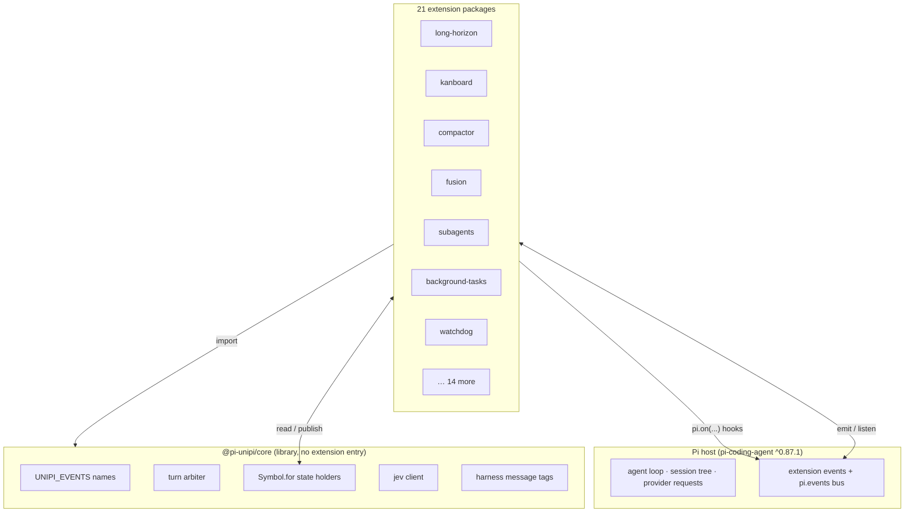

# Harness architecture

UniPi is a suite of extensions for the Pi coding agent
(`@earendil-works/pi-coding-agent` `^0.87.1`). This section explains the
mechanisms that UniPi adds to the Pi harness. Each page gives the problem, the
mechanism, the limits from the source, and the files to read.

For UniPi terms, see the [glossary](../reference/glossary.md).

## Layers

UniPi has three layers.

1. **Pi host.** Pi owns the agent loop, the session tree, provider requests,
   tool execution and the extension events (`before_agent_start`, `tool_call`,
   `agent_before_settle`, `session_before_compact` and others).
2. **UniPi core.** `@pi-unipi/core` has no extension entry of its own. It ships
   shared code: event names, the turn arbiter, shared state holders, the
   settings engine, the jev client and the harness message tags.
3. **Packages.** 21 packages have their own Pi extension entry in
   `package.json`. The umbrella package `@pi-unipi/unipi` loads all 21 in one
   fixed order.

## Design principles

**Packages talk over events and shared holders, not imports.** 17 of the 21
extension packages import no UniPi package except core. Four packages import
one accessor or one renderer from a peer: `footer` and `watchdog` import
`getSharedTaskRegistry` from `background-tasks`. `fusion` and `subagents`
import the delegated-step renderer from `utility`.

**Each package works alone.** Each package has its own `pi.extensions` entry.
Shared state lives on `globalThis` under `Symbol.for(...)` keys. Two separate
installs of a package therefore share one copy of the state.

**Coexist triggers add behavior when peers are present.** A package reads a
peer's shared holder or registry at run time. If the peer is absent, the read
returns `undefined` and the package keeps its standalone behavior. The
[event bus page](event-bus.md#coexist-triggers) lists each trigger.

**Cross-module hooks fail open.** The caller catches each error that a peer's
hook throws, and the turn continues. The source states this rule in comments
such as "A broken listener must never break settlement". Calls that wait on a
peer have a time box: 2,000 ms for nudge providers and evidence contributors.

**Children are the hands, the lead is the voice.** Fusion sidekicks, subagents
and kanboard children run with `UNIPI_FUSION_CHILD`, `UNIPI_SUBAGENT_CHILD` or
`UNIPI_KANBOARD_CHILD` set. `isChildProcess()` reads these variables. In a
child, the turn arbiter installs nothing, long-horizon owners refuse to start
and kanboard refuses board writes.

## Pages

| Page | Problem it solves |
|---|---|
| [Event bus](event-bus.md) | 21 packages must cooperate without import-time coupling. |
| [Turn arbiter](turn-arbiter.md) | Several packages want to continue the run when the agent stops. Only one may act. |
| [Prefix cache](prefix-cache.md) | Changes to the request prefix make the provider bill the full context again. |
| [Compaction](compaction.md) | A summary must keep the live task, and it must not grow at each compaction. |
| [Long-horizon](long-horizon.md) | Multi-turn work needs one driver, a completion judge and hard budgets. |
| [Delegation](delegation.md) | Work moves to other models and processes. Each one needs a known context boundary. |
| [Harness messages](harness-messages.md) | Text from the harness reaches the model as user content. The user must see its origin. |
| [Watchdog](watchdog.md) | A long tool call can hang. A timer alone cannot tell a hang from slow progress. |

## Limits and numbers

| Item | Value | Source |
|---|---|---|
| Packages in the repository | 24 directories (21 extensions, core, umbrella, kanboard binaries) | `packages/` |
| Modules the umbrella loads | 21, in fixed order | `packages/unipi/index.ts` |
| Event names in `UNIPI_EVENTS` | 29 | `packages/core/events.ts` |
| Nudge provider time box | 2,000 ms | `packages/core/src/turn/arbiter.ts` |
| Evidence contributor time box | 2,000 ms | `packages/core/src/evidence.ts` |
| jev call time box | 1,000 ms native, 6,000 ms decisions endpoint | `packages/core/src/jev/client.ts` |
| Packages that ask jev | 5 (long-horizon, workflow, utility, skill-registry, watchdog) | `askJev` call sites |

## Where to look in the code

- `packages/unipi/index.ts`: load order, provenance and arbiter install
  before the first module.
- `packages/core/index.ts`: the list of shared exports.
- `packages/core/src/turn/arbiter.ts`: `isChildProcess()`.
- `packages/core/events.ts` and `packages/core/bus.ts` (typed event map,
  sticky state, `bus.emit` / `bus.get` / `bus.on`).
