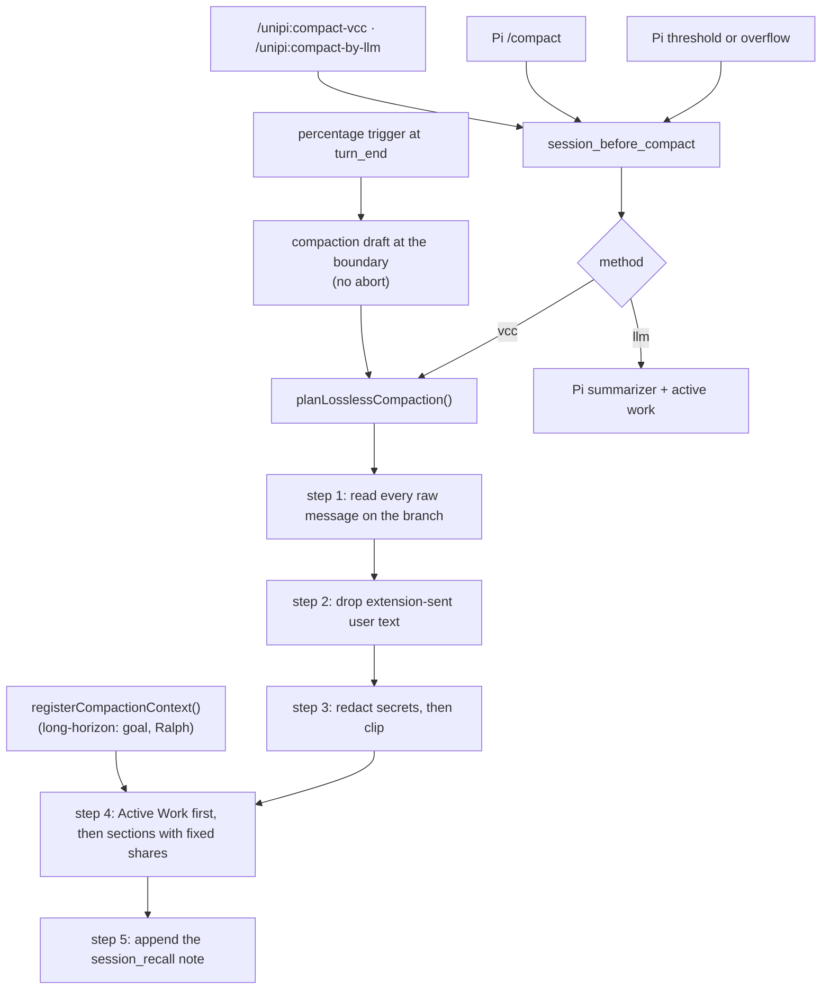

# Compaction

## Problem

A long session fills the context window. Pi then replaces old messages with a
summary. A summary that merges onto the previous summary grows and drifts: one
recorded session grew from 15k to 236k to 248k characters over three
compactions. A summary that loses the live goal or loop also stops the
autonomous work that caused the long session.

## How it works

The compactor routes every compaction through Pi's `session_before_compact`
event. This includes Pi's automatic compaction, Pi's `/compact`, the UniPi
commands and the UniPi percentage trigger. The compactor then uses one of two
methods.

| Method | LLM calls | What it writes |
|---|---|---|
| `vcc` (default) | 0 | A lossless summary that the compactor builds from the full branch with fixed rules. |
| `llm` | 1 | Pi's model summary. The compactor puts the active-work block in front of it. |

### Rebuilt from the full history

Pi's session file is append-only. After a compaction, each raw message is
still on the branch. The `vcc` method reads the branch from the start each
time. It does not read the previous summary text. A summary therefore cannot
inherit growth or errors from an earlier summary.

### The user's words, not injected text

Extensions send loop prompts, nudges and notices with the user role. The
compactor marks each extension-sent user message at `input` time with a
`compactor-origin` entry. The summary leaves marked text out of "Your
Requests". Sessions without marks use 8 known text shapes as a fallback.

### Led by live state

A package that drives autonomous work registers a provider with
`registerCompactionContext()`. Each summary starts with an `[Active Work]`
block from these providers. Today long-horizon registers the only provider.
It writes the Ralph loop name, iteration and task file, or the goal
objective, turn count and stall count. The `llm` method adds the same block.

### Sections and budgets

The `vcc` summary has these sections in this order. Each section has a fixed
share of the budget. The compactor clips each item to its share.

| Section | Share |
|---|---|
| Active Work | 16% |
| Your Requests | 14% |
| Latest State | 12% |
| Decisions & Constraints | 16% |
| Files | 7% |
| Lessons | 10% |
| Project Knowledge | 7% |
| Commits | 5% |
| Open Errors | 6% |
| Recent Transcript | the rest, 18% minimum |

### Session recall

The summary ends with a note: the session file keeps the full history. The
`session_recall` tool searches the branch with keywords or a regular
expression. It returns 5 hits per page and expands entries by index.

### When it runs

`trigger: "pi"` (default) keeps Pi's own reserve-token trigger.
`trigger: "percent"` compacts at the `turn_end` boundary when usage passes the
threshold. It returns a compaction draft, so Pi applies it without an abort.
Goal, Ralph and kanboard loops continue. A cooldown and a minimum token growth
stop repeat compactions.

## Limits and numbers

| Item | Value | Source |
|---|---|---|
| Default method | `vcc` (0 LLM calls) | `packages/compactor/src/config/schema.ts` |
| Default trigger | `pi` | `packages/compactor/src/config/schema.ts` |
| Percentage threshold | 80% (range 1–99) | `packages/compactor/src/compaction/auto-trigger.ts` |
| Cooldown | 60,000 ms | `cooldownMs` |
| Repeat growth minimum | 4,000 tokens | `repeatMinGrowthTokens` |
| Summary budget (auto) | 1,500–4,000 tokens (1,500 + 8 per block) | `autoBudgetTokens`, `summarize.ts` |
| Summary cap | 8% of the context window, 800 tokens minimum | `packages/compactor/src/compaction/hooks.ts` |
| Smart kept tail | grows from 5,000 to 25,000 tokens | `MIN_SMART_TAIL_TOKENS`, `MAX_SMART_TAIL_TOKENS`, `cut.ts` |
| Kept tail recut | above 40% of the window, down to 25% | `TAIL_WINDOW_LIMIT`, `TAIL_WINDOW_SHARE`, `hooks.ts` |
| Characters per token | 4 default, calibrated 2–6 | `token-estimate.ts` |
| Recall page | 5 hits, 50 maximum | `packages/compactor/src/tools/vcc-recall.ts` |
| Expanded recall hit | 16 KiB | `MAX_EXPANDED_HIT_BYTES` |
| Recall search time | 3,000 ms budget | `SEARCH_BUDGET_MS`, `search-entries.ts` |

Fallbacks:

- If the `llm` call fails, Pi's own summarizer runs.
- If the `vcc` plan fails during an overflow, Pi's own path runs.
- A saved `method: jev` (removed in 3.0.0-alpha.18) runs as `vcc`.

The compaction card (`Compacted 7.9k → 2.2k tokens …`) is a UI-only entry. It
never reaches the model.

## Where to look in the code

- `packages/compactor/src/compaction/hooks.ts`: routing, `planLosslessCompaction`,
  the `turn_end` trigger.
- `packages/compactor/src/compaction/source.ts`: full-history source and
  origin marks.
- `packages/compactor/src/compaction/summarize.ts`: sections, shares,
  redaction.
- `packages/compactor/src/compaction/cut.ts`: kept-tail sizes.
- `packages/core/compaction-context.ts`: the active-work registry.
- `packages/long-horizon/src/compaction-brief.ts`: the goal and Ralph block.
- `scripts/compactor-eval.mts`: replays real compaction points for review.
