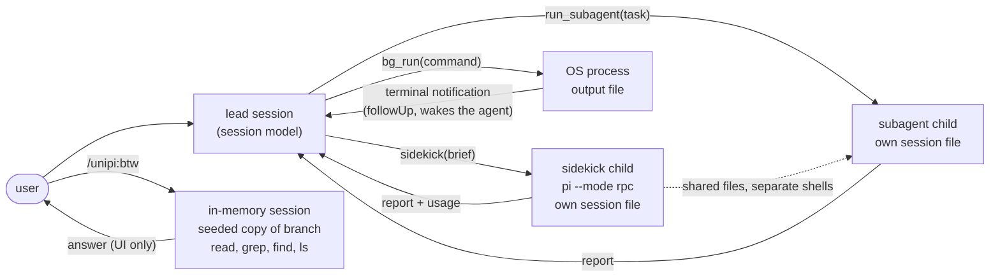

# Delegation

## Problem

A lead agent hands work to other models and processes: a cheaper model for
hands-on work, parallel agents for research, long shell commands, quick side
questions. Each handoff must state what context the worker sees, what it may
change, and how its result returns. An unclear boundary leaks the lead's
context, loses the worker's result, or blocks the lead.

## How it works

UniPi has four delegation paths. They differ in process, memory and context.

| Path | Worker | Sees the lead's conversation | Memory between calls | Result returns as |
|---|---|---|---|---|
| Fusion sidekick | Pi child in RPC mode, one per lead session | No, only the brief | Yes, same process and session file | Tool result, or a completion message |
| Subagent | Pi child per run | No, only the `task` text | Yes, on resume from its session file | Tool result, or a completion message |
| Background task | OS process (`bg_run`) | Not an agent | Output file | `<background-task-notification>` message |
| BTW | In-memory Pi session | Yes, a copy of the current branch | No | UI panel only, never the main session |

### Fusion: lead and persistent sidekick

The lead is the session model. The sidekick is a second model in a child Pi
process (`--mode rpc`). The child loads the lead's extensions and no skills.
It uses one session file per lead session, so it remembers earlier handoffs.
Its shells and servers also stay alive between handoffs.

The sidekick never sees the user's messages. It sees only the lead's brief and
what it finds on disk. A `sidekick` call waits for the report by default. With
`block: false`, the lead keeps working, and the `fusion` wait source holds
back arbiter nudges until the report arrives. A second call during a running
handoff sends an interrupt into it. It never starts a second sidekick.

Approval prompts from a blocking handoff go to the lead's UI. A background
handoff gets an automatic deny with a reason, so the child stops retrying.
Sidekick steps stream into the lead's transcript as UI-only `sidekick-step`
entries. The model does not see them.

The lead gets a policy section in its system prompt: delegate implementation
and checks, keep design, review and user contact. A direct edit by the lead
gets a reminder in the tool result once per turn. The lead also gets a
reminder after each 4 non-trivial shell commands since the last handoff.

### Subagents

`run_subagent` starts one child per run in the foreground or background, or
resumes an earlier run from its session file. Two built-in profiles exist:
`subagent_explore` has 7 read-only tools, and `subagent_general` has all
tools except the nesting tools. Custom agents are Markdown files.

`subagent_explore` uses the default subagent model from settings. With no such
setting, it uses the Fusion sidekick model when Fusion is active. Else it uses
the session model. A user message during a foreground run moves the run to
the background. Its completion message arrives later.

Subagents have no file locks in 3.0.0-alpha. Children share the working tree.
The `subagent_explore` tool list is the only write guard.

### Background tasks

`bg_run` starts a shell command and returns at once with a task ID and an
output path. When a task with `triggerOnCompletion: true` ends, a
`<background-task-notification>` message arrives as a follow-up and starts a
new turn. While the agent is idle and such a task runs, a **wake line** above
the editor reads `waiting on 1 bg task … — agent resumes automatically when
done`. The `background-tasks` wait source holds back arbiter nudges at the
same time. Servers set `triggerOnCompletion: false`, so nothing waits for them.

UniPi 3.0.0-alpha.3 removed `bg_delegate` and `bg_result`. A background agent
is now `run_subagent` in the background.

### BTW side questions

`/unipi:btw` opens a panel in place of the editor. Each question runs in a new
in-memory session, seeded from the main session's current branch. The session
has 4 tools: `read`, `grep`, `find`, `ls`. Nothing goes back to the main
session: no entries, no messages, no earlier BTW answers.

## Limits and numbers

| Item | Value | Source |
|---|---|---|
| Sidekicks per lead session | 1 | `packages/fusion/src/index.ts` |
| Sidekick progress events kept | 300 | `MAX_EVENTS`, `packages/core/src/child-agent/runtime.ts` |
| Tool output kept per sidekick step | 4,000 characters | `MAX_TOOL_OUTPUT` |
| Non-trivial lead shell commands per reminder | 4 | `BASH_NUDGE_EVERY`, `packages/fusion/src/nudge.ts` |
| Running subagents | 8 maximum | `MAX_CONCURRENT`, `packages/subagents/src/manager.ts` |
| Subagent nesting depth | 1 default (no nesting) | `UNIPI_SUBAGENT_MAX_DEPTH`, `manager.ts` |
| Cancel grace before kill | 5,000 ms | `CANCEL_GRACE_MS` |
| Task text kept in the record | 20,000 characters | `MAX_TASK_CHARS` |
| `subagent_explore` tools | 7 | `EXPLORE_TOOLS`, `packages/subagents/src/profiles.ts` |
| Background task output | 20 MiB, then kill and fail | `maxOutputBytes`, `packages/background-tasks/src/config.ts` |
| Finished tasks kept | 30 | `maxFinishedTasks` |
| `bg_logs` default read | 30 KiB | `DEFAULT_LOG_BYTES`, `packages/background-tasks/src/types.ts` |
| BTW tools | 4, read-only | `packages/btw/extensions/btw.ts` |

## Where to look in the code

- `packages/core/src/child-agent/runtime.ts`: the shared child runtime for
  sidekick and subagents.
- `packages/fusion/src/tools.ts`, `prompts.ts`, `nudge.ts`: the `sidekick`
  tool, the lead policy and the reminders.
- `packages/subagents/src/manager.ts`, `profiles.ts`: runs, limits,
  profiles.
- `packages/background-tasks/src/index.ts`, `tools.ts`, `registry.ts`: the
  wake line, `bg_run` and the terminal notification.
- `packages/btw/extensions/btw.ts`: the seeded in-memory session.
