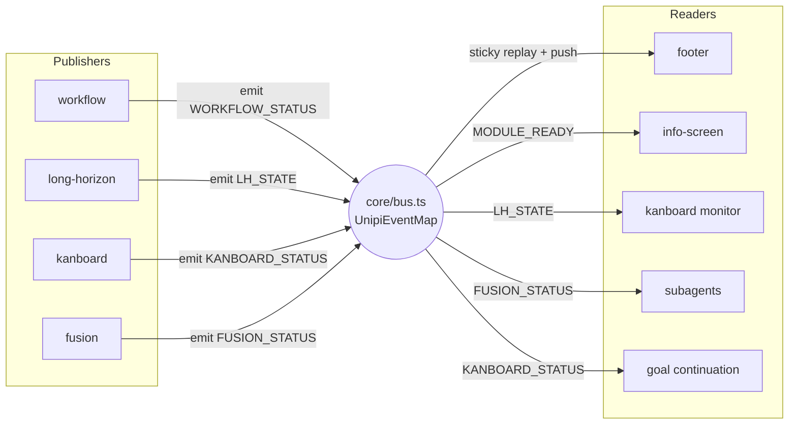

# Event bus and coexist triggers

## Problem

UniPi has 21 extension packages. A user can install one package or all of
them. If packages import each other, load order and version pins couple them,
and one missing package breaks another. The packages must still cooperate when
they run together.

## How it works

One channel carries state and events between packages: the typed bus in
`packages/core/bus.ts`. A few other channels stay for special jobs. None of
them needs an import of the peer package.

### One typed map

`UnipiEventMap` in `packages/core/bus.ts` maps every event name to its payload
type. `UNIPI_EVENTS` in `packages/core/events.ts` holds the 23 name strings.
Every name starts with `unipi:`.

The bus has three functions. `bus.emit(name, payload)` stores and delivers.
`bus.get(name)` reads the last sticky value. `bus.on(pi, name, fn)` subscribes
and returns an unsubscribe function. A broken listener never stops the sender.
`emit` catches listener errors one by one.

### Sticky state and one-shot events

Four keys are sticky. The bus keeps the last payload and replays it to every
late subscriber, so load order never matters:

| Sticky key | Owner | Readers |
|---|---|---|
| `LH_STATE` | long-horizon | footer, kanboard monitor |
| `KANBOARD_STATUS` | kanboard | footer, compaction context, goal continuation |
| `FUSION_STATUS` | fusion | footer, subagents |
| `WORKFLOW_STATUS` | workflow | footer |

All other events are one-shot. They carry things that happen once: a module
announcement, a compaction, a stored memory, a Ralph iteration. The bus never
stores them, and `bus.get` returns `undefined`.

### Session lifecycle

`bus.on` uses the subscribing `pi` as a key. On that pi's `session_shutdown`
the bus removes the pi's listeners and clears all sticky state. Stale values
must not leak into the next session. Publishers republish on `session_start`.

The bus singleton lives on `globalThis` under `Symbol.for("unipi.bus")`. Core
can load twice (umbrella bundle plus a standalone package). Both copies share
one bus.

### Routing by name

Some listeners take an event name from data. They route in three steps:

1. Pi lifecycle events (`agent_end`, `session_start`, `tool_call`) go to
   `pi.on`. Only pi fires them.
2. Names in `UNIPI_EVENTS` go to `bus.on`. `isUnipiEventName()` decides.
3. Everything else goes to `pi.events.on`. These are foreign events.

The hints registry and the notify package route this way.

### What stays off the bus

| Channel | Stays on `pi.events` | Users |
|---|---|---|
| `herdr:blocked`, `herdr:working` | yes | core helpers, herdr integration |
| `rpiv:ask-user:prompt` | yes | notify |
| background-tasks API | yes (`…:request:v1` / `…:response:v1` / `…:terminal:v1`) | watchdog, external tools |

Out of scope by design: the arbiter nudge providers, the evidence
contributors, the compaction context, the task registries, and the command
runner. They are function calls through core registries, not events.

### Module discovery

16 packages emit `MODULE_READY` (`unipi:module:ready`). The payload carries
`name`, `version`, `commands`, `tools` and an optional `loadTimeMs`.
`info-screen` collects the announcements in a batch. It waits 150 ms after the
last one, then invalidates its cache once. This stops one re-render per module
at startup.

### Status: pull, not request and response

UniPi 2.4.2 removed the `/unipi:status` request broadcast and its fixed
500 ms wait. Status now comes from the bus sticky state and the info screen.
One versioned request and response protocol remains. `background-tasks`
answers `capabilities`, `run`, `status`, `logs` and `kill` requests on
`unipi-background-tasks:request:v1`. It answers on `…:response:v1` and
reports task ends on `…:terminal:v1`. It refuses a reused `request_id`.

## Add new shared state

One reader needs state that another package owns. Do this:

1. Add a name and a payload type. One line in `UNIPI_EVENTS`, one line in
   `UnipiEventMap`. Add the name to `STICKY_EVENTS` in `bus.ts`.
2. The owner emits with `bus.emit`. Republish on `session_start`.
3. The reader calls `bus.get` when it needs the value, or `bus.on` to push.
   Pass the reader's `pi` so shutdown cleans up.

For one-shot signals, skip step 1's `STICKY_EVENTS` line.

## Coexist triggers

A coexist trigger is behavior that a package adds only when a peer is present.
If the peer is absent, the sticky value or registry is empty and nothing
changes.

| Package | Peer | What changes |
|---|---|---|
| kanboard | long-horizon | The kanboard monitor sends no nudge while a long-horizon owner is active. A resumed owner re-arms it. |
| kanboard | long-horizon | An open claim blocks goal completion through an evidence contributor. |
| kanboard | compactor | The board contract rides every compaction summary. |
| kanboard | long-horizon | Goal continuations carry the claim reminder. |
| subagents | fusion | Explore and custom agents use the Fusion sidekick model when the user names no other model. |
| compactor | long-horizon | Each summary starts with the live goal or Ralph state. |
| footer | fusion, long-horizon, kanboard, workflow | The status strip shows the pair, the mode, the claims and the permission mode. |
| watchdog | background-tasks | The watchdog judges running background tasks, not only `bash` calls. |
| info-screen | all emitters | The dashboard lists modules, tools and load times. |
| turn arbiter | background-tasks, fusion, subagents | A pending wake holds back all nudges. |

## Limits and numbers

| Item | Value | Source |
|---|---|---|
| Event names | 23 | `packages/core/events.ts` |
| Sticky keys | 4 | `STICKY_EVENTS` in `packages/core/bus.ts` |
| Packages that emit `MODULE_READY` | 16 | `bus.emit(UNIPI_EVENTS.MODULE_READY` call sites |
| `MODULE_READY` batch wait | 150 ms | `packages/info-screen/index.ts` |
| Background-task API error text | 240 characters maximum | `packages/background-tasks/src/extension-api.ts` |
| Background-task `request_id` | 200 characters maximum | `packages/background-tasks/src/extension-api.ts` |
| Evidence contributor time box | 2,000 ms each | `packages/core/src/evidence.ts` |
| `Symbol.for` keys in core | 4 | `bus.ts`, `src/turn/arbiter.ts`, `src/evidence.ts`, `harness-messages.ts` |

## Where to look in the code

- `packages/core/events.ts`: event names and payload types.
- `packages/core/bus.ts`: the bus, the sticky set, the session cleanup.
- `packages/long-horizon/src/lh-state.ts`: one publish point for `LH_STATE`.
- `packages/kanboard/src/bus-hooks.ts`: compaction context and monitor re-arm.
- `packages/core/command-runner.ts`, `compaction-context.ts`,
  `src/evidence.ts`: core registries.
- `packages/info-screen/index.ts`: `MODULE_READY` batching.
- `packages/background-tasks/src/extension-api.ts`: the request and response
  protocol.
