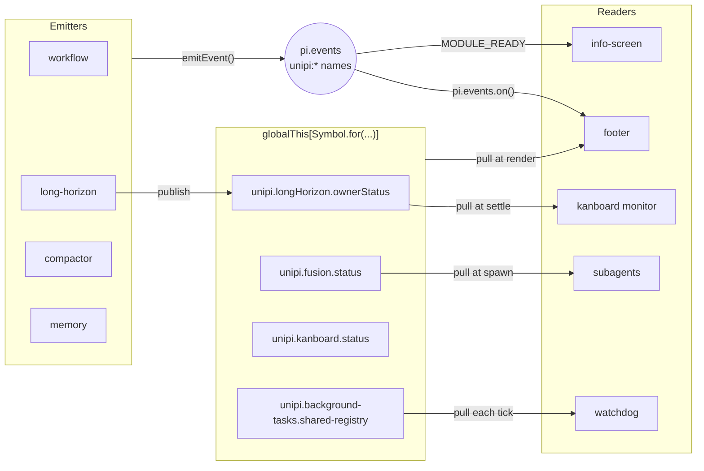

# Event bus and coexist triggers

## Problem

UniPi has 21 extension packages. A user can install one package or all of
them. If packages import each other, load order and version pins couple them,
and one missing package breaks another. The packages must still cooperate when
they run together.

## How it works

Packages use three channels. None of them needs an import of the peer package.

### 1. Named events on `pi.events`

`UNIPI_EVENTS` in `packages/core/events.ts` defines 29 event names. Each name
starts with `unipi:`, for example `unipi:module:ready` and
`unipi:compactor:compacted`. A package sends an event with `emitEvent(pi,
name, payload)`. `emitEvent` catches emit errors and returns `false`, so a
broken listener cannot stop the sender.

Events are push messages for things that happen once: a compaction, a stored
memory, a mode change, a Ralph iteration. The footer listens to 19 of these
names in `packages/footer/src/events.ts`.

### 2. Shared state holders

State that a reader needs at any time lives in a holder on `globalThis`. The
key is `Symbol.for("unipi.<name>")`, so every copy of core reaches the same
object. The owner package publishes. Readers pull when they need the value:
at render, at settle, or at spawn.

Pull reads remove timing problems. A reader never misses a value because it
loaded after the event. The footer reads the Fusion pair, the long-horizon
mode, the kanboard claims and the permission mode this way on each render.

### 3. Registries in core

Core holds registries that one package fills and another package calls:

| Registry | Filled by | Called by |
|---|---|---|
| `registerNudgeProvider` | long-horizon, kanboard | turn arbiter |
| `registerWaitSource` | background-tasks, fusion, subagents | turn arbiter |
| `registerEvidenceContributor` | kanboard | long-horizon goal verifier |
| `registerCompactionContext` | long-horizon | compactor |
| `registerCommandRunner` | long-horizon, workflow, utility, web-api, skill-registry, core hints | settings hub actions |

### Module discovery

16 packages emit `MODULE_READY` (`unipi:module:ready`) at load or at
`session_start`. The payload carries `name`, `version`, `commands`, `tools`
and an optional `loadTimeMs`. `info-screen` collects the announcements in a
batch. It waits 150 ms after the last one, then invalidates its cache once.
This stops one re-render per module at startup.

### Status: pull, not request and response

UniPi 2.4.2 removed the `/unipi:status` request broadcast and its fixed
500 ms wait. Status now comes from the shared holders and the info screen.
One versioned request and response protocol remains. `background-tasks`
answers `capabilities`, `run`, `status`, `logs` and `kill` requests on
`unipi-background-tasks:request:v1`. It answers on `…:response:v1` and
reports task ends on `…:terminal:v1`. It refuses a reused `request_id`.

## Coexist triggers

A coexist trigger is behavior that a package adds only when a peer is present.
If the peer is absent, the holder or registry is empty and nothing changes.

| Package | Peer | What changes |
|---|---|---|
| kanboard | long-horizon | The kanboard monitor sends no nudge while a long-horizon owner is active. |
| kanboard | long-horizon | An open claim blocks goal completion through an evidence contributor. |
| subagents | fusion | Explore and custom agents use the Fusion sidekick model when the user names no other model. |
| compactor | long-horizon | Each summary starts with the live goal or Ralph state. |
| footer | fusion, long-horizon, kanboard, workflow | The status strip shows the pair, the mode, the claims and the permission mode. |
| watchdog | background-tasks | The watchdog judges running background tasks, not only `bash` calls. |
| info-screen | all emitters | The dashboard lists modules, tools and load times. |
| turn arbiter | background-tasks, fusion, subagents | A pending wake holds back all nudges. |

## Limits and numbers

| Item | Value | Source |
|---|---|---|
| Event names | 29 | `packages/core/events.ts` |
| Packages that emit `MODULE_READY` | 16 | `emitEvent(pi, UNIPI_EVENTS.MODULE_READY` call sites |
| Event names the footer listens to | 19 | `packages/footer/src/events.ts` |
| `MODULE_READY` batch wait | 150 ms | `packages/info-screen/index.ts` |
| Background-task API error text | 240 characters maximum | `packages/background-tasks/src/extension-api.ts` |
| Background-task `request_id` | 200 characters maximum | `packages/background-tasks/src/extension-api.ts` |
| Evidence contributor time box | 2,000 ms each | `packages/core/src/evidence.ts` |
| `Symbol.for` keys in core | 7 | `packages/core/*.ts`, `packages/core/src/*` |

Known gap: `subagents` emits `MODULE_READY` with `{ module: "subagents" }` and
no `name`. `info-screen` skips a payload without `name`
(`packages/subagents/src/index.ts`).

## Where to look in the code

- `packages/core/events.ts`: event names and payload types.
- `packages/core/utils.ts`: `emitEvent`.
- `packages/core/long-horizon-owner-status.ts`, `fusion-status.ts`,
  `kanboard-status.ts`: holder pattern.
- `packages/core/command-runner.ts`, `compaction-context.ts`,
  `src/evidence.ts`: core registries.
- `packages/info-screen/index.ts`: `MODULE_READY` batching.
- `packages/background-tasks/src/extension-api.ts`: the request and response
  protocol.
