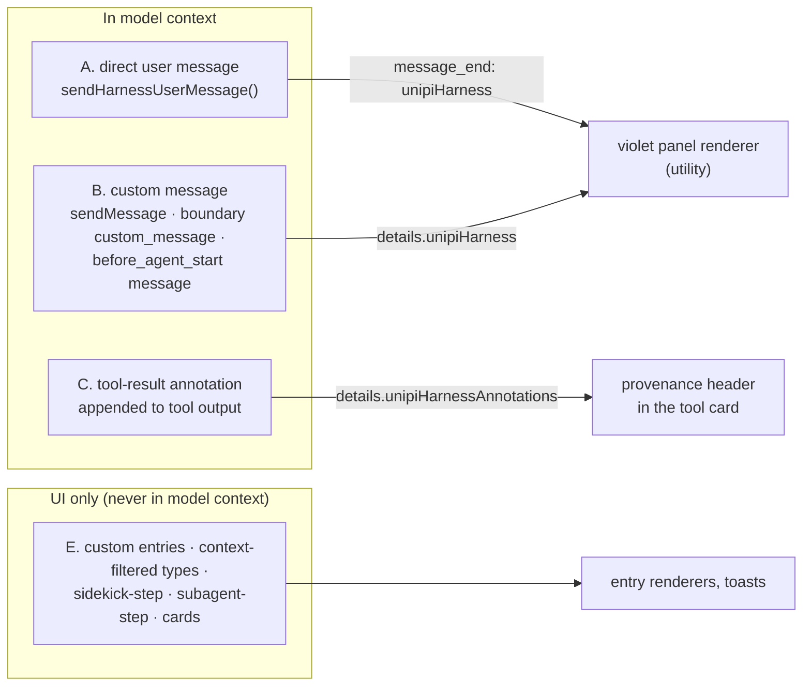

# Harness messages

## Problem

UniPi packages send text to the model: goal continuations, loop prompts,
guard warnings, reminders. Pi gives extensions no separate role for this text.
Most of it reaches the model as user content. In the transcript, harness text
then looks like text the user typed. The user cannot tell who said it, and a
summary can count it as a user request.

## How it works

UniPi keeps the model-facing role, text and delivery unchanged. It adds one
tag, `unipiHarness`, and the UI reads that tag. The tag is metadata only. The
UI never guesses the origin from the text, so a user who types "No-progress
guard: …" stays the user.

### The tag

`harnessMetadata()` builds the tag:

| Field | Meaning |
|---|---|
| `version` | Always `1` |
| `id` | Monotonic ID, no date header |
| `source` | Origin label, for example `Goal`, `Kanboard`, `Progress guard` |
| `title`, `synopsis` | Short text for the panel header |
| `delivery` | `direct`, `steer`, `followUp`, `nextTurn`, `boundary` or `before_agent_start` |
| `severity` | `warning`, or absent |

### Four transports

| Class | Transport | Model role | How the tag travels |
|---|---|---|---|
| A | `sendHarnessUserMessage()` around Pi's `sendUserMessage` | user | Attached at `message_end` |
| B | Custom message types, including arbiter nudges | custom (sent as user content) | `details.unipiHarness` |
| C | Text appended to a tool result (Fusion reminders, kanboard R1, watchdog kill) | tool | `details.unipiHarnessAnnotations` |
| E | `appendEntry`, toasts, types that a `context` hook drops | none | No tag needed: the model never sees them |

### Tagging a direct user message

Pi's `input` event has no per-send ID. Class A therefore uses a
single-call arm:

1. `sendHarnessUserMessage()` pushes an arm with the exact text, then calls
   the unchanged `pi.sendUserMessage`.
2. Pi runs the `input` handler inside that call. The handler records a
   harness entry only if the source is `extension` and the text matches the
   arm.
3. The arm ends with the call. An arm that the handler did not match leaves
   nothing behind.
4. At `message_start`, the observer picks the matching record. Two records
   with the same text and different origins fail closed: no tag.
5. At `message_end`, the tag goes on the message only if the final text still
   matches.

Every failure path gives Pi's native rendering. No path tags a human message
as harness text. The session file stores the tag, so it survives resume and
branch.

### Rendering

`utility` registers renderers for 10 known custom types and patches Pi's user
message card. A tagged message renders as a panel with a violet rail
(`#a78bfa`) on a dark slate fill (`#20222d`) and a source label. Three
densities follow the render style: `simple`, `regular`, `advanced`. Ctrl+O
expands the panel. The text that the model receives does not change.

### In context or UI only

The `display` flag on a custom message controls Pi's transcript only. It does
not remove the message from the model context (see
[Prefix cache](prefix-cache.md)). To keep text from the model, a package
uses a custom entry (`appendEntry`) or drops its type in a `context` hook.
Kanboard notices, compaction cards, memory cards and delegated step panels
use these UI-only paths.

## Limits and numbers

| Item | Value | Source |
|---|---|---|
| Inventory rows, class A (direct) | 8 | `scripts/harness-message-inventory.md` |
| Inventory rows, class B (custom) | 12 | same |
| Inventory rows, class C (tool annotation) | 4 | same |
| Inventory rows, user-authored (stay human) | 5 | same |
| Inventory rows, UI only | 6 | same |
| Packages that tag harness text | 9 | `harnessMetadata` / `sendHarnessUserMessage` call sites |
| Known custom types with a harness renderer | 10 | `KNOWN_CUSTOM_TYPES`, `packages/utility/src/render/harness.ts` |
| Delivery values | 6 | `HarnessDelivery`, `packages/core/harness-messages.ts` |

The inventory is a snapshot of one commit (`5fc316b`). Use the source for the
current list.

## Where to look in the code

- `packages/core/harness-messages.ts`: the tag, the arm and the observers.
- `packages/utility/src/render/harness.ts`: the panel, the known types, the
  user card patch and `withHarnessToolAnnotations`.
- `packages/unipi/index.ts`: provenance install before any module, and the
  tool annotation wrapper.
- `scripts/harness-message-inventory.md`: each message source by class.
- `scripts/harness-message-preview.ts`: the design preview and fixtures.
