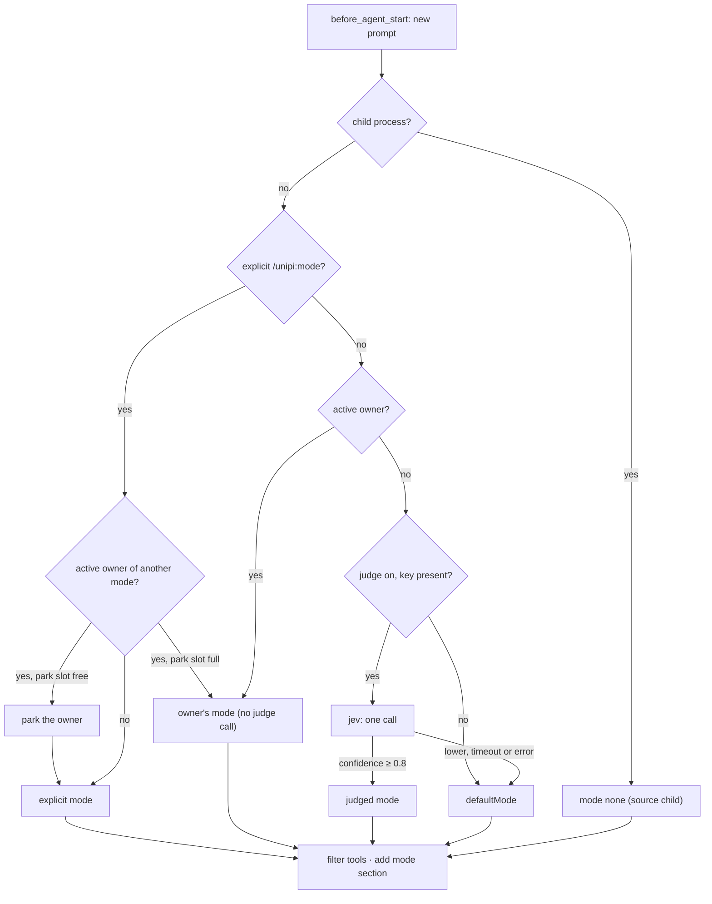

# Long-horizon execution

## Problem

Some work takes many turns: one objective until it is true, a checklist, a
set of parallel items, or a chain of dependent steps. Each shape needs a
different tool set and a different stop rule. Two drivers in one session fight
over the next turn. A model that grades its own work stops too early or never
stops.

## How it works

The `long-horizon` package has five modes. A **gate** picks the mode at each
turn start. An **owner** drives the turns of one mode. A separate **verifier**
decides when a goal is complete.

| Mode | Shape | Control tools | Owner kind |
|---|---|---|---|
| `goal` | One objective until a verifier finds it met | `create_goal`, `get_goal`, `update_goal`, `todowrite` | `goal` |
| `ralph` | A task file worked over many iterations | `ralph_done`, `loop_status`, `todowrite` | `ralph-loop` |
| `swarm` | Independent items, parallel workers, then a synthesis | `swarm_status`, `swarm_yield`, `swarm_report`, `todowrite` | `swarm` |
| `graph` | Steps that depend on earlier results | `view_agent_graph`, `update_agent_graph`, `graph_output`, `todowrite` | `graph` |
| `none` | A plain request | none | none |

### The jev judge

jev is a decision model from TypeSafe. It answers typed questions (`choice`
or `noul`) with a confidence value. It does not write text or call tools.

The long-horizon judge asks jev one question per new user message: which mode
fits this request. It does not ask on continuations, wakes or recovery turns.
Below the confidence threshold, the judge abstains and the default mode
applies. Any error, missing key or timeout also gives the default mode. The
judge never blocks a turn. The judge is off by default, and `defaultMode` is
`none`.

The same jev client (`askJev` in core) serves 4 other packages. Each one asks
its own question: bash risk in permission auto mode, session naming in
utility, skill relevance in skill-registry, and stuck tools in watchdog.

### One owner per session, with park and resume

The owner coordinator allows one **active** owner and one **parked** owner.
`activate()` refuses while an owner is active. An explicit mode command parks
the active owner and starts the new mode. If the park slot is full, the switch
fails and the owner keeps the turn. `/unipi:goal resume` brings a parked owner
back.

Each owner has a lease `{ownerId, generation}`. A park and a resume each add 1 to the
generation. A tool call from a turn before the park carries the old
generation, and the coordinator rejects it. The coordinator writes its state
to `~/.unipi/workspace/<id>/state/long-horizon/state.json` on each transition.
Crash recovery is a file read, not a replay.

### Propose and verify

The worker calls `update_goal` with `status: "complete"`. This is a claim. The
verifier is a separate model call with the `verifierModel` setting or the
session model. It reads a bounded evidence brief: the objective, the claim,
the changed files, the commands and the last 5 messages. Its verdict is
`met`, `not_met`, `impossible` or `inconclusive`.

Before the model call, core's evidence contributors run. Kanboard adds a
blocking item for each task this session still holds In Progress. A blocking
item gives `not_met` without a model call.

### Continuation and the runaway guard

After each turn, the owner settles: continue, wait, pause or stop. A
continuation goes into the one-slot nudge stash. The
[turn arbiter](turn-arbiter.md) delivers it at priority 100.

Inside a turn, the runaway guard reads each tool result. It looks for 6
signals: the same action, an A-B-A-B cycle, an unchanged action and result,
the same error family, the same result, and status polling. It sends one steer
message per turn at most. The message tells the model not to save the
reminder to memory or skills.

## Limits and numbers

| Item | Value | Source |
|---|---|---|
| Judge confidence threshold | 0.8 | `packages/long-horizon/src/settings.ts` |
| Judge time box | 1,000 ms native, 6,000 ms decisions endpoint | `packages/long-horizon/src/judge/typesafe.ts` |
| Judge answer cache | 1 entry, 10,000 ms | `CACHE_TTL_MS`, `judge/resolve.ts` |
| Owners per session | 1 active, 1 parked | `packages/long-horizon/src/owner.ts` |
| Owner history | 10 entries | `HISTORY_LIMIT` |
| Goal turns | 50 default, 200 maximum | `DEFAULT_MAX_TURNS`, `MAX_TURNS_CEILING`, `engine/goal-state.ts` |
| No-progress turns before pause | 8 default, 50 maximum | `DEFAULT_STALL_CAP`, `STALL_CAP_CEILING` |
| Token budget | 1,000 minimum | `TOKEN_BUDGET_MINIMUM` |
| `not_met` verdicts in a row before pause | 5 | `NOT_MET_STREAK_CAP` |
| `inconclusive` verdicts in a row before pause | 2 | `INCONCLUSIVE_STREAK_CAP` |
| Blocked proposals before `blocked` | 3 | `BLOCKED_PROPOSAL_THRESHOLD` |
| Goal objective | 500 code units, 1,500 UTF-8 bytes | `GOAL_CONDITION_LIMIT` |
| Status audit | every 5 turns | `AUDIT_EVERY_N_TURNS`, `prompts/goal.ts` |
| Wait backoff | 5 s × 2ⁿ, 5 min maximum | `engine/continuation.ts` |
| Verifier time box | 30,000 ms | `DEFAULT_VERIFIER_TIMEOUT_MS`, `engine/verifier.ts` |
| Evidence brief | 100 changes, 4,000 characters, 5 messages of 800 characters | `engine/verifier.ts` |
| Runaway repeat threshold | 3 | `DEFAULT_REMIND_AFTER`, `engine/runaway.ts` |
| A-B-A-B window | 8 steps | `MAX_ABAB_WINDOW` |
| Ralph items per iteration | 2 default | `engine/ralph.ts` |
| Ralph reflection | every 5 iterations | `engine/ralph.ts` |
| `todowrite` list | 50 items, 200 characters each | `tools/todo.ts` |

A token count is an estimate (characters ÷ 4) when the provider reports no
usage. `get_goal` then shows `tokens_estimated`.

## Where to look in the code

- `packages/long-horizon/src/gate.ts`: mode resolution and tool filter.
- `packages/long-horizon/src/judge/resolve.ts`, `judge/typesafe.ts`: the
  judge.
- `packages/long-horizon/src/owner.ts`: owners, leases, park and resume.
- `packages/long-horizon/src/engine/goal-state.ts`: goal statuses and caps.
- `packages/long-horizon/src/engine/verifier.ts`: the evidence brief and
  verdicts.
- `packages/long-horizon/src/engine/runaway.ts`: the 6 detectors.
- `packages/core/src/jev/client.ts`: the shared jev transport.
- `docs/long-horizon-design.md`: the design notes. Some defaults there are
  older than the source.
