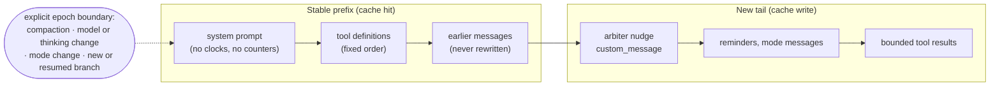

# Prefix cache

This page summarizes the full design in
[Provider prefix-cache architecture](../prefix-cache-architecture.md). The
full document holds the gap matrix and the Pi API limits. Its audit tables
describe Pi 0.84.1 and UniPi 2.5.x. This page describes UniPi 3.0.0-alpha.

## Problem

Providers such as DeepSeek and Anthropic bill cached prefix tokens at a lower
price. A cache hit needs a byte-identical request prefix. One changed byte in
the system prompt or tool list makes the provider bill the full context again.

A 2026-08-13 study of UniPi 2.4 logs counted 8,019 requests. The request hit
rate was 94.3% and the token hit rate was 97.3%. Each of the 459 misses resent
about 62.7K tokens uncached. Hooks that wrote per-turn text into the system
prompt caused most of these full-prefix misses
([study](../deepseek-cache-rate-research.md)).

## How it works

UniPi treats the prefix as an invariant inside one **cache epoch**. A cache
epoch is the time in which provider, model, inference settings, system prompt,
tool list and earlier messages stay the same. Each request in an epoch keeps
the earlier request as its prefix and adds only new tail messages.

### Rules

1. Put changing state in an appended message. Do not rewrite the system
   prompt or an earlier message.
2. Keep tool definitions and their order fixed for one configuration.
3. Enforce tool policy when the tool runs. Do not change the visible tool
   list in the middle of an epoch.
4. Keep clocks, random IDs and locale-dependent order out of model-visible
   text.
5. Treat compaction as an explicit epoch boundary.
6. Give large external results a bounded model-visible form.

`display: false` hides a message in Pi's UI only. The model still sees it.
Prefix safety comes from the position of the text, not from its visibility.

### How UniPi applies the rules

| Surface | Mechanism |
|---|---|
| Goal and Ralph continuations | The [turn arbiter](turn-arbiter.md) appends one `custom_message` entry at the boundary. The system prompt does not change. |
| Long-horizon mode fragment | The fragment states only that an owner exists. Turn counts and budgets ride tail messages. |
| Long-horizon tool filter | `before_provider_request` hides other modes' control tools. The list keeps its order and stays the same inside one mode. A mode change starts a new epoch. |
| Plan mode | Plan state reaches the model as appended messages, not as system prompt text. |
| Skill exposure | `skill-registry` picks the listed skills at the first real prompt and freezes them. The system prompt then stays byte-identical. |
| Memory save pass | A side session reuses the main session's system prompt verbatim, the same model and thinking level, and the same tool list as stubs. |
| MCP tools | Tool names sort in code-unit order. Schema object keys sort the same way. |
| Large results | MCP results show 64 KiB at most. Raw text up to 16 MiB goes to a file in a `0700` folder. |

## Limits and numbers

| Item | Value | Source |
|---|---|---|
| Model-visible tool output | 64 KiB | `DEFAULT_MODEL_OUTPUT_BYTES`, `packages/core/bounded-output.ts` |
| Raw output kept on disk | 16 MiB | `MAX_RAW_ARTIFACT_BYTES`, `packages/core/bounded-output.ts` |
| Tool result folder mode | `0700` | `packages/core/bounded-output.ts` |
| `session_recall` page size | 5 hits | `PAGE_SIZE`, `packages/compactor/src/tools/vcc-recall.ts` |
| `session_recall` result cap | 50 | `MAX_RECALL_RESULTS` |
| Expanded recall hit | 16 KiB | `MAX_EXPANDED_HIT_BYTES` |
| Footer cache-hit color | green at 70% or more | `packages/footer/src/index.ts` |
| Measured hit rate before the 2.4.1 fixes | 94.3% of requests, 97.3% of tokens | `docs/deepseek-cache-rate-research.md` |

### Diagnostics

The footer status strip shows `N% cache hit`. The value is
`cacheRead / (input + cacheRead + cacheWrite)` over the assistant messages in
the current branch.

UniPi 3.0.0-alpha.5 removed the `/unipi:prefix-cache` command. The full
document still describes it. That command kept HMAC fingerprints of each
request and classified each change, but it is no longer in the source.

### Boundaries that UniPi accepts

These events start a new epoch on purpose: compaction, a model or thinking
change, a long-horizon mode change, a system prompt or skill change, a new,
resumed or forked branch, and each independent side session (BTW, subagents,
Fusion sidekick). The memory save pass is the exception: it copies the main
prefix so that the provider can reuse the main session's cache.

## Where to look in the code

- `packages/core/src/turn/arbiter.ts`: tail delivery of nudges.
- `packages/long-horizon/src/gate.ts`: `renderModeFragment`,
  `filterPayloadTools`.
- `packages/skill-registry/src/judge.ts`: the frozen skill list.
- `packages/memory/save-session.ts`: the cache-matched side session.
- `packages/mcp/src/bridge/translator.ts`: code-unit ordering and
  `boundModelOutput`.
- `packages/footer/src/index.ts`: `cacheHitPct`.
