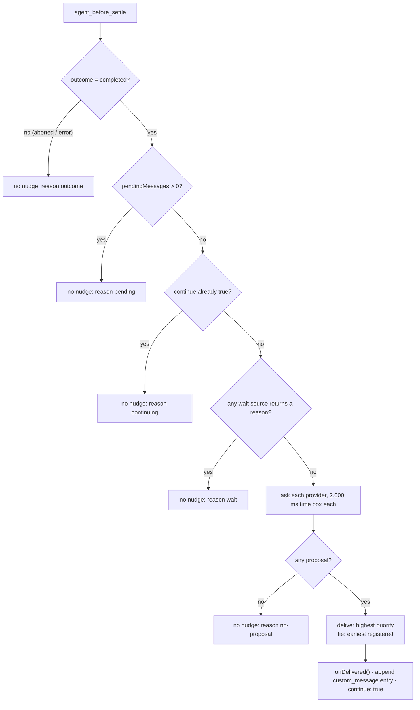

# Turn arbiter

## Problem

When the agent stops, several packages want to start the next turn. A goal
wants a continuation, kanboard wants the agent to finish a claimed task, and
autowork wants to offer the next task. Two continuations at once confuse the
model, and a nudge during a pending wake races that wake.

## How it works

Core installs one handler on Pi's `agent_before_settle` boundary event. All
packages propose through this handler. The handler delivers at most one nudge
per settle.

Packages register in two roles:

- A **nudge provider** proposes at most one continuation (`Nudge`) with a
  source, a priority, a `customType` and the text.
- A **wait source** returns a reason string while an event will wake the
  agent. A non-null reason holds back every nudge.

`decideSettle()` runs the checks in this fixed order. A provider that throws
or passes its time box counts as "no proposal". A wait source that throws
counts as "not waiting". Listeners from `onSettleDecision()` receive each
decision for status lines and tests.

### Providers and wait sources

| Role | Source | Priority | When it proposes or waits |
|---|---|---|---|
| Provider | `long-horizon` | 100 | Its one-slot nudge stash holds a continuation, kickoff or Ralph iteration. |
| Provider | `kanboard` (claims) | 50 | This session still holds a task In Progress. |
| Provider | `kanboard` (autowork) | 40 | Autowork is on and a ready task exists. |
| Wait | `background-tasks` | none | A running task has `triggerOnCompletion: true`. |
| Wait | `fusion` | none | A non-blocking sidekick handoff is still running. |
| Wait | `subagents` | none | A background subagent is still running. |

The kanboard monitor also defers by itself. It returns no proposal while the
shared long-horizon owner status is `active`.

### Delivery

The nudge becomes a `custom_message` entry appended at the boundary. Pi
replaces the boundary `entries` array with the result of the last handler. The
arbiter therefore copies `event.entries` and adds its entry at the end. The
previous request prefix stays the same, and the nudge is one new tail entry
(see [Prefix cache](prefix-cache.md)).

`onDelivered()` runs only for the nudge that wins. Counters count
deliveries, not proposals. A losing provider keeps its state for the next
settle.

### Disarm on abort

A run that the user stops with Esc never reaches `agent_before_settle`. A run
that ends with `aborted` or `error` reaches it with that outcome, and the
arbiter returns no nudge. The kanboard monitor also disarms itself in
`agent_end` when the last assistant message has `stopReason` `aborted` or
`error`. Kanboard then sends no nudge until a new arm: autowork start, a lead `start`,
or a user prompt that names a claimed task.

### Runaway guards

The arbiter delivers one nudge per settle. The providers limit how often they
propose:

- Kanboard counts nudges per task and stops at 5. It disarms after 2 nudged
  runs in a row with 0 tool calls.
- Kanboard autowork offers one ready task at most 3 times. Then it turns
  autowork off.
- Kanboard sends no nudge when the agent's last paragraph ends with `?` and
  the message had no tool calls. A notice goes to the user instead.
- Long-horizon owners have their own turn, stall and token budgets. See
  [Long-horizon](long-horizon.md).

## Limits and numbers

| Item | Value | Source |
|---|---|---|
| Handlers on `agent_before_settle` | 1 | `packages/core/src/turn/arbiter.ts` |
| Nudges per settle | 1 maximum | `packages/core/src/turn/arbiter.ts` |
| Provider time box | 2,000 ms | `DEFAULT_PROVIDER_TIMEOUT_MS`, `packages/core/src/turn/arbiter.ts` |
| Long-horizon priority | 100 | `packages/long-horizon/index.ts` |
| Kanboard claims priority | 50 | `CLAIMS_PRIORITY`, `packages/kanboard/src/monitor.ts` |
| Kanboard autowork priority | 40 | `AUTOWORK_PRIORITY`, `packages/kanboard/src/monitor.ts` |
| Nudges per kanboard task | 5 | `MAX_NUDGES_PER_TASK` |
| Idle nudged runs before disarm | 2 | `STALL_LIMIT` |
| Autowork offers per ready task | 3 | `MAX_OFFERS_PER_TASK` |
| Long-horizon stash | 1 slot | `packages/long-horizon/src/engine/nudge-stash.ts` |

The long-horizon stash keeps the newest text. One exception: while a kickoff
waits for delivery, a new put appends to it. An owner stop or park clears the
stash.

### Install rules

- `installArbiter()` is idempotent. The first call wins.
- The umbrella entry calls it before any module loads. The long-horizon entry
  also calls it, so a standalone long-horizon install has the arbiter.
- A standalone kanboard install registers its provider, but kanboard does not
  call `installArbiter()`. Without the umbrella or long-horizon, no handler
  delivers kanboard nudges.
- In a child process (`isChildProcess()`), the install is a no-op. Children
  get no nudges.

## Where to look in the code

- `packages/core/src/turn/arbiter.ts`: `decideSettle`, `installArbiter`,
  `registerNudgeProvider`, `registerWaitSource`.
- `packages/core/src/turn/__tests__/arbiter.test.ts`: the decision order in
  tests.
- `packages/long-horizon/index.ts` and
  `packages/long-horizon/src/engine/nudge-stash.ts`: the priority-100 provider.
- `packages/kanboard/src/monitor.ts`: the priority-50 and priority-40
  provider.
- `packages/background-tasks/src/index.ts` (`pendingWakeReason`),
  `packages/fusion/src/tools.ts`, `packages/subagents/src/index.ts`: wait
  sources.
