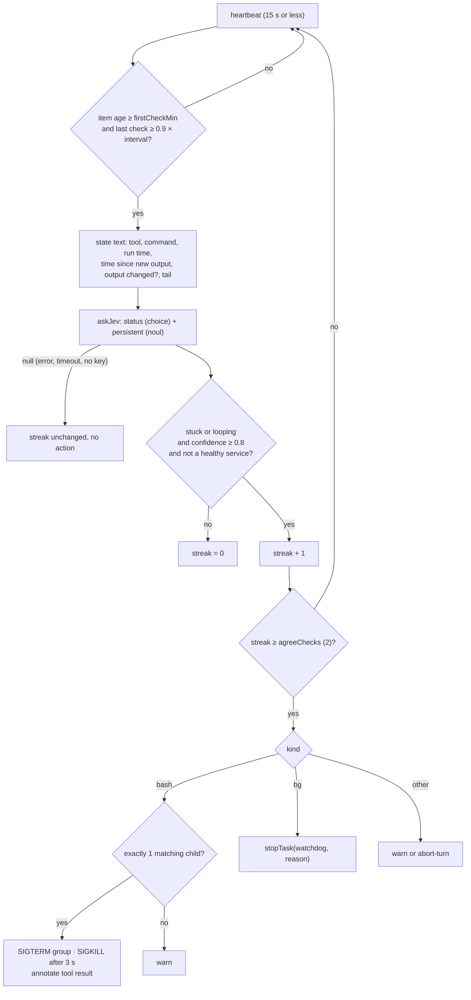

# Watchdog

## Problem

A tool call can hang: a test waits for input that never comes, a script
loops on one error, a build deadlocks. A fixed timeout cannot tell a hang from
a slow build or a dev server. The agent then waits for a long time, or a
timeout kills good work.

## How it works

The `watchdog` package asks jev, the decision model, to judge each long
running item. It acts only on a repeated, confident "stuck" or "looping"
answer. The watchdog is off by default.

It watches three kinds of item:

| Kind | What it watches | Action handle |
|---|---|---|
| `bash` | Pi's `bash` tool calls | Kills the child process group. Pi's `bash` tool stays unchanged. |
| `bg` | Running background tasks with `triggerOnCompletion: true` | `stopTask()` in the shared task registry |
| `other` | Other long tool calls (web, image, MCP, subagents) | No kill handle: `off`, `warn` or `abort-turn` |

Fast and interactive tools are never watched: `read`, `write`, `edit`, `grep`,
`find`, `ls`, `ask_user`, `read_subagent`, `bg_kill`, `bg_tasks`. Servers
(`triggerOnCompletion: false`) are never checked.

### The decision

jev answers two questions about each item:

- `status` (choice): `progressing`, `waiting`, `stuck` or `looping`.
- `persistent` (noul, 0 to 1): is this a long-lived service that runs
  normally?

The watchdog acts when all four conditions are true:

1. `status` is `stuck` or `looping`.
2. The confidence is 0.8 or more.
3. The item is not a healthy service. A `persistent` value of 0.5 or more
   protects the item, except when `status` is `looping`.
4. The last `agreeChecks` checks in a row agree. The default is 2.

A failed jev call returns `null`. The streak then stays the same and nothing
happens. A disagreeing answer sets the streak to 0.

### The action

For `bash`, the watchdog looks for a child of the Pi process that runs the
same command. If exactly one child matches, it sends `SIGTERM` to the process
group. If the group leader is still alive after 3 seconds, it sends `SIGKILL`. If more or fewer children match, the
watchdog warns instead. The `tool_result` hook then puts a warning in front of
the output and marks it as an error. The warning ends with
`Do not blindly re-run; investigate or change approach.` The kill path does not run on Windows.

A warning goes to the model at the next turn start as one `unipi-watchdog`
custom message. Each item and status pair warns once.

## Limits and numbers

| Item | Value | Source |
|---|---|---|
| Default state | off | `DEFAULT_WATCHDOG_SETTINGS`, `packages/watchdog/src/config.ts` |
| Check interval | 5 min per item | `intervalMin` |
| First check | 2 min after the item starts | `firstCheckMin` |
| Confidence minimum | 0.8 | `confidence` |
| Agreeing checks in a row | 2 | `agreeChecks` |
| Default action | `kill` | `action` |
| `other` tools default | `warn` | `otherTools` |
| Heartbeat | 15,000 ms maximum, 1,000 ms minimum | `HEARTBEAT_MS`, `packages/watchdog/index.ts` |
| Healthy-service cut-off | `persistent` ≥ 0.5 | `packages/watchdog/src/decide.ts` |
| Command text sent to jev | 500 characters | `packages/watchdog/index.ts` |
| Output tail sent to jev | 3,000 characters | `packages/watchdog/index.ts` |
| `SIGKILL` delay | 3 s | `packages/watchdog/src/bash-kill.ts` |
| jev time box | 1,000 ms native, 6,000 ms decisions endpoint | `packages/core/src/jev/client.ts` |

Set `UNIPI_DEBUG_WATCHDOG=1` to log each tick to
`~/.unipi/logs/watchdog.log`.

## Where to look in the code

- `packages/watchdog/src/decide.ts`: `evaluateTick`, the pure decision.
- `packages/watchdog/index.ts`: item tracking, the heartbeat, the jev
  questions, the actions.
- `packages/watchdog/src/bash-kill.ts`: child lookup and group kill.
- `packages/watchdog/src/config.ts`: settings and defaults.
- `packages/watchdog/tests/decide.test.ts`: decision cases.
