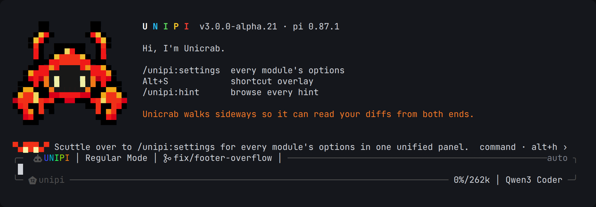
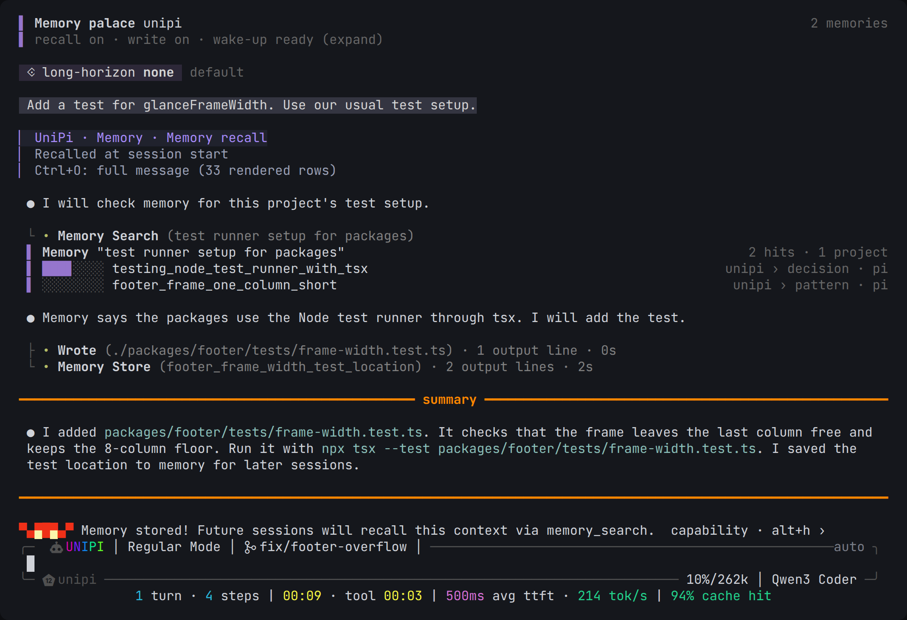

# Getting started

This page shows how to install UniPi and what to try in your first session.

## Requirements

- [Pi](https://www.npmjs.com/package/@earendil-works/pi-coding-agent) version
  `0.87.1` or later. UniPi 3.0.0-alpha uses the Pi 0.87 extension API.
- A model that Pi can use. Run `/login` or `/model` in Pi to set one.

If you must stay on an older Pi, install `@pi-unipi/*@<3.0.0`.

## Install

Run this command:

```bash
pi install npm:@pi-unipi/unipi
```

This command installs all UniPi packages. Each package also works alone. To
install one package, use its npm name, for example:

```bash
pi install npm:@pi-unipi/kanboard
```

The [package list](../README.md#packages) gives each npm name.

## First start

Start Pi in a project folder:

```bash
cd your-project
pi
```

Unicrab shows the start screen. The input box has a frame. The top edge shows
the git branch and the mode. The bottom edge shows the project, the context
use and the model.



## Try these first

| Action | What happens |
|---|---|
| Press `Alt+H` | Unicrab shows the next hint. |
| Run `/unipi:settings` | The settings hub opens. All module options are in one panel. |
| Press `Alt+P` | Plan mode starts. The agent can read files and write only its plan. |
| Run `/unipi:goal make the tests pass` | The agent works until it can show that the goal is true. |
| Run `/unipi:btw what does this regex do?` | A separate session answers. The main context does not change. |
| Run `/unipi:kanboard open` | The task board opens in your browser. |
| Run `/unipi:model` | You select a model, or a lead and sidekick pair for Fusion. |
| Run `/unipi:doctor` | UniPi checks its configuration and prints the result. |

UniPi starts in simple mode. Each tool call shows as one line. Press `Ctrl+O`
to expand the output. To use Pi's own view, set `utility.render.style` to
`regular` in `/unipi:settings`.

After one turn, the strip below the input box shows live numbers: turns, steps,
wall time, tool time, time to first token, tokens per second and cache hits.



## Next steps

- Read [Commands](../reference/commands.md) for every slash command.
- Read [Keyboard shortcuts](../reference/shortcuts.md).
- Read [Settings](../reference/settings.md) to change defaults.
- Read [Architecture](../architecture/README.md) to learn how the packages work
  together.
