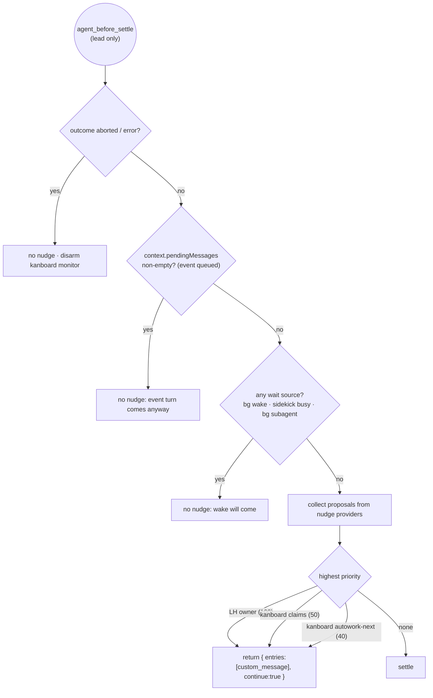
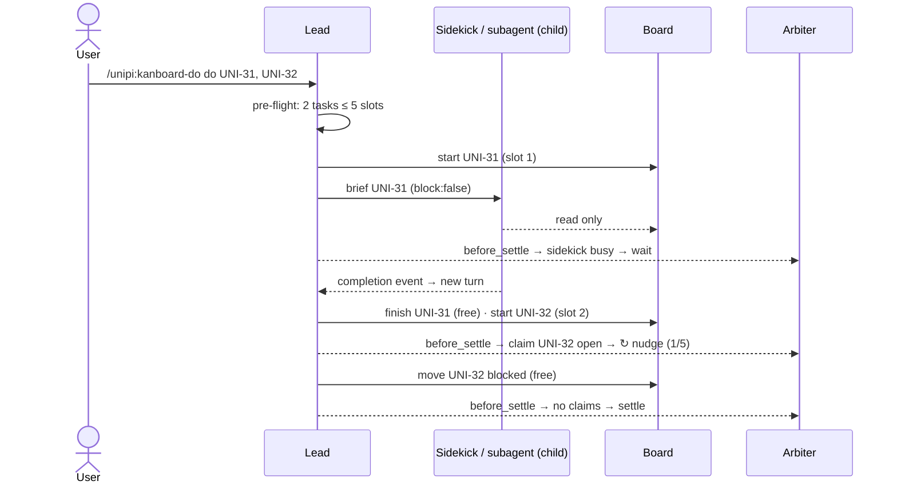

# Kanboard without a runner: one model, one turn arbiter

## Summary

Remove the kanboard runner. The session works board tasks itself in whatever
long-horizon mode it is in (regular, goal, ralph, swarm, graph). A single
**turn arbiter** in core decides, at pi's native `agent_before_settle`
boundary, whether the session continues and which nudge drives it. That ends
today's situation of up to nine producers queueing turns independently.

Decisions settled with the user:

1. **No runner.** Delete `runner.ts`, the queue drain, the claim-next loop and
   the per-task `--strategy/--plan` labels. `/unipi:kanboard-autowork` stays as
   a *mode of the session*: unlimited credits, and the arbiter keeps offering
   the next ready task. It no longer runs a worker loop.
2. **One model.** The lead, the Fusion sidekick and subagents (including
   swarm/graph workers) behave as a single model. **Children are the hands, the
   lead is the voice.** Children may read the board. Only the lead writes it,
   holds claims and credits, and drives continuation. In children the
   long-horizon judge and owners, the kanboard reminders and all nudges are
   off.
3. **Credits.**
   - `-do` grants **task slots**: each `start` uses one.
   - `-do` also grants a small **write budget** for `add`, `edit`, `link`,
     `order`, `move backlog↔todo` and `note` on others' tasks.
   - **Always free:** reads; `finish`, `move blocked` and `note` on the
     session's own claims. A started task can therefore always be closed.
   - **Pre-flight:** before starting anything, the agent compares the tasks
     the request needs with the slots left. If short, it tells the user
     ("I can do 3 of 5: raise the limit or batch") and does not start work.
   - **Autowork:** unlimited slots and writes; the per-turn add cap stays as a
     runaway guard.
4. **Coordinated continuation.**
   - *Events* (bg task done, subagent or sidekick done, compaction resume,
     watchdog notice) are always delivered, as today.
   - *Nudges* (long-horizon owner continuation, kanboard claim/autowork
     monitor) become proposals. The arbiter delivers **at most one per
     settle**, only when no event is already pending and no wait state
     (running bg wake, busy sidekick, background subagent) exists.
   - Priority: **LH owner > kanboard claims > kanboard autowork-next.**





## Steps

Phase 1 is TypeScript only. It ships without new kanboard binaries: the guard
refuses the removed subcommands. Phase 2 (Rust and web UI cleanup) is listed
at the end and is out of scope for this plan's implementation.

### Step 0: confirm the hypotheses (spikes, no product code)

Record the results in the plan before building on them.

**Results (2026-09-30, pi 0.99.1, live in tmux; artifacts in /tmp/spike/):**

- **Q1a:** `{ entries:[custom_message], continue:true }` runs exactly one extra
  turn with the message in context, and the boundary fires again after it. ✅
- **Q1b:** handlers run in extension load order and each is awaited.
  `entries` is **replaced** by the last handler that returns it (not
  concatenated); `continue` is OR-ed. The arbiter must concat `event.entries`
  itself, and it is the only unipi handler.
- **Q1c:** queued followUps (both `sendMessage` with triggerTurn and
  `sendUserMessage` with followUp) are drained **before** the boundary
  (`agent-session.js` `_handlePostAgentRun`), so `pendingMessages` is always
  0 there. Events suppress nudges inherently: the boundary only fires at the
  end of the event's run. Keep the `pendingMessages` check as a defence only.
  A followUp sent after settle starts its own run. Also: `sendUserMessage`
  returns `undefined`, not a Promise.
- **Q1d:** on Esc the boundary does **not** fire, so the arbiter never sees
  `outcome:"aborted"`. Kanboard disarms from `agent_end` instead (last
  assistant `stopReason === "aborted"`, as `reminders.ts` `aborted()` does).
- **Q1e:** `agent_end` handlers are fully awaited before the boundary, which
  is fully awaited before `agent_settled`. A stash filled at the end of
  long-horizon's `agent_end` settlement is therefore always visible at the
  boundary. The step-2 ordering fallback (wait reason plus a direct send) is
  **not needed**; drop it.
- **Q2:** long-horizon has no child guard anywhere. `gate.ts`, `resolve.ts`
  and `create_goal` (`tools/goal.ts:187`) all run in children. The step-2
  child rule is required.
- **Q3:** no global holder exists. Use
  `getSharedSubagents().some(r => r.background && r.status === "running")`
  (`subagents/src/manager.ts:58-63`) as the wait source.
- **Q4:** `ctx.sessionManager.getSessionId()` is stable across `pi -c` and
  `pi -r` and is available in `session_start`. However, `reason` is
  `"startup"` for `-c`/`-r` too, so resume detection must not use `reason`.
  The resume notice runs on every lead `session_start`.

1. **`agent_before_settle` semantics** (pi 0.87):
   - Does returning `{ entries: [custom_message], continue: true }` start
     exactly one turn with that message in context?
   - Do multiple extension handlers compose (entries concatenated, `continue`
     OR-ed), and in what order?
   - Does `context.pendingMessages` include followUps queued through
     `sendMessage(..., { deliverAs: "followUp", triggerTurn: true })` and
     `sendUserMessage(..., { deliverAs: "followUp" })`?
   - Does it fire when the run is aborted (`outcome: "aborted"`)?
   - Method: throwaway extension in tmux, logging to /tmp.
2. **Is the long-horizon judge/owner reachable in children?**
   `UNIPI_FUSION_CHILD` / `UNIPI_SUBAGENT_CHILD` are set, but no long-horizon
   code checks them. Check a sidekick brief like "keep going until tests pass".
3. **Where does background-subagent in-flight state live?** There is no
   `Symbol.for` holder today (only fusion status, long-horizon mode and the bg
   registry have one). Find the manager's running-set to publish.
4. Is `ctx.sessionManager.getSessionId()` stable across `pi -c` / `pi -r` at
   `session_start`? Workflow and subagents already use it.

### Step 1: core turn arbiter (`packages/core/src/turn/`)

- **`arbiter.ts`:** a process-global holder via `Symbol.for("unipi.turn.arbiter")`.
  ```ts
  type Nudge = { source: string; priority: number; customType: string; content: string; display: boolean; details?: unknown };
  registerNudgeProvider(source: string, priority: number, propose: (s: SettleInfo) => Nudge | null | Promise<Nudge | null>): () => void;
  registerWaitSource(source: string, waiting: () => string | null): () => void;   // reason text or null
  onSettleDecision(listener: (d: SettleDecision) => void): () => void;           // for footer/tests
  installArbiter(pi: ExtensionAPI): void;  // idempotent: the first call wins (holder flag)
  interface SettleInfo { outcome: "completed" | "aborted" | "error"; pendingMessages: number; lastAssistantText: string; toolCallsThisRun: number }
  ```
- **Single `agent_before_settle` handler.** It follows the decision tree in the
  Summary and returns at most one `custom_message` plus `continue: true`.
  - Provider errors are caught and never abort a turn.
  - Each provider is time-boxed (2s); a timeout counts as `null`.
- **`isChildProcess()`:** `UNIPI_FUSION_CHILD === "1" || UNIPI_SUBAGENT_CHILD === "1" || UNIPI_KANBOARD_CHILD`.
  In children `installArbiter` is a no-op, so no nudges are delivered.
- **Tool-call counter** for `toolCallsThisRun`, reset at `agent_start`.
- Export from `@pi-unipi/core` and install from the umbrella `packages/unipi/index.ts`.

### Step 2: long-horizon on the arbiter

- `GoalContinuation.send` and `RalphLoop.send` stop calling `sendUserMessage`.
  - Settlement still runs at `agent_end`: the verifier is async.
  - It stores the decided message in a one-slot stash.
  - The long-horizon nudge provider (priority 100) returns the stash at
    `before_settle` and clears it.
  - Waiting-backoff wakes are timer-driven while idle, so they stay direct
    sends (they are events).
  - The kickoff and the wrap-up prompt go through the stash too.
  - The runaway guard's mid-turn `steer` is unchanged.
- **Ordering guard.** The stash is filled in `agent_end`, but `before_settle`
  may run before the async settlement resolves. The provider awaits the
  in-flight settlement promise, within the 2s box. If the verifier is slower,
  the provider registers a wait reason ("goal verifying") and sends the message
  directly after settle as a fallback. Step 0 decides whether this is needed.
- **Children:** in `gate.ts`, when `isChildProcess()`, resolve mode `none`
  (`source: "child"`), never consult the judge, and refuse owner creation.
- **Owner status holder:** add `core/long-horizon-owner-status.ts`
  (`{ kind, status: "active" | "parked", stoppedThisRun?: "complete" | "paused" | "budget" }`).
  Kanboard reads it.
- **Verifier evidence contributors:** add
  `core registerEvidenceContributor(name, () => Promise<{ blocking: string[]; notes: string[] }>)`.
  - `verifyCompletion` gathers them.
  - Any `blocking` item forces `not_met`, with `missing` = the items.
  - Contributors are time-boxed, and a failure counts as no contribution.

### Step 3: wait sources

- **background-tasks** (`index.ts`, existing `pendingWakeText` logic): wait
  while any task is `running && triggerOnCompletion`.
- **fusion:** wait while `getSharedFusionStatus()?.busy` and the in-flight
  handoff was `block:false`. A blocking handoff can't reach settle.
- **subagents:** publish the in-flight background run set (step 0.3), and wait
  while it is non-empty.
- Completion deliveries stay as they are (`followUp` + `triggerTurn`). If one
  lands before settle, `pendingMessages` suppresses nudges; if it lands after,
  it starts its own turn.

### Step 4: kanboard redesign (`packages/kanboard`)

1. **Delete the runner:**
   - `src/runner.ts`, `tests/runner.test.ts`, the `RUNNER_ENTRY` resume and
     the runner compaction brief
   - `drainQueueAfterDo` and `drainPending`
   - the `/unipi:kanboard-autowork` runner loop
   - `runnerTask`/`runnerOwned` plumbing in `guard.ts` and `reminders.ts`
2. **Guard:**
   - Refuse `queue`, `unqueue`, `claim-next` and `set-run`, plus
     `edit --strategy/--plan`, with "removed: the session works tasks itself".
   - New budgets `slots` and `writes`:
     - `start` costs one slot in `-do`.
     - `finish`, `move <own> blocked` and `note <own>` are free. Ownership is
       checked with `show --json` (`run.session` = ours), cached per call.
     - Autowork: unlimited.
   - Settings `doTasks` (default 5) and `doWrites` (default 10) replace
     `doCredits`, with a migration in the settings hub.
3. **Children:** when `isChildProcess()`, allow reads only. Refuse every write
   with "report this to the lead; the lead updates the board". Reminders are
   silent.
4. **Session identity:**
   - At `session_start` in the lead, set
     `UNIPI_KANBOARD_SESSION = "pi-" + ctx.sessionManager.getSessionId()`
     (plain assignment; children keep the inherited value).
   - Set `UNIPI_KANBOARD_PID = process.pid`.
   - On resume, list tasks whose activity says
     `session lost: <our session>` (reaped because the old pid died). Show one
     notice ("UNI-30 was released when the last run ended — ask me to
     re-start it"). Nothing is auto-restarted.
5. **Monitor**, which replaces R2 and becomes a nudge provider:
   - **Claims (priority 50):**
     - When: armed, the session holds `in_progress` claims, no LH owner is
       active, and no owner stopped this run.
     - Nudge (visible): `↻ UNI-30 still In Progress — continue, or finish/block it (n/5)`.
   - **Autowork-next (priority 40):**
     - When: autowork is on, there are no open claims, and a ready Todo task
       exists.
     - Nudge: `↻ next ready: UNI-33 <title>`.
     - With nothing ready: a notice ("autowork done · 3 in review · 1
       blocked"), then disarm.
   - **Arming:** `-do`, autowork start, or a successful `start` in the lead.
   - **Disarming:** an aborted or errored outcome; or a long-horizon owner that
     stopped `paused` or `budget` this run (notice only: "goal paused —
     UNI-30 left In Progress").
   - **Re-arming:** `-do`, autowork, `start`, or a user prompt that names a
     claimed id.
   - **Budgets:** stop after 2 consecutive nudged runs with 0 tool calls
     (notice "⚠ UNI-30 stalled"). Hard cap of 5 nudges per task.
   - **Questions to the user:** if the last assistant text asks the user
     something (the final paragraph ends in `?` and the final message had no
     tool calls), send no nudge, only a notice.
   - R1 (the "start before editing" steer) stays.
6. **Goal evidence:** register the contributor `kanboard`. Its `blocking` list
   is every open claim of this session (`UNI-30 is still In Progress`), so a
   goal can't complete with claims open.
7. **`doText` / autowork text:**
   - Drop the queue and strategy wording.
   - State the slot count and the pre-flight rule, and that finish, blocked
     and own notes are free.
   - Autowork text: "work every ready task; choose any mode yourself".
8. **TUI:**
   - Footer: add `core/kanboard-status.ts` holder
     (`{ claims: string[]; autowork: boolean }`), pulled by the glance footer:
     `▣ UNI-30` / `▣ UNI-30 +1` / `▣ autowork`.
   - Transcript badges through `appendEntry` + `registerEntryRenderer`:
     `▣ UNI-30 started`, `✓ UNI-30 → In Review`, `⊘ UNI-30 blocked: …`,
     `↻` nudges (display:true custom messages).
9. **Shutdown:** on `session_shutdown`, run `release` on this session's
   claims with the note "released: session ended mid-task".

### Step 5: docs

`packages/kanboard/README.md`, `skills/kanboard/SKILL.md` (lanes table,
rules 2 and 6, terminal-only section), `docs/specs/2026-09-24-kanboard-v3-design.md`
(add a superseded note plus a pointer here), `docs/prefix-cache-architecture.md`
(nudges are tail custom messages), and the long-horizon design doc (arbiter and
child rule).

### Phase 2 (separate change, next binary release)

Remove `queue`, `unqueue`, `claim-next`, `set-run` and the strategy/plan fields
from `crates/kanboard`. Remove them from the web UI (Topcoat). Rebuild the 5
platform binaries.

## Files

- **New:**
  - `packages/core/src/turn/arbiter.ts`
  - `packages/core/src/turn/__tests__/arbiter.test.ts`
  - `packages/core/long-horizon-owner-status.ts`
  - `packages/core/kanboard-status.ts`
  - `packages/core/src/evidence.ts` (contributor registry)
  - `packages/kanboard/src/monitor.ts`
  - `packages/kanboard/tests/monitor.test.ts`
  - `packages/kanboard/src/badges.ts`
- **Edit:**
  - `packages/core/index.ts` / exports
  - `packages/unipi/index.ts` (install the arbiter)
  - `packages/long-horizon/index.ts` (send → stash)
  - `packages/long-horizon/src/engine/continuation.ts`
  - `packages/long-horizon/src/engine/ralph.ts`
  - `packages/long-horizon/src/engine/verifier.ts` (contributors)
  - `packages/long-horizon/src/gate.ts` (child → none)
  - `packages/long-horizon/src/owner.ts` (publish status)
  - `packages/background-tasks/index.ts` (wait source)
  - `packages/fusion/src/index.ts` / `tools.ts` (wait source, non-blocking flag)
  - `packages/subagents/src/manager.ts` / `index.ts` (in-flight holder + wait source)
  - `packages/kanboard/index.ts`, `src/guard.ts`, `src/commands.ts` (doText,
    autowork, status), `src/reminders.ts` (R2 removed, R1 kept),
    `src/settings.ts` (doTasks/doWrites + migration)
  - `packages/core/src/settings/migrations.ts`
  - `packages/footer/src/glance-editor.ts` + `footer/src/index.ts` (▣ segment)
  - the docs listed in Step 5
- **Delete:** `packages/kanboard/src/runner.ts`, `packages/kanboard/tests/runner.test.ts`,
  and the runner parts of `compaction-brief.test.ts`, `do-completions.test.ts`
  and `contract.test.ts`.

## Risks

- **`agent_before_settle` may not behave as assumed** (composition,
  pendingMessages coverage, abort firing). Step 0 gates everything. Fallback:
  the arbiter runs at `agent_settled` and sends with `sendMessage(triggerTurn)`.
  It still coordinates but loses the atomic "one continuation" guarantee.
- **Async goal verifier vs. the settle boundary.** A late stash could be
  dropped or double-sent. Mitigation: the provider awaits the settlement
  promise, with the wait-reason fallback, plus a test with a slow verifier.
- **Loop hijack of normal chat.** Mitigation: explicit arming and disarming,
  abort disarms, stall and hard caps.
- **Prefix cache.** Nudges must be tail messages with deterministic text. No
  system-prompt changes: the doText slot count lives in the user message, as
  credits do today.
- **Children regressions.** Making child kanboard read-only could break a
  sidekick flow that relied on `finish`. That is accepted by design: the lead
  finishes. Briefs and the skill must say so.
- **The long-horizon child rule** changes behavior for anyone who deliberately
  ran goals inside subagents. That's unlikely. Keep an env escape hatch:
  `UNIPI_LH_ALLOW_CHILD=1`.
- **Session-id switch** (pid → pi session id): claims started under the old
  scheme are reaped as before (pid dead). No data migration.
- **Old binaries still carry queue/strategy.** They are only refused in TS
  until phase 2, so the web UI may still show strategy fields.
- **Watchdog abort + follow-up** stays an event. After an abort, the arbiter's
  aborted branch keeps nudges off, so there is no fight.

## Verification

- **Step 0 spikes:** results written into this plan before step 1 starts.
- **Unit tests (per package):**
  - `core` arbiter:
    - priority pick; one nudge per settle
    - pendingMessages suppresses; a wait source suppresses; aborted suppresses
    - provider throw/timeout ignored; no-op in children
  - `long-horizon`:
    - continuation uses the stash, not a direct send
    - slow-verifier ordering
    - gate returns `none` in children
    - a blocking evidence contributor forces `not_met`
  - `kanboard`:
    - guard: slots, writes, the free own-claim set, removed subcommands
      refused, child read-only
    - monitor: arm/disarm matrix, stall cap, question heuristic, deference to
      an active or stopped owner, autowork next/done
    - doText pre-flight wording
    - session id from the pi session
    - resume notice
  - `background-tasks` / `fusion` / `subagents`: wait source true/false.
- **Gates:** `npm run typecheck` (0 errors); package tests for core,
  long-horizon, kanboard, background-tasks, fusion, subagents and footer; one
  final full `npm test` (EXIT:0).
- **Live on the coffee sandbox (tmux, cheap test model):**
  1. `-do` with 2 tasks: both reach In Review / Blocked across turns, the
     footer shows `▣`, badges appear.
  2. `-do` listing only (no start): no nudges.
  3. `-do` then `/unipi:goal …`: the goal drives with no kanboard nudges; a
     completion claim with an open claim is rejected; after the goal
     completes, the board is clean.
  4. A goal that pauses: no kanboard restart, and a notice appears.
  5. A Fusion sidekick working a claimed task (`block:false`): no nudge while
     it's busy; the lead finishes the task; the sidekick's own `note` is
     refused with the "report to lead" text.
  6. `bg_run` with trigger while a claim is open: no nudge until the wake.
  7. Esc mid-task: no nudge; a later unrelated prompt: no nudge.
  8. Resume with `pi -c` after killing pi: the reaped-task notice appears.
  9. Autowork over 3 ready tasks: it works through them and ends with
     "autowork done".
  10. Credits: a `-do` request needing 6 tasks with 5 slots makes the agent
      ask about batching before it starts anything.

## Implementation notes (2026-09-30, steps 1–5)

Deviations from the plan as written, all verified:

- **Step 0 supersedes the original assumptions** (recorded above): boundary
  `entries` are REPLACED by the last handler (the arbiter concats
  `event.entries` itself); followUps queued in `agent_end` drain BEFORE the
  boundary, so `pendingMessages` is a defence-only check; on Esc the boundary
  does not fire at all (kanboard disarms from `agent_end`); `agent_end` is
  fully awaited before the boundary, so the step-2 ordering fallback was
  dropped entirely.
- **Shutdown release uses `--actor system`**: the agent actor cannot run
  `release` (in_progress → todo is user/system only), but system can and
  `release` has no ownership check. The activity line the binary writes is
  `released to todo: <comment>`, so the resume notice matches the release
  marker with "contains" (the reaper's `session lost: <session> …` matches
  startsWith).
- **Stale-claim reaping moved to lead `session_start`** (`reap --json`): the
  runner used to reap; without it, killed-pid claims would never be released
  and the resume notice would never fire.
- **tool_result hooks parse invocations** (`kanboardInvocations`), not regexes:
  a first-cut regex missed global flags between the binary and the subcommand
  (`unipi-kanboard --actor agent --project p start X`) and silently never armed
  the monitor — caught in live verification.
- **`doCredits` → `doWrites` migration reads the stored layers**: `getSettings`
  merges registered defaults over stored values, so a stored `doCredits` is
  invisible behind the new `doWrites` default; `readKanboardSettings` checks
  the project and global config files for the legacy key. `queueMax` was
  removed outright (its only consumer was the queue).
- **`queue --list` is refused** like every other `queue` use (it was
  previously read-only); `status` no longer prints the queue.
- **Test scripts pin the child env**: this repository's tests are frequently
  run from fusion/subagent children (which inherit `UNIPI_FUSION_CHILD=1`
  etc.), where the new child rules (gate → none, owner refusal, read-only
  board) would fail the suites. `long-horizon` and `kanboard` test scripts and
  the core arbiter tests blank those vars so suites simulate the lead.
- **Core test glob gotcha**: core's test script matches `src/*/__tests__/*.test.ts`
  — tests placed directly under `src/__tests__/` silently do not run; the
  evidence tests live in `src/evidence/__tests__/`.
- **Auto-off wiring**: when the kanboard monitor turns autowork off itself
  (done / stalled / per-task cap), a `onAutoworkOff` callback drops the
  guard's budget and refreshes the footer holder, so all three views agree.
