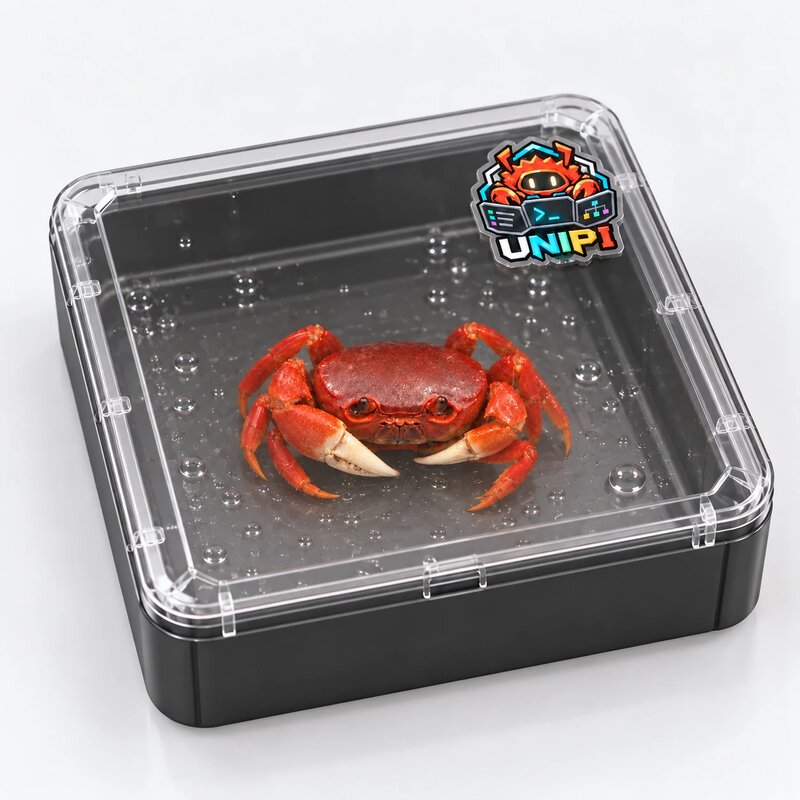

# The making of Unicrab

  
  
  

Unicrab is the UniPi mascot. It says hello when Pi starts. It leaves short hints
above the input box. It also has opinions about exit codes.

This page tells how a real crab became a terminal character that is 7 columns
wide.

## 1. A real crab

Unicrab started as the author's pet: a small red crab that lives in a clear box.
The photo above shows the crab with a UniPi sticker on the lid.

<!-- Author: add the crab's name, how it came home, and one habit here. -->

Crabs walk sideways and have two claws. Both facts became part of the mascot's
lore.

## 2. Pixel art

The first drawing of Unicrab is a pixel-art crab with a dark face, two bright
eyes and four raised claws. The colors come from the real crab: red shell,
orange joints and pale claw tips. The file is
[`docs/assets/unicrab-pixel.png`](../assets/unicrab-pixel.png).

## 3. The logo

The logo puts the same crab behind three terminal screens. The left screen
shows a list, the middle screen shows a prompt, and the right screen shows a
graph. The wordmark uses one color per letter. The start screen and the glance
footer use the same letter colors.

## 4. A crab in a terminal

A terminal cell is not a pixel. To draw the crab in a terminal, UniPi uses
half-block characters (`▀` and `▄`). One cell holds two pixels: the top pixel
takes the text color, and the bottom pixel takes the background color.

The script `packages/core/scripts/gen-crab.py` converts the pixel art:

1. It reads `docs/assets/unicrab-pixel.png`.
2. It divides the crab into a grid of cells.
3. It gives each cell the most frequent color in that cell.
4. It writes the result to `packages/core/src/hints/crab-data.ts`.

The script makes one crab for each place where Unicrab appears:

| Place | Size | When |
|---|---|---|
| Start screen | 22 columns × 10 rows | The terminal has 72 columns or more. |
| Start screen | 14 columns × 6 rows | The terminal has 40–71 columns. |
| Hint widget | 7 columns × 1 row | Always, above the input box. |
| Kitty image | A PNG image | Only when you set `hints.crab` to `image`. |

Each size has a truecolor version and a 256-color version. UniPi selects the
version that your terminal supports.

  

## 5. Lore

Unicrab has 12 lore lines in `packages/core/src/hints/lines.ts`. The start
screen shows one of them at random. Some favorites:

> Unicrab walks sideways so it can read your diffs from both ends.

> Unicrab has two claws: one for git add, one for git restore. It rarely mixes them up.

> Unicrab is not a lobster. Please stop asking about the butter.

> Merge conflicts don't scare Unicrab. It has survived low tide.

## 6. Hints

Unicrab also teaches UniPi. The hint system has 90 lines in 9 categories:
commands, shortcuts, settings, capabilities, explanations, troubleshooting,
release notes, workflows and lore.

- Press `Alt+H` to show the next hint.
- Press `Alt+Shift+H` to go back to an earlier hint.
- Run `/unipi:hint` to browse all hints.

The [Core README](../../packages/core/README.md#unicrab-hints) lists the hint
settings.
