# Architecture (/docs/architecture)


**System:** Unipi — all-in-one extension suite for the Pi coding agent (`@pi-unipi/unipi` v2.18.x)
&#x2A;*Document type:** C4 architecture model (Context → Container → Component → Code → Deployment)
&#x2A;*Generated:** 2026-09-16 06:56:42 (UTC)

***

## 1. Architecture Overview [#1-architecture-overview]

### 1.1 Architecture Design Philosophy [#11-architecture-design-philosophy]

Unipi is not a standalone application. It is a **plugin suite** that loads into an existing host — the Pi coding agent, a terminal-based AI coding assistant — and extends it with new tools, slash commands, lifecycle hooks, and terminal-UI overlays. Every architectural decision in the codebase follows from three constraints that this positioning imposes:

1. **The host owns the main loop.** No Unipi package runs its own event loop, HTTP listener (with the single exception of the kanboard board server and the trajectory server), or scheduler. Everything is triggered by the host: a tool call from the LLM, a slash command from the developer, or a lifecycle hook such as `session_start`. Packages therefore behave as **reactive registrations** rather than services.

2. **The agent's context window is the scarcest resource.** Compaction, bounded output truncation of helper results, token budgets for delegated children, and deterministic (non-LLM) summarization are all expressions of a single principle: never let a feature flood the parent conversation. This principle explains why `@pi-unipi/core` ships a `bounded-output` utility and why `get_helper_result` truncates before returning.

3. **Optional peers must never become hard dependencies.** With \~24 independently publishable packages, any package may be absent or disabled. Cross-package cooperation is therefore designed around **discovery** (`MODULE_READY` events), **shared synchronous read-models** (`Symbol.for` global slots), and **file-format contracts** (kanboard parses markdown written by workflow/milestone) instead of direct imports. The kernel `@pi-unipi/core` is the only universally shared code.

From these constraints emerge the operational values visible throughout the code: **config-gated, fail-closed registration** (a disabled module registers nothing), **fail-soft backends** (a missing MemPalace or a failed SQLite init degrades rather than crashes), **crash-safe persistence** (temp-write/fsync/rename with versioned manifests), and **centralised process-tree lifecycle** (timeouts, ESC abort propagation, and Windows `taskkill` tree termination are handled in hubs).

### 1.2 Core Architecture Patterns [#12-core-architecture-patterns]

| Pattern                                        | Where it appears                                                                                                                     | Purpose                                                                              |
| ---------------------------------------------- | ------------------------------------------------------------------------------------------------------------------------------------ | ------------------------------------------------------------------------------------ |
| **Plugin suite on a thin shared kernel**       | `@pi-unipi/core` is the only internal dependency of nearly every package                                                             | Minimise blast radius; keep packages independently loadable and publishable          |
| **Composition root with fixed load order**     | `packages/unipi/index.ts` loads 23 modules in sequence                                                                               | Single place to wire the suite; encodes implicit ordering contracts                  |
| **Host-mediated integration (Extension API)**  | `pi.registerTool`, `pi.registerCommand`, `pi.on(...)`, `pi.events`                                                                   | All host interaction goes through one typed API surface                              |
| **Event-driven discovery (`MODULE_READY`)**    | `core/events.ts`, consumed by `notify`, `footer`, `workflow`                                                                         | Optional peers announce themselves; consumers subscribe without imports              |
| **Shared read-model via `Symbol.for` globals** | `background-tasks/registry-shared.ts`, `core/fusion-status.ts`                                                                       | Hot-path synchronous reads (footer 1s refresh) that survive duplicate `node_modules` |
| **Adapter**                                    | `mcp/bridge/translator.ts`, `ServerRegistry` with injected callbacks                                                                 | Translate MCP tools into Pi tools; adapt to `registerTool` vs `registerExternalTool` |
| **Pipeline**                                   | `compactor/compaction/summarize.ts#compile()` — six deterministic stages                                                             | Cheap, predictable compaction that can be auto-triggered on every turn               |
| **Registry**                                   | `web-api/providers/registry.ts`, `footer/registry`, `kanboard/parser` ParserRegistry, `notify/events.ts` subscription registry       | Pluggable providers/segments/parsers resolved at runtime                             |
| **Cross-cutting proxy (tracer scope)**         | `trajectory/tracer.ts` wraps each module's `ExtensionAPI`                                                                            | Attribute context mutations to individual packages for observability                 |
| **Guard-rails-before-side-effects**            | `subagents/tool-handler.ts` (enablement → depth → budgets → policy), `ask-user/tools.ts` (schema → allow-list), `compactor/security` | Validate fully before spawning processes or rendering UI                             |

### 1.3 Technology Stack Overview [#13-technology-stack-overview]

| Layer                   | Technology                                                                                     | Notes                                                                                       |
| ----------------------- | ---------------------------------------------------------------------------------------------- | ------------------------------------------------------------------------------------------- |
| Language / runtime      | TypeScript on Node.js 22                                                                       | esbuild target `node22`, ESM output                                                         |
| Monorepo tooling        | npm workspaces (`packages/*`), esbuild bundler (`scripts/build-bundle.mjs`)                    | Bundles only `@pi-unipi/*` and relative imports; third-party code stays external            |
| Host framework          | `@earendil-works/pi-coding-agent ^0.84.0`, `pi-tui`, `pi-ai`                                   | Provides `ExtensionAPI`, TUI primitives, model registry, event bus                          |
| Schema validation       | TypeBox                                                                                        | All tool input schemas (`spawn_helper`, `ask_user`, `image_generate`, …)                    |
| Embedded storage        | SQLite (compactor `SessionDB`, legacy memory), Markdown files, JSON artifacts                  | Project-scoped `.unipi/`, user-scoped `~/.unipi/`                                           |
| Memory backend          | MemPalace (Python, via `uv` venv and `spawnSync` JSON-line bridge)                             | Fail-soft with SQLite/markdown fallback                                                     |
| Inter-process protocols | JSON-RPC 2.0 over stdio (MCP), `pi --mode json -p` child processes, XML usage blocks on stdout | All child processes are spawned, tailed, and killed by hub modules                          |
| Web fetching            | `wreq-js` (TLS-fingerprinted HTTP), `defuddle` (content extraction)                            | Multiple search providers: DuckDuckGo, Tavily, SerpAPI, Perplexity, Jina, Firecrawl, Wigolo |
| Notification transports | Native desktop, ntfy, gotify, Telegram, Focus                                                  | Dispatched from `notify/platforms/*`                                                        |
| Web UI                  | Small HTTP server with server-rendered pages (htmx / Alpine.js)                                | Kanboard only                                                                               |

***

## 2. System Context [#2-system-context]

### 2.1 System Positioning and Value [#21-system-positioning-and-value]

Unipi turns a single-process terminal coding agent into a broader development platform. Its business value can be summarised in four capabilities that map directly onto user needs:

* **Longer autonomous sessions** — the compactor keeps context under budget with a deterministic summarisation pipeline and persists session history to SQLite for later recall.
* **Parallel and long-running execution** — subagents and background tasks let the primary agent delegate to child Pi processes with budgets, artifacts, and result packages.
* **Persistent memory** — the memory package stores durable knowledge in MemPalace with a human-readable markdown tier.
* **External reach** — MCP servers, web search/fetch, image generation/recognition, and model fusion extend what the agent can call.

Around these core capabilities sit presentation features (footer status bar, ask-user prompts, keyboard chords, notifications) and team-process features (workflow commands with sandboxes, milestones, a kanban web UI).

### 2.2 User Roles and Scenarios [#22-user-roles-and-scenarios]

| User role                            | Description                                                        | Primary scenarios                                                                                                                                                         |
| ------------------------------------ | ------------------------------------------------------------------ | ------------------------------------------------------------------------------------------------------------------------------------------------------------------------- |
| **AI coding agent users**            | Developers running Pi in a terminal with Unipi installed           | Run long sessions without hitting context limits; delegate sub-tasks to helpers; recall prior sessions; call MCP tools; receive mobile notifications when input is needed |
| **Extension developers**             | Engineers building or maintaining `@pi-unipi/*` packages           | Depend on `core` contracts; register through the Pi `ExtensionAPI`; emit `MODULE_READY`; reuse TUI overlay/width helpers                                                  |
| **Teams using structured workflows** | Groups adopting `/unipi:brainstorm`, `plan`, `work`, `review-work` | Enforce sandboxes per workflow phase; track milestones in `MILESTONES.md`; view plans on the kanboard web UI                                                              |

### 2.3 External System Interactions [#23-external-system-interactions]

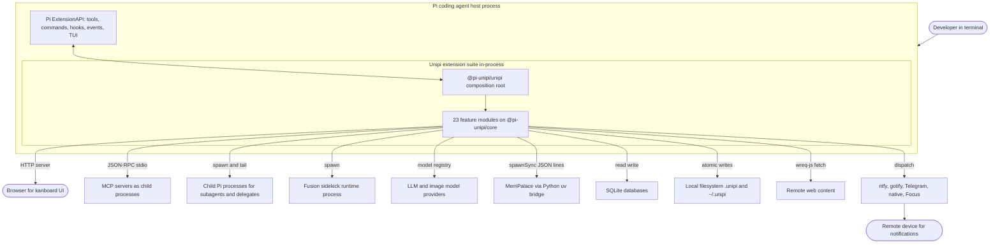

| External system        | Interaction type                                                                                                            | Owning Unipi packages                                                         |
| ---------------------- | --------------------------------------------------------------------------------------------------------------------------- | ----------------------------------------------------------------------------- |
| Pi coding agent        | In-process `ExtensionAPI` (tool registration, commands, hooks, `pi.events`, `setFooter`, `setWidget`)                       | All                                                                           |
| MCP servers            | JSON-RPC 2.0 over stdio, child process lifecycle                                                                            | `mcp`                                                                         |
| Child Pi processes     | `pi --mode json -p` spawned; stdout tailed for JSON events and XML usage blocks                                             | `subagents`, `background-tasks`                                               |
| LLM / image providers  | Via the Pi model registry and OpenAI-compatible images API                                                                  | `image`, `fusion`, `compactor` (ranked brief), `notify` (recap summarisation) |
| MemPalace              | Python bridge (`bridge/mempalace_bridge.py`) invoked with `spawnSync`, one JSON line per operation; auto-installed via `uv` | `memory`                                                                      |
| SQLite                 | Embedded DB for `SessionDB` (events, sessions, compaction stats) and legacy memory                                          | `compactor`, `memory`                                                         |
| Filesystem             | `.unipi/` (project), `~/.unipi/` (user), temp roots for child runs                                                          | Most packages                                                                 |
| Web content            | TLS-fingerprinted fetch (`wreq-js`) + extraction (`defuddle`) + search provider APIs                                        | `web-api`                                                                     |
| Notification platforms | Outbound HTTP / native OS notifications                                                                                     | `notify`                                                                      |
| Browser                | Local HTTP server rendering board pages                                                                                     | `kanboard` (and `trajectory/server.ts`)                                       |

### 2.4 System Boundary Definition [#24-system-boundary-definition]

**In scope:** everything under `packages/` and `scripts/`, plus the on-disk state the modules own — `.unipi/` project directories (created by `initUnipiDirs()`), `~/.unipi/memory`, session databases, delegate artifacts, ralph state under `.unipi/ralph`, and `.unipi/docs/{specs,plans,reviews}` written by workflow.

**Out of scope:** the Pi host runtime and its built-in tools; third-party MCP server implementations; LLM and image providers; OS notification services and their transports; remote content servers; the user's shell, terminal emulator, and window manager.

***

## 3. Container View [#3-container-view]

In C4 terms, Unipi's "containers" are the deployable/loadable units — the npm packages that are composed into the host process — together with the out-of-process children they spawn and the data stores they own. Because all packages share one OS process with the host, the container boundary here is a **package boundary**, not a network boundary.

### 3.1 Domain Module Division [#31-domain-module-division]

The 24 packages group into six domains. Two classification decisions differ from earlier documentation and are made explicit here: **ralph** is placed with Agent Orchestration (it drives iterative loops and emits `RALPH_LOOP_START/END` on the same bus as task events), and **trajectory** is placed with Context & Memory but is also a **cross-cutting observability layer** because it wraps every module's `ExtensionAPI` in the composition root.

| Domain                                | Type                | Packages                                                                                                            | Importance | Complexity |
| ------------------------------------- | ------------------- | ------------------------------------------------------------------------------------------------------------------- | ---------- | ---------- |
| Platform Core & Shared Infrastructure | Infrastructure      | `core`, `utility`, `updater`, `unipi`, `scripts/`                                                                   | 9.0        | 5.5        |
| Agent Orchestration                   | Core business       | `subagents`, `background-tasks`, `ralph`                                                                            | 9.5        | 9.5        |
| Context & Memory Management           | Core business       | `compactor`, `memory`, `trajectory`                                                                                 | 9.5        | 9.0        |
| External Capability Integration       | Core business       | `mcp`, `web-api`, `image`, `fusion`                                                                                 | 8.5        | 8.0        |
| User Interaction & Presentation       | Presentation        | `footer`, `ask-user`, `input-shortcuts`, `notify`, `info-screen`, `command-enchantment` (dir `autocomplete`), `btw` | 7.5        | 6.5        |
| Structured Development Workflow       | Supporting business | `workflow`, `milestone`, `kanboard`                                                                                 | 6.5        | 5.5        |

### 3.2 Domain Module Architecture [#32-domain-module-architecture]

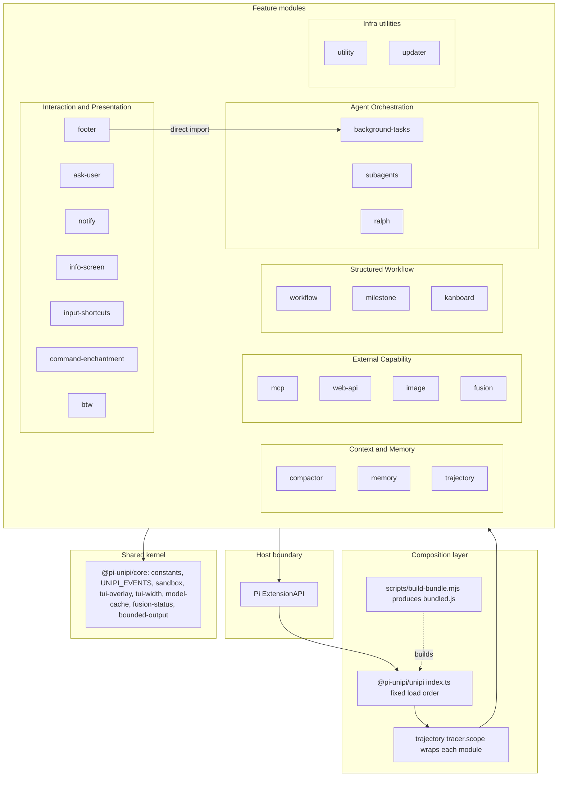

**Composition and load order.** `packages/unipi/index.ts` is the single composition root. The verified sequence is:

```
workflow → ralph → memory → utility → info-screen → subagents → background-tasks →
btw → web-api → ask-user → mcp → notify → milestone → kanboard →
command-enchantment → compactor → footer → updater → input-shortcuts → image → fusion → trajectory
```

Two properties of this ordering are architecturally significant. First, `createUnipiTracer(pi)` produces `tracer.scope(name)`, a proxy around the `ExtensionAPI` that fingerprints hook inputs/outputs so trajectory can attribute context mutations to individual packages. Second, the order is **load-bearing**: `utility` must precede `info-screen` because the TUI overlay stack pops top-most entries and a capturing overlay's `done()` is one-shot. This contract is currently enforced only by a comment in the composition root.

### 3.3 Storage Design [#33-storage-design]

Persistence is file- and SQLite-based; there is no network database. Each store is owned by exactly one package.

| Store                                                                  | Location                                           | Format                                                            | Owner                                                                  | Consistency mechanism                                                                            |
| ---------------------------------------------------------------------- | -------------------------------------------------- | ----------------------------------------------------------------- | ---------------------------------------------------------------------- | ------------------------------------------------------------------------------------------------ |
| Session events, sessions, compaction counters                          | project-scoped `.unipi/`                           | SQLite (`SessionDB`) with schema migrations                       | `compactor/src/session/db.ts`                                          | Transactions; init failure leaves `sessionDB = null` (fail-soft)                                 |
| Delegate artifacts (seed, prompt, ledger, budget plan, result package) | temp root per delegate                             | JSON files + versioned manifest                                   | `background-tasks/src/delegate/artifacts.ts` (`DelegateArtifactStore`) | Temp-write → fsync → rename; manifest tracks committed artifacts                                 |
| Background task snapshots and logs                                     | task directory                                     | Snapshot files, tailed output                                     | `background-tasks/src/registry.ts`, `durable-fs.ts`                    | Periodic snapshot persistence                                                                    |
| Async subagent runs                                                    | `~/…` temp root                                    | `status.json`, `output.txt`, `events.jsonl`                       | `subagents/src/async-runner.ts`                                        | Append-only event log                                                                            |
| Memories                                                               | `~/.unipi/memory` (global) and project dir         | MemPalace store (primary) + markdown durable tier + legacy SQLite | `memory/storage.ts`, `mempalace.ts`                                    | Auto-install and migration flags; markdown is the human-readable tier; MemPalace ping cached 24h |
| Ralph loop state                                                       | `.unipi/ralph`                                     | Files                                                             | `ralph`                                                                | Completion marker `<promise>COMPLETE</promise>`                                                  |
| Workflow documents                                                     | `.unipi/docs/{specs,plans,reviews}`                | Markdown with frontmatter and checkboxes                          | `workflow`                                                             | Human-editable; parsed by kanboard                                                               |
| Milestones                                                             | `MILESTONES.md`                                    | Markdown                                                          | `milestone`                                                            | Parsed inline by kanboard's `MilestoneParser`                                                    |
| Fusion preset                                                          | user config                                        | JSON                                                              | `fusion/src/preset.ts`                                                 | Persisted on apply                                                                               |
| Web fetch cache                                                        | in-memory / local                                  | Formatted text                                                    | `web-api/src/cache.ts`                                                 | Keyed by URL/options                                                                             |
| Module configs                                                         | per-package config files (scaffolded on first run) | JSON                                                              | Each package's `config/manager.ts`                                     | Master `enabled` toggle gates registration                                                       |

### 3.4 Inter-Domain Module Communication [#34-inter-domain-module-communication]

Unipi uses **three** distinct inter-module channels. Knowing which channel an interaction uses is the key to reading the codebase.

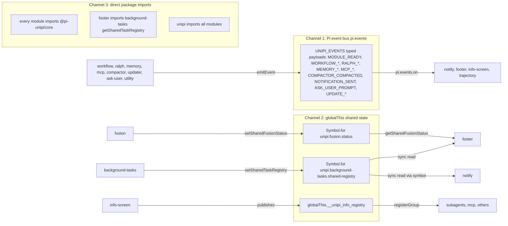

**Channel 1 — typed event bus.** `core/utils.ts#emitEvent` wraps `pi.events.emit`; `UnipiEventPayload` is a discriminated union of \~22 payload interfaces. `MODULE_READY` carries `{name, version, commands, tools}` and is the discovery mechanism: `notify` dynamically subscribes to events of discovered peers, `footer` adds segments, `workflow` detects `ralph`. Third-party events (`herdr:blocked`, `rpiv:ask-user:prompt`, `permissions:ui_prompt`) are also consumed. `COMPACTOR_STATS_UPDATED` is `@deprecated` — the footer now reads live Pi session data directly.

**Channel 2 — `Symbol.for` shared read-models.** Chosen deliberately for hot-path synchronous reads. `registry-shared.ts` documents the rationale: the footer's 1-second refresh timer calls `allTasks()` directly, and `Symbol.for` ensures a single instance across duplicate `node_modules` copies. `core/fusion-status.ts` explicitly follows the same pattern. The info-screen registry is the older string-keyed variant with only an `InfoRegistryLike` interface in `core/global-types.ts`.

**Channel 3 — direct imports.** Kept minimal. Only `footer → background-tasks` breaks the "core-only" rule; `notify` reads the same registry via the symbol to have "zero load-order or dependency coupling to that optional sibling". This inconsistency is a tracked risk (Section 6.6).

**Domain relation summary**

| From                       | To                  | Relation                             | Strength | Mechanism                                                                      |
| -------------------------- | ------------------- | ------------------------------------ | -------- | ------------------------------------------------------------------------------ |
| All feature domains        | Platform Core       | Configuration dependency             | 8.0–9.0  | Direct import of `@pi-unipi/core`                                              |
| Interaction & Presentation | Agent Orchestration | Event subscription + shared registry | 6.0      | `MODULE_READY`, task/loop events, `Symbol.for` task registry                   |
| Interaction & Presentation | Context & Memory    | Data dependency                      | 6.0      | Footer compactor/memory segments; compaction events to notify                  |
| Interaction & Presentation | External Capability | Data dependency                      | 5.0      | Footer MCP segment; `fusion-status`; fusion supplies `/model` autocomplete     |
| Interaction & Presentation | Structured Workflow | Data dependency                      | 5.0      | Footer workflow/kanboard segments                                              |
| Structured Workflow        | Agent Orchestration | Optional integration                 | 4.0      | Workflow detects ralph via `MODULE_READY`; subagents execute `workflowScript`  |
| Agent Orchestration        | Context & Memory    | Conceptual overlap                   | 5.5      | Delegate context policy / token budgets mirror compaction concepts (no import) |
| kanboard                   | workflow, milestone | File-format contract                 | 7.0      | Parses markdown produced by peers; **no runtime import**                       |

***

## 4. Component View [#4-component-view]

### 4.1 Core Functional Components [#41-core-functional-components]

#### 4.1.1 Agent Orchestration [#411-agent-orchestration]

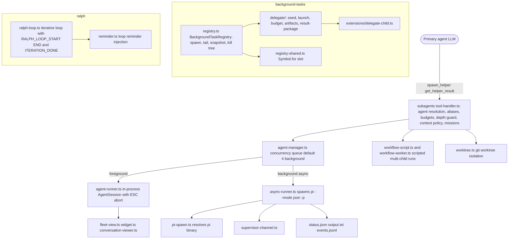

| Component                  | File(s)                                                                              | Responsibility                                                                                                                                                                                                                                                                           |
| -------------------------- | ------------------------------------------------------------------------------------ | ---------------------------------------------------------------------------------------------------------------------------------------------------------------------------------------------------------------------------------------------------------------------------------------- |
| **Tool handler**           | `subagents/src/tool-handler.ts` (\~49 KB, complexity \~143)                          | Single dispatcher for the multiplexed `spawn_helper` tool: management actions (list/status/kill/view), `workflowScript` runs, and single-child launches. Applies enablement, depth guard, spawn/token budgets, authority policy, context policy, acceptance criteria, and mission state. |
| **AgentManager**           | `agent-manager.ts`                                                                   | Concurrency queue (default 4 background helpers); tracks `AgentRecord`s; routes to foreground or async runner.                                                                                                                                                                           |
| **Agent runner**           | `agent-runner.ts`                                                                    | Foreground execution via the host's `createAgentSession`, `SessionManager`, `SettingsManager`; propagates ESC abort.                                                                                                                                                                     |
| **Async runner**           | `async-runner.ts`                                                                    | Spawns `pi --mode json -p`; writes `status.json`, `output.txt`, `events.jsonl`; excludes `spawn_helper`/`get_helper_result` from the child tool set to prevent nesting.                                                                                                                  |
| **Budgets / authority**    | `budgets.ts`, `authority-policy.ts`                                                  | Prevent runaway fan-out and constrain what helpers may do.                                                                                                                                                                                                                               |
| **Worktree isolation**     | `worktree.ts`                                                                        | Runs helpers in isolated git worktrees.                                                                                                                                                                                                                                                  |
| **BackgroundTaskRegistry** | `background-tasks/src/registry.ts` (\~2000 lines)                                    | Spawns child processes, tails stdout, parses XML usage payloads (model/context/tokens/tools), persists snapshots, terminates process trees (incl. `windows-taskkill.ts`).                                                                                                                |
| **Delegate subsystem**     | `delegate/{seed,launch,budget,artifacts,result-package}.ts`, `delegate-extension.ts` | Builds child seed and prompt, plans budgets, writes crash-safe artifacts, assembles result packages.                                                                                                                                                                                     |
| **Ralph loop**             | `ralph/ralph-loop.ts`, `tools.ts`, `completions.ts`                                  | `/unipi:ralph` iterative loops; stops on `<promise>COMPLETE</promise>`; state under `.unipi/ralph`.                                                                                                                                                                                      |

> **Important correction.** `subagents` and `background-tasks` are **independent siblings** — neither depends on the other. Helpers spawned via `spawn_helper` run through `subagents`' own runners; the `background-tasks` delegate path (`delegate-extension.ts` → `extensions/delegate-child.ts`) is a separate orchestration mechanism. Both are ports of upstream extensions (`pi-subagents`, `pi-background-tasks`) rebranded to `/unipi:*`. Earlier documentation conflated them.

#### 4.1.2 Context & Memory Management [#412-context--memory-management]

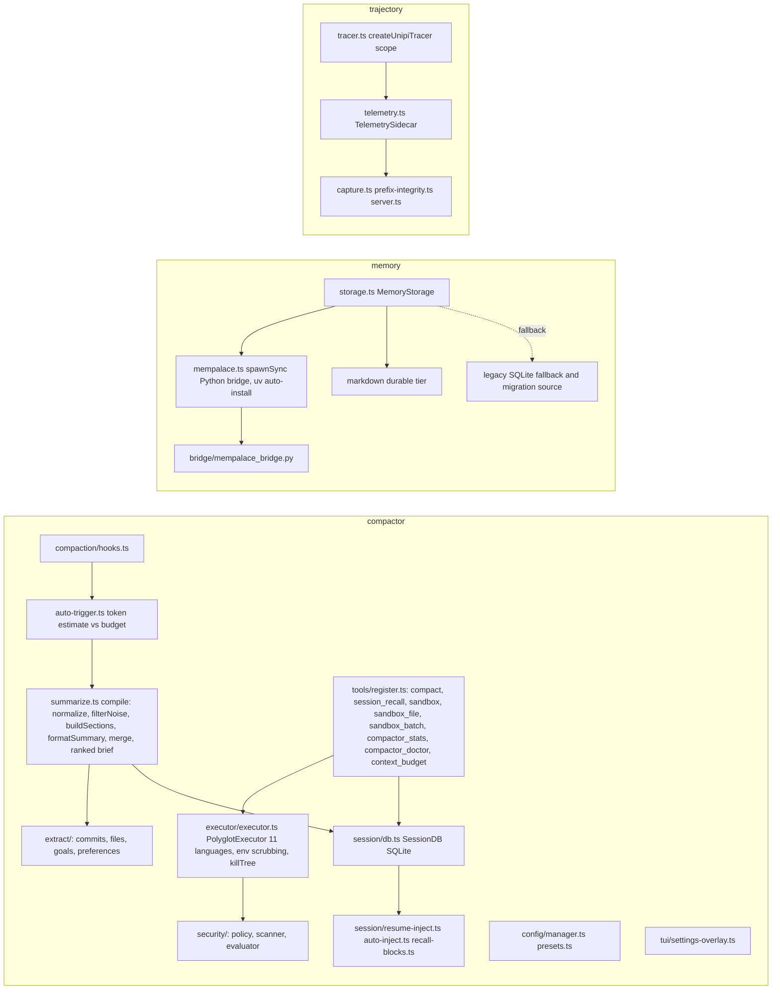

| Component                              | Responsibility                                                                                                                                                                                        |
| -------------------------------------- | ----------------------------------------------------------------------------------------------------------------------------------------------------------------------------------------------------- |
| **Compaction Engine** (`compaction/*`) | Deterministic six-stage `compile()`; no LLM call in core stages, which is what makes per-turn auto-triggering affordable. Optional ranked-brief branch (`selectRankedBriefBlocks`).                   |
| **Auto-trigger**                       | Estimates tokens (`token-estimate.ts`) against configured budget on each turn hook.                                                                                                                   |
| **SessionDB**                          | Project-scoped SQLite with events, sessions, compaction statistics, schema migrations, aggregate queries.                                                                                             |
| **Resume & recall**                    | `resume-inject` re-injects prior summary at session start; `session_recall` tool pulls specific blocks on demand.                                                                                     |
| **Sandbox executor & security**        | `PolyglotExecutor` supports 11 languages, strips `DANGEROUS_ENV_VARS`, uses temp dirs, kills process trees; guarded by policy scanner/evaluator. Arguably orthogonal to compaction (see Section 6.6). |
| **MemoryStorage**                      | Primary backend MemPalace; markdown as durable human-readable tier; legacy SQLite as fallback/migration source. "Memory must never hard-fail" — all bridge ops return `null` when unavailable.        |
| **Trajectory tracer**                  | Wraps each module's `ExtensionAPI`; computes `mutationSurface`/`mutationEvidence` fingerprints; telemetry sidecar and local server for inspection.                                                    |

#### 4.1.3 External Capability Integration [#413-external-capability-integration]

```mermaid
%% litho-mermaid
flowchart TB
    subgraph McpPkg["mcp"]
        McpConfig["config/: manager, schema, sync, seed-servers.json"] --> ServerRegistry["bridge/registry.ts ServerRegistry start stop restart with partial-failure cleanup"]
        ServerRegistry --> McpClient["bridge/client.ts McpClient JSON-RPC stdio: initialize, listTools, callTool"]
        ServerRegistry --> Translator["bridge/translator.ts MCP tool to Pi tool with unique names"]
        Translator -->|registerTool or registerExternalTool| PiTools["Pi tool registry"]
        ServerRegistry -->|MCP_SERVER_* MCP_TOOLS_*| McpBus["pi.events"]
        McpTUI["tui/: add-overlay, settings-overlay"] --> ServerRegistry
    end

    subgraph WebPkg["web-api"]
        WebTools["tools.ts"] --> ProviderReg["providers/registry.ts: duckduckgo, tavily, serpapi, perplexity, jina-reader, firecrawl, wigolo"]
        ProviderReg --> Engine["engine/extract.ts: URL validation, wreq-js fetch, content-type routing, defuddle, fallbacks"]
        Engine --> WebCache["cache.ts"]
        Engine --> Format["engine/format.ts dom.ts profiles.ts"]
        ProviderTUI["tui/provider-selector.ts"] --> ProviderReg
    end

    subgraph ImagePkg["image"]
        ImageTools["tools.ts: image_generate image_recognize"] --> GenRec["generate.ts recognize.ts"]
        GenRec --> OpenAIImages["openai-images-api.ts"]
        ImageTools --> VisionGate["vision gating by active model"]
        RegisterProv["register-providers.ts models.ts"] --> GenRec
    end

    subgraph FusionPkg["fusion"]
        Picker["picker.ts preset-editor.ts overlays"] --> PresetStore["preset.ts persisted preset"]
        PresetStore --> SidekickRT["sidekick-runtime.ts"]
        SidekickRT --> Savings["savings.ts"]
        Savings -->|setSharedFusionStatus| CoreFusion["core/fusion-status.ts"]
        FusionTools["tools.ts transcript.ts nudge.ts"] --> SidekickRT
    end
```

The MCP bridge is the cleanest **adapter** in the codebase: `ServerRegistry` is constructed with injected callbacks (`emitEvent`, `registerTool`, `unregisterTool`, `canUnregisterTools`), and `mcp/src/index.ts` feature-detects whether the host exposes `registerTool` or `registerExternalTool`. Tool names are made deterministic and globally unique so multiple servers can coexist; a failed handshake triggers cleanup of any already-registered tools for that server.

#### 4.1.4 User Interaction & Presentation [#414-user-interaction--presentation]

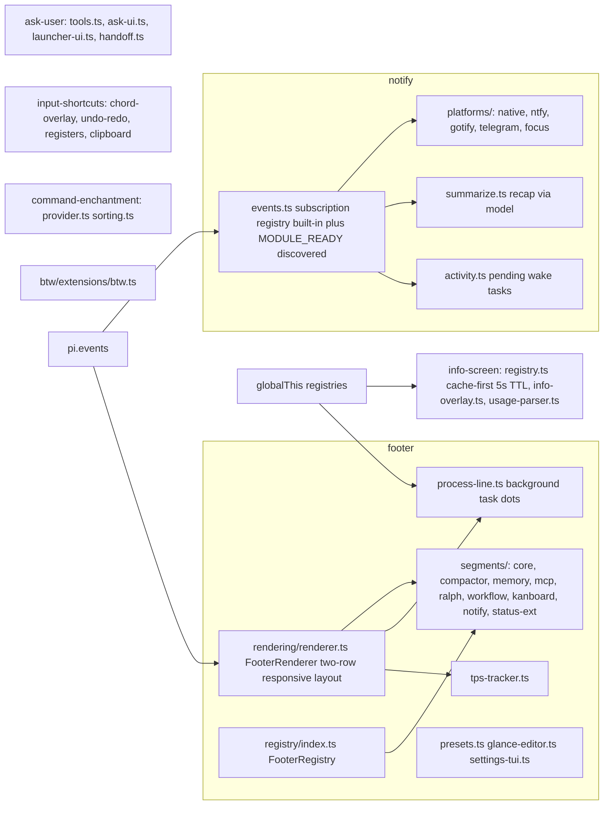

`footer` is the system's **primary read-model consumer** — it aggregates the event bus, the fusion status global, the background-tasks registry, and live Pi session data into a 1-second-refreshed status bar. `notify` is the **primary egress module**, translating internal events into outbound platform messages while honouring focus/activity suppression and tracking pending wake tasks so a remote user knows when the agent is blocked on input.

#### 4.1.5 Structured Development Workflow [#415-structured-development-workflow]

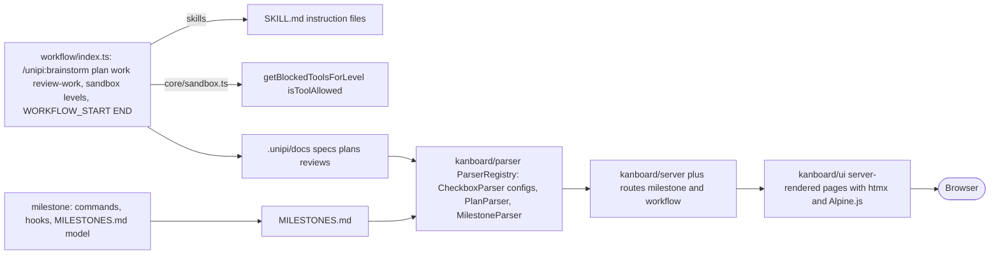

The coupling in this domain is **file-format based**. `kanboard` parses the markdown documents produced by `workflow` and `milestone` rather than importing their code; `MilestoneParser` re-implements milestone parsing inline specifically "to avoid requiring `@pi-unipi/milestone` as a runtime dependency" (the file header comment claiming an import is stale). Workflow sandboxes gate tools through `core/sandbox.ts` **without mutating Pi's tool schemas**, and a sandbox snapshot message is shown to the user.

### 4.2 Technical Support Components [#42-technical-support-components]

| Component                      | Package                                                                                                                                  | Responsibility                                                                                                |
| ------------------------------ | ---------------------------------------------------------------------------------------------------------------------------------------- | ------------------------------------------------------------------------------------------------------------- |
| **Core contracts & event bus** | `core/{constants,events,utils,global-types}.ts`                                                                                          | `UNIPI_EVENTS`, typed payloads, `emitEvent` safe wrapper, `MODULES` constant, `InfoRegistryLike`              |
| **Sandbox primitives**         | `core/sandbox.ts`                                                                                                                        | Sandbox levels, `getBlockedToolsForLevel`, `isToolAllowed`                                                    |
| **TUI helpers**                | `core/tui-overlay.ts`, `tui-width.ts`, `spinner-line.ts`                                                                                 | Overlay mounting on the shared overlay stack; width measurement                                               |
| **Model cache**                | `core/model-cache.ts`                                                                                                                    | Cached Pi model registry lookups (used by fusion, image, image vision gating)                                 |
| **Fusion status**              | `core/fusion-status.ts`                                                                                                                  | `Symbol.for` shared status slot (`SharedFusionStatus`)                                                        |
| **Bounded output**             | `core/bounded-output.ts`                                                                                                                 | Truncation utilities used before returning results into agent context                                         |
| **Lifecycle & diagnostics**    | `utility/src/lifecycle/{process,cleanup}.ts`, `diagnostics/engine.ts`, `analytics/collector.ts`, `skill-discovery.ts`, `prefix-cache.ts` | Process lifecycle, cleanup, diagnostics, analytics, skill discovery, prefix cache, `env` tool, name-badge TUI |
| **Updater**                    | `updater/src/{checker,installer,changelog,remote-changelog,version}.ts`                                                                  | Version checking (`getPiVersion()` avoids `execSync`), install, changelog overlay                             |
| **Build**                      | `scripts/build-bundle.mjs`, `scripts/sync-pins.mjs`                                                                                      | esbuild bundle with secret-pattern scan; dependency pin sync                                                  |

### 4.3 Component Responsibility Division [#43-component-responsibility-division]

A consistent responsibility ladder is visible across packages:

1. **Entry (`index.ts`)** — reads config, checks master toggle, registers tools/commands/hooks/overlays, emits `MODULE_READY`.
2. **Tools / commands** — TypeBox-validated tool handlers and slash command dispatchers; validate fully before side effects.
3. **Domain logic** — pipelines, registries, runners, parsers.
4. **Persistence / bridge** — SQLite, artifact stores, JSON-RPC clients, Python bridges.
5. **TUI** — settings overlays, pickers, renderers mounted via `core/tui-overlay`.
6. **Footer segment** — a read-only projection contributed to `footer/segments/`.

### 4.4 Component Interaction Relationships [#44-component-interaction-relationships]

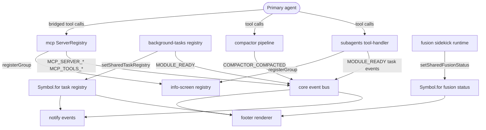

***

## 5. Key Processes [#5-key-processes]

### 5.1 Extension Bootstrap & Module Discovery (prerequisite for all flows) [#51-extension-bootstrap--module-discovery-prerequisite-for-all-flows]

Every workflow depends on this cross-cutting start-up contract.

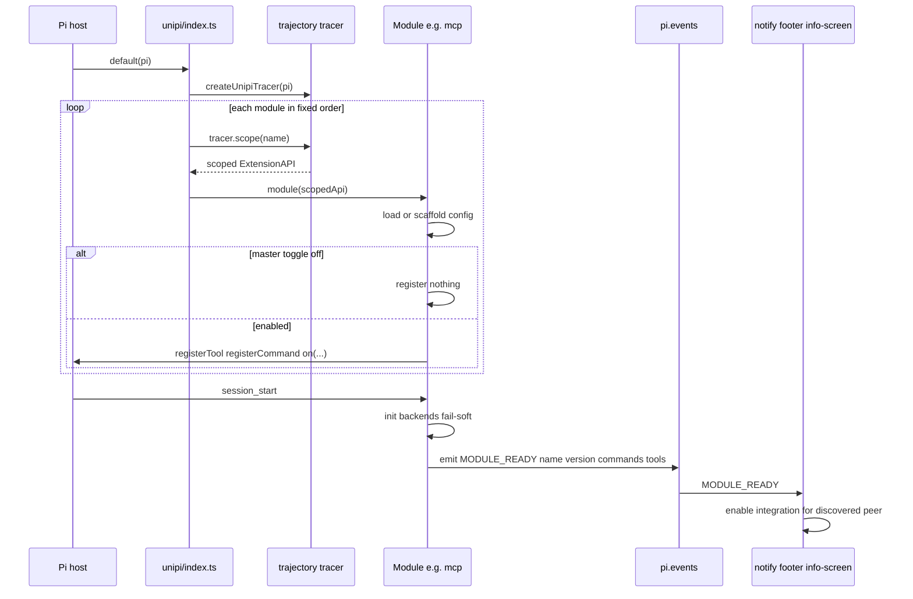

**Operational implication:** "the tool is missing" is usually a configuration state, not a bug. `background-tasks` explicitly registers nothing when `enabled` is false; `image_generate`/`image_recognize` are conditionally registered so disabled features do not pollute the system prompt.

### 5.2 Subagent Delegation Flow (core business process, importance 9.5) [#52-subagent-delegation-flow-core-business-process-importance-95]

The primary agent decides to delegate; `spawn_helper` is a **multiplexed** tool handling management actions, `workflowScript` runs, and single-child launches.

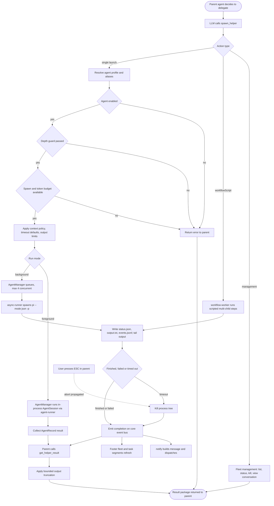

**Key steps**

| # | Step                      | Code entry                                                                 | Purpose                                                            |
| - | ------------------------- | -------------------------------------------------------------------------- | ------------------------------------------------------------------ |
| 1 | Invocation & routing      | `subagents/src/tool-handler.ts`                                            | Dispatch management / script / launch                              |
| 2 | Agent resolution & gating | `tool-handler.ts`, `custom-agents.ts`                                      | Map name to built-in or custom agent; refuse disabled              |
| 3 | Guard rails               | `budgets.ts`, `authority-policy.ts`, depth guard                           | Prevent runaway fan-out                                            |
| 4 | Context shaping           | context policy                                                             | Decide how much parent conversation is projected into the child    |
| 5 | Launch                    | `agent-manager.ts` → `agent-runner.ts` / `async-runner.ts` → `pi-spawn.ts` | In-process or child process; nesting blocked by tool-set exclusion |
| 6 | Runtime tracking          | run files, `supervisor-channel.ts`, `fleet-view.ts`, `widget.ts`           | Live fleet state and text deltas on screen                         |
| 7 | Termination               | timeouts, ESC propagation, kill tree                                       | Whole process tree torn down                                       |
| 8 | Completion broadcast      | `core/events.ts`                                                           | Decoupled fan-out to notify, footer, trajectory                    |
| 9 | Result retrieval          | `get_helper_result`, `output-limits.ts`                                    | Truncated result package                                           |

The **background-tasks delegate path** is the parallel mechanism: `delegate/seed.ts` builds the child seed, `DelegateArtifactStore` writes seed/prompt/budget plan atomically, `registry.ts` spawns the child with `UNIPI_BG_*` environment variables, parses XML usage blocks from stdout, persists snapshots and ledger, and commits a `result-package` on exit. Both mechanisms share concepts (budgets, artifacts, kill tree) but no code.

### 5.3 Context Compaction & Session Recall Flow (importance 9.0) [#53-context-compaction--session-recall-flow-importance-90]

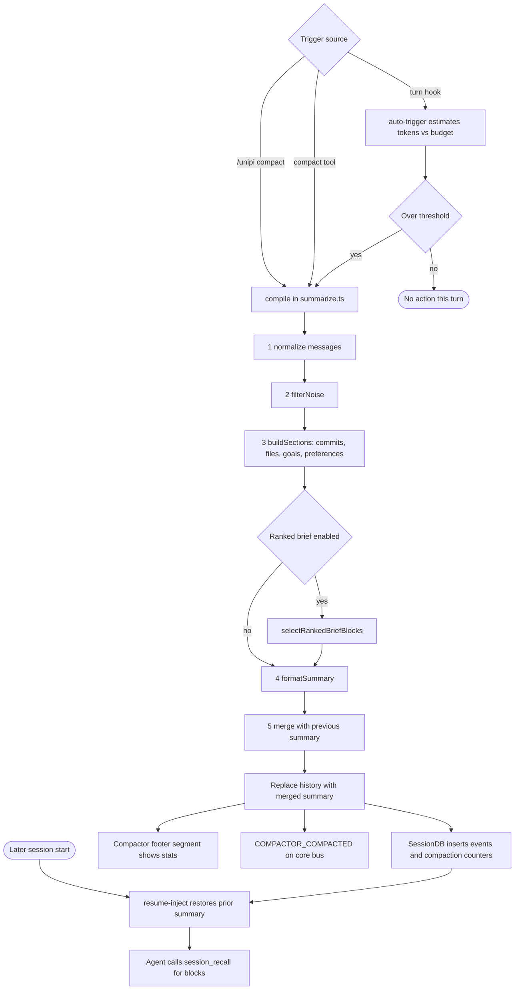

The core stages are **deterministic** — no LLM call — which keeps compaction cheap enough to evaluate on every turn. Persistence uses SQLite with schema migrations; if `SessionDB` fails to initialise, commands report "not initialized" gracefully rather than throwing.

### 5.4 MCP Server Tool Bridging Flow (importance 8.0) [#54-mcp-server-tool-bridging-flow-importance-80]

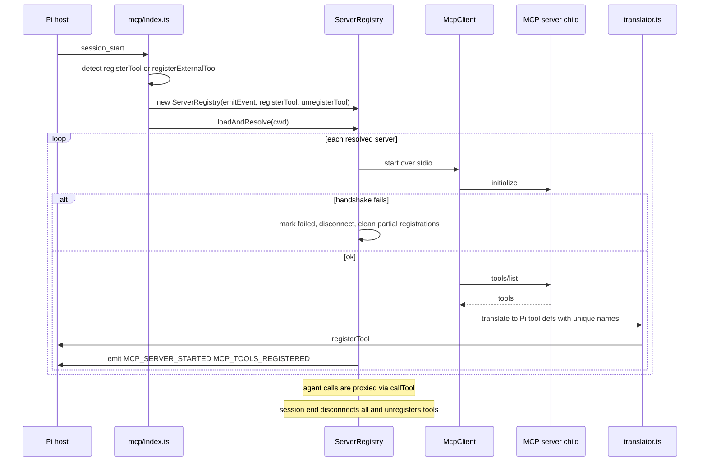

### 5.5 Web Smart-Fetch Flow [#55-web-smart-fetch-flow]

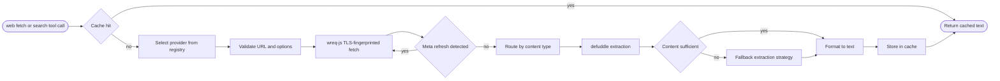

### 5.6 Model Fusion Preset Flow [#56-model-fusion-preset-flow]

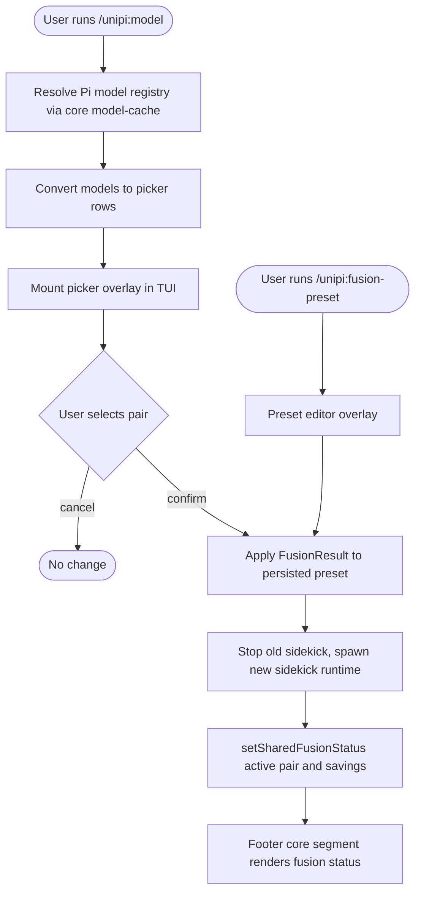

`/unipi:model` is pinned as the first `/model` autocomplete suggestion by `command-enchantment`. Changing the active pair also affects **vision gating** in the image package and the cost/savings shown in the footer.

### 5.7 Interactive Ask-User Flow [#57-interactive-ask-user-flow]

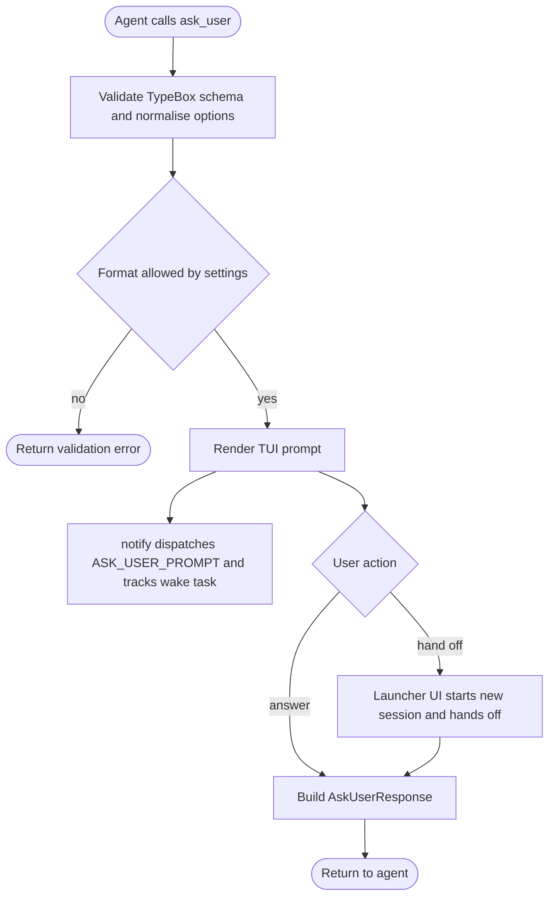

### 5.8 Structured Workflow with Kanban Board Flow [#58-structured-workflow-with-kanban-board-flow]

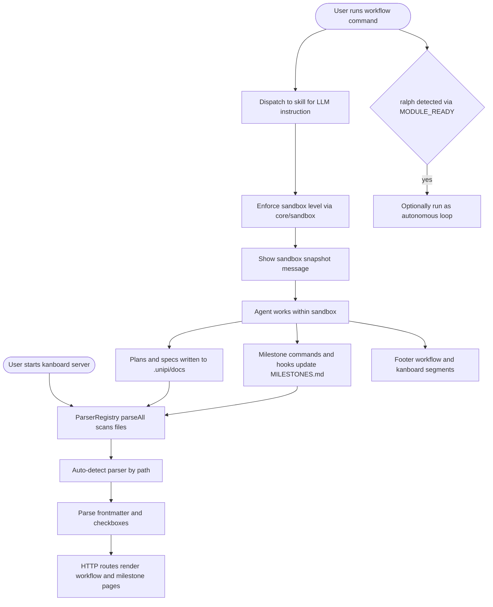

### 5.9 Notification Dispatch Flow [#59-notification-dispatch-flow]

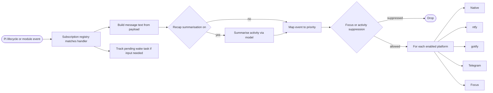

### 5.10 Data Flow Paths [#510-data-flow-paths]

| Data                  | Origin              | Path                                                 | Sink                                     |
| --------------------- | ------------------- | ---------------------------------------------------- | ---------------------------------------- |
| Conversation history  | Pi session          | compactor `compile()` → merged summary → `SessionDB` | Replaced history; SQLite; footer segment |
| Helper prompt/context | Parent agent        | context policy → seed → child stdin/args             | Child Pi process                         |
| Child output & usage  | Child stdout        | tail → normalise XML usage → snapshots/ledger        | Artifact store; footer; result package   |
| MCP tool schemas      | MCP server          | `tools/list` → translator                            | Pi tool registry                         |
| Web content           | Remote server       | wreq-js → defuddle → format                          | Cache; agent context                     |
| Module status         | Each module         | `MODULE_READY` + feature events                      | notify, footer, info-screen              |
| Fusion pair & savings | fusion              | `setSharedFusionStatus`                              | footer core segment                      |
| Plans/milestones      | workflow, milestone | markdown files → ParserRegistry                      | Kanboard HTTP pages                      |

### 5.11 Exception Handling Mechanisms [#511-exception-handling-mechanisms]

| Failure                    | Handling                                                            | Location                                                |
| -------------------------- | ------------------------------------------------------------------- | ------------------------------------------------------- |
| Module disabled by config  | Registers nothing; no tools in system prompt                        | Each `index.ts`                                         |
| MemPalace / uv unavailable | Bridge returns `null`; storage falls back to legacy SQLite/markdown | `memory/mempalace.ts`                                   |
| `SessionDB` init failure   | `sessionDB = null`; commands report "not initialized"               | `compactor/src/index.ts`                                |
| MCP handshake failure      | Server marked failed; partial tool registrations cleaned up         | `mcp/bridge/registry.ts`                                |
| Child timeout / parent ESC | Whole process tree killed (POSIX and Windows `taskkill`)            | `registry.ts`, `windows-taskkill.ts`, `agent-runner.ts` |
| Process crash mid-write    | Temp-write/fsync/rename leaves manifest consistent                  | `delegate/artifacts.ts`, `durable-fs.ts`                |
| Thin web extraction        | Fallback extraction strategy chain                                  | `web-api/engine/extract.ts`                             |
| Invalid `ask_user` format  | Validation error returned to agent                                  | `ask-user/tools.ts`                                     |
| Dangerous sandbox command  | Security scanner/evaluator blocks; env vars scrubbed                | `compactor/security/*`, `executor.ts`                   |
| Overflowing result         | Bounded output truncation                                           | `core/bounded-output.ts`, `output-limits.ts`            |

***

## 6. Technical Implementation [#6-technical-implementation]

### 6.1 Core Module Implementation [#61-core-module-implementation]

**Composition root (`packages/unipi/index.ts`).** A single default-exported `ExtensionAPI` function. It creates the trajectory tracer, then for each module in the fixed order obtains `tracer.scope(name)` and invokes the module with the scoped proxy. Each module therefore sees a normal `ExtensionAPI`, but hook inputs/outputs are fingerprinted (`mutationSurface`, `mutationEvidence`) for later attribution.

**`@pi-unipi/core` (\~58 KB, zero internal dependencies).** `index.ts` re-exports `constants`, `events`, `sandbox`, `utils`, `model-cache`, `tui-overlay`, `tui-width`, `spinner-line`, `bounded-output`, and `fusion-status`. The two `Symbol.for` slots (`unipi.background-tasks.shared-registry`, `unipi.fusion.status`) are typed accessors that return `undefined` when the producer is absent, allowing consumers to degrade gracefully.

**`subagents/tool-handler.ts`.** Routes on the `spawn_helper` payload's action family; resolves aliases and custom agents; enforces depth guard (children cannot see `spawn_helper`/`get_helper_result`), spawn and token budgets, and authority policy; shapes projected context; then hands to `AgentManager`. Foreground runs use the host's `createAgentSession` in-process; async runs spawn `pi --mode json -p` with a resolved binary (`UNIPI_SUBAGENT_PI_BINARY` override).

**`background-tasks/registry.ts` (`BackgroundTaskRegistry`).** Spawns child processes with `UNIPI_BG_*` env, tails stdout, recognises XML usage blocks and normalises them into a uniform usage record (model, context, tokens, tools), persists periodic snapshots, and exposes `allTasks()` synchronously through the shared symbol for the footer's 1-second refresh.

**`mcp/bridge/*`.** `McpClient` implements JSON-RPC 2.0 over stdio (`initialize`, `tools/list`, `tools/call`). `translator.ts` maps JSON Schema tool inputs to TypeBox-compatible Pi tool definitions and derives deterministic unique names. `ServerRegistry` owns start/stop/restart and emits `MCP_SERVER_*`/`MCP_TOOLS_*` events.

**`memory/mempalace.ts`.** Invokes `bridge/mempalace_bridge.py` via `spawnSync`, exchanging one JSON line per operation. Auto-installs MemPalace through `uv`, caches the availability ping for 24 hours, and runs one-time migrations from legacy SQLite/markdown (`scripts/migrate-unipi-memory-to-mempalace.py`).

### 6.2 Key Algorithm Design [#62-key-algorithm-design]

**Deterministic compaction pipeline (`compile()`).**

1. `normalize` — canonicalise message shapes and roles.
2. `filterNoise` — drop tool chatter, repeated status lines, and low-value turns.
3. `buildSections` — run extractors (`commits`, `files`, `goals`, `preferences`) to produce structured sections.
4. *(optional)* `selectRankedBriefBlocks` — rank blocks and select within budget.
5. `formatSummary` — render sections into the summary format.
6. `merge` — combine with the previous summary so knowledge accumulates across compactions.

Because no stage calls a model, the pipeline's cost is linear in message count, making `auto-trigger`'s per-turn evaluation (`token-estimate` vs configured budget) affordable.

**Depth and budget guard (subagents).** Nesting depth is bounded by excluding orchestration tools from child tool sets, so depth is structurally ≤ 1 for helpers; spawn and token budgets are checked before any process is created.

**Crash-safe artifact commit.** Write to `name.tmp` → `fsync` → atomic `rename` to final path → update versioned manifest. A crash at any point leaves either the previous or the new consistent state, never a torn file.

**Deterministic MCP tool naming.** Server identifier + tool name are combined into a stable, unique Pi tool name so registration is idempotent across restarts and collisions between servers are impossible.

**Responsive footer layout.** `FooterRenderer` computes a two-row layout from measured widths (`core/tui-width`), applies segment priorities and overflow handling, and repaints on a 1-second timer plus event triggers; `tps-tracker` computes tokens-per-second from streaming events.

**Kanboard parser auto-detection.** `ParserRegistry` selects a parser by file path pattern (plans, milestones, generic checkbox configs), then parses frontmatter and checkbox items into board columns.

### 6.3 Data Structure Design [#63-data-structure-design]

| Structure                                | Definition                                                         | Notes                                                                             |
| ---------------------------------------- | ------------------------------------------------------------------ | --------------------------------------------------------------------------------- |
| `UnipiEventPayload`                      | Discriminated union of \~22 payload interfaces in `core/events.ts` | `MODULE_READY {name, version, commands, tools}` is the discovery contract         |
| `SharedFusionStatus`                     | `core/fusion-status.ts`                                            | Active model pair + savings, read by footer                                       |
| `BackgroundTaskRegistry` / task snapshot | `registry.ts`, `registry-shared.ts`                                | State, logs, normalised usage; accessed via `allTasks()`                          |
| `DelegateArtifactStore` manifest         | `delegate/artifacts.ts`                                            | Versioned list of committed artifacts (seed, prompt, ledger, budget plan, result) |
| Result package                           | `delegate/result-package.ts`                                       | Compact, truncated result returned to the parent                                  |
| `AgentRecord`                            | `subagents/agent-manager.ts`                                       | Helper identity, mode, status, output paths                                       |
| `SessionDB` schema                       | `compactor/session/db.ts`                                          | Tables for events, sessions, compaction stats; migrations                         |
| `AskUserResponse`                        | `ask-user/tools.ts`                                                | Normalised answer or handoff outcome                                              |
| `FusionResult` / preset                  | `fusion/preset.ts`                                                 | Persisted pair selection                                                          |
| Footer segment                           | `footer/registry`                                                  | Render function + priority + module binding                                       |
| `InfoRegistryLike`                       | `core/global-types.ts`                                             | Minimal typed view of the info-screen registry                                    |

### 6.4 Performance Optimization Strategies [#64-performance-optimization-strategies]

* **Prebuilt bundle.** `bundled.js` reduces jiti transpile cost at host start from \~1 s to \~80 ms; third-party dependencies remain external to keep the bundle small.
* **Synchronous shared read-models.** `Symbol.for` slots let the footer poll `allTasks()` and fusion status without event round-trips on its 1-second timer.
* **Cache-first info registry.** `info-screen/registry.ts` serves cached values with a 5-second TTL.
* **Avoided subprocesses on hot paths.** `getPiVersion()` avoids `execSync`; MemPalace availability ping is cached for 24 hours.
* **Deterministic compaction.** No model call in `compile()` keeps auto-trigger cheap.
* **Web result caching.** `web-api/cache.ts` short-circuits repeated fetches.
* **Model registry caching.** `core/model-cache.ts` avoids repeated registry resolution for fusion/image.
* **Bounded output.** Truncation prevents the parent's context from growing (and re-triggering compaction) due to verbose helpers.

### 6.5 Security Design [#65-security-design]

| Mechanism                         | Location                                                     | Protection                                                                                |
| --------------------------------- | ------------------------------------------------------------ | ----------------------------------------------------------------------------------------- |
| Environment scrubbing             | `compactor/executor/executor.ts` strips `DANGEROUS_ENV_VARS` | Prevents secret leakage into sandboxed commands                                           |
| Security policy scanner/evaluator | `compactor/security/*`                                       | Blocks dangerous sandbox invocations before execution                                     |
| Temp-dir isolation and kill tree  | `executor.ts`                                                | Contains sandboxed processes and guarantees cleanup                                       |
| Workflow sandbox levels           | `core/sandbox.ts`, `workflow`                                | Tool gating per phase (e.g. `brainstorm`, `write_unipi`) without mutating Pi tool schemas |
| Authority policy & budgets        | `subagents/authority-policy.ts`, `budgets.ts`                | Limits what helpers may do and how much they may consume                                  |
| Nesting prevention                | `async-runner.ts` tool-set exclusion                         | Prevents recursive spawn storms                                                           |
| Format allow-list                 | `ask-user/tools.ts`                                          | Only settings-approved prompt formats render                                              |
| Secret-pattern scan               | `scripts/build-bundle.mjs`                                   | Refuses to emit bundles containing `sk-…`, `ghp_…`, `AKIA…`, `Bearer …`                   |
| URL validation                    | `web-api/engine/extract.ts`                                  | Rejects malformed/unsafe URLs before fetch                                                |
| Git worktree isolation            | `subagents/worktree.ts`                                      | Helpers work on isolated checkouts                                                        |

### 6.6 Architectural Drift and Technical Debt [#66-architectural-drift-and-technical-debt]

Code inspection surfaced discrepancies between earlier documentation and the implementation. These are recorded so future validation has a baseline.

| # | Documented claim                                                      | Code finding                                                                                                                                          | Severity   |
| - | --------------------------------------------------------------------- | ----------------------------------------------------------------------------------------------------------------------------------------------------- | ---------- |
| 1 | kanboard depends on milestone                                         | `kanboard/package.json` depends only on `core`; `parser/milestones.ts` parses inline and the header comment claiming an import is stale               | Low        |
| 2 | footer depends only on core                                           | `footer/package.json` declares `@pi-unipi/background-tasks`; `process-line.ts` imports `getSharedTaskRegistry` while `notify` uses the symbol pattern | Medium     |
| 3 | `spawn_helper` routes through background-tasks registry               | `subagents` uses its own runners; delegate path in `background-tasks` is independent                                                                  | Medium     |
| 4 | Package named "autocomplete"                                          | Publishes as `@pi-unipi/command-enchantment`; directory ≠ package name                                                                                | Low        |
| 5 | `core/constants.ts#MODULES` is complete                               | Contains phantom entries (`REGISTRY`, `TASK`, `IMPECCABLE`, `SETTINGS`); lacks `BACKGROUND_TASKS`, `FUSION`, `TRAJECTORY`, `COMMAND_ENCHANTMENT`      | Low–Medium |
| 6 | Trajectory is a feature sub-module                                    | It wraps every module's API in the composition root — cross-cutting observability                                                                     | Low        |
| 7 | `docs/prefix-cache-architecture.md` referenced in root `package.json` | `docs/` is empty                                                                                                                                      | Low        |
| 8 | \~25 packages                                                         | 24 directories; 23 loaded by the umbrella plus `core`                                                                                                 | Cosmetic   |
| 9 | `COMPACTOR_STATS_UPDATED` is live                                     | Marked `@deprecated`; footer reads Pi session data directly                                                                                           | Cosmetic   |

**Risks**

1. Three parallel integration mechanisms with no documented rule for choosing between them (footer vs notify divergence is the symptom).
2. Implicit load-order contract (`utility` before `info-screen`) enforced only by a comment.
3. Two orchestration subsystems (`subagents` async runner and `background-tasks` delegate) with overlapping budgets, artifacts, and process lifecycle but separate code and temp roots.
4. Concentrated hubs: `tool-handler.ts` (\~49 KB), `subagents/src/index.ts` (\~45 KB), `workflow-script.ts` (\~32 KB), `footer/src/index.ts` (\~29 KB), `background-tasks/registry.ts` (\~2000 lines).
5. Mixed responsibilities: an 11-language `PolyglotExecutor` and security scanner live inside `compactor`.
6. Stale kernel metadata reduces trust in `core` as source of truth.

**Recommendations**

| Priority | Action                                                                                                                                                                                                              |
| -------- | ------------------------------------------------------------------------------------------------------------------------------------------------------------------------------------------------------------------- |
| High     | Document in `core` the rule for event bus vs `Symbol.for` state vs direct import; migrate `footer/process-line.ts` to the symbol-read pattern or promote a typed accessor into `core` (as done for `fusion-status`) |
| High     | Reconcile `core/constants.ts#MODULES` with the actual package set                                                                                                                                                   |
| Medium   | Encode load-order constraints as an ordered manifest with rationale                                                                                                                                                 |
| Medium   | Consolidate child-process spawning, budgets and artifact persistence shared by `subagents` and `background-tasks` into a common primitive (candidate home: `utility`, which already owns lifecycle cleanup)         |
| Medium   | Extract `compactor/src/executor` + `security` into a dedicated sandbox package aligned with `core/sandbox.ts`                                                                                                       |
| Medium   | Add an info-screen diagnostic listing which modules announced `MODULE_READY`, so silent discovery failures are visible                                                                                              |
| Low      | Fix stale header in `kanboard/parser/milestones.ts`; restore or remove the `docs/` reference; rename `packages/autocomplete` or document the mapping; start an ADR log under `docs/`                                |

***

## 7. Deployment Architecture [#7-deployment-architecture]

### 7.1 Runtime Environment Requirements [#71-runtime-environment-requirements]

| Requirement       | Detail                                                                                                            |
| ----------------- | ----------------------------------------------------------------------------------------------------------------- |
| Node.js           | v22 (esbuild target `node22`, ESM)                                                                                |
| Pi coding agent   | `@earendil-works/pi-coding-agent ^0.84.0` with `pi-tui` and `pi-ai`                                               |
| Python + uv       | Required only for MemPalace (memory package); auto-installed into a `uv` venv; absent → SQLite/markdown fallback  |
| SQLite            | Embedded; no server                                                                                               |
| Git               | For worktree isolation of helpers                                                                                 |
| Network           | Outbound HTTPS for web providers, image/LLM providers, ntfy/gotify/Telegram; none required for core operation     |
| OS                | POSIX and Windows (process-tree termination supports both via `taskkill`)                                         |
| Optional binaries | MCP server executables as configured; `pi` binary resolvable for child runs (`UNIPI_SUBAGENT_PI_BINARY` override) |

### 7.2 Deployment Topology Structure [#72-deployment-topology-structure]

Unipi is deployed as **an npm package installed into the developer's Pi environment**. All packages run inside the single Pi host process; children are spawned on the same machine.

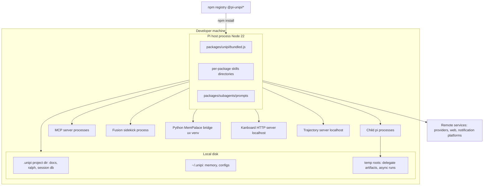

**Distribution details**

* Root `package.json` `pi.extensions` points at `packages/unipi/bundled.js`; `pi.skills` enumerates per-package `skills/` directories; `pi.prompts` exposes `packages/subagents/prompts`.
* `scripts/build-bundle.mjs` (esbuild, `format: esm`) bundles only `@pi-unipi/*` and relative imports; all third-party code is external and installed via npm. A secret-pattern scan gates the output.
* Each package is independently publishable (`publish:all` → `npm publish --workspaces`) and declares its own `pi.extensions` entry, so users may install the umbrella or individual packages.
* `scripts/sync-pins.mjs` keeps internal dependency pins consistent across the workspace.
* The `updater` package provides in-product self-update with changelog overlays.

### 7.3 Scalability Design [#73-scalability-design]

Because Unipi runs inside a single developer's host process, scalability is about **capability extension** and **local concurrency**, not horizontal scaling.

| Extension point            | How to extend                                                                                                                                                                                                        |
| -------------------------- | -------------------------------------------------------------------------------------------------------------------------------------------------------------------------------------------------------------------- |
| New feature module         | Create `packages/<name>` depending only on `@pi-unipi/core`; export an `ExtensionAPI` function; read config with a master toggle; register tools/commands/hooks; emit `MODULE_READY`; add to the umbrella load order |
| New footer segment         | Add `footer/src/segments/<module>.ts` and register in presets/registry                                                                                                                                               |
| New notification platform  | Implement `notify/platforms/<platform>.ts` and add to dispatch                                                                                                                                                       |
| New web provider           | Implement `providers/base.ts` contract and register in `providers/registry.ts`                                                                                                                                       |
| New MCP server             | Add to config (`seed-servers.json` or user config); no code change                                                                                                                                                   |
| New kanboard document type | Add a parser to `ParserRegistry` (checkbox configs, plan, milestone)                                                                                                                                                 |
| New custom agent           | Define in `custom-agents.ts` config; aliases resolved by tool-handler                                                                                                                                                |
| New compaction extractor   | Add to `compaction/extract/` and include in `buildSections`                                                                                                                                                          |
| New event                  | Add to `UNIPI_EVENTS` and the `UnipiEventPayload` union in `core/events.ts`                                                                                                                                          |

**Local concurrency controls:** `AgentManager` caps background helpers (default 4); spawn/token budgets cap fan-out; timeouts and kill-tree guarantee resource reclamation; compaction keeps parent context bounded regardless of helper count.

### 7.4 Monitoring and Operations [#74-monitoring-and-operations]

| Concern                   | Mechanism                                                                                                                          |
| ------------------------- | ---------------------------------------------------------------------------------------------------------------------------------- |
| Module health / discovery | `MODULE_READY` events; info-screen registry groups; footer segments per module                                                     |
| Fleet status              | Footer process-line dots (background tasks), fleet view, conversation viewer, `spawn_helper` management actions (list/status/kill) |
| Compaction health         | `compactor_stats`, `compactor_doctor`, `context_budget` tools; compactor footer segment; `SessionDB` statistics                    |
| MCP health                | MCP footer segment (server/tool counts); `MCP_SERVER_*` events; settings overlay for restart/stop                                  |
| Diagnostics               | `utility/diagnostics/engine.ts`; `analytics/collector.ts`; `env` tool                                                              |
| Trajectory / attribution  | `trajectory` tracer, `TelemetrySidecar`, local trajectory server, prefix-integrity checks                                          |
| Throughput                | `tps-tracker.ts` tokens-per-second in footer                                                                                       |
| Remote awareness          | `notify` platforms with priority mapping and pending-wake tracking                                                                 |
| Updates                   | `updater` checker and changelog overlay                                                                                            |
| Crash recovery            | Atomic artifact manifests, SQLite migrations, resume-inject on `session_start`                                                     |

**Operations guidance**

* If a tool is absent, check the module's master toggle first — disabled modules register nothing by design.
* If notify or footer lack a module's status, verify the module emitted `MODULE_READY` (a missing announcement silently disables discovery-based features).
* If memory behaves as SQLite-only, MemPalace/uv is unavailable; this is the intended fail-soft mode.
* Child-process leaks after abnormal termination should be investigated in the hub modules (`registry.ts`, `ServerRegistry`, sidekick runtime), which own kill-tree logic.
* Keep the umbrella load order intact when adding modules; `utility` must precede `info-screen`.

***

## Appendix A — Component Inventory [#appendix-a--component-inventory]

| Package (npm)                   | Directory           | Role                                     | Internal deps              | Key entry           |
| ------------------------------- | ------------------- | ---------------------------------------- | -------------------------- | ------------------- |
| `@pi-unipi/core`                | `core/`             | Shared kernel                            | —                          | `index.ts`          |
| `@pi-unipi/unipi`               | `unipi/`            | Composition root                         | all                        | `index.ts`          |
| `@pi-unipi/subagents`           | `subagents/`        | Helper agents, fleet, missions           | core                       | `src/index.ts`      |
| `@pi-unipi/background-tasks`    | `background-tasks/` | Durable jobs, delegates, shared registry | core                       | `src/index.ts`      |
| `@pi-unipi/ralph`               | `ralph/`            | Autonomous loops                         | core                       | `index.ts`          |
| `@pi-unipi/compactor`           | `compactor/`        | Compaction, SessionDB, sandbox executor  | core                       | `src/index.ts`      |
| `@pi-unipi/memory`              | `memory/`           | MemPalace-backed memory                  | core                       | `index.ts`          |
| `@pi-unipi/trajectory`          | `trajectory/`       | Tracer, telemetry, trajectory server     | core                       | `index.ts`          |
| `@pi-unipi/mcp`                 | `mcp/`              | MCP server bridge                        | core                       | `src/index.ts`      |
| `@pi-unipi/web-api`             | `web-api/`          | Web search/fetch                         | core                       | `src/index.ts`      |
| `@pi-unipi/image`               | `image/`            | Image generate/recognize                 | core                       | `src/index.ts`      |
| `@pi-unipi/fusion`              | `fusion/`           | Model pairing, sidekick                  | core                       | `src/index.ts`      |
| `@pi-unipi/footer`              | `footer/`           | Status bar                               | core, **background-tasks** | `index.ts`          |
| `@pi-unipi/notify`              | `notify/`           | Outbound notifications                   | core                       | `index.ts`          |
| `@pi-unipi/ask-user`            | `ask-user/`         | Interactive prompts, handoff             | core                       | `index.ts`          |
| `@pi-unipi/info-screen`         | `info-screen/`      | Info overlay, global registry            | core                       | `index.ts`          |
| `@pi-unipi/input-shortcuts`     | `input-shortcuts/`  | Chords, undo/redo, registers             | core                       | `src/index.ts`      |
| `@pi-unipi/command-enchantment` | `autocomplete/`     | `/unipi:*` autocomplete                  | —                          | `src/index.ts`      |
| `@pi-unipi/btw`                 | `btw/`              | Side questions                           | —                          | `extensions/btw.ts` |
| `@pi-unipi/workflow`            | `workflow/`         | Workflow commands, sandboxes             | core                       | `index.ts`          |
| `@pi-unipi/milestone`           | `milestone/`        | Milestone tracking                       | core                       | `index.ts`          |
| `@pi-unipi/kanboard`            | `kanboard/`         | Markdown → kanban web UI                 | core                       | `index.ts`          |
| `@pi-unipi/utility`             | `utility/`          | Lifecycle, diagnostics, analytics        | core                       | `src/index.ts`      |
| `@pi-unipi/updater`             | `updater/`          | Self-update                              | core                       | `index.ts`          |

## Appendix B — Onboarding Guide for New Contributors [#appendix-b--onboarding-guide-for-new-contributors]

1. Read `packages/core/index.ts`, `events.ts`, and `constants.ts` — these are the contracts every module obeys.
2. Read `packages/unipi/index.ts` to see composition and load order.
3. Pick one small module (e.g. `btw` or `milestone`) and trace: config load → registration → `MODULE_READY` → footer segment.
4. Then study a hub: `subagents/src/tool-handler.ts` for orchestration or `compactor/src/compaction/summarize.ts` for the pipeline.
5. When adding cross-module behaviour, prefer events for notifications, `Symbol.for` typed accessors in `core` for hot synchronous reads, and avoid direct package imports.
6. Validate with `compactor_doctor`, the info screen, and the footer to confirm your module announced itself correctly.
