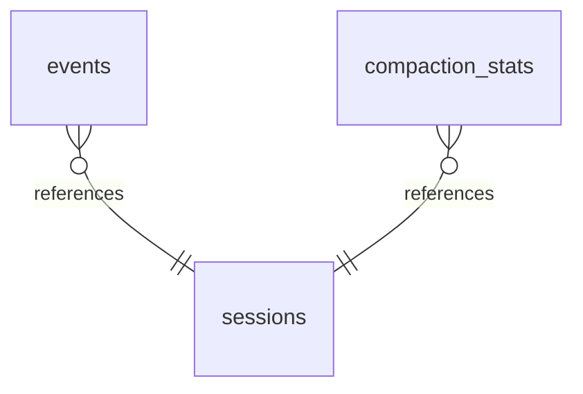

# Database Overview (/docs/database-overview)

## Database Overview [#database-overview]

### Summary [#summary]

| Metric            | Count |
| ----------------- | ----- |
| Database Projects | 0     |
| Tables            | 3     |
| Views             | 0     |
| Stored Procedures | 0     |
| Functions         | 0     |
| Relationships     | 2     |

### Tables [#tables]

#### main.events [#mainevents]

Inferred SQLite table (not SQL Server) managed by the compactor SessionDB class in db.ts. Stores per-project session events written via insertEvent and read via getEvents/getEventCount. No CREATE TABLE statement was available in the provided insights, so column definitions could not be extracted.

**Source:** `./packages/compactor/src/session/db.ts`

#### main.sessions [#mainsessions]

Inferred SQLite table (not SQL Server) managed by the compactor SessionDB class. Holds session metadata and compaction counters accessed through ensureSession, getSessionStats and incrementCompactCount. Column definitions were not present in the provided insights.

**Source:** `./packages/compactor/src/session/db.ts`

#### main.compaction\_stats [#maincompaction_stats]

Inferred SQLite table (not SQL Server) managed by the compactor SessionDB class. Accumulates compaction statistics via addCompactionStats and is aggregated by getAllTimeStats for resume and reporting features. Exact table name and columns are inferred from method names only.

**Source:** `./packages/compactor/src/session/db.ts`

### Table Relationships [#table-relationships]

| From Table             | From Columns | To Table      | To Columns | Type     |
| ---------------------- | ------------ | ------------- | ---------- | -------- |
| main.events            |              | main.sessions |            | Implicit |
| main.compaction\_stats |              | main.sessions |            | Implicit |

### Data Flows [#data-flows]

#### Compactor session event persistence [#compactor-session-event-persistence]

* **Source:** Pi coding-agent session hooks (compactor hooks.ts / index.ts)
* **Destination:** SQLite project-scoped session database (events, sessions, compaction\_stats)
* **Operations:** INSERT, UPDATE, SELECT, SCHEMA MIGRATION
* **Procedures:** SessionDB.init, SessionDB.initSchema, SessionDB.runMigrations, SessionDB.insertEvent, SessionDB.ensureSession, SessionDB.incrementCompactCount, SessionDB.addCompactionStats, SessionDB.getAllTimeStats

#### Memory storage migration from legacy SQLite to MemPalace [#memory-storage-migration-from-legacy-sqlite-to-mempalace]

* **Source:** Legacy SQLite memory store and markdown memory files
* **Destination:** MemPalace backend (primary) with markdown files as durable tier
* **Operations:** SELECT, MIGRATE, WRITE
* **Procedures:** MemoryStorage.init, MemoryStorage.tryInitMempalace, MemoryStorage.store, MemoryStorage.storeMempalace, isMigrated, markMigrated

#### Background-task snapshot and delegate artifact persistence [#background-task-snapshot-and-delegate-artifact-persistence]

* **Source:** Background task registry and delegate runner
* **Destination:** File-based JSON artifact/manifest store (temp runtime directory)
* **Operations:** WRITE, ATOMIC REPLACE, READ
* **Procedures:** DelegateArtifactStore.writeSeed, DelegateArtifactStore.writeLedger, DelegateArtifactStore.commitResult, DelegateArtifactStore.readCommittedResult

#### Telemetry JSONL append [#telemetry-jsonl-append]

* **Source:** Trajectory telemetry sidecar
* **Destination:** File-backed JSONL event log
* **Operations:** APPEND, READ
* **Procedures:** readTail
