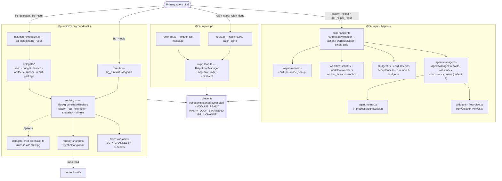
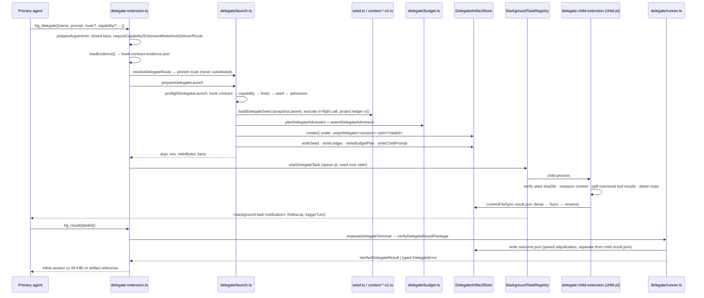
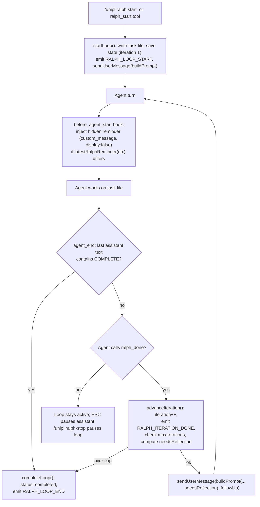

# Agent Orchestration (/docs/deep-exploration/agent-orchestration-domain)


I now have a thorough, source-verified picture of all three packages. Here is the documentation.

***

# Agent Orchestration Domain [#agent-orchestration-domain]

**Packages:** `@pi-unipi/subagents` · `@pi-unipi/background-tasks` · `@pi-unipi/ralph`
&#x2A;*Domain type:** Core Business Domain
&#x2A;*Host:** Pi coding agent (`@earendil-works/pi-coding-agent`) via `ExtensionAPI`

***

## 1. Purpose and Scope [#1-purpose-and-scope]

The Agent Orchestration Domain is the part of Unipi that turns a single, interactive Pi coding agent into something that can *coordinate work*: spin up helper agents in parallel, hand long-running shell jobs and read-only investigations to background processes, and keep itself running through many autonomous iterations without a human re-prompting every turn.

The domain is implemented as three sibling packages that share **no import dependencies on one another**. Each integrates with the host only through the Pi `ExtensionAPI` and with its neighbours through the Pi event bus or a `globalThis` registry. This matters for how you read the code: the "subagent" story and the "background delegate" story are two independent orchestration mechanisms that happen to both spawn child `pi` processes, not one pipeline.

| Package            | Primary agent-facing surface                                                                         | What it orchestrates                                                                                                |
| ------------------ | ---------------------------------------------------------------------------------------------------- | ------------------------------------------------------------------------------------------------------------------- |
| `subagents`        | `spawn_helper`, `get_helper_result` tools; `/unipi:subagents-*` commands                             | Helper agents (in-process sessions or child `pi --mode json -p` processes), scripted workflows, missions, schedules |
| `background-tasks` | `bg_run`, `bg_status`, `bg_logs`, `bg_kill`, `bg_delegate`, `bg_result` tools; `/unipi:bg*` commands | Arbitrary shell jobs with tracked lifecycle; crash-safe, hash-verified read-only delegates                          |
| `ralph`            | `ralph_start`, `ralph_done` tools; `/unipi:ralph` command                                            | Self-driving iterative loops of the primary agent itself                                                            |

***

## 2. Domain Architecture [#2-domain-architecture]



### 2.1 Common design principles observed in code [#21-common-design-principles-observed-in-code]

* **Guard rails before side effects.** Every launch path validates fully—agent enablement, depth, budgets, capability, route, hook contract—before a process, session, or artifact directory exists. The delegate pipeline states this as an invariant: "a refusal here leaves exactly zero children and zero artifacts."
* **Bounded output as the scarce resource.** `get_helper_result` bounds helper output at 64 KiB via `boundHelperOutput`; `spawn_helper` truncates at 200 KiB / 5000 lines (`DEFAULT_MAX_OUTPUT`); `bg_logs` is capped; `bg_result` refuses to *truncate*—it degrades to an artifact reference instead.
* **Config-gated registration.** Both `subagents` and `background-tasks` return early from their factory when `enabled` is false, registering nothing.
* **Crash-safe persistence.** Delegate artifacts, task snapshots, and configs are written via temp-write → fsync → rename.
* **ESC/abort propagation.** Parent aborts are forwarded to in-process children via `AbortSignal` and to processes via `SIGTERM` → grace → `SIGKILL` across the detached process group.

***

## 3. Sub-module: Subagent Spawning & Fleet Management (`@pi-unipi/subagents`) [#3-sub-module-subagent-spawning--fleet-management-pi-unipisubagents]

### 3.1 Tool surface [#31-tool-surface]

**`spawn_helper`** is a multiplexed tool. `handleSpawnHelper` in `tool-handler.ts` routes on the shape of the arguments:

```
args.action defined      → handleAction (management)
args.workflowScript def. → handleWorkflowScript / handleAsyncWorkflowScript
otherwise                → handleSingleChild (agent + task)
```

The result is always a tool result; the function is documented to "never throw." The full action vocabulary lives in `parity-types.ts#SUBAGENT_ACTIONS` and includes `list`, `get`, `status`, `children.list`, `resume`, `stop`, `doctor`, `guide`, `grant-spawn-budget`, the `mission.*` family (`create`, `list`, `show`, `update`, `resolve-decision`, `attach-run`, `close`), and the `schedule.*` family (`create`, `list`, `show`, `history`, `pause`, `resume`, `run`, `run-due`, `delete`). Actions recognized but not yet implemented return a clear `"planned phase"` error rather than misbehaving.

**`get_helper_result`** retrieves results by id from two sources (see §3.6).

**Slash commands** (`slash-commands.ts`): `/unipi:subagents-fleet`, `/unipi:subagents-doctor`, `/unipi:subagents-guide`.

### 3.2 Agent resolution: `AgentManager` [#32-agent-resolution-agentmanager]

`AgentManager` (`agent-manager.ts`) is the fleet's registry and scheduler. Its constructor merges four discovery layers into a single `Map<string, AgentConfig>`:

1. **Code built-ins** — `BUILTIN_CONFIGS` in `types.ts`: `explore` (read-only tools), `work` (all tools), and the internal `name-gen` (no tools, used for session badge generation).
2. **File built-ins** — `loadBuiltinFileAgents()` from the package's shipped agent markdown files.
3. **Custom agents** — `loadCustomAgents(cwd)` from `~/.unipi/config/agents/*.md` (global) and `<cwd>/.unipi/config/agents/*.md` (project); project wins over global.
4. **Runtime agents** — registered by other extensions via `registerRuntimeAgent()`; highest priority.

Overrides from `subagents.json`'s `subagents` block are applied via `applyBuiltinOverrides` and `applySubagentDefaults` (`agent-overrides.ts`). An **alias index** maps alternative names to canonical agents; `resolveAlias()` is called before every lookup. An agent type is enabled only when both the JSON `types[name].enabled` and the agent's own frontmatter `enabled` are not `false` (`isTypeEnabled`).

**Concurrency.** Background spawns are queued when `runningBackground >= maxConcurrent` (default `DEFAULT_MAX_CONCURRENT = 4`, configurable via `maxConcurrent`). Foreground spawns bypass the queue. `drainQueue()` runs after each background completion. A 60-second `cleanup()` interval disposes sessions of records finished more than 10 minutes ago.

### 3.3 Guard rails applied per launch [#33-guard-rails-applied-per-launch]

`preflight()` and `handleSingleChild()` in `tool-handler.ts` apply the following, in order:

| Guard                           | Implementation                                                                                                | Behaviour                                                                                                                  |
| ------------------------------- | ------------------------------------------------------------------------------------------------------------- | -------------------------------------------------------------------------------------------------------------------------- |
| Agent known & enabled           | `manager.getAgentConfig`, `manager.isTypeEnabled`                                                             | Unknown type lists known types; disabled type errors                                                                       |
| **Depth guard**                 | `child-safety.ts`: `resolveMaxSubagentDepth`, `depthExceeded`, `childDepthEnv`                                | Env vars `UNIPI_SUBAGENT_DEPTH` / `UNIPI_SUBAGENT_MAX_DEPTH`; default cap 2; inherited caps can only tighten               |
| **Context policy**              | `resolveContext` → `"fresh"` or `"fork"`                                                                      | Explicit `fork` never silently downgrades; fork requires the async process runner                                          |
| **Turn / tool / usage budgets** | `budgets.ts`: `resolveTurnBudgetConfig`, `validateToolBudgetConfig`, `validateUsageBudgetConfig`              | Turn budget appends a "## Turn budget" wrap-up block to the child prompt                                                   |
| **Acceptance gate**             | `acceptance.ts`: `gate` shorthand or `acceptance` object; `evaluateAcceptance` runs host-side verify commands | Rejected runs return `status: "error"` with the failure message                                                            |
| **Boundary instructions**       | `withChildBoundaryInstructions`                                                                               | Prepends `CHILD_SUBAGENT_BOUNDARY_INSTRUCTIONS` (or the fanout variant when the agent's tool list includes `spawn_helper`) |
| **Session spawn budget**        | `HandlerDeps.spawnAccounting` (`maxSubagentSpawnsPerSession`)                                                 | Exhausted budget instructs the agent to request `grant-spawn-budget` from the interactive parent                           |
| **Per-run fanout budget**       | `run-fanout-budget.ts` (`maxSubagentSpawnsPerRun`, default 64)                                                | Used by workflow scripts for atomic group admission                                                                        |

Nesting is additionally prevented at the tool level: `agent-runner.ts` filters `EXCLUDED_TOOL_NAMES = ["spawn_helper", "get_helper_result", "Agent", "get_result"]` out of every child session unless the agent is explicitly a fanout child.

### 3.4 Two execution strategies [#34-two-execution-strategies]

#### In-process (`agent-runner.ts`) [#in-process-agent-runnerts]

`runAgent()` builds a child session inside the parent Pi process using host APIs: `DefaultResourceLoader` (with `noExtensions`/`noSkills` honoured from `AgentConfig.extensions`/`.skills`), `SessionManager.inMemory(cwd)`, `SettingsManager.create(...)`, and `createAgentSession({... modelRuntime, tools, resourceLoader})`. The system prompt is either the agent's own (`promptMode: "replace"`), an isolated variant, or the parent system prompt with the agent prompt appended.

Runtime behaviours:

* `forwardAbortSignal()` wires the parent `AbortSignal` to `session.abort()` — this is how ESC reaches children.
* Turn limiting is **soft-then-hard**: at `maxTurns` the child is steered to wrap up; after `GRACE_TURNS = 5` more turns it is aborted.
* Tool activity, text deltas, turn ends and session creation are surfaced via callbacks that drive the `AgentWidget`, `FleetView`, and `ConversationViewer`.

Used for foreground runs (`spawnAndWait`) and for background runs when the process runner is not preferred.

#### Out-of-process (`async-runner.ts`) [#out-of-process-async-runnerts]

`runAsyncSubagent()` spawns a detached `pi --mode json -p` child through `getPiSpawnCommand()` (`pi-spawn.ts`, honouring `UNIPI_SUBAGENT_PI_BINARY`) with argv built by `buildPiArgs()` (`pi-args.ts`). Artifacts land under a per-user temp root:

```
$TMPDIR/unipi-subagents-<uid|user>/
  async-subagent-runs/<runId>/   status.json · output.txt · process.json · supervisor-channel.json
  async-subagent-results/        durable result files read by get_helper_result
  chain-runs/  artifacts/  supervisor-channels/
```

(`parity-types.ts#TEMP_ROOT_DIR`, overridable via `UNIPI_SUBAGENTS_TEMP_ROOT`.)

The runner parses newline-delimited JSON events from stdout, extracting the final assistant text and usage from `message_end` / `agent_end` / `agent_settled` events. Three termination mechanisms exist: an explicit run deadline (`timeoutMs`), a `ZERO_ACTIVITY_TIMEOUT_MS = 20_000` watchdog that `SIGKILL`s a silent child, and abort propagation (`SIGTERM`, then `SIGKILL` after 3 s, targeting the negative PID / process group). A child killed before producing any output triggers **one retry with file-based task delivery**, an explicit workaround for EDR/antivirus interference.

Fork context (`context: "fork"`) is implemented in `index.ts#runAsyncDep` via `createForkContextResolver`, which branches the parent's persisted session into a child session file (thinking may be forced off when the fork is sanitized). Worktree isolation (`worktree: true`) uses `worktree.ts` to create a managed git worktree per child, then captures diffs and writes `handoff.json` on completion.

A `createResultWatcher()` polls `RESULTS_DIR` and delivers completions to the parent as `<task-notification>` follow-up messages that trigger a new turn. Retention is cleaned hourly via `cleanupAsyncRetention`.

### 3.5 Scripted workflows [#35-scripted-workflows]

`workflow-script.ts` hosts a `workflowScript` runtime in a `node:worker_threads` worker (`workflow-worker.ts`), exposing `run` / `all` / `steer` / `status` / `state` RPC to the script. The host supplies three callbacks: `admit` (fanout + session budget claims), `launch` (either `spawnForeground` or `runAsync`), and `status`. Workflow scripts default to async execution (`asyncByDefault ?? true`); foreground workflow children are always fresh-context. Failures raise `WorkflowScriptError` carrying partial child results.

### 3.6 Result retrieval and notifications [#36-result-retrieval-and-notifications]

`get_helper_result` checks the async results directory first (`readAsyncResultFile`), then in-process `AgentManager` records. Options: `wait: true` blocks on the record's promise; `view: true` opens the `ConversationViewer` overlay; `nonBlocking: true` writes a pending subscription so the watcher wakes the session on completion; `all: true` waits for every active in-process agent (up to `timeoutMs`, default 30 min). Output is bounded to 64 KiB with an artifact path for the remainder.

On completion, the `AgentManager` callback in `index.ts` sends a `subagent-notification` custom message (rendered by a registered message renderer) with `deliverAs: "followUp", triggerTurn: true`, and emits `subagents:completed` on `pi.events`. A `sessionEnded` latch, set on `session_shutdown` *before* `abortAll()`, prevents completion callbacks from touching a disposed runtime—an explicitly documented crash fix.

### 3.7 Configuration [#37-configuration]

`config.ts` layers `~/.unipi/config/subagents.json` (global) under `<cwd>/.unipi/config/subagents.json` (workspace), auto-generates defaults, and writes atomically. `validateParityConfig()` rejects invalid strict keys (`timeoutMs`, `toolTimeoutMs`, spawn caps, `maxSubagentDepth`, `defaultSubagentContext`) with visible errors while best-effort keys (`fleetViewPlacement`, `resultScanLogging`, `inlineToolDisplay`) fall back to defaults.

***

## 4. Sub-module: Background Task Registry & Delegation (`@pi-unipi/background-tasks`) [#4-sub-module-background-task-registry--delegation-pi-unipibackground-tasks]

### 4.1 Module wiring [#41-module-wiring]

`src/index.ts` constructs a single `BackgroundTaskRegistry`, publishes it via `setSharedTaskRegistry()`, installs the event-bus API (`installBackgroundTaskExtensionApi`), registers the `bg_*` tools and `/unipi:bg`, `/unipi:bg-tasks`, `/unipi:bg-settings` commands plus `shift+down` / `ctrl+alt+c` shortcuts, and registers the delegate extension. A 1-second status interval refreshes the footer status label and a "waiting on N bg tasks — agent resumes automatically when done" spinner line above the editor when the agent is idle but a wake-triggering task is running.

### 4.2 `BackgroundTaskRegistry` (`registry.ts`) [#42-backgroundtaskregistry-registryts]

The registry is the hub of the package (\~2000 lines). Its responsibilities:

* **Spawn.** `startTask()` runs a shell command via `shellInvocation` (POSIX or Windows dialect), detached on non-Windows, `stdio: ['ignore','pipe','pipe']`. When `isAgent` is true and the command matches `commandMayLaunchPiAgent()`, a **telemetry wrapper** (`createPiTelemetryWrapperSource`) is written and injected as a shell function so that a nested `pi` emits `background-task-telemetry` control lines. `startDelegateTask()` launches the Pi executable directly (`shell: false`) with `stdio: ['pipe','pipe','pipe']` and writes the seed prompt over stdin so "the bytes the child reads are exactly the bytes that were persisted and hashed."
* **Tail and cap.** `writeToStream()` appends output to `<runtime-dir>/<id>.output`, keeps an in-memory tail, and kills the task with `killKind: 'output_cap'` when `maxOutputBytes` (default 20 MiB, env `UNIPI_BG_MAX_OUTPUT_BYTES`) is exceeded.
* **Telemetry normalization.** `ingestTelemetry()` / `consumeAgentLine()` parse JSON control payloads (`background-task-context-usage`, `background-task-telemetry`) and `<background-task-context-usage>` XML blocks into `normalizeContextUsage`, `normalizeTokenUsage`, `normalizeToolUsage`, `normalizeModel`; `commitTelemetry()` persists metadata only on change.
* **Snapshot persistence.** `writeMetadata()` serializes a `BgTaskSnapshot` with `writeJsonAtomic` through a per-task write chain so writes never interleave.
* **Termination.** `requestKill()` uses `SIGTERM` with `KILL_GRACE_MS = 3000` then force; on Windows it delegates to `runWindowsTaskkill()` (`windows-taskkill.ts`) which runs validated `terminate` and `force` phases with a `BoundedCapture` of stdout/stderr. Exit classification on `close`: `killed` (user/shutdown), `failed` (timeout, output cap, non-zero exit), or `completed`.
* **Completion delivery.** `finalizeTask()` sends a `background-task-notification` message via the injected `CompletionNotificationSender` with `deliverAs: 'followUp'` and `triggerTurn` per task options, and calls `publishTerminal()`.

### 4.3 Inter-extension interfaces [#43-inter-extension-interfaces]

* **`registry-shared.ts`** — stores the live registry on `globalThis[Symbol.for("unipi.background-tasks.shared-registry")]`. The `Symbol.for` key guarantees a single instance even when duplicate `node_modules` copies exist; the footer's process line and `notify` read `allTasks()` synchronously from it.
* **`extension-api.ts`** — a request/response protocol over `pi.events` with channels `unipi-background-tasks:request:v1`, `:response:v1`, `:terminal:v1`. Operations: `capabilities`, `run`, `status`, `logs`, `kill`. Requests are schema-versioned, closed-key validated, and a terminal publication gate ensures a `run` response is delivered before that task's terminal event.

### 4.4 The delegate pipeline (`bg_delegate` → `bg_result`) [#44-the-delegate-pipeline-bg_delegate--bg_result]

`bg_delegate` launches one **inspect-only** background Pi agent seeded with a frozen projection of the current conversation. The design goal, stated repeatedly in the source, is that nothing is ever silently clipped, substituted, or truncated—every degradation is typed and every claim is hash-verifiable.



**Stage details:**

1. **Parameter hardening** (`delegate-extension.ts`). `prepareArguments` rejects unknown keys; `capability` may only be `"inspect"`; `extensionMode` is `isolated` (default) or `ambient`; `autoDeliver` is `never | when_small | always`.

2. **Hook-contract gate** (`hook-contract.ts`, `hook-contract-evidence.json`). The shipped evidence file records hook guarantees observed by running a real Pi agent loop in a characterisation test. `assertDelegateHookContract` refuses to spawn if the required guarantees are missing; a missing or malformed evidence file is a refusal, never a default-allow.

3. **Route pinning** (`launch.ts#resolveDelegateRoute`). An explicit `{provider, model}` must exist in the registry; otherwise the parent's current model is pinned. There is no fallback list. A route without a declared `contextWindow` is refused with `route_capacity_unknown`.

4. **Seed construction** (`seed.ts`, `context-parent-snapshot.ts`, `context-visible-conversation-v2.ts`). `snapshotParentConversation` freezes the session into `Message[]`, excluding the assistant message containing the in-flight `bg_delegate` call (so sibling delegates in one message receive identical history). `projectVisibleConversationV2` — the frozen `visible-conversation-ledger-v2` transform with "no behavioural knobs" — keeps user/assistant text verbatim and replaces thinking and all tool traffic with deterministic `omitted_activity` receipts (`kind`, `at`, `bytes`, `counts`), recording each omission as a SHA-256-hashed ledger row under a Merkle-style `root_sha256`. The `BuiltDelegateSeed` carries the exact serialized bytes and their hash.

5. **Admission budgeting** (`budget.ts`, `context-token-budget.ts`). `planDelegateAdmission` estimates the child prompt + system prompt with a family-calibrated byte-class estimator against `allowed_input_tokens = context_window − reserves` (16 384 output, 8 192 framing, 4 096 safety; minimum usable input 8 192). The plan records utilization in basis points, a `retained_growth_budget_tokens` runway, and whether a conservative estimate fits. Defaults: 24 turns, 120 tool calls, 1200 s timeout; 64 KiB per tool result; 4 MiB max answer; 48 KiB inline cap.

6. **Child argv and env** (`launch.ts`). The child gets its own random `--session-id` and a task-owned `--session-dir`, `--no-builtin-tools --tools read,grep,find,ls,delegate_read_artifact`, `--exclude-tools` for the forbidden set (`bash`, `edit`, `write`, all `bg_*`), `--no-skills --no-prompt-templates --no-themes --no-context-files`, `--no-extensions` in isolated mode, and `--extension <delegate-child>` always. The env strips `PI_SESSION_ID`, `PI_SESSION_FILE`, `PI_PROVIDER`, `PI_MODEL`, `PI_REASONING_LEVEL` and injects `UNIPI_BG_DELEGATE_{ARTIFACT_DIR,SEED_PATH,SEED_SHA256,TASK_ID,LAUNCH_NONCE}`.

7. **Artifact store** (`artifacts.ts`). `DelegateArtifactStore.create()` makes `<cwd>/.unipi/delegate/<session>-<pid>/<taskId>` with `recursive: false` (a pre-existing dir is a loud failure), mode `0o700`, plus a `spill/` subdir. Files: `seed.json`, `context-omission-ledger.json`, `budget-plan.json`, `manifest.json`, `child-prompt.txt`, `runtime-budget.json`, `result.json`, `outcome.json`, `error.json`. All writes go through `writeFileDurable` / `replaceFileDurable` (temp → fsync → rename → dir fsync). `manifest.state` records only what the parent knew at launch and "is never used to decide success"; `pathInside()` guards every path.

8. **Child guard** (`delegate-child-extension.ts`, loaded through `extensions/delegate-child.ts`). Inside the child it verifies the seed hash before the first model call, measures retained context on every `context` hook, spills tool results exceeding the runway to hashed artifacts (replacing them with receipts readable via `delegate_read_artifact` for exact byte ranges), asserts every assistant message came from the pinned route, enforces turn/tool-call limits, and commits exactly one `result.json` via `commitFileSync`. A `TerminalLatch` ensures that once anything has been refused or degraded, no later message can be committed as success; on latch, the `context` hook calls `ctx.abort()` and replaces the message set with `suppressedMessages()`. Only `stopReason === "stop"` is accepted as a complete answer.

9. **Terminal adjudication** (`runner.ts#evaluateDelegateTerminal`). "The committed result package is the sole answer data plane." Absence of `result.json` yields a typed `child_exited_without_commit` (or `child_cancelled`) even on exit code 0, with preserved diagnostic artifacts listed. Presence triggers `verifyDelegateResultPackage` (`result-package.ts`), which checks UTF-8 well-formedness, per-block and aggregate SHA-256, task id / nonce / seed hash / route attestations. The parent writes its verdict to `outcome.json` separately so "the two writers never race over one field."

10. **Delivery** (`bg_result`). `decideDelegateDelivery` returns the answer inline if ≤ 48 KiB, otherwise an artifact reference; requesting inline for an oversized answer raises `result_too_large_for_inline` rather than truncating. `bg_result` never blocks: a running task returns a typed not-ready result.

The 30-plus `DelegateError` codes (`route_unresolved`, `seed_budget_exceeded`, `child_timeout`, `answer_hash_mismatch`, `route_mismatch`, …) are enumerated in `runner.ts#DELEGATE_ERROR_CODE_SET`.

### 4.5 Configuration [#45-configuration]

`config.ts` layers `~/.unipi/config/background-tasks.json` under the workspace file. Defaults: `enabled: true`, `notifyOnCompletion: true`, `triggerOnCompletion: true`, `defaultTimeoutSeconds: 0`, `maxFinishedTasks: 30`, `maxOutputBytes: 20 MiB`, and `delegate: { extensionMode: "isolated", autoDeliver: "when_small", maxTurns: 40, maxToolCalls: 120, timeoutSeconds: 900 }`. A settings overlay (`settings-overlay.ts`) writes the global file atomically.

***

## 5. Sub-module: Ralph Autonomous Loop (`@pi-unipi/ralph`) [#5-sub-module-ralph-autonomous-loop-pi-unipiralph]

Ralph orchestrates the *primary* agent rather than children. It keeps the agent iterating on a task file until the agent emits the completion marker or the iteration cap is reached.

### 5.1 State model [#51-state-model]

`RalphLoopManager` (`ralph-loop.ts`) persists `LoopState` as `<cwd>/.unipi/ralph/<name>.state.json` (core `RALPH_DIR`), with an `archive/` subdirectory. Fields: `name`, `taskFile`, `iteration`, `maxIterations`, `itemsPerIteration`, `reflectEvery`, `reflectInstructions`, `status` (`active | paused | completed`), `startedAt`, `completedAt`, `lastReflectionAt`; the legacy `active` boolean is kept in sync by `migrateState`. On `session_start`, `rehydrate()` reselects the most recently modified active loop.

### 5.2 Loop mechanics [#52-loop-mechanics]



Key implementation details:

* **Prompt caching awareness.** The reminder is injected as a *hidden tail message* rather than into the system prompt, "so the cacheable prefix stays byte-stable across turns." `latestRalphReminder()` walks the session branch backwards and stops at a `compaction` entry so a reminder is re-injected once per compaction epoch.
* **Completion marker.** `RALPH_COMPLETE_MARKER = "<promise>COMPLETE</promise>"` (from `@pi-unipi/core`) is scanned in the last assistant message on `agent_end`.
* **`ralph_done` safety.** The tool refuses to queue a prompt when `ctx.hasPendingMessages()` is true, and pauses the loop if the task file can no longer be read.
* **Reflection checkpoints.** Every `reflectEvery` iterations the prompt includes `reflectInstructions` (default: a five-question reflection checklist).
* **Commands.** `/unipi:ralph start|stop|resume|status|list|cancel|archive|clean|nuke` with flags `--max-iterations`, `--items-per-iteration`, `--reflect-every`; `completions.ts` provides pure argument completions.
* **Events.** `RALPH_LOOP_START`, `RALPH_ITERATION_DONE`, `RALPH_LOOP_END`, and `MODULE_READY` are emitted via core `emitEvent`; `notify` and `footer` discover these dynamically.

***

## 6. Cross-Cutting Concerns [#6-cross-cutting-concerns]

### 6.1 Process lifecycle and abort [#61-process-lifecycle-and-abort]

| Path                            | Abort trigger                                                       | Mechanism                                                            |
| ------------------------------- | ------------------------------------------------------------------- | -------------------------------------------------------------------- |
| In-process helper               | Parent ESC / `session_shutdown` / `stop` action                     | `AbortController.abort()` → `forwardAbortSignal` → `session.abort()` |
| Async helper (`pi --mode json`) | Controller abort, deadline, zero-activity                           | `process.kill(-pid, SIGTERM)` → 3 s → `SIGKILL`                      |
| Background task                 | `bg_kill`, timeout, output cap, shutdown                            | `requestKill` with grace; Windows `taskkill` two-phase               |
| Delegate child                  | Same as background task; guard-side `ctx.abort()` on terminal latch | Registry kill + child stops transport                                |
| Ralph                           | ESC pauses the assistant; `/unipi:ralph-stop` pauses the loop       | State transition, no process                                         |

### 6.2 Persistence map [#62-persistence-map]

| Location                                                                  | Owner            | Contents                                                              |
| ------------------------------------------------------------------------- | ---------------- | --------------------------------------------------------------------- |
| `$TMPDIR/unipi-subagents-<scope>/`                                        | subagents        | Async run dirs, result files, chain runs, supervisor channels         |
| `<runtime dir>/<taskId>.output`, `.json`                                  | background-tasks | Task output logs and atomic snapshots                                 |
| `<cwd>/.unipi/delegate/<session>-<pid>/<taskId>/`                         | background-tasks | Delegate seed, ledger, budget plan, manifest, result, outcome, spill/ |
| `<cwd>/.unipi/ralph/`                                                     | ralph            | `<name>.state.json`, `<name>.md`, `archive/`                          |
| `~/.unipi/config/{subagents,background-tasks}.json` + workspace overrides | each             | Layered configuration                                                 |
| `~/.unipi/config/agents/*.md`, `<cwd>/.unipi/config/agents/*.md`          | subagents        | Custom agent definitions                                              |

### 6.3 Events and shared state [#63-events-and-shared-state]

* `pi.events`: `subagents:started`, `subagents:completed`, `subagent:async-*` constants, `UNIPI_EVENTS.MODULE_READY`, `RALPH_LOOP_START/END`, `RALPH_ITERATION_DONE`, `BADGE_GENERATE_REQUEST` (consumed by subagents to spawn a `name-gen` helper), and the `BG_*_CHANNEL` request/response protocol.
* `globalThis[Symbol.for("unipi.background-tasks.shared-registry")]` for synchronous task reads.
* `globalThis.__unipi_info_registry` for info-screen groups (`subagents` and `ralph` register groups).

***

## 7. Observations and Considerations [#7-observations-and-considerations]

* **Two parallel child-process orchestrators.** `subagents/async-runner.ts` and `background-tasks/registry.ts` both spawn `pi` children, both enforce timeouts and tree-kill, and both persist artifacts—but under different roots (`$TMPDIR/unipi-subagents-*` vs the background runtime dir / `.unipi/delegate`). They embody different trust models: subagents are configurable and may be write-capable; delegates are inspect-only, route-pinned, and hash-verified. Consolidating spawn/kill/artifact primitives into a shared module would reduce duplication without erasing that distinction.
* **Hub concentration.** `tool-handler.ts` (\~49 KB), `subagents/index.ts` (\~45 KB) and `registry.ts` (\~73 KB) centralize most decision logic. `registry.ts` in particular mixes process lifecycle, telemetry parsing, and persistence.
* **Stale kernel metadata.** `core/constants.ts#MODULES` lacks a `BACKGROUND_TASKS` entry; subagents emits `MODULE_READY` with a hard-coded `version: "0.2.0"` rather than reading `package.json`.
* **Implicit contracts worth preserving.** The `sessionEnded` latch ordering in `subagents/index.ts`, the "preflight creates nothing" property in `delegate/launch.ts`, and the "result.json presence is the only success signal" rule in `delegate/runner.ts` are all load-bearing invariants documented only in comments and tests; they should be kept in mind when modifying these paths.
