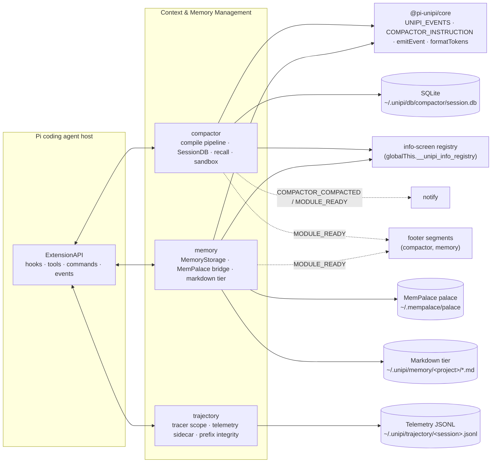
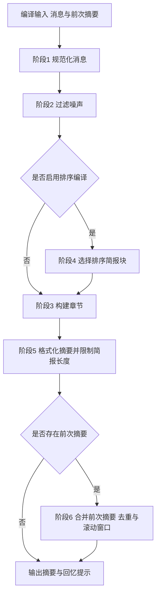
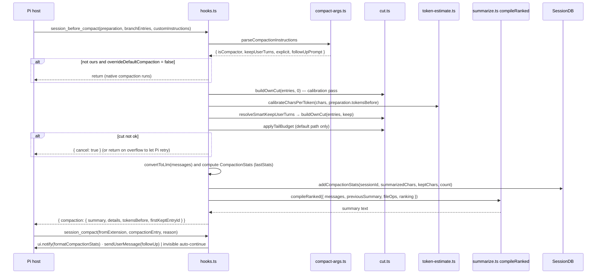
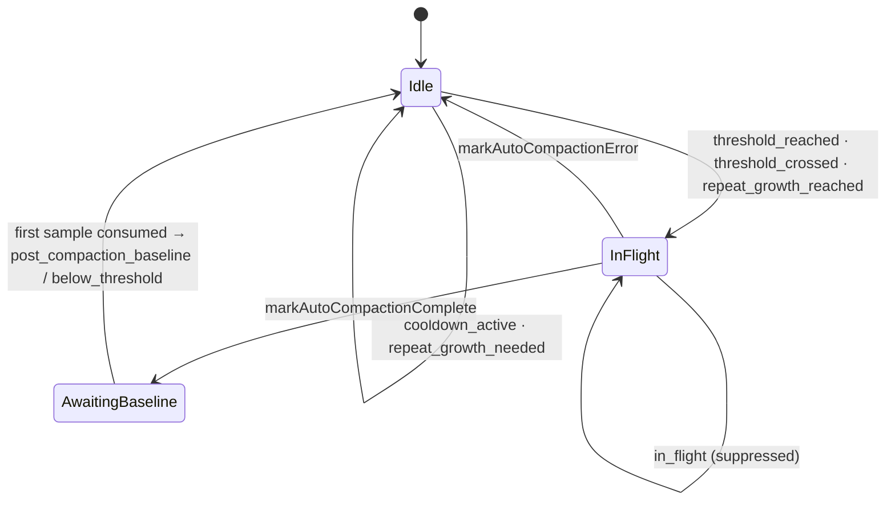
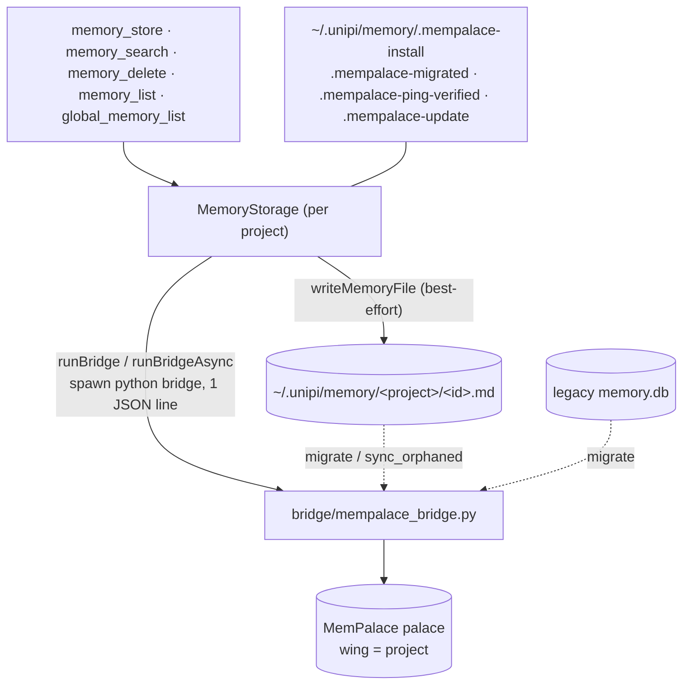
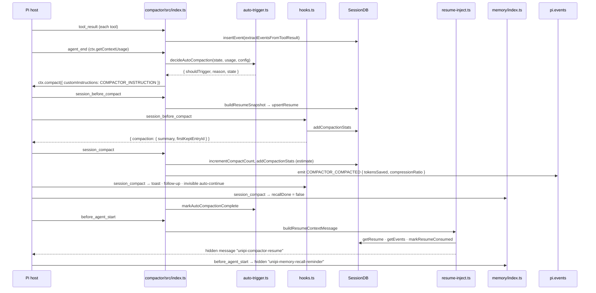

# Context & Memory Management (/docs/deep-exploration/context-and-memory-management-domain)


**Project:** Unipi (`@pi-unipi/*` extension suite for the Pi coding agent)
&#x2A;*Packages covered:** `packages/compactor`, `packages/memory`, `packages/trajectory`
&#x2A;*Document date:** 2026-09-16

***

## 1. Domain Overview [#1-domain-overview]

The Context & Memory Management domain is responsible for the scarcest resource in an agentic coding session: the model's context window. It provides three complementary capabilities, each implemented as an independently loadable extension package:

| Capability                              | Package                | Core idea                                                                                                                                            |
| --------------------------------------- | ---------------------- | ---------------------------------------------------------------------------------------------------------------------------------------------------- |
| **Context compaction & session recall** | `@pi-unipi/compactor`  | Replace raw conversation history with a compact, deterministic, structured summary — with zero LLM calls — and keep the discarded detail searchable. |
| **Persistent cross-session memory**     | `@pi-unipi/memory`     | Store durable facts (preferences, decisions, patterns, summaries) in a MemPalace backend with a human-readable markdown tier, scoped per project.    |
| **Trajectory capture & observability**  | `@pi-unipi/trajectory` | Record what every hook and API call did to the context, verify provider-request prefix integrity, and serve a live trajectory view.                  |

Together they deliver the domain's value proposition: longer autonomous sessions with less manual context management, and continuity across sessions. All three packages depend only on `@pi-unipi/core` and integrate with the host through the Pi `ExtensionAPI` (tools, slash commands, lifecycle hooks).

### 1.1 Position in the overall architecture [#11-position-in-the-overall-architecture]



***

## 2. Compactor: Compaction Engine [#2-compactor-compaction-engine]

### 2.1 Design philosophy [#21-design-philosophy]

The compactor is a **deterministic, zero-LLM** summarizer. Rather than asking a model to summarize the conversation (slow, expensive, non-reproducible), it runs a chain of pure functions over normalized message blocks. Every stage takes `NormalizedBlock[]` or `SectionData` as input and returns a new value, so stages can be tested and recomposed independently. Because compaction is cheap, it can safely be auto-triggered on a percentage threshold.

The core data type (`src/types.ts`) is:

```ts
export type NormalizedBlock =
  | { kind: "user"; text: string; sourceIndex?: number }
  | { kind: "assistant"; text: string; sourceIndex?: number }
  | { kind: "tool_call"; name: string; args: Record<string, unknown>; sourceIndex?: number }
  | { kind: "tool_result"; name: string; text: string; isError: boolean; sourceIndex?: number }
  | { kind: "thinking"; text: string; redacted: boolean; sourceIndex?: number };
```

The output of the pipeline is a bracketed text summary (`[Session Goal]`, `[Files And Changes]`, `[Commits]`, `[Outstanding Context]`, `[User Preferences]`) followed by a *brief transcript*, then a `RECALL_NOTE` telling the model it can retrieve dropped detail via the recall tool.

### 2.2 The six-stage `compile()` pipeline [#22-the-six-stage-compile-pipeline]

`src/compaction/summarize.ts` is the orchestrator. It exposes two entry points sharing one implementation, `compileWithBriefBlocks`:

* **`compile(input)`** — the unranked path. The brief transcript is built from all filtered blocks and capped at `BRIEF_MAX_LINES = 120`.
* **`compileRanked(input)`** — the path used by the live compaction hook. Blocks are first scored and selected under a character budget (`selectRankedBriefBlocks`), the fresh brief is **not** capped, and merging preserves the fresh brief (`preserveFreshBriefOnMerge: true`).



**Stage 1 — Normalize.** `normalizeMessages` maps each pi-ai `Message` into `NormalizedBlock`s, extracting text from mixed content parts (`text`, `toolCall`, `thinking`) via `content.ts#textOf`. `sanitize.ts` strips control characters and normalizes whitespace.

**Stage 2 — Filter noise.** `filter-noise.ts` drops:

* all `thinking` blocks;
* `tool_call`/`tool_result` blocks whose tool is in `NOISE_TOOLS` (`TodoWrite`, `TodoRead`, `ToolSearch`, `WebSearch`, `AskUser`, `ExitSpecMode`, `GenerateDroid`);
* user blocks containing `NOISE_STRINGS` (e.g. "Continue from where you left off.") or user-configured `customNoisePatterns`;
* XML wrappers such as `<system-reminder>`, `<ide_opened_file>`, `<command-message>`, `<context-window-usage>` (`XML_WRAPPER_RE`), and user blocks that become empty after stripping them.

**Stage 3 — Build sections.** `build-sections.ts` produces `SectionData` by running the heuristic extractors:

| Extractor                                             | Output section          | Notes                                                                                                                                                         |
| ----------------------------------------------------- | ----------------------- | ------------------------------------------------------------------------------------------------------------------------------------------------------------- |
| `extractGoals`                                        | `[Session Goal]`        | Task-verb / scope-change regexes over user turns                                                                                                              |
| `extractFiles` → `formatFileActivity`                 | `[Files And Changes]`   | Classifies paths into `Modified`, `Created`, `Read` sets; paths present in *Modified* are removed from *Created*; each category capped at 10 with `(+N more)` |
| `extractCommits` → `formatCommits`                    | `[Commits]`             | Commit hash + message detection                                                                                                                               |
| `extractOutstandingContext`                           | `[Outstanding Context]` | Inspects the last 20 blocks for error tool results and `BLOCKER_RE` matches ("failed", "broken", "blocked", "crash"…); at most 5 items                        |
| `extractPreferences` → `dedupPreferencesAgainstGoals` | `[User Preferences]`    | Preferences that duplicate goals are dropped                                                                                                                  |
| `buildBriefSections` → `stringifyBrief`               | brief transcript        | Built from `briefBlocks` when supplied (ranked path), else all blocks                                                                                         |

**Stage 4 — Rank (ranked path only).** `rank.ts` scores each block by *signal density* and adds a `reasons[]` trail for debuggability. Representative weights: user turn +18, assistant +10, edit tool (`edit|write|multiedit|apply_patch…`) +34, test/build command (`TEST_COMMAND_RE`) +26, recency 0–12, tool result +1. Bash blocks consisting only of scaffolding (`set -e`, `cd`, `echo`, `ls`, heredoc bodies…) receive `TRIVIAL_BASH_PENALTY = 16`. Hook-provided `fileOps` (read/written/edited files reported by Pi) are used as a structural signal instead of prose guessing. Selection is governed by `BriefRankingOptions`:

* `maxBlocks` (default 80) and `preserveRecentBlocks` (default 16) as safety bounds;
* `maxBriefChars` (floor), `maxBriefCharsCeiling`, `briefCharsPerBlock` (slope) — a **size-relative budget**: `clamp(briefCharsPerBlock × blockCount, floor, ceiling)`, so long transcripts earn more brief budget while small sessions stay at the floor.

`brief.ts#compileBrief` renders the selected blocks with per-segment head/tail word budgets, keeps heredoc commands intact (`heredocCloseIndex`), labels tool calls with an extracted path, and collapses `<skill name=…>` blocks (`skill-collapse.ts`).

**Stage 5 — Format.** `format.ts#formatSummary` renders each non-empty section as `[Title]\n- item…`, joins sections with `\n\n---\n\n`, and (for the unranked path) applies `capBrief`, which keeps the last 120 lines and prefixes `...(N earlier lines omitted)`.

**Stage 6 — Merge.** `merge.ts#mergePrevious` parses the previous summary by header (`sectionOf`) and merges section by section:

* `Outstanding Context` is always replaced by the fresh version (blockers are transient);
* `Files And Changes` is merged set-wise per category (`mergeFileLines`), Modified wins over Created;
* other sections are de-duplicated line-wise and capped as a rolling window (`Session Goal` 8, `Commits` 8, others 15);
* the brief transcript is re-budgeted via `mergeBriefTranscriptWithFreshBudget`.

Before merging, `stripRecallNote` removes the previous `RECALL_NOTE` so it is not duplicated.

### 2.3 Cut selection: what gets summarized vs. kept [#23-cut-selection-what-gets-summarized-vs-kept]

`src/compaction/cut.ts` decides the boundary between "history to summarize" and "tail to keep verbatim":

* `collectLiveMessages` walks the append-only branch, starts after the last `compaction` entry's `firstKeptEntryId`, and performs **orphan recovery** when that id is the `""` sentinel (prior compact-all) or no longer exists in the branch. `custom_message` and `branch_summary` entries are converted to their agent-message form so they count as live context.
* `buildOwnCut(branchEntries, keepUserTurns)` returns `OwnCutResult`: either `{ ok: true, messages, firstKeptEntryId, keptUserTurns, … }` or `{ ok: false, reason }` with `OwnCutCancelReason` = `no_live_messages` | `too_few_live_messages` (≤ 2 live messages).
* `resolveSmartKeepUserTurns` boosts the default `keep:1` to a larger tail when the tail is small (config `smartKeepTail`); an explicit `keep:N` from the user is always respected.
* `applyTailBudget` rescues autonomous or oversized-tail sessions with a token-budget cut (`budgetCut: "no_anchor" | "oversized_tail"`), only on the default (non-explicit) path.

User intent arrives through `compact-args.ts#parseCompactionInstructions`: exactly `COMPACTOR_INSTRUCTION` (from core) selects the default path; `COMPACTOR_INSTRUCTION keep:N …` parses an explicit keep count; any other instruction is treated as "not ours" but still parsed for a trailing `keep:N` and follow-up prompt.

### 2.4 Token estimation with per-session calibration [#24-token-estimation-with-per-session-calibration]

`token-estimate.ts` is character-based, with `DEFAULT_CHARS_PER_TOKEN = 4` clamped to `[2, 6]`. At compaction time `hooks.ts` calibrates the ratio from Pi's *real* `preparation.tokensBefore` against the measured character count of live messages plus the previous summary (`calibrateCharsPerToken`), yielding `{ mode: "heuristic" | "calibrated", charsPerToken }`. `estimateMessageContentChars` counts every token-bearing part (text, thinking, tool call name + arguments, tool result content, images at `IMAGE_CONTENT_CHARS = 4800`) so the calibrated ratio is not deflated. The ranked brief budget (`RANKED_BRIEF_BUDGET_TOKENS = 1100`, ceiling `2000`, `15` tokens per block) is converted to characters using this calibrated ratio, so the summary targets a token size regardless of content density.

### 2.5 Compaction hooks (`hooks.ts`) [#25-compaction-hooks-hooksts]

`registerCompactionHooks(pi, deps)` binds the engine into three Pi events:

1. **`context`** — filters out the invisible auto-continue marker message (`customType === "compactor-auto-continue"`) from the LLM payload.
2. **`session_before_compact`** — the main path (see sequence below). It only acts when the instruction carries the compactor marker **or** `config.overrideDefaultCompaction` is true; otherwise it returns and lets Pi's native compaction proceed. On an unworkable cut during an `overflow` compaction it returns without cancelling so Pi core can retry; otherwise it returns `{ cancel: true }` with a UI warning.
3. **`session_compact`** — shows the post-compaction toast (`formatCompactionStats`), sends a pending follow-up prompt via `pi.sendUserMessage`, or, when `continueAfterThresholdCompact` is enabled and the reason was `threshold`/`overflow`, schedules `triggerInvisibleContinue`: a hidden custom message (`content: []`, `display: false`, `triggerTurn: true`, `deliverAs: "followUp"`) that makes the agent resume from the summary without polluting context.



`details` returned to Pi records `compactor: "@pi-unipi/compactor"`, the list of section headers, source message count, whether a previous summary was used, the compaction reason and any budget cut — useful when inspecting the session file.

### 2.6 Auto-compaction trigger (`auto-trigger.ts`) [#26-auto-compaction-trigger-auto-triggerts]

`auto-trigger.ts` is a **pure state machine**: it never touches Pi, it only decides whether a context-usage sample should trigger compaction. State is immutable; every function returns a new `AutoCompactionState`.

Defaults (`AUTO_COMPACTION_DEFAULTS`): `enabled: false`, `thresholdPercent: 80`, `cooldownMs: 60 000`, `repeatMinGrowthTokens: 4 000`, `notify: true`. `normalizeAutoCompactionConfig` clamps threshold to `[1, 99]`, cooldown to `[0, 24h]`, growth to `[0, 10M]`.



`decideAutoCompaction` returns an `AutoCompactionDecision` with a typed `reason`, the updated `state`, and diagnostics (`cooldownRemainingMs`, `tokenGrowth`, `tokensUntilRepeat`). Loop safeguards encoded in the code comments: unknown usage never triggers and never erases the baseline; in-flight compactions suppress triggers; every repeat honours cooldown; and if usage remains above threshold after compaction, the first known sample is only a baseline and a repeat requires `repeatMinGrowthTokens` of growth.

**Runtime wiring** (`src/index.ts&#x60;): the decision runs on &#x2A;*`agent_end`**, not `turn_end`. The code explains why: `ctx.compact()` aborts the active agent operation first, so compacting between turns of a still-running loop would kill the next in-flight provider request. `agent_end` fires only after the run has settled, matching Pi core's own native check point. On trigger, `ctx.compact({ customInstructions: COMPACTOR_INSTRUCTION, onComplete, onError })` is called; `onComplete` → `markAutoCompactionComplete`, `onError` → `markAutoCompactionError` (benign errors "Compaction cancelled"/"Already compacted" are not surfaced).

### 2.7 Configuration [#27-configuration]

`src/config/manager.ts` loads a global config from `~/.unipi/config/compactor/config.json` (scaffolded from `DEFAULT_COMPACTOR_CONFIG` on first run) and deep-merges optional per-project overrides from `<cwd>/.unipi/config/compactor.json`. `migrateConfig` fills missing keys so older files keep working. `CompactorConfig` (`types.ts`) groups:

* **Strategies** (`CompactorStrategyConfig` = `{ enabled, mode, autoDetect? }`): `sessionGoals`, `filesAndChanges`, `commits` (auto-disabled at runtime when `autoDetect: "git"` and no `.git` directory exists), `outstandingContext`, `userPreferences`, `briefTranscript`, `sessionContinuity`, `sandboxExecution`; `fts5Index` is retained only for compatibility.
* **Pipeline**: `autoInjection`, `customNoisePatterns`.
* **`autoCompaction`** (see §2.6).
* **Global**: `overrideDefaultCompaction`, `smartKeepTail`, `continueAfterThresholdCompact`, `debug` (writes `/tmp/compactor-debug.json`).

`config/presets.ts` provides named presets (`precise`, `balanced`, `thorough`, `lean`, `opencode`, `verbose`, `minimal`, `custom`) and a settings TUI (`tui/settings-overlay.ts`) edits them interactively.

***

## 3. Compactor: Session Store & Recall [#3-compactor-session-store--recall]

### 3.1 `SessionDB` (`src/session/db.ts`) [#31-sessiondb-srcsessiondbts]

`SessionDB` is a SQLite store at `~/.unipi/db/compactor/session.db` (WAL mode). It prefers `bun:sqlite` and falls back to `better-sqlite3`, normalising the different constructor shapes. Initialization is fail-soft: `src/index.ts` only assigns `sessionDB` after `init()` succeeds, so a partially constructed instance never slips past null-guards and dependent commands report "not initialized" gracefully.

**Session identity.** `getWorktreeSuffix()` appends `__<sha256(cwd)[0:8]>` when the current directory is a non-main git worktree (or honours `COMPACTOR_SESSION_SUFFIX`), so parallel worktrees on the same Pi session id do not share state.

**Schema** (created idempotently, then migrated with `PRAGMA user_version`):

| Table            | Purpose                                                    | Key columns                                                                                                                             |
| ---------------- | ---------------------------------------------------------- | --------------------------------------------------------------------------------------------------------------------------------------- |
| `session_events` | Append-only behavioural events extracted from tool results | `type`, `category`, `priority`, `data`, `data_hash`, `attribution_source`, `attribution_confidence`, `source_hook`                      |
| `session_meta`   | One row per session                                        | `event_count`, `compact_count`, `total_chars_before`, `total_chars_kept`, `total_messages_summarized`, `sandbox_runs`, `search_queries` |
| `session_resume` | One-shot resume snapshot per session                       | `snapshot`, `event_count`, `consumed`                                                                                                   |

Migrations V1 and V2 add columns with a `safeAddColumn` helper that tolerates "duplicate column" errors, because SQLite auto-commits DDL and a partially applied prior run must not break startup.

**Write discipline.** `insertEvent` runs in a transaction: it de-duplicates against the last `DEDUP_WINDOW = 5` events by `(type, data_hash)`, evicts the lowest-priority oldest event when a session exceeds `MAX_EVENTS_PER_SESSION = 1000`, and bumps `session_meta.event_count`. `cleanupOldSessions(7)` runs on `session_shutdown`.

### 3.2 Event capture (`src/session/extract.ts`) [#32-event-capture-srcsessionextractts]

On every `tool_result`, `extractEventsFromToolResult` converts the tool call into zero or more `SessionEvent`s with priorities (`LOW`=1 … `CRITICAL`=4): `tool_error` (HIGH), `file_read`/`file_edit`/`file_write` (NORMAL), `bash_executed` (LOW), `git_operation` (NORMAL), `sandbox_execution` (LOW), `content_search` (LOW). The tool response is truncated to 1000 characters before extraction.

### 3.3 Resume snapshot and injection [#33-resume-snapshot-and-injection]

Two handlers cooperate around a compaction:

1. `src/index.ts&#x60; on &#x2A;*`session_before_compact`** (when `sessionContinuity` is enabled) loads up to 1000 events and stats, builds an XML snapshot via `session/snapshot.ts#buildResumeSnapshot` — `<files>` (last 10 active files with op counts), `<errors>`, `<decisions>`, each with a suggested recall tool call — and `upsertResume`s it (resetting `consumed = 0`).
2. On the next &#x2A;*`before_agent_start`**, `resume-inject.ts#buildResumeContextMessage` calls `injectResumeSnapshot`, which returns the snapshot once (then `markResumeConsumed`), optionally appending `buildAutoInjection(events)` when `pipeline.autoInjection` is on. The result is delivered as a **hidden custom message** (`customType: "unipi-compactor-resume"`, `display: false`) rather than a system-prompt change — the comment notes this preserves Pi's stable prompt prefix for provider cache reuse.

### 3.4 Recall (`session_recall`, `/unipi:session-recall`) [#34-recall-session_recall-unipisession-recall]

`session/recall-blocks.ts#recallBlocksFromContext` reads the **append-only session branch** (`ctx.sessionManager.getBranch()`), not the compacted LLM context, so raw pre-compaction messages remain searchable. It normalizes standard roles via `normalizeMessages` and handles Pi-specific roles (`bashExecution`, `custom`, `branchSummary`, `compactionSummary`) plus `custom_message`, `branch_summary` and `compaction` entries, tagging each block with its `sourceIndex`. `src/index.ts` also caches filtered blocks on `before_agent_start` as a fallback.

The `session_recall` tool (`tools/register.ts`, deprecated alias `vcc_recall`) accepts `query` (keywords, regex, or `#N:path` drill-down), `expand` (indices to return untruncated), `page`, `scope` (`lineage` | `all` to include edited/retried branches) and `mode` (`hybrid` | `touched` — files aggregated by path). It delegates to `tools/vcc-recall.ts`, which reuses `search-entries.ts`, `touched-files.ts` and `drill-down.ts`. The slash command variant sends results as a visible custom message *and* feeds them to the agent with `triggerTurn` so recall drives the next turn.

***

## 4. Compactor: Tools, Sandbox Executor & Security [#4-compactor-tools-sandbox-executor--security]

### 4.1 Registered surface [#41-registered-surface]

All tools are registered on `session_start` once `SessionDB` is live, via `registerCompactorTools(pi, deps)` with TypeBox schemas:

| Tool                                                                                                          | Purpose                                                                                             |
| ------------------------------------------------------------------------------------------------------------- | --------------------------------------------------------------------------------------------------- |
| `compact`                                                                                                     | Manual compaction; `dryRun: true` previews counts without compacting                                |
| `session_recall` (alias `vcc_recall`)                                                                         | Search session history (see §3.4)                                                                   |
| `sandbox` / `sandbox_file` / `sandbox_batch` (aliases `ctx_execute`, `ctx_execute_file`, `ctx_batch_execute`) | Execute code in 11 languages inside the sandbox; only registered when `sandboxExecution` is enabled |
| `compactor_stats` (alias `ctx_stats`)                                                                         | Session and all-time compaction statistics                                                          |
| `compactor_doctor` (alias `ctx_doctor`)                                                                       | Diagnostics on the compactor installation                                                           |
| `context_budget`                                                                                              | Token-budget introspection built on `token-estimate.ts`                                             |

Slash commands (`commands/index.ts`) include `/unipi:lossless-compact` (alias `/unipi:compact`) which calls `ctx.compact({ customInstructions: COMPACTOR_INSTRUCTION })` and reports `getLastCompactionStats()` on completion, plus `/unipi:session-recall` and preset/settings commands. The module announces itself with `MODULE_READY` carrying `COMPACTOR_COMMANDS` and `COMPACTOR_TOOLS` from core, and registers a `compactor` info-screen group (tokens saved, cost saved, % reduction, top tools, compactions, tool calls) backed by `src/info-screen.ts`.

### 4.2 `PolyglotExecutor` (`src/executor/executor.ts`) [#42-polyglotexecutor-srcexecutorexecutorts]

A sandboxed runner for `javascript`, `typescript`, `python`, `shell`, `ruby`, `go`, `rust`, `php`, `perl`, `r`, `elixir`. It detects available runtimes (`runtime.ts#detectRuntimes`), writes code to a temp directory, and enforces an output hard cap (`sandboxExecution.outputLimit`, default 100 MiB). Security measures:

* `sanitizeEnv()` removes an explicit `DANGEROUS_ENV_VARS` list (cloud credentials, `GITHUB_TOKEN`, `NPM_TOKEN`, `DATABASE_URL`, …) and any variable whose name contains `SECRET`, `PASSWORD`, `TOKEN` or `PRIVATE_KEY`.
* `killTree()` terminates the whole process group (`taskkill /F /T` on Windows, `process.kill(-pid, "SIGKILL")` on POSIX); backgrounded PIDs are tracked and cleaned on `session_shutdown`.

### 4.3 Security policy layer (`src/security/*`) [#43-security-policy-layer-srcsecurity]

The `input` hook in `src/index.ts` applies an advisory, **fail-open** security pass: `readsOrCreatesPolicy(cwd)` loads deny patterns from `.pi/settings.json`; `evaluateCommand` blocks bash commands matching deny patterns (returning an error tool result); `hasShellEscapes`/`scanForShellEscapes` inspect non-shell sandbox code; `evaluateFilePath` checks read/edit/write paths. A hard-coded guard also cancels bash commands invoking `curl|wget|nc|netcat`. Errors in the security path never block execution — enforcement is intentionally left to the hooks system.

### 4.4 Display safety [#44-display-safety]

The `tool_result` hook clamps `details.diff` of `edit`/`write` results to the terminal width (`display/diff-width-safety.ts#clampDiffToWidth`) because Pi's diff renderer does not truncate lines and could crash the TUI on narrow terminals.

***

## 5. Memory Package: Persistent Cross-Session Memory [#5-memory-package-persistent-cross-session-memory]

### 5.1 Storage model [#51-storage-model]

`packages/memory/storage.ts` defines the record shape and the `MemoryStorage` class:

```ts
export interface MemoryRecord {
  id: string; title: string; content: string; tags: string[];
  project: string;
  type: "preference" | "decision" | "pattern" | "summary";
  created: string; updated: string;
  embedding?: Float32Array | null;
}
```

Storage is **project-scoped**: `getProjectName(cwd)` sanitizes the last path segment, and each project owns `~/.unipi/memory/<project>/`. Two tiers are maintained:

1. **MemPalace** (primary, queryable) — a "palace" at `~/.mempalace/palace` with one "wing" per project.
2. **Markdown tier** (durable, human-readable) — `<id>.md` files with YAML frontmatter (`id`, `title`, `tags`, `project`, `created`, `updated`, `type`). `storeMempalace` writes the palace first and then the markdown copy best-effort, so the file tier stays a consistent fallback and migration source.



### 5.2 MemPalace bridge (`mempalace.ts`) [#52-mempalace-bridge-mempalacets]

The TypeScript ↔ Python boundary is a **processless CLI protocol**: each operation spawns the MemPalace venv Python with `[bridgePath, palace, cmd, argsJson]` and parses a single JSON line `{ ok, result?, error? }`. `runBridge` is synchronous (`spawnSync`, 60 s default timeout, 64 MiB buffer); `runBridgeAsync` is the non-blocking twin used wherever the UI is live (status bar, info overlay), because a synchronous Python round-trip takes \~0.5–1.1 s. Any failure — timeout, non-zero exit, malformed JSON, `ok: false` — yields `null`; callers treat `null` as "no data".

Installation and health are cached with flag files under `~/.unipi/memory/`:

* `ensureMempalace()` locates the venv Python via `uv tool dir`, or installs with `uv tool install mempalace` (180 s timeout) when `uv` is present; the result is cached in `.mempalace-install`.
* A `ping` sanity check is skipped when `.mempalace-ping-verified` is younger than 24 h; the flag is invalidated on any failed bridge call so a broken palace is re-verified next session.
* `maybeAutoUpdateMempalace()` performs a TTL-gated (\~daily) PyPI check and `uv tool upgrade`, emitting `UPDATE_APPLIED` on success.

`resolveMempalaceBridgePath` supports the standalone package layout, the umbrella bundle layout, an `UNIPI_MEMPALACE_BRIDGE` override, and `require.resolve("@pi-unipi/memory/package.json")` for non-hoisted installs.

### 5.3 Migration with verified, resumable state [#53-migration-with-verified-resumable-state]

Legacy data (markdown files and a `memory.db` SQLite file) is migrated one-way into the palace. Rather than a one-shot timestamp, `getMemorySourceFingerprint` hashes the relative path, size and mtime of every durable source file; `isMigrated(fingerprint)` compares against `.mempalace-migrated` (`MIGRATION_STATE_VERSION = 2`). `markMigrated` refuses to record completion unless `result.failed === 0 && result.verified === result.discovered`, so a failed or partial run retries on a later session. Because new or changed markdown changes the fingerprint, catch-up migration is automatic. The first migration may embed thousands of records and is given a 15-minute window.

**Fail-soft behaviour.** `MemoryStorage.init()` throws when MemPalace cannot be made available; `index.ts` catches this, sets `projectStorage = null`, and the extension runs without memory ("Memory must never hard-fail"). Note that the header comment in `mempalace.ts` still mentions a legacy SQLite fallback path, whereas the current `storage.ts` implementation treats SQLite solely as a migration source.

### 5.4 Lifecycle and agent nudging (`index.ts`) [#54-lifecycle-and-agent-nudging-indexts]

| Hook                 | Behaviour                                                                                                                                                                                                                                                                                                                                                  |
| -------------------- | ---------------------------------------------------------------------------------------------------------------------------------------------------------------------------------------------------------------------------------------------------------------------------------------------------------------------------------------------------------- |
| `session_start`      | Create `MemoryStorage` for the project, `init()`; defer orphaned-markdown sync to first storage access (`ensureOrphanSync`) to keep startup fast; kick off the TTL-gated auto-update; emit `MODULE_READY`; register the `memory` info group; set a status string (`🧠 mem <project>p/<all>all`, or `⚡`/`📝` when embeddings/markdown-only) asynchronously. |
| `before_agent_start` | Once per session, inject a hidden `unipi-memory-recall-reminder` message built by `buildMemoryRecallReminder` listing up to 20 memory titles and instructing the agent to call `memory_search` before work and `memory_store` after. Only tools currently active (`pi.getActiveTools()`) are mentioned, so workflow sandboxes are respected.               |
| `agent_end`          | If recall happened but nothing was stored, send a hidden `unipi-memory-retro-reminder` for the next turn.                                                                                                                                                                                                                                                  |
| `session_compact`    | Reset `recallDone` so the reminder is re-injected after compaction.                                                                                                                                                                                                                                                                                        |
| `session_shutdown`   | Close storage.                                                                                                                                                                                                                                                                                                                                             |

`tools.ts#memory_store` guards against duplicates: an exact title match with identical content returns a `duplicate_detected` result asking the agent to read first; same title with new content updates the record (regenerating the embedding via `embedding.ts#generateEmbedding`). `findSimilarByTitle` provides fuzzy matching for near-duplicates. Cross-project search/list (`searchAllProjects`, `listAllProjectsCachedAsync`, `global_memory_list`, alias `global_memory_search`) iterate all project directories.

***

## 6. Trajectory Package: Capture & Observability [#6-trajectory-package-capture--observability]

### 6.1 Cross-cutting tracer [#61-cross-cutting-tracer]

Although grouped in this domain, `trajectory` acts as a **cross-cutting observability layer**: the umbrella entry (`packages/unipi/index.ts`) calls `createUnipiTracer(pi)` and wraps every other module's `ExtensionAPI` with `tracer.scope(packageName)`. The proxy fingerprints hook inputs and outputs so context mutations can be attributed to individual packages:

* `mutationSurface(event)` selects the part of an event that can mutate context (`context` → messages, `before_provider_request` → payload, `before_agent_start` → systemPrompt, `input` → text/images, `tool_result` → content/details/isError/usage, …).
* `mutationEvidence(before, after)` compares SHA-256 fingerprints of canonicalized values and, when they differ, records `firstDifference` (path, kind, sampled before/after).
* `CONTEXT_API_ACTIONS` (`sendMessage`, `sendUserMessage`, `setActiveTools`, `setModel`, `setThinkingLevel`, `registerProvider`, `unregisterProvider`) are traced as context-affecting API calls.

### 6.2 Telemetry sidecar and prefix integrity [#62-telemetry-sidecar-and-prefix-integrity]

`src/capture.ts#registerTelemetryCapture` registers read-only hooks that append `TelemetryEvent`s (`hook`, `unipi-trace`, `prefix-integrity`, `system-prompt`, `request`, `response`, `first-token`, `message-end`, `tool-start`, `tool-end`) to `~/.unipi/trajectory/<sessionId>.jsonl` via `TelemetrySidecar`. Safety properties of the sidecar:

* Directory mode `0o700`, file mode `0o600`.
* `redactTelemetry` masks keys matching `authorization|api[-_]?key|token|cookie|secret|password|credential` and values that look like bearer tokens, `sk-…`, `gh[pousr]_…`, or Google API keys; strings are truncated at 200 000 chars; events over 2 MB are dropped.
* Only a 5 MB tail is retained in memory and re-read, so the live inspector never scans the whole file; a `revision` counter allows cheap change detection.

`PrefixIntegrityTracker` (`prefix-integrity.ts`) fingerprints each provider request's messages, system prompt, tools and envelope, and classifies successive requests as `first_request`, `identical_retry`, `prefix_extended`, `boundary` (marked on `session_compact` and `session_tree`) or `violation` — surfacing when something breaks the stable prefix that provider prompt caching depends on.

### 6.3 Live trajectory UI [#63-live-trajectory-ui]

The `/unipi:trajectory` command (`index.ts`) starts a `TrajectoryServer`, opens the browser, and serves a snapshot built by `projectTrajectory(branchEntries, sessionMeta, telemetry)`. Snapshots are cached by `(leafId, telemetryRevision)`; `stop`/`off`/`toggle` arguments manage the server, which is also stopped on `session_shutdown`.

***

## 7. End-to-End Flow: Compaction, Persistence and Recall [#7-end-to-end-flow-compaction-persistence-and-recall]



Downstream, `notify` and `footer` react to `COMPACTOR_COMPACTED`/`MODULE_READY` without importing the compactor, and the info screen reads the registered data providers.

***

## 8. Persistence Inventory [#8-persistence-inventory]

| Artifact                   | Path                                                                 | Owner               | Format / Notes                                                     |
| -------------------------- | -------------------------------------------------------------------- | ------------------- | ------------------------------------------------------------------ |
| Compactor global config    | `~/.unipi/config/compactor/config.json`                              | compactor           | JSON, scaffolded from defaults, deep-merged with project overrides |
| Compactor project override | `<cwd>/.unipi/config/compactor.json`                                 | compactor           | JSON                                                               |
| Session store              | `~/.unipi/db/compactor/session.db`                                   | compactor           | SQLite (WAL), `user_version` migrations, 7-day cleanup             |
| Debug dump                 | `/tmp/compactor-debug.json`                                          | compactor           | Only when `debug: true`                                            |
| Memory markdown tier       | `~/.unipi/memory/<project>/<id>.md`                                  | memory              | YAML frontmatter + markdown body                                   |
| MemPalace palace           | `~/.mempalace/palace`                                                | memory (via bridge) | Managed by MemPalace                                               |
| Memory flags               | `~/.unipi/memory/.mempalace-{install,migrated,ping-verified,update}` | memory              | JSON / timestamp caches                                            |
| Telemetry sidecar          | `~/.unipi/trajectory/<sessionId>.jsonl`                              | trajectory          | Redacted JSONL, 0600                                               |

***

## 9. Design Patterns and Engineering Observations [#9-design-patterns-and-engineering-observations]

* **Pure core, impure edges.** Both the compile pipeline and the auto-trigger are pure functions over plain data; all Pi/host interaction is confined to `hooks.ts` and `src/index.ts`. This makes the highest-risk logic (what gets thrown away) unit-testable and reproducible.
* **Hidden messages instead of system-prompt edits.** Resume snapshots, memory reminders and the auto-continue marker are all delivered as `display: false` custom messages, and the auto-continue marker is additionally filtered from the LLM payload. This preserves the stable prompt prefix that provider caching depends on — a property the trajectory package explicitly monitors.
* **Fail-soft by default.** SessionDB init failure, MemPalace unavailability, security-check errors and bridge timeouts all degrade rather than crash. The `input` security hook is explicitly advisory ("fail-open").
* **Startup latency as a constraint.** Orphan sync is deferred to first use, ping verification is cached for 24 h, status counts are resolved asynchronously, and `node:fs` is lazily imported on debug paths.
* **Bounded everything.** Section caps (8/15 lines), file caps (10 per category), brief budgets in tokens, 1000 events per session, 5 MB telemetry tail, 2 MB per event, 64 MiB bridge buffer.

### Points worth noting for maintainers [#points-worth-noting-for-maintainers]

1. **Two `session_before_compact` handlers** exist in the compactor (`index.ts` for resume snapshots, `hooks.ts` for the summary). They are independent but both rely on the closure-held `currentSessionId`, since the event does not carry a session id.
2. **`session_compact` statistics in `index.ts` are heuristic** (assumes \~12 % retained, 500 tokens/event) and are recorded in addition to the precise stats written by `hooks.ts`; consumers of `compactor_stats` should be aware the two feeds are combined.
3. **`RECALL_NOTE` references `vcc_recall`**, the deprecated alias, while the preferred tool name is `session_recall`; both remain registered.
4. **The MemPalace fallback comment is stale**: `mempalace.ts` describes a legacy SQLite fallback, but `MemoryStorage.init()` throws and the extension runs without memory instead.
5. **Mixed responsibilities**: the `PolyglotExecutor` and security scanner live inside the compactor although they are orthogonal to compaction; the architecture review suggests extracting them into a dedicated sandbox package.
6. **Auto-compaction is disabled by default** (`enabled: false`) for backward compatibility; the compactor also only overrides Pi's native compaction when `overrideDefaultCompaction` is set or the compactor marker instruction is used.
