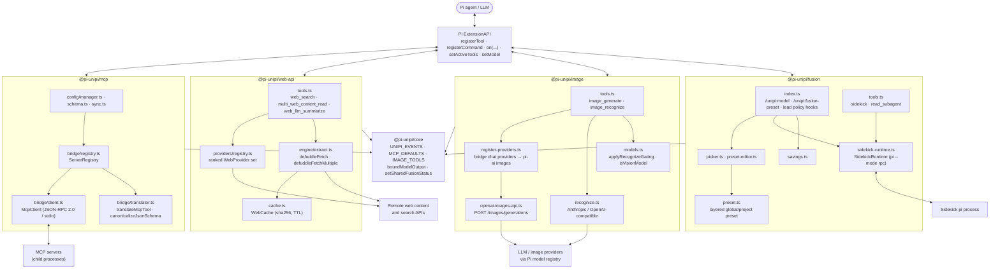
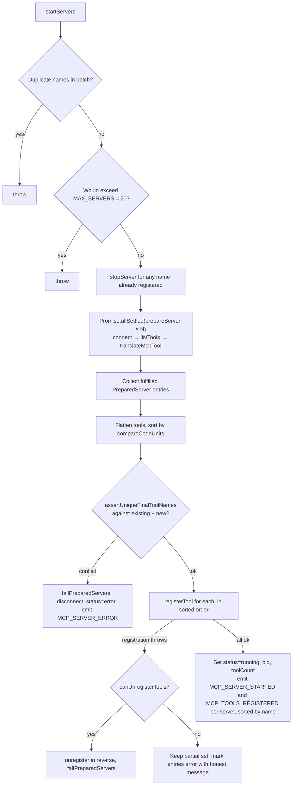
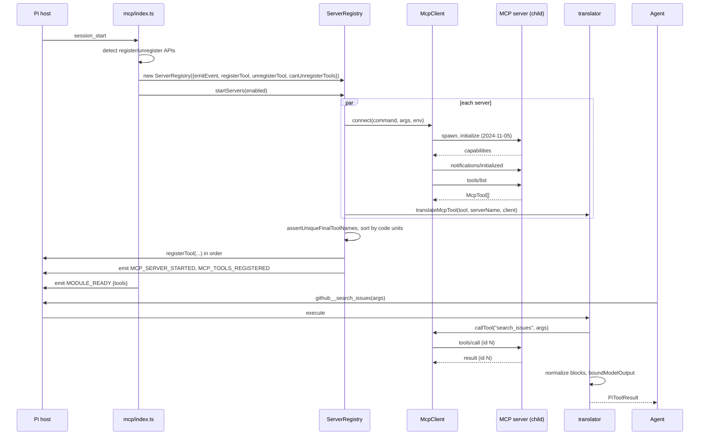
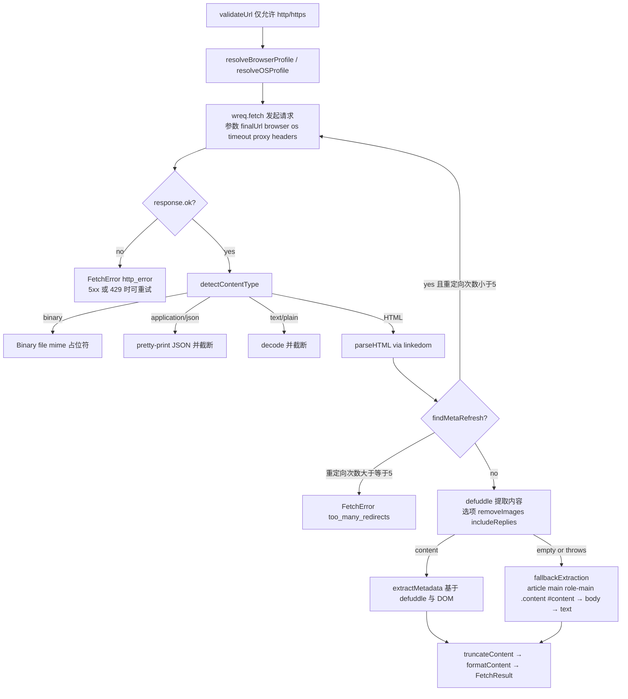
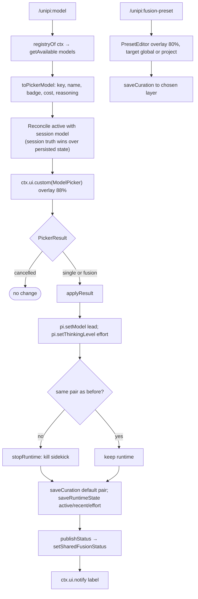

# External Capability Integration (/docs/deep-exploration/external-capability-integration-domain)

**Project:** Unipi — extension suite for the Pi coding agent
&#x2A;*Packages:** `@pi-unipi/mcp`, `@pi-unipi/web-api`, `@pi-unipi/image`, `@pi-unipi/fusion`
&#x2A;*Document date:** 2026-09-16

***

## 1. Purpose and Scope [#1-purpose-and-scope]

The External Capability Integration Domain is the part of Unipi that extends the agent's reach beyond the terminal and beyond the host's built-in tool set. Where the Agent Orchestration domain multiplies *agents* and the Context & Memory domain stretches *context*, this domain multiplies *capabilities*: it lets the model call tools served by third-party Model Context Protocol (MCP) servers, search and read the web, generate and interpret images, and pair a primary "lead" model with a cheaper "sidekick" model for delegated work.

The domain is implemented as four independent Pi extension packages. Each follows the same architectural shape that the rest of Unipi uses:

| Package             | Sub-module                      | Primary responsibility                                                                       |
| ------------------- | ------------------------------- | -------------------------------------------------------------------------------------------- |
| `@pi-unipi/mcp`     | MCP Server Bridge               | Spawn MCP servers, translate their tools into Pi tools, proxy calls back over JSON-RPC/stdio |
| `@pi-unipi/web-api` | Web Search & Smart-Fetch Engine | Provider-ranked web search/read/summarize plus a local extraction pipeline                   |
| `@pi-unipi/image`   | Image Generation & Recognition  | `image_generate` / `image_recognize` tools bridging Pi providers into image APIs             |
| `@pi-unipi/fusion`  | Model Fusion & Sidekick         | `/unipi:model` picker, layered presets, a persistent sidekick child process                  |

All four depend on `@pi-unipi/core` for constants (`MCP_DEFAULTS`, `IMAGE_TOOLS`, `MODULES`, …), the typed event contract (`UNIPI_EVENTS`, `emitEvent`), bounded-output helpers and — in the fusion case — the shared `fusion-status` slot. `@pi-unipi/fusion` additionally depends on `@pi-unipi/subagents` for `getPiSpawnCommand`, the one intra-domain cross-package import worth noting.

***

## 2. Domain Architecture [#2-domain-architecture]

Three characteristics are shared across the four packages and define the domain's style:

1. **Adapter pattern at the boundary.** Every external system is wrapped by a small adapter with an injected or feature-detected surface — `ServerRegistryOptions` injects `emitEvent`/`registerTool`/`unregisterTool`/`createClient`; `SidekickSpawnConfig` accepts an injectable `spawn` and `command`; `RecognizeOptions` and `ImagesOptionsLike` accept `fetchImpl`. This keeps the bridges testable without live servers or network access.
2. **Fail-soft integration.** A failed MCP server, a missing `pi-ai` images collection, an unavailable wigolo daemon or an unreachable lead model all degrade into a status entry, a `"?"` in the info screen, or a notice — never a crash of the host.
3. **Context budget awareness.** MCP results pass through `boundModelOutput` (64 KB cap with artifact spill-over), web content is truncated to `maxChars` (default 50 000), vision replies are capped at 2 048 tokens, and sidekick tool output is trimmed to 4 000 characters.

***

## 3. MCP Server Bridge (`@pi-unipi/mcp`) [#3-mcp-server-bridge-pi-unipimcp]

### 3.1 Responsibilities [#31-responsibilities]

The MCP bridge turns any stdio-based MCP server into a set of ordinary Pi tools. It owns four concerns: configuration (load, validate, merge, sync a catalog), lifecycle (spawn, handshake, stop, restart), translation (MCP schema → Pi tool definition) and proxying (Pi tool call → `tools/call` JSON-RPC request).

### 3.2 Configuration Layer [#32-configuration-layer]

`config/manager.ts` reads two files per scope:

| File              | Content                                                                                                  | Scopes                                                                |
| ----------------- | -------------------------------------------------------------------------------------------------------- | --------------------------------------------------------------------- |
| `mcp-config.json` | `{ mcpServers: { name: { command, args, env? } } }` — Claude Desktop / Cursor compatible                 | `~/.unipi/config/mcp/` (global), `<cwd>/.unipi/config/mcp/` (project) |
| `config.json`     | Per-server metadata (`enabled`, `addedAt`) and sync settings (`enabled`, `lastSyncAt`, `syncIntervalMs`) | same two scopes                                                       |

`validateMcpConfig` (in `config/schema.ts`) enforces that each server has a non-empty string `command`, an array of string `args`, and — if present — a string-valued `env` object. `loadMcpConfig` throws on invalid content, so a corrupt file surfaces as an explicit error rather than a half-loaded server list. `saveMcpConfig` writes with `chmod 600` because the file may contain API keys in `env`.

`resolveServers` merges the two scopes into `ResolvedServer[]` with a `ServerSource` tag:

* server only in global → `"global"`
* server only in project → `"project"`
* server in both → project definition wins entirely → `"project-override"`
* project metadata `enabled: false` disables a server even if globally defined

`config/sync.ts` fetches the `punkpeye/awesome-mcp-servers` README from GitHub, parses `## Category` headings and `- [Name](url) ⭐ - Description` bullets into `CatalogEntry` records (deduplicated by URL, official flag from the star, scope guessed as `local`/`cloud` via keyword heuristics, language guessed heuristically), enriches known servers with install recipes from `KNOWN_INSTALLS`, caches the result to `~/.unipi/config/mcp/servers.json`, and records `lastSyncAt`. The default sync interval is 24 hours (`DEFAULT_SYNC_CONFIG.syncIntervalMs = 86400000`). If the fetch fails, the bundled `data/seed-servers.json` provides a fallback catalog.

### 3.3 Transport: `McpClient` [#33-transport-mcpclient]

`bridge/client.ts` implements a minimal JSON-RPC 2.0 client over a child process's stdio:

* **`connect(command, args, env)`** spawns the process with `stdio: ["pipe","pipe","pipe"]` and `{...process.env, ...env}`, then sends `initialize` with `protocolVersion: "2024-11-05"` and `clientInfo: { name: "@pi-unipi/mcp" }`. On success it sends the `notifications/initialized` notification and marks the client connected. If the process exits before the handshake completes, the rejection message includes a stderr tail (bounded to 10 000 characters, trimmed to the last 5 000 when exceeded).
* **Framing** is newline-delimited JSON. `handleStdoutData` appends chunks to a buffer, splits on `\n`, parses each complete line and dispatches responses by `id` to a `Map<number, PendingRequest>`. Notifications from the server are currently ignored; malformed lines are skipped.
* **Timeouts** are per request (`MCP_DEFAULTS.STARTUP_TIMEOUT_MS = 10000` by default). On unexpected process exit after connection, `rejectAllPending` fails every in-flight request.
* **`listTools()`** → `tools/list&#x60;; &#x2A;*`callTool(name, args)`** → `tools/call`.
* **`disconnect()`** sends a `shutdown` notification, sends `SIGTERM`, waits up to 500 ms for exit, then `SIGKILL`s if needed and clears handles.

### 3.4 Lifecycle: `ServerRegistry` [#34-lifecycle-serverregistry]

`bridge/registry.ts` is the domain's most carefully engineered component. Its central method, `startServers(resolvedServers)`, implements a **discovery barrier**:

Key design decisions visible in the code:

* **Parallel prepare, serial register.** Connections and `tools/list` run concurrently for speed, but Pi-side registration happens only after every server has settled, in deterministic `compareCodeUnits` order. This makes the tool list stable across runs, which matters for prompt-cache stability.
* **No half-registered state.** If any tool name collides, or if any `registerTool` call throws while unregistration is supported, all tools registered in that batch are rolled back and every prepared client is disconnected.
* **Honesty on older hosts.** When the host cannot unregister tools (`canUnregisterTools === false`, detected in `index.ts`), a partial registration failure is *not* pretended away; the affected entries are marked `error` with the message "some MCP tools remain registered until Pi restarts", and `stopServer` refuses to run for entries that have tools.
* **Individual failures are isolated.** A server that fails during `prepareServer` gets a `status: "error"` entry and emits `MCP_SERVER_ERROR`, but does not prevent other servers' tools from being registered.
* **Locale independence.** `compareCodeUnits` compares UTF-16 code units rather than using `localeCompare`, so ordering is identical on every machine.

The registry also exposes `stopServer`, `restartServer` (stop then start with the previously resolved definition), `stopAll`, `disconnectAll` (used at shutdown; disconnects clients without claiming tool removal, because Pi tears down the extension's tool set itself), and read accessors `getAll`, `getActive`, `getFailed`, `getTotalToolCount`, `getServerState`, `getEntry`, `hasServer`.

### 3.5 Translation: `translateMcpTool` [#35-translation-translatemcptool]

`bridge/translator.ts` maps an `McpTool` to a `PiExternalTool`:

* **Name** is `${serverName}__${toolName}` (`MCP_DEFAULTS.TOOL_NAME_SEPARATOR = "__"`), e.g. `github__search_issues`. The server name in the description (`[Server: github]`) lets the model see the provenance.
* **Parameters** keep the Pi-facing top-level shape `{ type: "object", properties, required }` and are run through `canonicalizeJsonSchema`, which sorts object keys by code units and sorts/deduplicates valid string-only `required` arrays. Values under literal-data keywords (`const`, `default`, `enum`, `examples`) are not normalized, since a property named `required` inside application data must keep its order. The result is a byte-stable schema across restarts.
* **Execution** calls `client.callTool(mcpTool.name, params)`, then normalizes `McpToolResult.content` blocks: text is passed through, images become `[Image: <mime>]`, resources become `[Resource: …]`. Empty results become `(no output)` or `Unknown error`. The joined text is bounded by `boundModelOutput` to `MCP_DEFAULTS.MAX_MODEL_OUTPUT_BYTES` (64 KB) minus the error wrapper, with overflow written to an artifact whose prefix is `mcp-<server>-<tool>`. Transport failures return a text error that points the user at `/unipi:mcp-settings` rather than throwing into the agent loop.

### 3.6 Extension Entry and Commands [#36-extension-entry-and-commands]

`src/index.ts` wires everything on `session_start`:

1. Feature-detects `registerTool` vs `registerExternalTool` and `unregisterTool` vs `unregisterExternalTool` on the host API and builds the callbacks passed to `ServerRegistry`.
2. `loadAndResolve(cwd)` and `startServers(enabled servers)`; both are wrapped so failures only appear in registry state.
3. Registers an info-screen group (`id: "mcp"`, priority 15) with total/active/tools/failed counters, read from the global `__unipi_info_registry`.
4. Emits `MODULE_READY` with the command list and the sorted names of all registered tools — this is how `notify`, `footer` and subagents discover the MCP tool set.

On `session_shutdown` it calls `disconnectAll()` and drops the registry.

| Command               | Behaviour                                                                                                                                     |
| --------------------- | --------------------------------------------------------------------------------------------------------------------------------------------- |
| `/unipi:mcp-status`   | Text summary with `●`/`✗`/`◐`/`○` icons per status, tool counts and error messages                                                            |
| `/unipi:mcp-sync`     | Forces `syncCatalog()`; emits `MCP_CATALOG_SYNCED`                                                                                            |
| `/unipi:mcp-add`      | Opens the catalog browser / custom JSON editor overlay (`tui/add-overlay.ts`, 90% width); saved servers activate after restart                |
| `/unipi:mcp-settings` | Opens the server settings overlay (`tui/settings-overlay.ts`) with enable/disable/edit/delete/scope actions, given the live registry          |
| `/unipi:mcp-reload`   | Intentionally advisory only: explains that a Pi restart is required for a clean tool-schema cache epoch on hosts without dynamic tool removal |

### 3.7 Runtime Sequence [#37-runtime-sequence]

***

## 4. Web Search & Smart-Fetch Engine (`@pi-unipi/web-api`) [#4-web-search--smart-fetch-engine-pi-unipiweb-api]

### 4.1 Responsibilities [#41-responsibilities]

The web package gives the agent three tools and two backends: a **provider registry** of external search/read/summarize services, and a **local smart-fetch engine** that fetches and extracts page content without any API key.

### 4.2 Provider Registry and Ranking [#42-provider-registry-and-ranking]

`providers/base.ts` defines the `WebProvider` contract: `id`, `name`, `capabilities: ("search"|"read"|"summarize")[]`, `requiresApiKey`, `apiKeyEnv`, a `ranking` object with one integer per capability (0 = unsupported, lower = cheaper/simpler), and optional `search`, `read`, `summarize` methods. `providers/registry.ts` is a singleton `ProviderRegistry` whose `getRankedProviders(capability)` filters to rank > 0 and sorts ascending.

Providers self-register on import in `index.ts`: wigolo, DuckDuckGo, Jina Search, Jina Reader, SerpAPI, Tavily, Firecrawl and Perplexity. The tool descriptions expose the ranks to the model:

| Capability | Rank → Provider                                                                                                   |
| ---------- | ----------------------------------------------------------------------------------------------------------------- |
| search     | 1 wigolo · 2 DuckDuckGo · 3 Jina Search · 4 SerpAPI · 5 Tavily · 6 Perplexity                                     |
| read       | 0 smart-fetch engine (default, not a registered provider) · 1 wigolo · 2 Jina Reader · 3 Firecrawl · 4 Perplexity |
| summarize  | 1 Perplexity · 2 LLM summarize                                                                                    |

`tools.ts` adds two selection helpers:

* **`selectProviderChain(capability, sourceRank?)`** filters ranked providers by `isProviderEnabled` and API-key availability. With an explicit `sourceRank` it returns exactly that provider (user intent is respected; a failure is reported, not silently rerouted). Without one it returns the full ordered list.
* **`withProviderFallthrough(providers, attempt)`** tries each candidate in turn and, if all fail, throws a combined error listing every hop. The code comment explains the motivation: wigolo, the rank-1 provider, is a local engine that requires `npx wigolo init`, so an enabled-but-uninitialized wigolo must not break every web call.

### 4.3 Smart-Fetch Extraction Pipeline [#43-smart-fetch-extraction-pipeline]

`engine/extract.ts` exports `defuddleFetch(url, options)`:

Notable details:

* **TLS fingerprinting.** `profiles.ts` lists known Chrome, Firefox, Safari and Edge profiles plus OS values; `resolveBrowserProfile("chrome")` prefix-matches to the newest Chrome (`chrome_145` is the default) and unknown values pass through so newer `wreq-js` profiles remain usable.
* **Typed errors.** `createError` produces a real `Error` instance that also carries `FetchError` fields (`code`, `phase`, `retryable`, `statusCode`, …), so boundary `catch` blocks show a message instead of `[object Object]`. Wreq errors are classified into `timeout`, `network_error` or `unexpected_response` using `describeError`.
* **Defaults** (`engine/constants.ts`): `maxChars = 50000`, `timeoutMs = 15000`, `batchConcurrency = 8`, `includeReplies = "extractors"`, `format = "markdown"`.
* **Batch mode.** `defuddleFetchMultiple` runs a bounded worker pool (`batchConcurrency` workers pulling from a shared index), records `{status: "done", result}` or `{status: "error", error}` per position, and returns `{ total, succeeded, failed, items }`.

### 4.4 Caching [#44-caching]

`cache.ts` implements `WebCache` under `~/.unipi/config/web-api/cache/`. Keys are `sha256(provider + ":" + url)`, entries are JSON files carrying `timestamp` and `ttlMs` (default one hour). `get` deletes expired entries lazily; `clearExpired` runs on `session_start` and `session_shutdown`; `clear` backs `/unipi:web-cache-clear`; `getStats` feeds the info-screen group. Smart-fetch results are cached under the `"smart-fetch"` provider name with a key that includes `browser`, `format` and `maxChars` so different rendering options do not collide.

### 4.5 Tools [#45-tools]

| Tool                     | Parameters                                                                                                                                                                 | Behaviour                                                                                                                                               |
| ------------------------ | -------------------------------------------------------------------------------------------------------------------------------------------------------------------------- | ------------------------------------------------------------------------------------------------------------------------------------------------------- |
| `web_search`             | `query`, `source? (1–6)`                                                                                                                                                   | `executeSearch` through the provider chain; formats numbered title/url/snippet results                                                                  |
| `multi_web_content_read` | `url` (string or string\[]), `source? (0–4)`, `browser`, `os`, `format`, `maxChars`, `timeoutMs`, `removeImages`, `includeReplies`, `proxy`, `batchConcurrency`, `verbose` | `source 0` → smart-fetch (cached, single or batch); `source ≥ 1` → provider read (batch handled as per-URL `Promise.all` with individual error capture) |
| `web_llm_summarize`      | `url`, `prompt?`, `source? (1–2)`                                                                                                                                          | `executeSummarize` through the summarize chain; explicitly described as higher cost                                                                     |

All three return `isError: true` with a descriptive message on failure rather than throwing. `index.ts` emits `MODULE_READY` with the tool and command names and registers an info group (priority 50) showing enabled providers, wigolo installation state (probed only when enabled, to avoid daemon start-up cost), smart-fetch dependency availability and cache statistics. On shutdown it stops the wigolo daemon if this session started it.

***

## 5. Image Generation & Recognition (`@pi-unipi/image`) [#5-image-generation--recognition-pi-unipiimage]

### 5.1 Responsibilities [#51-responsibilities]

The image package exposes two agent tools and one command (`/unipi:image-settings`), and solves two integration problems: pi-ai ships only one image provider out of the box, and Pi's model registry cannot say which models emit images or accept them.

### 5.2 Conditional Registration and Vision Gating [#52-conditional-registration-and-vision-gating]

`tools.ts#registerImageTools` registers `image_generate` only when `config.generate.enabled` and `image_recognize` only when `config.recognize.enabled`, so a disabled tool never consumes system-prompt context.

`index.ts` adds a second, dynamic layer for recognition. `applyVisionGating(pi, model)` calls `applyRecognizeGating(activeTools, model, "image_recognize")` from `models.ts`: if the session model is vision-capable (`isVisionModel`, based on the model's declared `input` modalities; undeclared counts as non-vision), the tool is removed from the active set because the model can already read images; if a text-only model takes over, the tool is restored. This runs at `session_start` and on every `model_select` event. The `MODULE_READY` payload lists only the tools that are actually provided after gating.

### 5.3 Provider Bridging for Generation [#53-provider-bridging-for-generation]

`register-providers.ts#registerRegistryImageProviders` re-registers Pi's configured chat providers into pi-ai's images collection:

1. Loads the collection via `getImagesModels()`, which imports `@earendil-works/pi-ai/providers/all` and calls `builtinImagesModels()` (the file header documents why the root exports must not be used — they return an empty array silently).
2. Discovers likely image-generating models in the chat registry (`listRegistryImageGenModels`, heuristic name matching since the registry drops any `output` field).
3. Groups them by provider with `groupModelsByProvider`, skipping providers without a resolvable `baseUrl`.
4. For each provider not already served natively by pi-ai, calls `createImagesProvider({ id, models, api: imagesApi, auth })`, where `auth.apiKey.resolve` returns an `AuthResult` sourced from Pi's own credential store so the user never logs in twice.

The function is idempotent (`registered` flag, `force` override) and best-effort; it is invoked at `session_start` and again inside `image_generate`.

`openai-images-api.ts` is the single generic adapter behind every bridged provider. It POSTs to `{baseUrl}/images/generations` (edits use the same endpoint with an `image` array, since multipart `/images/edits` is rejected by most gateways) with a 240-second default timeout. `normalizeImageItem` accepts the three observed response shapes — `{ b64_json, media_type }`, `{ b64_json, revised_prompt }` and `{ url: "data:…" }` — and surfaces a plain remote URL as text rather than silently dropping it.

### 5.4 `image_generate` [#54-image_generate]

Parameters: `prompt`, optional `image` (path, `data:` URL or raw base64 — an input image switches to edit mode) and optional `model` override. Execution resolves the requested model against `listAllImageGenModels`, fills in `baseUrl` from the registry when a user typed `provider/model-id`, resolves a fallback API key through `registry.getApiKeyForProvider` or `<PROVIDER>_API_KEY`, and calls `generateImage`. Results are returned inline as `image` content blocks and optionally saved under the configured output directory (`IMAGE_DIRS.OUTPUT = ~/.unipi/images`).

### 5.5 `image_recognize` [#55-image_recognize]

Parameters: `image`, optional `prompt` (default "Describe this image in detail."), `model`, `systemPrompt`. Model precedence is per-call override → configured model → current session model. `resolveVisionModel` restricts the choice to image-capable registry models with exact, id, then fuzzy scoring; a known-but-blind model yields a targeted "does not accept image input" error, and a well-formed unknown `provider/id` is accepted as an escape hatch. `recognize.ts` then dispatches per API family — `callAnthropic` for the Messages API (nested `source` image part, `anthropic-version: 2023-06-01`) or an OpenAI-compatible chat completion that accumulates SSE deltas — with a 120-second timeout combined with the tool's abort signal and a 2 048-token reply cap.

***

## 6. Model Fusion & Sidekick (`@pi-unipi/fusion`) [#6-model-fusion--sidekick-pi-unipifusion]

### 6.1 Responsibilities [#61-responsibilities]

Fusion lets the user run the session on a strong *lead* model while delegating implementation and verification chores to a cheaper *sidekick* model in a persistent child process. The package supplies the picker UI, the layered preset that keeps the picker's list finite, the runtime that drives the sidekick, the `sidekick`/`read_subagent` tools, prompt-level nudges that steer the lead towards delegation, and a savings estimate published to the footer.

The extension is a no-op inside its own children: `fusionExtension` returns immediately when `UNIPI_FUSION_CHILD === "1"`.

### 6.2 Layered Preset (`preset.ts`) [#62-layered-preset-presetts]

| Layer   | Path                                 | Merge semantics                                                                                                     |
| ------- | ------------------------------------ | ------------------------------------------------------------------------------------------------------------------- |
| global  | `~/.unipi/config/fusion/preset.json` | base                                                                                                                |
| project | `<cwd>/.unipi/fusion-preset.json`    | on top; arrays (`lead`, `sidekick`, `recent`) replace, objects (`default`, `effort`, `badges`, `prices`) deep-merge |

`FusionPreset` holds `lead[]`, `sidekick[]`, `default {lead, sidekick}`, per-model `effort` (one of `off|minimal|low|medium|high|xhigh|max`), an MRU `recent` list capped at 5, hand-curated `badges` (`new|promotion|beta`), manual `prices` overrides for providers that report no pricing, and the `active` selection (`{kind:"single", model}` or `{kind:"fusion", lead, sidekick, leadEffort?, sidekickEffort?}`). `parsePreset` validates every field defensively. Writes go through `writeJsonAtomic` (temp file + `renameSync`). `saveCuration` writes the lead/sidekick/default lists to the chosen layer, while `saveRuntimeState` (effort, recent, active) always writes to the global layer.

### 6.3 Commands and Picker Flow [#63-commands-and-picker-flow]

`createModelBoostProvider` wraps the host autocomplete provider so that while the user types `/model…`, `/unipi:model` is moved to the first suggestion — the only way to "override" Pi's built-in `/model`, which extensions cannot replace. On `session_start` the extension restores the persisted active pair (switching the session model back to the lead, or turning Fusion off with a warning if the lead is unavailable) and registers the autocomplete provider. On `model_select` triggered by Pi's own picker, Fusion leaves fusion mode unless the chosen model is still the lead.

### 6.4 `SidekickRuntime` [#64-sidekickruntime]

`sidekick-runtime.ts` manages one child Pi process per session:

* **Spawn.** Writes the sidekick system prompt to a temp file and runs `getPiSpawnCommand(["--mode","rpc","--session",<file>,"--model",<sidekick>,"--thinking",<effort>,"--append-system-prompt",<tmp>,"--no-skills"])` with `UNIPI_FUSION_CHILD=1` and `UNIPI_SUBAGENT_CHILD=1` in the environment. The session file lives at `~/.unipi/state/fusion/sidekick/<leadSessionId>.jsonl`, so sidekick context and shells persist across handoffs. Spawning is lazy: the first `handoff()` on a dead runtime starts the process.
* **Protocol.** stdin receives newline-delimited JSON commands (`prompt`, `steer`, `abort`, `get_last_assistant_text`, `extension_ui_response`); stdout is parsed line-by-line in `readStdout`/`handleMessage`. `tool_execution_start`/`end` update `HandoffProgress` (tool call count, last six tool summaries, event list bounded to `MAX_EVENTS = 300` with a `droppedEvents` counter, tool output tail bounded to `MAX_TOOL_OUTPUT = 4000`); `message_update` text deltas maintain a 400-character `textTail`; `message_end` accumulates `SidekickUsage` (input, output, cacheRead, cacheWrite, cost) both per handoff and runtime-wide; `agent_settled` triggers `get_last_assistant_text`, whose response finalizes the `HandoffReport` with status `completed`, `aborted` or `error`. UI requests from the child (`select`, `confirm`, `input`, `editor`) are auto-cancelled so the sidekick never blocks on a prompt nobody can see.
* **Steering.** Calling `handoff()` while a handoff is pending sends a `steer` message instead of starting a second sidekick.
* **Teardown.** `kill()` removes the temp prompt, sends `SIGTERM`, and escalates to `SIGKILL` after two seconds.

### 6.5 Tools and Lead Policy [#65-tools-and-lead-policy]

`tools.ts` registers two tools with custom `renderCall`/`renderResult` components (framed transcripts via `transcript.ts`) and a `sidekick-completion` message renderer:

| Tool            | Parameters                        | Behaviour                                                                                                                                                                                                                                                                                                                                                                                                                              |
| --------------- | --------------------------------- | -------------------------------------------------------------------------------------------------------------------------------------------------------------------------------------------------------------------------------------------------------------------------------------------------------------------------------------------------------------------------------------------------------------------------------------- |
| `sidekick`      | `message`, `block? = true`        | Starts or steers a handoff. Blocking mode polls every 500 ms (default ceiling 2 700 s), streams progress through `onUpdate`, honours the abort signal, and yields early with an explanatory message if `ctx.hasPendingMessages()` reports a new user message. Non-blocking mode returns immediately and later delivers a `<subagent_completion_notification>` via `pi.sendMessage(..., { deliverAs: "followUp", triggerTurn: true })`. |
| `read_subagent` | `agent_id?`, `block?`, `timeout?` | Returns a stored report, a progress snapshot, or waits for the latest handoff.                                                                                                                                                                                                                                                                                                                                                         |

`index.ts` shapes the lead's behaviour through hooks: `before_agent_start` appends `leadPolicy(identity)` to the system prompt while a Fusion pair is active; `tool_result` counts lead tool calls, appends `EDIT_NUDGE` once per turn after an `edit`/`write`, and appends `bashNudge(streak)` after `BASH_NUDGE_EVERY = 4` consecutive non-trivial shell commands (`isTrivialShell` whitelists read-only commands such as `git status`, `ls`, `cat`, `rg`). Calls to `sidekick`/`read_subagent` reset the streak.

### 6.6 Savings and Status Publication [#66-savings-and-status-publication]

`savings.ts#estimateSavings(usage, leadCost, sideCost)` prices the sidekick's accumulated tokens at both models' per-million rates (cache writes billed at input rate, cache reads at `cachedInput`) and reports `sidekickUsd`, `atLeadUsd` and `savedUsd`. When no pricing is available it falls back to the provider-reported `usage.cost`. `publishStatus` writes a `SharedFusionStatus` (`leadName`, `leadEffort`, `sidekickName`, `sidekickEffort`, `savedUsd`, `busy`, `leadToolCalls`, `sidekickToolCalls`) into the `Symbol.for("unipi.fusion.status")` slot defined in `core/fusion-status.ts`; the footer reads it synchronously to render `Fusion · Lead ◆ Sidekick`. `/unipi:fusion-stats` prints the same numbers as text, with a hint to set `prices` in the preset when the provider reports none.

***

## 7. Cross-Cutting Integration Contracts [#7-cross-cutting-integration-contracts]

### 7.1 Event Bus [#71-event-bus]

| Emitter             | Event                                                            | Payload highlights                                             |
| ------------------- | ---------------------------------------------------------------- | -------------------------------------------------------------- |
| mcp                 | `MCP_SERVER_STARTED` / `MCP_SERVER_STOPPED` / `MCP_SERVER_ERROR` | `name`, `toolCount`, `error`                                   |
| mcp                 | `MCP_TOOLS_REGISTERED` / `MCP_TOOLS_UNREGISTERED`                | `serverName`, sorted `toolNames`                               |
| mcp                 | `MCP_CATALOG_SYNCED`                                             | `totalServers`, `source`                                       |
| mcp, web-api, image | `MODULE_READY`                                                   | `name`, `version`, `commands`, `tools` (post-gating for image) |

All events go through `emitEvent(pi, event, payload)` from core. `notify`, `footer` and subagent prompt builders consume these to discover what the domain currently offers.

### 7.2 Shared Global State [#72-shared-global-state]

* `globalThis.__unipi_info_registry` — mcp, web-api and image register info-screen groups (`mcp` priority 15, `web-api` 50, `image` 55) with async `dataProvider` callbacks.
* `Symbol.for("unipi.fusion.status")` — fusion publishes, footer consumes.

### 7.3 On-Disk State [#73-on-disk-state]

| Package | Path                                                                                                                      | Purpose                                                 |
| ------- | ------------------------------------------------------------------------------------------------------------------------- | ------------------------------------------------------- |
| mcp     | `~/.unipi/config/mcp/{mcp-config.json, config.json, servers.json}`, `<cwd>/.unipi/config/mcp/…`                           | Server definitions (chmod 600), metadata, catalog cache |
| web-api | `~/.unipi/config/web-api/cache/<sha256>.json`                                                                             | TTL cache entries                                       |
| image   | `~/.unipi/config/image`, `~/.unipi/images`                                                                                | Config, saved generations                               |
| fusion  | `~/.unipi/config/fusion/preset.json`, `<cwd>/.unipi/fusion-preset.json`, `~/.unipi/state/fusion/sidekick/<session>.jsonl` | Layered preset, sidekick session transcript             |

### 7.4 Host API Adaptation [#74-host-api-adaptation]

The domain repeatedly adapts to host-version differences: `mcp/index.ts` chooses between `registerTool`/`registerExternalTool` and detects whether unregistration exists; `image` reads `ctx.modelRegistry` structurally and treats missing pi-ai exports as "no models"; `fusion` reads `ctx.thinkingLevel` or `pi.getThinkingLevel()` and tolerates providers without thinking support.

***

## 8. Observations and Recommendations [#8-observations-and-recommendations]

1. **The `ServerRegistry` barrier is a reusable pattern.** Its "prepare everything, validate, then commit in deterministic order, roll back on failure" shape would suit any other place in Unipi that registers dynamic tool sets (for example, subagent-provided tools).
2. **Three independent child-process managers.** `McpClient`, `SidekickRuntime` and the orchestration domain's runners each implement spawn, newline-delimited JSON framing, stderr tailing and SIGTERM→SIGKILL escalation. A shared primitive in `@pi-unipi/utility` would reduce duplicated edge-case handling (e.g. Windows tree termination is handled only in background-tasks today).
3. **`MODULES` lacks a `FUSION` entry.** `core/constants.ts` has no `MODULES.FUSION`, and `fusion/index.ts` does not emit `MODULE_READY`; the fusion package is therefore invisible to `notify`'s dynamic discovery even though it registers two agent tools. Adding the constant and the announcement would align it with its three sibling packages.
4. **Provider ranks are duplicated in prose.** The rank→provider mapping lives in each provider's `ranking` object *and* in the hand-written tool descriptions in `tools.ts`. Generating the description text from the registry at registration time would prevent drift when providers are added or re-ranked.
5. **MCP notifications are discarded.** `McpClient` ignores server-initiated notifications (e.g. `notifications/tools/list_changed`). Handling that notification would allow tool sets to refresh without a restart on hosts that support unregistration.
6. **Cache key granularity.** `WebCache` keys on `provider:url` but the smart-fetch key string also folds in `browser`, `format` and `maxChars`; `os`, `removeImages` and `includeReplies` are not part of the key, so two reads that differ only in those options share a cache entry. This is an acceptable trade-off but worth documenting for users who toggle those flags.
