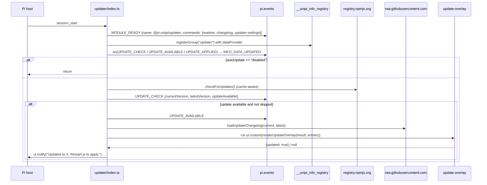
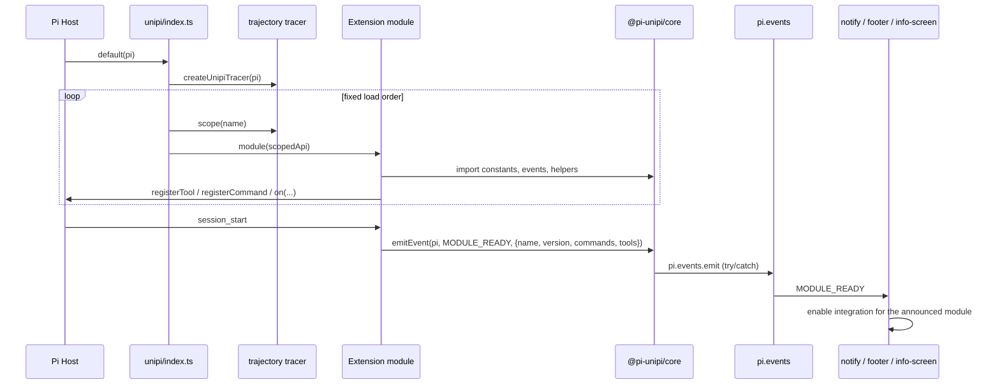

# Platform Core & Shared Infrastructure (/docs/deep-exploration/platform-core-and-shared-infrastructure-domain)


**Project:** Unipi — extension suite for the Pi coding agent (`@pi-unipi/unipi` v2.18.1)
&#x2A;*Domain type:** Infrastructure Domain
&#x2A;*Packages covered:** `@pi-unipi/core`, `@pi-unipi/utility`, `@pi-unipi/updater`, `@pi-unipi/unipi` (umbrella entry), `scripts/`
&#x2A;*Document date:** 2026-09-16

***

## 1. Overview [#1-overview]

The Platform Core & Shared Infrastructure domain is the layer that every other Unipi package stands on. It is deliberately thin — `@pi-unipi/core` is roughly 58 KB of TypeScript with **no internal dependencies** — but it defines the contracts that let \~23 independently loadable feature packages behave as a single coherent extension suite inside the Pi host.

The domain has four sub-modules, each with a distinct responsibility:

| Sub-module                           | Package / path                                                                                      | Responsibility                                                                                                                                                                                          |
| ------------------------------------ | --------------------------------------------------------------------------------------------------- | ------------------------------------------------------------------------------------------------------------------------------------------------------------------------------------------------------- |
| **Core Contracts & Event Bus**       | `packages/core`                                                                                     | Constants, typed event names and payloads, sandbox primitives, TUI overlay/width helpers, spinner widget, model cache, fusion status slot, bounded output, shared filesystem/version utilities          |
| **Utility, Lifecycle & Diagnostics** | `packages/utility`                                                                                  | Process lifecycle manager, stale-file cleanup, diagnostics engine, analytics collector, provider prefix-cache observability, skill discovery gate, `ctx_env` / `set_session_name` tools, name-badge TUI |
| **Updater**                          | `packages/updater`                                                                                  | npm registry version check, cached check state, changelog parsing (local and remote), update installer, README/changelog/settings overlays                                                              |
| **Umbrella Entry & Build**           | `packages/unipi/index.ts`, `scripts/build-bundle.mjs`, `scripts/sync-pins.mjs`, root `package.json` | Composition root that loads every module in a fixed order under a trajectory tracer; esbuild bundling with secret scanning; workspace version pin synchronisation                                       |

The design intent, visible throughout the code comments, is: &#x2A;*one shared kernel, three loosely-coupled integration channels (typed events, `Symbol.for` globals, `globalThis.__unipi_*` registries), fail-soft behaviour everywhere, and startup performance as a first-class constraint.**

```mermaid
%% litho-mermaid
graph TD
  A[Platform Core & Shared Infrastructure] --> B[Core Contracts & Event Bus]
  A --> C[Utility, Lifecycle & Diagnostics]
  A --> D[Updater]
  A --> E[Umbrella Entry & Build]
  B --> B1[events.ts]
  B --> B2[constants.ts]
  B --> B3[sandbox.ts]
  B --> B4[tui-overlay.ts / tui-width.ts / spinner-line.ts]
  B --> B5[model-cache.ts / fusion-status.ts]
  B --> B6[bounded-output.ts]
  B --> B7[utils.ts / global-types.ts / global.d.ts]
  C --> C1[lifecycle/process.ts]
  C --> C2[lifecycle/cleanup.ts]
  C --> C3[diagnostics/engine.ts]
  C --> C4[analytics/collector.ts]
  C --> C5[prefix-cache.ts]
  C --> C6[skill-discovery.ts]
  C --> C7[tools/env.ts]
  D --> D1[checker.ts / cache.ts / settings.ts]
  D --> D2[installer.ts]
  D --> D3[changelog.ts / remote-changelog.ts]
  D --> D4[tui/update-overlay.ts]
  E --> E1[packages/unipi/index.ts]
  E --> E2[scripts/build-bundle.mjs]
  E --> E3[scripts/sync-pins.mjs]
```



***

## 2. Core Contracts & Event Bus (`@pi-unipi/core`) [#2-core-contracts--event-bus-pi-unipicore]

### 2.1 Package shape [#21-package-shape]

`packages/core/index.ts` is a pure barrel that re-exports ten modules:

```ts
export * from "./constants.js";
export * from "./events.js";
export * from "./sandbox.js";
export * from "./utils.js";
export * from "./model-cache.js";
export * from "./tui-width.js";
export * from "./tui-overlay.js";
export * from "./bounded-output.js";
export * from "./spinner-line.js";
export * from "./fusion-status.js";
```

The package manifest declares **only peer dependencies** (`@earendil-works/pi-coding-agent`, `@earendil-works/pi-tui`, `typebox`, all `^0.84.0` / `^1.1.38`) and an empty `pi.extensions` array — core registers nothing with the host itself; it is a library, not an extension. `global-types.ts` and `global.d.ts` are type-only and are consumed via TypeScript's global augmentation rather than the barrel.

### 2.2 Constants (`constants.ts`) [#22-constants-constantsts]

`constants.ts` is the single source of naming truth for the whole suite. It groups `as const` objects per module so that command names, tool names, directory paths and defaults are never hard-coded in feature packages.

Key groups:

| Constant                                                                                                                                  | Purpose                                                  | Notable values                                                                                                                                                        |
| ----------------------------------------------------------------------------------------------------------------------------------------- | -------------------------------------------------------- | --------------------------------------------------------------------------------------------------------------------------------------------------------------------- |
| `UNIPI_PREFIX`                                                                                                                            | Prefix for every slash command                           | `"unipi:"` → commands surface as `/unipi:<name>`                                                                                                                      |
| `UNIPI_SETTINGS_KEY`                                                                                                                      | Key inside Pi's `settings.json`                          | `"unipi"`                                                                                                                                                             |
| `MODULES`                                                                                                                                 | Canonical npm names used in `MODULE_READY` payloads      | `@pi-unipi/core`, `@pi-unipi/workflow`, …                                                                                                                             |
| `UNIPI_DIRS`                                                                                                                              | Project-local state layout                               | `.unipi`, `.unipi/docs/{specs,plans,generated,reviews,debug,fix,quick-work,chore}`, `.unipi/memory`                                                                   |
| `WORKFLOW_COMMANDS`, `RALPH_COMMANDS`, `MEMORY_COMMANDS`, `UTILITY_COMMANDS`, `MCP_COMMANDS`, `COMPACTOR_COMMANDS`, `UPDATER_COMMANDS`, … | Per-module command vocabularies                          | e.g. `UPDATER_COMMANDS = { README, CHANGELOG, UPDATER_SETTINGS }`                                                                                                     |
| `*_TOOLS`                                                                                                                                 | Per-module tool names                                    | `UTILITY_TOOLS = { CONTINUE: "continue_task", BATCH: "ctx_batch", ENV: "ctx_env", SET_SESSION_NAME: "set_session_name" }`                                             |
| `*_DIRS`                                                                                                                                  | Global (`~/.unipi/...`) and project (`.unipi/...`) paths | `UPDATER_DIRS = { CONFIG: "~/.unipi/config/updater", CACHE: "~/.unipi/cache/updater" }`                                                                               |
| `*_DEFAULTS`                                                                                                                              | Tunables                                                 | `MCP_DEFAULTS.MAX_MODEL_OUTPUT_BYTES = 64 KiB`, `COMPACTOR_DEFAULTS.SESSION_TTL_DAYS = 7`, `KANBOARD_DEFAULTS.PORT = 8165`                                            |
| `COMPACTOR_INSTRUCTION`                                                                                                                   | Sentinel string `"__compactor__"`                        | When passed as `customInstructions` to `ctx.compact()`, the compactor recognises it and runs its zero-LLM pipeline — a cross-package protocol expressed as a constant |
| `RALPH_COMPLETE_MARKER`                                                                                                                   | `"<promise>COMPLETE</promise>"`                          | Completion marker for autonomous loops                                                                                                                                |

> **Known drift.** `MODULES` still lists phantom packages (`REGISTRY`, `TASK`, `IMPECCABLE`, `SETTINGS`) and lacks `BACKGROUND_TASKS`, `FUSION`, `TRAJECTORY` and `COMMAND_ENCHANTMENT`. The updater's `readme.ts` builds its `PACKAGE_MAP` from `MODULES`, so this staleness leaks into the README browser. Reconciling the constant with the actual workspace is a recommended maintenance item.

### 2.3 Event contract (`events.ts`) [#23-event-contract-eventsts]

`events.ts` defines the **typed inter-module event bus** that rides on the host's `pi.events` emitter. It contains two things: an `UNIPI_EVENTS` name map and one payload interface per event, unioned into `UnipiEventPayload`.

Event families (all names are namespaced `unipi:<module>:<verb>`):

| Family      | Events                                                                                                             | Payload interface                                                                                                                               |
| ----------- | ------------------------------------------------------------------------------------------------------------------ | ----------------------------------------------------------------------------------------------------------------------------------------------- |
| Discovery   | `MODULE_READY` (`unipi:module:ready`)                                                                              | `UnipiModuleEvent { name, version, commands[], tools[], loadTimeMs? }`                                                                          |
| Workflow    | `WORKFLOW_START`, `WORKFLOW_END`                                                                                   | `UnipiWorkflowEvent { command, fullCommand, args, success?, durationMs? }`                                                                      |
| Ralph       | `RALPH_LOOP_START`, `RALPH_LOOP_END`, `RALPH_ITERATION_DONE`                                                       | `UnipiRalphLoopEvent`, `UnipiRalphIterationEvent`                                                                                               |
| Info screen | `INFO_GROUP_REGISTERED`, `INFO_DATA_UPDATED`                                                                       | `UnipiInfoGroupEvent`, `UnipiInfoDataEvent`                                                                                                     |
| Memory      | `MEMORY_STORED`, `MEMORY_DELETED`, `MEMORY_CONSOLIDATED`                                                           | `UnipiMemoryStoredEvent`, …                                                                                                                     |
| MCP         | `MCP_SERVER_STARTED/STOPPED/ERROR`, `MCP_TOOLS_REGISTERED/UNREGISTERED`, `MCP_CATALOG_SYNCED`                      | `UnipiMcpServerEvent`, `UnipiMcpToolsEvent`, `UnipiMcpCatalogSyncedEvent`                                                                       |
| Compactor   | `COMPACTOR_COMPACTED`, `COMPACTOR_STATS_UPDATED&#x60; (&#x2A;*`@deprecated`** — footer reads live Pi session data) | `UnipiCompactionEvent { sessionId, summarized, kept, tokensSaved, compressionRatio }`                                                           |
| Utility     | `UTILITY_CLEANUP_DONE`, `UTILITY_DIAGNOSTICS_START/DONE`                                                           | `UnipiUtilityCleanupEvent`, `UnipiUtilityDiagnosticsEvent`                                                                                      |
| Notify      | `NOTIFICATION_SENT`                                                                                                | `UnipiNotificationSentEvent { eventType, platforms[], success, suppressedPlatforms?, timestamp }`                                               |
| Badge       | `BADGE_GENERATE_REQUEST`                                                                                           | `UnipiBadgeGenerateRequestEvent { source, conversationSummary? }`                                                                               |
| Ask-user    | `ASK_USER_PROMPT`                                                                                                  | `UnipiAskUserPromptEvent { question, context?, optionCount?, allowMultiple?, allowFreeform? }`                                                  |
| Updater     | `UPDATE_CHECK`, `UPDATE_AVAILABLE`, `UPDATE_APPLIED`, `UPDATE_ERROR`                                               | `UnipiUpdateCheckEvent`, `UnipiUpdateAvailableEvent`, `UnipiUpdateAppliedEvent`, `UnipiUpdateErrorEvent { error, phase: "check" \| "install" }` |

**How `MODULE_READY` drives discovery.** Every package emits `MODULE_READY` on `session_start` with its name, version and registered commands/tools (see `utility/src/index.ts` and `updater/src/index.ts` for canonical examples). Consumers such as `notify` and `footer` subscribe to this event and light up integrations only for modules that actually announced themselves. This is what allows packages to be removed or disabled without breaking peers — there are no compile-time imports between feature modules for this purpose.

**Emission helper.** `utils.ts#emitEvent(pi, name, payload)` wraps `pi.events.emit` in a `try/catch` and returns a boolean, so a misbehaving listener can never crash an emitter.

### 2.4 Sandbox primitives (`sandbox.ts`) [#24-sandbox-primitives-sandboxts]

The sandbox module encodes **tool access levels for workflow commands**. It is a pure data + predicate module with no host dependency.

* `SandboxLevel = "read_only" | "brainstorm" | "write_unipi" | "review" | "full"`
* `BLOCKED_TOOLS` — tools removed at each level:
  * `read_only` → `write`, `edit`, `bash`
  * `brainstorm` → `edit`
  * `write_unipi` → `bash`
  * `review`, `full` → nothing
* `FALLBACK_TOOLS` — legacy explicit allow-lists used only when no active tool list is supplied.
* `COMMAND_SANDBOX` — maps each `WORKFLOW_COMMANDS` entry to a level (e.g. `brainstorm → "brainstorm"`, `plan → "write_unipi"`, `work → "full"`, `review-work → "review"`, `consultant`/`research`/`debug`/`scan-issues` → `"read_only"`).

Public API: `getSandboxLevel(cmd)`, `getBlockedToolsForLevel(level)`, `filterToolsForLevel(level, activeTools)`, `getToolsForCommand(cmd, activeTools?)`, `isToolAllowed(level, tool)`, `hasWriteAccess(cmd)`, `hasBashAccess(cmd)`.

An important design note in the file header: the workflow package **enforces blocked names at `tool_call` time rather than mutating Pi's tool schemas**, "so provider tool schemas and ordering remain stable". This keeps the provider-side prompt prefix cache intact (see §3.5) — the sandbox is a call-time gate, not a schema rewrite. `filterToolsForLevel` deliberately subtracts only violating tools, preserving safe extension tools such as `memory_search`, `ask_user` and web tools.

### 2.5 TUI helpers [#25-tui-helpers]

Three modules exist to make terminal rendering safe and consistent across the 9+ overlay implementations in the suite.

**`tui-width.ts` — width invariants.** pi-tui's differential renderer throws (and writes `~/.pi/agent/pi-crash.log`) when any rendered line is wider than the terminal. The module encodes the invariant `visibleWidth(line) <= width` as pure arithmetic:

* `normalizeWidth(w)` — guards against `0`, negative, `NaN` and fractional widths observed during resize races.
* `MIN_BORDERED_WIDTH = 12`, `shouldRenderBorder(w)`, `boxInnerWidth(w)` (= width − 2), `adaptiveInnerWidth(w)` (drop borders on narrow terminals), `contentWidth(available, reserved)`.
* `safeRepeat(char, n)` / `safeRepeatCount(n)` — `String.prototype.repeat` throws on negative counts; these never do.
* `WidthKeyedCache` — a render cache keyed on width, because `requestRender()` does not call `invalidate()` and a cache that ignores width returns stale over-wide lines after the terminal narrows.
* Shared `ansi` escape table and `TOGGLE_ON` / `TOGGLE_OFF` glyphs for settings overlays.

**`tui-overlay.ts` — box drawing and theming.** `OverlayTheme` wraps an optional Pi `Theme` and falls back to raw ANSI when none is set. It supplies `fg`, `bold`, `bg`, `frameLine(content, innerWidth)` (│ … │ padded and truncated), `ruleLine` (├───┤) and `borderLine(innerWidth, "top" | "bottom")`. `frameOverlay(body, width, options)` wraps pre-rendered lines in an **opaque** rounded frame — every row is padded to full inner width and tinted with a background so the transcript cannot bleed through the overlay (Pi's compositor only paints cells a component returns).

**`spinner-line.ts` — self-animating widget.** `createSpinnerLine({ text, colorSpinner?, frames?, intervalMs?, padLeft? })` returns a factory for `ctx.ui.setWidget()`. The component owns a `setInterval` (default 80 ms, braille frames) and calls `tui.requestRender()` each tick, stopping on `dispose()`. Returning `undefined` from `text()` collapses the line without disposing. This pattern lets slow-refreshing data (1 s task polls) still show a live spinner.

### 2.6 Shared state slots [#26-shared-state-slots]

Core hosts two kinds of process-wide state, chosen deliberately for synchronous hot-path reads that an async event bus cannot serve well.

**`fusion-status.ts` — `Symbol.for` slot.** The fusion package owns the active lead/sidekick pair; the footer owns the frame that displays it. Rather than importing each other, both use a `Symbol.for("unipi.fusion.status")` key on `globalThis`:

```ts
export interface SharedFusionStatus {
  leadName; leadEffort; sidekickName; sidekickEffort;
  savedUsd?; busy?; leadToolCalls?; sidekickToolCalls?;
}
setSharedFusionStatus(status | undefined); getSharedFusionStatus();
```

The header comment states this follows "the same pattern as background-tasks' shared registry". `Symbol.for` (rather than a plain property) is used so the singleton survives duplicate `node_modules` copies of the package.

**`global-types.ts` + `global.d.ts` — string-keyed registries.** The older variant declares `globalThis.__unipi_info_registry`, `__unipi_footer_registry`, `__unipi_kanboard_registry` and `__unipi_mcp_stats`, with minimal structural interfaces (`InfoRegistryLike`, `FooterRegistryLike`, `McpStatsLike`) so consumers avoid `as any`. The updater, for example, calls `globalThis.__unipi_info_registry?.registerGroup(...)` to add an "Updater" group to the info screen.

**`model-cache.ts` — file-backed registry snapshot.** `writeModelCache(models)` / `readModelCache()` persist `{ updatedAt, models: [{ provider, id, name? }] }` to `~/.unipi/config/models-cache.json` (resolved at call time so `HOME` changes are honoured). The utility package writes this on `session_start` from `ctx.modelRegistry`, enabling TUI pickers in other packages to list models without a live registry handle. Both operations are best-effort and never throw.

### 2.7 Bounded output (`bounded-output.ts`) [#27-bounded-output-bounded-outputts]

`boundModelOutput(text, { maxBytes?, artifactPrefix?, artifactDir? })` implements the suite's policy that **the agent's context window is the scarcest resource**:

1. If `originalBytes <= maxBytes` (default `DEFAULT_MODEL_OUTPUT_BYTES = 64 KiB`, floor 1 KiB), return unchanged.
2. Otherwise, if the text is at most `MAX_RAW_ARTIFACT_BYTES = 16 MiB`, write the complete text to a **private artifact** under `~/.unipi/tool-results/` (directory created `0o700`, refused if it is a symlink or group/world-accessible; file written `0o600` with `flag: "wx"` and a random UUID name).
3. Build a marker block (`--- output bounded by UniPi ---`, artifact path or warning, sizes, and a hint to use the `read` tool with offset/limit).
4. Keep a **75 % head / 25 % tail** split of the remaining budget, insert an `… N bytes omitted …` line, and byte-slice to guarantee the result never exceeds `maxBytes`. Slicing is UTF-8 aware and strips trailing replacement characters.

The returned `BoundedOutput { text, truncated, originalBytes, visibleBytes, artifactPath? }` is used by MCP tool proxies, helper result packages and other large-output producers. The utility cleanup job (§3.2) later reaps these artifacts (`tool-result-*`, `mcp-*`, `helper-*`) after the temp retention period.

### 2.8 Shared utilities (`utils.ts`) [#28-shared-utilities-utilsts]

Small, defensive helpers used across the suite:

* Filesystem: `sanitize`, `ensureDir`, `tryDelete`, `tryRead`, `safeMtimeMs`, `tryRemoveDir`, `resolvePath`, `fileExists`, `writeFile`, `readJson<T>`, `writeJson`.
* Misc: `randomId`, `now`, `parseArgs` (quote-aware tokeniser), `formatTokens` (1234 → `1.2k`, 1.5 M → `1.5M`), `isActiveSnapshot`.
* Package resolution: `getPackageVersion(dir)`, `findPackageRoot(startDir, packageName, maxSteps = 10)` (walks up, and also probes sibling `node_modules/<name>`), `getInstalledPackageVersion`.
* `getPiVersion()` — resolves the host version by `realpath`-ing `process.argv[1]` and walking up to `@earendil-works/pi-coding-agent`'s `package.json`. It is cached per process and **never spawns a subprocess**; the comment records that the previous `execSync("pi --version")` cost \~350 ms per call.
* `initUnipiDirs(cwd)` — creates the standard `.unipi/**` project layout; intended to be called on `session_start`.
* `emitEvent` — safe emitter (see §2.3).
* `withHerdrBlocked(pi, label, fn)` — emits `herdr:blocked { active: true, label }` before awaiting a blocking UI and `{ active: false }` after (including on throw), so an external "herdr" integration can show *blocked* rather than *working*.
* `compareVersions(a, b)` / `isNewerVersion(latest, current)` — semver-ish comparison (strips `v`, splits on `.`/`-`, first three numeric parts). The updater re-exports these from `version.ts` for backward compatibility.

***

## 3. Utility, Lifecycle & Diagnostics (`@pi-unipi/utility`) [#3-utility-lifecycle--diagnostics-pi-unipiutility]

The utility package is itself a Pi extension (`packages/utility/src/index.ts`) that bundles cross-cutting operational concerns. It registers thirteen `/unipi:*` commands (`continue`, `reload`, `status`, `cleanup`, `env`, `doctor`, `badge-name`, `badge-gen`, `badge-toggle`, `badge-settings`, `util-settings`, `prefix-cache`, `skills-settings`) and three tools (`ctx_batch`, `ctx_env`, `set_session_name`).

### 3.1 Process lifecycle (`lifecycle/process.ts`) [#31-process-lifecycle-lifecycleprocessts]

`ProcessLifecycle` is a global singleton (`getLifecycle()`, `disposeLifecycle()`) with a small state machine `running → shutting_down → error` plus an `orphaned` branch.

* **Orphan detection.** Records `process.ppid` at construction and polls every 30 s (`unref`'d timer) with `process.kill(ppid, 0)`. If the parent has vanished, state becomes `orphaned` and `shutdown("orphaned")` runs.
* **Signal handling.** Installs one-shot `SIGTERM` / `SIGINT` handlers that run shutdown and then `process.exit(0)`.
* **Cleanup registry.** `registerCleanup(fn)` returns an unregister closure; `shutdown(reason)` drains all callbacks best-effort (one failure does not stop the others). The extension registers analytics disable here, and calls `lifecycle.shutdown("session_shutdown")` on the Pi `session_shutdown` hook.

### 3.2 Stale cleanup (`lifecycle/cleanup.ts`) [#32-stale-cleanup-lifecyclecleanupts]

`cleanupStale(options)` runs five category scanners and returns a `CleanupReport { timestamp, results[], totalRemoved, totalBytesFreed }`:

| Category       | Target                                                          | Rule                                                                                                                                   |
| -------------- | --------------------------------------------------------------- | -------------------------------------------------------------------------------------------------------------------------------------- |
| `db`           | `*.db`, `*.sqlite`, `*.sqlite3` under `~/.unipi/` (recursive)   | Older than `dbMaxAgeDays` (14) **or** has a WAL file older than 5 min (zombie lock); companions `-wal`, `-shm`, `-journal` removed too |
| `temp`         | OS tmpdir entries matching `^unipi-`, `^pi-`, `\.unipi\.`       | Older than `tempMaxAgeDays` (7)                                                                                                        |
| `tool-results` | `~/.unipi/tool-results/(tool-result\|mcp-*\|helper)-<uuid>.txt` | Older than `tempMaxAgeDays` — reaps bounded-output artifacts                                                                           |
| `session`      | Directories under `~/.unipi/sessions`                           | Older than `sessionMaxAgeDays` (30)                                                                                                    |
| `cache`        | Files under `~/.unipi/cache`                                    | Older than `tempMaxAgeDays`                                                                                                            |

`dryRun: true` counts without deleting. `formatCleanupReport` renders markdown (first 10 paths per category). The `/unipi:cleanup` command wires this up and emits `UTILITY_CLEANUP_DONE`.

### 3.3 Diagnostics engine (`diagnostics/engine.ts`) [#33-diagnostics-engine-diagnosticsenginets]

A plugin-based health checker. `registerDiagnosticPlugin(plugin)` appends to an in-memory plugin list; `runDiagnostics()` executes every plugin (isolating failures as `<plugin>_error` checks), aggregates counts, and derives `overall` as `error > warning > healthy > unknown`.

Built-in plugins (all attributed to `@pi-unipi/core`):

* `core_directories` — `~/.unipi` (required), `~/.unipi/memory`, `~/.unipi/cache`, `~/.unipi/analytics` (optional); checks existence and writability, with `mkdir -p` / `chmod u+w` suggestions.
* `config_files` — validates `~/.unipi/config/mcp/servers.json` and `.unipi/config/mcp/servers.json` parse as JSON.
* `node_environment` — Node ≥ 18 check and heap usage (> 512 MB → warning).

`formatDiagnosticsReport` groups results errors-first in markdown. Exposed via `/unipi:doctor` with `UTILITY_DIAGNOSTICS_START/DONE` events.

### 3.4 Analytics collector (`analytics/collector.ts`) [#34-analytics-collector-analyticscollectorts]

`AnalyticsCollector` (singleton via `getAnalyticsCollector()`) keeps an **in-memory** ring of `AnalyticsEvent { id, type, timestamp, metadata }` with types `module_load | command_run | tool_call | error | compaction | search`. Typed helpers: `recordCommand`, `recordTool`, `recordError`, `recordModuleLoad`, `recordSearch`. `getRollup(date?)` computes a per-day `AnalyticsRollup`. Metadata passes through `sanitizeMetadata`, which redacts sensitive keys; `flush()` runs every 60 s and on buffer-full but currently only trims to `maxEvents` (10 000) — the SQLite persistence is an explicit `TODO`. The `dbPath` default `~/.unipi/analytics/events.db` is reserved for that future.

### 3.5 Provider prefix-cache observability (`prefix-cache.ts`) [#35-provider-prefix-cache-observability-prefix-cachets]

`PrefixCacheTracker` answers the operational question "is my provider prompt-prefix cache being invalidated?" without ever retaining prompts.

* Each request payload observed via the `before_provider_request` hook is **canonicalised** (sorted keys, cycle-safe, bigint/NaN/bytes tagged) and fingerprinted with an **HMAC-SHA256 under a random per-session 32-byte key** (first 16 hex chars kept). The key is never persisted, so fingerprints cannot be correlated across processes or used as a dictionary oracle.
* The sequence field (`messages` | `input` | `contents`) is fingerprinted item-by-item; everything else plus the model route (`provider/id/api`) forms the *envelope*.
* Transitions are classified as `first_request`, `prefix_extended`, `identical_retry`, `envelope_changed`, `payload_shape_changed` or `history_rewritten`; boundary transitions bump an `epoch` counter.
* `observeMessages` (on `agent_end`) accumulates `input/output/cacheRead/cacheWrite` usage from assistant messages, deduplicating by object identity because `agent_end` re-exposes the whole context.
* `markBoundary(...)` is invoked from `model_select`, `thinking_level_select`, `session_compact` and `session_tree` hooks so lifecycle-driven boundaries are attributed correctly before the next payload arrives.

`formatPrefixCacheStats` renders the snapshot for `/unipi:prefix-cache`, including observed cache-read share. The tracker is reset on `session_start`.

### 3.6 Skill discovery gate (`skill-discovery.ts`) [#36-skill-discovery-gate-skill-discoveryts]

Controls the `unipi.skills.discovery` flag in Pi's `settings.json` (`$PI_AGENT_DIR` or `~/.pi/agent`). When disabled, the `before_agent_start` hook strips Unipi's bundled skills from the `<available_skills>…</available_skills> ` block of the system prompt every turn — user skills stay listed and `/skill:name` invocation is unaffected because Pi reads `SKILL.md` directly. Applying the filter consistently per turn keeps the provider prefix cache stable.

### 3.7 Environment tool (`tools/env.ts`) and info-screen integration [#37-environment-tool-toolsenvts-and-info-screen-integration]

`getEnvironmentInfo()` collects Node version, `getPiVersion()`, OS/arch, installed `@pi-unipi/*` modules discovered from `node_modules/@pi-unipi`, config paths (`~/.unipi/config`, `.unipi/config`) and `~/.pi`. `formatEnvironmentInfo` renders a markdown table. This backs both the `ctx_env` tool and `/unipi:env`.

`info-screen.ts` emits `INFO_GROUP_REGISTERED` for a `utility` group and exposes `getUtilityStats()` (uptime, lifecycle state, orphan flag, today's event/error counts).

### 3.8 Extension entry behaviour (`src/index.ts`) [#38-extension-entry-behaviour-srcindexts]

On load the entry initialises lifecycle, analytics and the prefix tracker, registers commands and tools, and wires hooks. On `session_start` it emits `MODULE_READY` for `MODULES.UTILITY`, records a `module_load` analytics event, restores/shows the name badge, and **writes the model cache** from `ctx.modelRegistry`. A first-message/`agent_end` pair captures a ≤ 800-char conversation summary and emits `BADGE_GENERATE_REQUEST` so a background agent (in another package) can propose a session name. The `set_session_name` tool is registered only when `badgeSettings.agentTool` is enabled — an example of the suite's config-gated tool registration.

***

## 4. Updater (`@pi-unipi/updater`) [#4-updater-pi-unipiupdater]

### 4.1 Responsibilities and commands [#41-responsibilities-and-commands]

The updater keeps the umbrella package current and doubles as a documentation browser. It registers:

* `/unipi:readme [package]` — README browser over the root and per-package READMEs (`readme.ts` discovers them via `findPackageRoot(…, "@pi-unipi/unipi")` and `node_modules/@pi-unipi/<name>/README.md`).
* `/unipi:changelog` — Keep-a-Changelog browser.
* `/unipi:updater-settings` — check interval and auto-update mode editor.

All three open `ctx.ui.custom(...)` overlays with `width: "80%"`, `minWidth: 60`, centered.

### 4.2 Configuration and cache [#42-configuration-and-cache]

* `settings.ts` — `UpdaterConfig { checkIntervalMs, autoUpdate: "disabled" | "notify" | "auto" }` stored at `~/.unipi/config/updater/config.json`. Defaults: 1 h interval, `notify`. Valid intervals: 30 min, 1 h, 6 h, 1 d. Load failures fall back to defaults silently.
* `cache.ts` — `LastCheckCache { lastCheck, latestVersion, skippedVersion? }` at `~/.unipi/cache/updater/last-check.json`, with `isCheckDue(intervalMs)`, `writeSkippedVersion`, `isVersionSkipped`.

### 4.3 Update check (`checker.ts`) [#43-update-check-checkerts]

`checkForUpdates()` resolves the installed `@pi-unipi/unipi` version by walking up from the updater's own location, then:

1. If a cache exists and the interval has not elapsed, return the cached answer — **unless** the cached npm version is older than the installed version (which happens right after a local/source release), in which case the interval is ignored and a fresh fetch is forced.
2. `fetch("https://registry.npmjs.org/@pi-unipi/unipi")` with a 10 s `AbortSignal.timeout`, read `dist-tags.latest`, write the cache.
3. `toUpdateResult` uses `isNewerVersion`, so a stale or downgraded registry state is never reported as an update.
4. On network error, return cached info (still guarded against downgrades) plus an `error` string.

### 4.4 Session-start flow (`src/index.ts`) [#44-session-start-flow-srcindexts]



Any failure in the check path is swallowed ("silent, non-critical"), consistent with the suite's fail-soft principle.

### 4.5 Changelog handling [#45-changelog-handling]

* `changelog.ts` — `resolveChangelogPath()` locates the shipped `CHANGELOG.md` from the module's own location (not `process.cwd()`, which only worked inside a repo checkout), falling back to the working directory. `parseChangelogContent` parses `## [x.y.z] — YYYY-MM-DD` / `## [Unreleased]` headers and `### Section` blocks into `ChangelogEntry { version, date, sections, body }`. `getNewerVersions(entries, current)` filters by `isNewerVersion`.
* `remote-changelog.ts` — `fetchRemoteChangelog(version)` fetches `https://raw.githubusercontent.com/Neuron-Mr-White/unipi/v<version>/CHANGELOG.md` (5 s timeout), falling back to `main` on 404. Only the immutable tag response is cached (`~/.unipi/cache/updater/changelog-<version>.md`); the `main` fallback is never cached. `loadUpdateChangelog` prefers remote entries newer than the current version, falling back to the local changelog.

### 4.6 Installer and overlay [#46-installer-and-overlay]

* `installer.ts` — `installUpdate()` runs `pi install npm:@pi-unipi/unipi` via promisified `child_process.exec` with a 60 s timeout, then re-reads the installed version. Errors surface `stderr` when present.
* `tui/update-overlay.ts` — renders the version diff and wrapped changelog entries (using `boxInnerWidth` from core and `renderMarkdown`), supports scrolling, `[Y] Update / [n] Skip`, and in `auto` mode a 5-second countdown that triggers `installUpdate()` unless cancelled. Skipping records the version so the prompt does not reappear for it.

***

## 5. Umbrella Entry & Build [#5-umbrella-entry--build]

### 5.1 Composition root (`packages/unipi/index.ts`) [#51-composition-root-packagesunipiindexts]

The umbrella is a single default-exported `ExtensionAPI` function — "the oh-my-zsh for pi". It creates a trajectory tracer and loads every module through `tracer.scope(name)`, which returns a proxied `ExtensionAPI` that fingerprints hook inputs/outputs so context mutations can be attributed per package.

Verified load order:

```
workflow → ralph → memory → utility → info-screen → subagents → background-tasks →
btw → web-api → ask-user → mcp → notify → milestone → kanboard →
command-enchantment → compactor → footer → updater → input-shortcuts → image → fusion
→ trajectory(pi, { traceRecorder })
```

Two facts about this list are architecturally significant:

1. **Order is load-bearing.** The inline comment explains that `utility` must precede `info-screen`: the name-badge overlay must sit at the *bottom* of the overlay stack because `hideOverlay()` pops the top entry and a capturing overlay's `done()` is one-shot; stacking the badge above the boot info-screen would strand the dashboard uncloseable. Nothing enforces this beyond the comment.
2. **Trajectory is cross-cutting.** It is loaded last with the plain (unscoped) `pi` and the shared recorder, so it observes every other module rather than being a peer feature.

### 5.2 Bundling (`scripts/build-bundle.mjs`) [#52-bundling-scriptsbuild-bundlemjs]

Pi runs extensions through jiti with `moduleCache: false`, so transpiling \~577 `.ts` files costs \~1 s per startup. The build script produces `packages/unipi/bundled.js` (ESM, `platform: node`, `target: node22`) and cuts that to \~80 ms. Two safeguards shape the output:

* **Externalise everything that is not ours.** An esbuild `onResolve` plugin bundles only relative imports and `@pi-unipi/*`; all third-party packages remain external and resolve from `node_modules` at runtime. The comment records that an earlier attempt inlined `node_modules` wholesale, which is why the bundle was gitignored as potentially carrying vendored credentials.
* **Secret scan.** After emitting, the script greps the bundle for `sk-…`, `ghp_…`, `AKIA…`, `Bearer …` and `apiKey/secret/password = "…"` patterns and refuses to ship on a match.

`--if-missing` (used by the `prepare` hook) builds only when the bundle is absent and never fails an install if esbuild is unavailable — published tarballs already contain the bundle and no devDependencies.

### 5.3 Root manifest and version pinning [#53-root-manifest-and-version-pinning]

The root `package.json` (`@pi-unipi/unipi` 2.18.1) declares npm workspaces (`packages/*`), points `pi.extensions` at `packages/unipi/bundled.js`, enumerates per-package `skills/` directories under `pi.skills`, exposes `packages/subagents/prompts` as `pi.prompts`, and pins every `@pi-unipi/*` dependency to an exact version. Scripts: `build`, `prepare` (`--if-missing`), `prepublishOnly`, `publish:all` (`npm publish --workspaces`), `test`, `typecheck`.

`scripts/sync-pins.mjs <x.y.z>` rewrites every `@pi-unipi/*` entry in `dependencies` and `peerDependencies` across the root and all `packages/*/package.json` files to the given version — the mechanism the release chore uses to keep exact pins consistent.

> **Drift note.** The root `files` array references `docs/prefix-cache-architecture.md`, but the `docs/` directory is empty in the repository.

***

## 6. Runtime Interactions [#6-runtime-interactions]

### 6.1 Bootstrap and discovery [#61-bootstrap-and-discovery]



### 6.2 Integration channels provided by this domain [#62-integration-channels-provided-by-this-domain]

| Channel                                | Mechanism                                                                                            | Typical use                                                | Where defined                              |
| -------------------------------------- | ---------------------------------------------------------------------------------------------------- | ---------------------------------------------------------- | ------------------------------------------ |
| ① Typed event bus                      | `UNIPI_EVENTS` + `emitEvent` over `pi.events`                                                        | Discovery, lifecycle notifications, cross-module reactions | `core/events.ts`, `core/utils.ts`          |
| ② `Symbol.for` global slot             | `globalThis[Symbol.for("unipi.fusion.status")]`                                                      | Hot-path synchronous reads (footer 1 s refresh)            | `core/fusion-status.ts`                    |
| ③ String-keyed `globalThis` registries | `__unipi_info_registry`, `__unipi_footer_registry`, `__unipi_mcp_stats`, `__unipi_kanboard_registry` | Registering groups/stats with UI aggregators               | `core/global.d.ts`, `core/global-types.ts` |
| ④ File-backed snapshot                 | `~/.unipi/config/models-cache.json`                                                                  | Model lists for TUI pickers without a registry handle      | `core/model-cache.ts`                      |
| ⑤ Constant protocols                   | `COMPACTOR_INSTRUCTION`, `RALPH_COMPLETE_MARKER`                                                     | Sentinel-based coordination without imports                | `core/constants.ts`                        |

### 6.3 On-disk state owned or governed by this domain [#63-on-disk-state-owned-or-governed-by-this-domain]

| Path                                                                                 | Owner                                 | Content                                                 |
| ------------------------------------------------------------------------------------ | ------------------------------------- | ------------------------------------------------------- |
| `.unipi/**` (project)                                                                | `initUnipiDirs`                       | docs/specs/plans/reviews, memory, quick-work, worktrees |
| `~/.unipi/config/models-cache.json`                                                  | core model cache (written by utility) | Cached model registry snapshot                          |
| `~/.unipi/tool-results/*.txt`                                                        | core bounded output                   | Private (0600/0700) full-output artifacts               |
| `~/.unipi/config/updater/config.json`                                                | updater                               | Check interval, auto-update mode                        |
| `~/.unipi/cache/updater/last-check.json`, `changelog-<v>.md`                         | updater                               | Last npm check, skipped version, cached tag changelogs  |
| `~/.unipi/cache`, `~/.unipi/sessions`, `~/.unipi/analytics`, `*.db` under `~/.unipi` | utility cleanup / diagnostics         | Reaped by `/unipi:cleanup`, checked by `/unipi:doctor`  |

***

## 7. Design Principles Observed [#7-design-principles-observed]

* **Small kernel, no internal dependencies.** Core has only peer dependencies on the host libraries; every other package depends on core and (with one exception, `footer → background-tasks`) nothing else internal. The blast radius of most changes is one package.
* **Fail-soft by default.** `emitEvent`, `readModelCache`, `writeModelCache`, `loadConfig`, `readLastCheck`, `getPiVersion`, cleanup and diagnostics all catch and degrade rather than throw. The updater swallows check failures entirely.
* **Security hygiene built into primitives.** Bounded-output artifacts enforce private directory/file modes and refuse symlinked or shared directories; the bundle build refuses to ship on secret-pattern matches; the prefix tracker keeps only keyed HMACs with an ephemeral key; analytics metadata is sanitised.
* **Startup and render performance as constraints.** Prebuilt bundle (\~1 s → \~80 ms), no-subprocess `getPiVersion`, width-keyed render caches, `unref`'d timers, and call-time sandbox enforcement that preserves the provider prefix cache.
* **Context window as the scarcest resource.** `boundModelOutput` and `MCP_DEFAULTS.MAX_MODEL_OUTPUT_BYTES` (both 64 KiB) enforce a consistent ceiling on what tools may return to the model.

***

## 8. Known Issues and Recommendations [#8-known-issues-and-recommendations]

| Priority | Item                                                                                                                                                                                                                                                                                          |
| -------- | --------------------------------------------------------------------------------------------------------------------------------------------------------------------------------------------------------------------------------------------------------------------------------------------- |
| High     | Reconcile `core/constants.ts#MODULES` with the real workspace: remove `REGISTRY`, `TASK`, `IMPECCABLE`, `SETTINGS`; add `BACKGROUND_TASKS`, `FUSION`, `TRAJECTORY`, `COMMAND_ENCHANTMENT`. The updater README browser inherits the stale map.                                                 |
| High     | Document in core the rule for choosing between the typed event bus, `Symbol.for` slots and string-keyed `globalThis` registries; consider promoting a typed accessor for the background-tasks registry into core (as done for `fusion-status`) so `footer` and `notify` read it the same way. |
| Medium   | Encode the `utility → info-screen` load-order constraint (and any others) in an ordered manifest with rationale rather than a comment in `unipi/index.ts`.                                                                                                                                    |
| Medium   | Implement the analytics `flush()` persistence (currently a `TODO`; events are memory-only and lost on exit) or remove the SQLite-oriented options to avoid misleading configuration.                                                                                                          |
| Low      | Remove or restore the `docs/prefix-cache-architecture.md` reference in the root `files` array; consider renaming `packages/autocomplete` to match its published name `@pi-unipi/command-enchantment`.                                                                                         |
| Low      | `COMPACTOR_STATS_UPDATED` is `@deprecated`; schedule its removal along with the `UnipiCompactorStatsEvent` payload once no consumers remain.                                                                                                                                                  |
