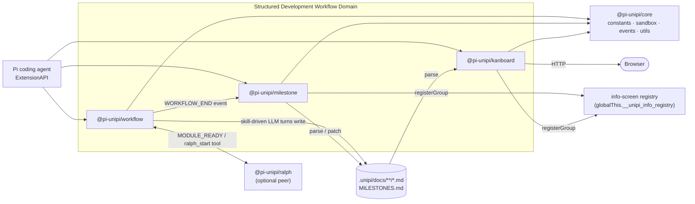
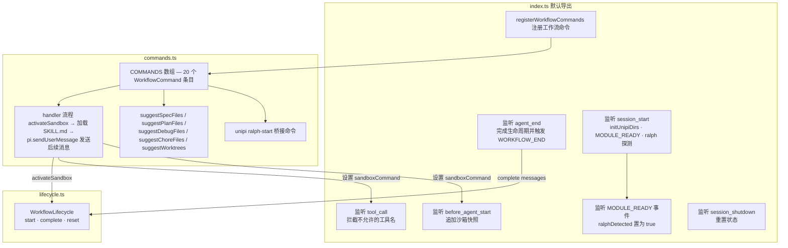
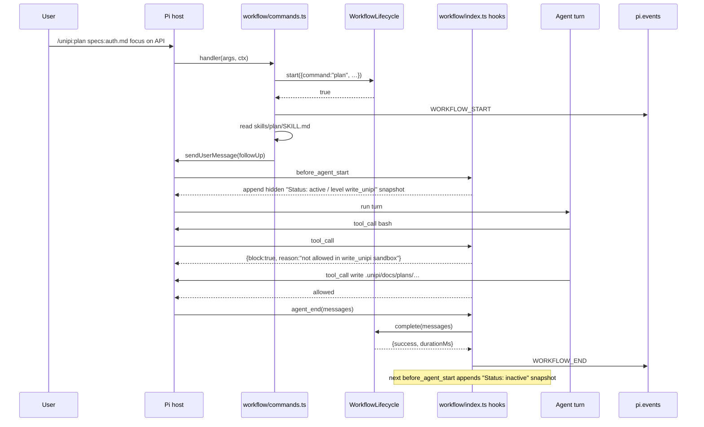
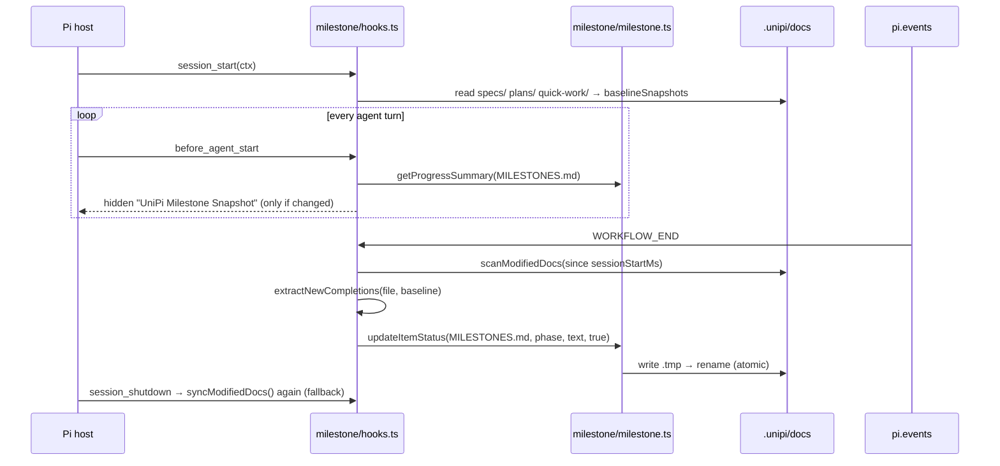
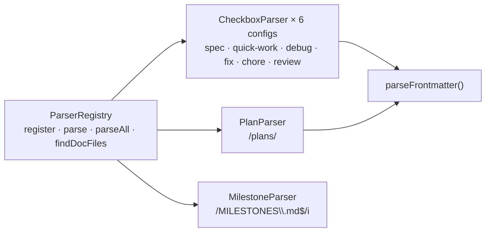
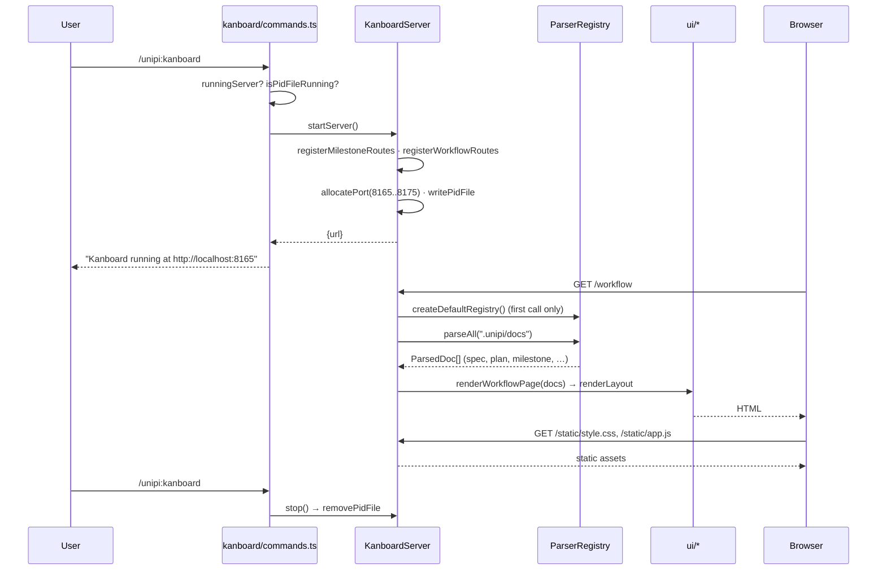
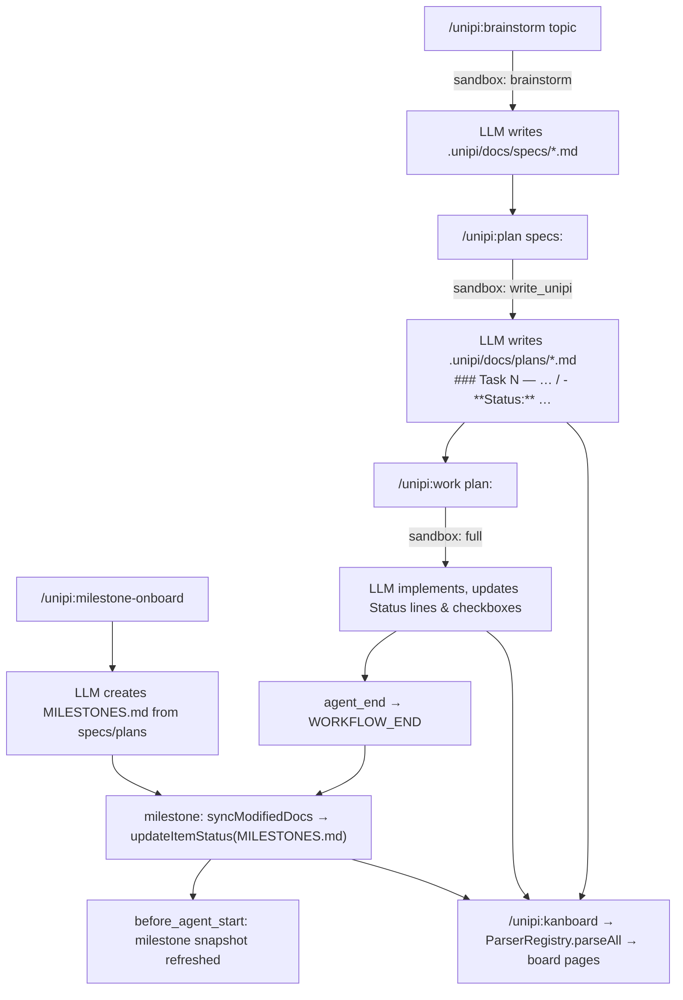

# Structured Development Workflow (/docs/deep-exploration/structured-development-workflow-domain)


## Technical Documentation — `@pi-unipi/workflow`, `@pi-unipi/milestone`, `@pi-unipi/kanboard` [#technical-documentation--pi-unipiworkflow-pi-unipimilestone-pi-unipikanboard]

***

## 1. Domain Overview [#1-domain-overview]

The Structured Development Workflow Domain is the part of Unipi that turns an open-ended coding agent into a process-driven development environment. It is implemented as three independently publishable ESM TypeScript packages (all at version `2.18.0`, `type: module`, `main: index.ts`, MIT-licensed) that load into the Pi coding agent through the standard `ExtensionAPI` contract:

| Package               | Role                                                                                                                                                                       | Primary artefacts                                                   |
| --------------------- | -------------------------------------------------------------------------------------------------------------------------------------------------------------------------- | ------------------------------------------------------------------- |
| `@pi-unipi/workflow`  | Registers twenty `/unipi:*` slash commands, maps each to a `SKILL.md` instruction file, enforces a per-command tool sandbox and tracks a single active workflow lifecycle. | `.unipi/docs/{specs,plans,reviews,debug,fix,chore,quick-work}/*.md` |
| `@pi-unipi/milestone` | Adds project-level goal tracking on top of `MILESTONES.md`, injects progress snapshots before every agent turn and auto-syncs completed checkboxes when a workflow ends.   | `.unipi/docs/MILESTONES.md`                                         |
| `@pi-unipi/kanboard`  | Provides a read-only visualisation layer: a parser registry over the markdown artefacts and an embedded HTTP server that renders milestone and workflow board pages.       | `.unipi/kanboard.pid`, HTTP on `localhost:8165–8175`                |

The unifying design principle is that **markdown files on disk are the single source of truth**. The workflow package causes the LLM to write them, the milestone package reads and patches them, and the kanboard package projects them into a browser. No package in the domain maintains a database; the only cross-package coupling is the *file format*, not code.

### 1.1 Position in the Unipi Architecture [#11-position-in-the-unipi-architecture]



All three packages declare `@pi-unipi/core` as their **only** internal dependency. The composition root (`packages/unipi/index.ts`) loads `workflow` first in its fixed sequence and `milestone` → `kanboard` later, but none of the three relies on that ordering.

***

## 2. Shared Kernel Contracts Used by the Domain [#2-shared-kernel-contracts-used-by-the-domain]

Before examining each package, it is useful to know which `@pi-unipi/core` primitives the domain consumes. They define the vocabulary the three packages share.

### 2.1 Constants (`packages/core/constants.ts`) [#21-constants-packagescoreconstantsts]

| Constant                                          | Value / purpose                                                                                                                                                                                                                                                                                    |
| ------------------------------------------------- | -------------------------------------------------------------------------------------------------------------------------------------------------------------------------------------------------------------------------------------------------------------------------------------------------- |
| `UNIPI_PREFIX`                                    | `"unipi:"` — every command is registered as `unipi:<name>`, invoked as `/unipi:<name>`.                                                                                                                                                                                                            |
| `WORKFLOW_COMMANDS`                               | Twenty command names: `brainstorm`, `plan`, `work`, `review-work`, `consolidate`, `worktree-create`, `worktree-list`, `worktree-merge`, `consultant`, `quick-work`, `gather-context`, `document`, `scan-issues`, `auto`, `debug`, `fix`, `quick-fix`, `research`, `chore-create`, `chore-execute`. |
| `MILESTONE_COMMANDS`                              | `ONBOARD: "milestone-onboard"`, `UPDATE: "milestone-update"`.                                                                                                                                                                                                                                      |
| `MILESTONE_DIRS.MILESTONES`                       | `".unipi/docs/MILESTONES.md"`.                                                                                                                                                                                                                                                                     |
| `KANBOARD_COMMANDS`                               | `KANBOARD: "kanboard"`, `KANBOARD_DOCTOR: "kanboard-doctor"`.                                                                                                                                                                                                                                      |
| `KANBOARD_DIRS.PID_FILE`                          | `".unipi/kanboard.pid"`.                                                                                                                                                                                                                                                                           |
| `KANBOARD_DEFAULTS`                               | `PORT: 8165`, `MAX_PORT: 8175`.                                                                                                                                                                                                                                                                    |
| `UNIPI_DIRS`                                      | `.unipi/docs/{specs,plans,generated,reviews,debug,fix,quick-work,chore}` etc.                                                                                                                                                                                                                      |
| `MODULES.WORKFLOW / MILESTONE / KANBOARD / RALPH` | Module identity strings used in `MODULE_READY` payloads.                                                                                                                                                                                                                                           |

### 2.2 Sandbox primitives (`packages/core/sandbox.ts`) [#22-sandbox-primitives-packagescoresandboxts]

The sandbox model is defined in core so that other packages (e.g. subagents) can reuse it, but it is *enforced* by the workflow package.

```ts
export type SandboxLevel = "read_only" | "brainstorm" | "write_unipi" | "review" | "full";
```

| Level         | Blocked tool names (`BLOCKED_TOOLS`) | Intended use                                                                  |
| ------------- | ------------------------------------ | ----------------------------------------------------------------------------- |
| `read_only`   | `write`, `edit`, `bash`              | research, consultant, gather-context, scan-issues, debug, worktree-list       |
| `brainstorm`  | `edit`                               | brainstorm (write allowed, restricted by instruction to `.unipi/docs/specs/`) |
| `write_unipi` | `bash`                               | plan, consolidate, document, chore-create                                     |
| `review`      | *(none)*                             | review-work — constraints come from the skill text                            |
| `full`        | *(none)*                             | work, auto, fix, quick-fix, quick-work, worktree-create/merge, chore-execute  |

The `COMMAND_SANDBOX` map binds every `WORKFLOW_COMMANDS` entry to a level; `getSandboxLevel(command)` falls back to `"full"` for unknown names. The key functions used at runtime are `getSandboxLevel`, `getBlockedToolsForLevel` and `isToolAllowed(level, toolName)`. Note the design comment in the file: filtering helpers (`filterToolsForLevel`, `getToolsForLevel`) remain available for other callers, but the workflow package deliberately **does not** alter Pi's active tool list — it only blocks calls by name at `tool_call` time so provider tool schemas and ordering stay cache-stable.

### 2.3 Events (`packages/core/events.ts`) [#23-events-packagescoreeventsts]

```ts
UNIPI_EVENTS.MODULE_READY    // "unipi:module:ready"
UNIPI_EVENTS.WORKFLOW_START  // "unipi:workflow:start"
UNIPI_EVENTS.WORKFLOW_END    // "unipi:workflow:end"

export interface UnipiWorkflowEvent {
  command: string;      // e.g. "brainstorm"
  fullCommand: string;  // e.g. "/unipi:brainstorm"
  args: string;
  success?: boolean;    // WORKFLOW_END only
  durationMs?: number;  // WORKFLOW_END only
}
```

`emitEvent(pi, name, payload)` in `core/utils.ts` is a try/catch wrapper around `pi.events.emit`.

### 2.4 Utility helpers (`packages/core/utils.ts`) [#24-utility-helpers-packagescoreutilsts]

* `tryRead(path)` — returns file content or `null`; used everywhere the domain reads markdown.
* `safeMtimeMs(path)` — returns mtime or `0`.
* `initUnipiDirs(cwd)` — creates the standard `.unipi/` tree on session start.
* `getPackageVersion(dir)` — reads `package.json` version.
* `isActiveSnapshot({content, details})` — returns `details.active` when boolean, otherwise checks whether the content string contains `"Status: active"`. This helper is the shared logic behind both the workflow and milestone snapshot mechanisms described below.

***

## 3. `@pi-unipi/workflow` — Workflow Commands & Sandboxes [#3-pi-unipiworkflow--workflow-commands--sandboxes]

### 3.1 File layout [#31-file-layout]

```
packages/workflow/
├── index.ts        # extension entry: hooks, sandbox enforcement, snapshots, MODULE_READY, ralph detection
├── commands.ts     # command table, tab completion, dispatch to SKILL.md
├── lifecycle.ts    # WorkflowLifecycle single-slot state machine
├── skills/<name>/SKILL.md   # one directory per workflow command (20 skills)
└── package.json    # test: npx bun test lifecycle.test.ts tests
```

### 3.2 Component diagram [#32-component-diagram]



### 3.3 Command registration and dispatch (`commands.ts`) [#33-command-registration-and-dispatch-commandsts]

The command table is a static array of `WorkflowCommand` records:

```ts
interface WorkflowCommand {
  name: string;          // WORKFLOW_COMMANDS value
  description: string;
  skillName: string;     // directory under ./skills
  argumentHint?: string; // shown in autocomplete, e.g. "plan:<file> <description>"
  ralphHint?: string;    // extra hint appended when ralph is detected (only `work` uses it)
}
```

`registerWorkflowCommands(pi, options)` iterates the table and calls `pi.registerCommand("unipi:<name>", { description, getArgumentCompletions, handler })`. The `options` object is the seam between `commands.ts` and `index.ts`:

```ts
export interface WorkflowCommandOptions {
  isRalphDetected: () => boolean;
  activateSandbox: (event: UnipiWorkflowEvent) => boolean;  // begin lifecycle + sandbox
  abortWorkflow: () => void;                                 // roll back on dispatch failure
}
```

**Handler algorithm** (identical for all twenty commands):

1. Build a `UnipiWorkflowEvent` `{ command, fullCommand: "/unipi:<name>", args }`.
2. Call `options.activateSandbox(event)`. If it returns `false&#x60; another workflow is already active; the handler notifies &#x2A;"Another UniPi workflow is still active"* and returns.
3. Read `skills/<skillName>/SKILL.md` relative to `import.meta.url`. A missing file is tolerated — the workflow proceeds without skill content.
4. Compose the user message:
   ```
   Execute the <skillName> workflow.

   Arguments: <args>              (if provided)

   💡 <ralphHint>                 (if ralphHint set and ralph detected)

   <skill_content>
   ...SKILL.md...
   </skill_content>
   ```
5. `pi.sendUserMessage(message, { deliverAs: "followUp" })`. If this throws synchronously, `options.abortWorkflow()` is called so no phantom lifecycle or sandbox is left behind, and the error is re-thrown.
6. Update the TUI: `ctx.ui.notify("Running /unipi:<name>")` and `ctx.ui.setStatus("unipi-workflow", "⚡ wf:<name> ✓ rl|○ rl")`.

The skill files themselves are the "programme" the LLM executes. For example, `skills/plan/SKILL.md` declares its own boundaries ("MAY read specs… MAY NOT edit code"), the command format `/unipi:plan specs:<path> <string(greedy)>`, the sandbox (`write` only to `.unipi/docs/`) and the output path `.unipi/docs/plans/YYYY-MM-DD-<topic>-plan.md`. This is how the workflow package produces the artefacts that the kanboard parsers later expect.

**Ralph bridge.** A twenty-first command, `/unipi:ralph-start&#x60;, is always registered. If ralph is not detected it warns &#x2A;"Ralph module not detected. Install @unipi/ralph first."*; otherwise it sends `Start a ralph loop with this task: …` as a follow-up user message, delegating to ralph's own tooling.

### 3.4 Filesystem-backed tab completion [#34-filesystem-backed-tab-completion]

`getArgumentCompletions(prefix)` returns `CompletionItem[]` (`{ value, label, description }`) or `null` for free-text commands. Completions are derived from disk, not from an index:

| Command                             | Source                          | `value` format  |
| ----------------------------------- | ------------------------------- | --------------- |
| `plan`                              | `.unipi/docs/specs/*.md`        | `specs:<file>`  |
| `work`, `review-work`, `auto`       | `.unipi/docs/plans/*.md`        | `plan:<file>`   |
| `fix`                               | `.unipi/docs/debug/*.md`        | `debug:<file>`  |
| `chore-execute`                     | `.unipi/docs/chore/*.md`        | `chore:<file>`  |
| `worktree-merge`, `worktree-create` | `git worktree list --porcelain` | branch basename |

`suggestFilesFrom(subdir, valuePrefix, descLabel, prefix)` lists `.md` files sorted by mtime (newest first) and filters by the last whitespace-separated token of the prefix. `suggestWorktrees()` shells out via `execFileSync` once per `cwd` and caches the result in a module-level `worktreeSuggestionsCache`. A defensive filter drops any item whose `value` is not a string before returning.

### 3.5 `WorkflowLifecycle` (`lifecycle.ts`) [#35-workflowlifecycle-lifecyclets]

```ts
export class WorkflowLifecycle {
  private active: (UnipiWorkflowEvent & { startedAt: number }) | null = null;
  constructor(private readonly now: () => number = Date.now) {}

  start(event): boolean            // false if one is already active
  complete(messages): CompletedWorkflowEvent | undefined
  reset(): void
}

export interface CompletedWorkflowEvent extends UnipiWorkflowEvent {
  success: boolean;
  durationMs: number;
}
```

This is a **single-slot state machine**: at most one workflow can be active per session. `complete(messages)` locates the last `assistant` message and treats the workflow as successful unless its `stopReason` is `"error"` or `"aborted"`. The injectable `now` clock exists for deterministic tests (`lifecycle.test.ts`).

### 3.6 Sandbox enforcement and snapshot persistence (`index.ts`) [#36-sandbox-enforcement-and-snapshot-persistence-indexts]

The entry point wires three concerns around a single mutable `sandboxCommand: string | null`.

**(a) Enforcement — `tool_call` hook.**

```ts
pi.on("tool_call", async (event) => {
  if (!sandboxCommand) return;
  const level = getSandboxLevel(sandboxCommand);
  if (!isToolAllowed(level, event.toolName)) {
    return { block: true, reason: `Tool "${event.toolName}" is not allowed in ${level} sandbox. Blocked: …` };
  }
});
```

Because this is a call-time veto rather than a change to the registered tool set, the provider sees an unchanged tool schema across turns — an intentional choice to preserve prompt-prefix caching.

**(b) Snapshot persistence — `before_agent_start` hook.**

The sandbox state is made visible to the LLM through a **hidden, append-only custom message** of type `WORKFLOW_SANDBOX_SNAPSHOT_TYPE = "unipi-workflow-sandbox-snapshot"` rather than by editing the system prompt. Two lookups feed the decision:

* `latestEffectiveSandboxSnapshot(branch)` — scans `buildSessionContext(branch).messages` backwards for a `role: "custom"` message of that type (i.e. what the model currently sees).
* `latestHistoricalSandboxSnapshot(branch)` — scans raw `SessionEntry[]` for a `custom_message` entry of that type (state that compaction may have folded into summary prose).

Decision logic:

| Condition                                                                                       | Action                                                                               |
| ----------------------------------------------------------------------------------------------- | ------------------------------------------------------------------------------------ |
| Sandbox active and latest snapshot content equals `formatActiveSandboxSnapshot(command, level)` | no-op                                                                                |
| Sandbox active otherwise                                                                        | append active snapshot (`display: false`, `details: {active: true, command, level}`) |
| Sandbox inactive, prior snapshot exists and `isActiveSnapshot(prior)`                           | append inactive snapshot (`details: {active: false}`)                                |
| Sandbox inactive, no prior or prior already inactive                                            | no-op (clean sessions get no marker)                                                 |

`formatActiveSandboxSnapshot` emits a Markdown block headed `# UniPi Workflow Sandbox Snapshot` that states it *supersedes all prior snapshots*, lists the workflow, level, blocked tool names and the per-level prose from `sandboxRestrictions(level)`:

* `brainstorm` → write restricted to `.unipi/docs/specs/`, bash only for setup like `git init`/`mkdir`.
* `write_unipi` → write restricted to `.unipi/docs/`, bash blocked.
* all levels → do not attempt blocked tools; explain to the user if they request one.

**(c) Completion — `agent_end` hook.** `workflowLifecycle.complete(event.messages)` returns a `CompletedWorkflowEvent`; if present, `sandboxCommand` is cleared and `WORKFLOW_END` is emitted. The comment notes that `agent_end` is retained as the completion boundary for Pi 0.80.2 compatibility.

**(d) Discovery.** On `session_start` the module calls `initUnipiDirs()`, emits `MODULE_READY` `{ name: MODULES.WORKFLOW, version, commands: Object.values(WORKFLOW_COMMANDS), tools: [] }`, probes `pi.getAllTools()` for a tool named `ralph_start`, and sets the status line `⚡ wf ✓ rl` / `⚡ wf ○ rl`. It also subscribes to `MODULE_READY` and flips `ralphDetected` when `MODULES.RALPH` announces itself, so load order is irrelevant. `session_shutdown` resets all three pieces of state.

### 3.7 Workflow execution sequence [#37-workflow-execution-sequence]



***

## 4. `@pi-unipi/milestone` — Milestone Tracking [#4-pi-unipimilestone--milestone-tracking]

### 4.1 File layout [#41-file-layout]

```
packages/milestone/
├── index.ts        # entry: hooks, commands, info-screen group, MODULE_READY
├── commands.ts     # milestone-onboard / milestone-update → SKILL.md as user message
├── hooks.ts        # before_agent_start snapshot; WORKFLOW_END / session_shutdown auto-sync
├── milestone.ts    # parseMilestones · updateItemStatus · getProgressSummary
├── types.ts        # MilestoneItem · MilestonePhase · MilestoneDoc · PhaseProgress · ProgressSummary
├── skills/{milestone-onboard,milestone-update}/SKILL.md
└── package.json    # test: npx tsx --test tests/hooks.test.ts
```

### 4.2 Document model (`types.ts`) and file format [#42-document-model-typests-and-file-format]

```ts
interface MilestoneItem  { text: string; checked: boolean; lineNumber: number; }
interface MilestonePhase { name: string; description?: string; items: MilestoneItem[]; }
interface MilestoneDoc   { title: string; created: string; updated: string; phases: MilestonePhase[]; filePath: string; }
interface PhaseProgress  { name: string; done: number; total: number; }
interface ProgressSummary {
  totalItems: number; completedItems: number; percentComplete: number;
  currentPhase: string;          // first phase with incomplete items
  phases: PhaseProgress[];
}
```

The canonical `MILESTONES.md` shape that `parseMilestones` understands:

```markdown
---
title: "Project Milestones"
created: 2026-01-10
updated: 2026-02-03
---

## Phase 1: Foundation
> Core plumbing and storage.
- [x] Authentication system
- [ ] API routing

## Phase 2: Polish
- [ ] Docs
```

Parsing rules in `milestone.ts`:

* Frontmatter is recognised only if line 1 is `---`; `title` (quotes stripped), `created` and `updated` are captured.
* `## <text>` opens a new phase; `> text` lines are concatenated into `phase.description`.
* `- [ ] text` / `- [x] text` (case-insensitive `x`) become items with their 1-indexed `lineNumber`.
* Missing files and unparseable lines never throw: `emptyDoc(filePath)` supplies a default document dated today.

`updateItemStatus(filePath, phaseName, itemText, checked)` matches by lower-cased, trimmed phase and item text, rewrites the checkbox mark, bumps the `updated:` frontmatter to today, and performs an **atomic write** (`<file>.tmp` + `renameSync`). It returns `false` when the file is missing or the item is not found — callers rely on this to skip unmatched items silently.

`getProgressSummary(filePath)` aggregates counts per phase, computes `percentComplete` (rounded) and selects `currentPhase` as the first phase with `done < total`, defaulting to the first phase name or `"None"`.

### 4.3 Commands (`commands.ts`) [#43-commands-commandsts]

Both commands follow the workflow package's pattern exactly — load `skills/<name>/SKILL.md`, wrap it in `<skill_content>` tags and deliver it as a `followUp` user message:

| Command                    | Description                                                                        | Extras                                                                                                                                  |
| -------------------------- | ---------------------------------------------------------------------------------- | --------------------------------------------------------------------------------------------------------------------------------------- |
| `/unipi:milestone-onboard` | "Create MILESTONES.md from existing workflow docs — scan, propose, refine, write"  | —                                                                                                                                       |
| `/unipi:milestone-update`  | "Sync MILESTONES.md with completed work — scan docs, diff checkboxes, auto-update" | `getArgumentCompletions` returns `all` plus every phase name from the current `MILESTONES.md`, each described as `<done>/<total> done`. |

The `milestone-update` skill instructs the model to scan `.unipi/docs/{specs,plans,quick-work}/` for files newer than the `updated` frontmatter date, diff checkbox states, auto-apply exact matches and ask the user about unmatched completions. Note that these commands do **not** activate a workflow sandbox — they are lightweight instruction dispatchers only.

### 4.4 Lifecycle hooks (`hooks.ts`) [#44-lifecycle-hooks-hooksts]

**Progress snapshot before each agent turn.** `registerSessionStartHook(pi)` (despite its name) installs a `before_agent_start` handler that mirrors the workflow sandbox mechanism with its own custom type `MILESTONE_SNAPSHOT_TYPE = "unipi-milestone-snapshot"`:

1. `formatMilestoneContext(path)` builds a `## Project Milestones` block with overall progress, per-phase counts and `Current focus: <phase>`; it returns `null` when there are no items.
2. `latestEffectiveSnapshot` / `latestHistoricalSnapshot` look up the model-visible and raw-history snapshot respectively.
3. If there is no context and no prior snapshot → no-op. If there is no context and the prior snapshot is already inactive → no-op. Otherwise `formatMilestoneSnapshot(workspace, context)` is compared with the latest content and appended only when it changed (`display: false`, `details: { active: context !== null, workspace }`).

This keeps the model informed of milestone status without touching the system prompt and without emitting redundant messages every turn.

**Auto-sync at workflow end.** `registerSessionEndHook(pi)`:

* On `session_start` records `sessionStartMs`, captures `ctx.cwd` (because `process.cwd()` may change before shutdown), and snapshots the content of every file in `.unipi/docs/{specs,plans,quick-work}` into a `baselineSnapshots` map.
* `syncModifiedDocs()&#x60; runs on &#x2A;*`UNIPI_EVENTS.WORKFLOW_END`*&#x2A; (emitted by the workflow package when its follow-up agent loop drains) and again on &#x2A;*`session_shutdown`** as a fallback. It skips entirely if `MILESTONES.md` does not exist, otherwise:
  1. `scanModifiedDocs(dirs, since)` lists files whose `safeMtimeMs` exceeds `sessionStartMs`.
  2. `extractNewCompletions(file, baseline)` walks the current file tracking `##` phases; an item counts as newly completed if it is `[x]` now and either the same line was `[ ]` in the baseline, or the baseline contained an unchecked line with identical text.
  3. For each `{ text, phase }` it calls `updateItemStatus(milestonesPath, phase, text, true)`; non-matching items (e.g. spec checklists with "— covered in Task N" suffixes) are silently ignored.

### 4.5 Entry point (`index.ts`) [#45-entry-point-indexts]

`milestoneExtension(pi)` registers both hooks and both commands, then registers an **info-screen group** if `globalThis.__unipi_info_registry` is present:

```ts
registry.registerGroup({
  id: "milestone", name: "Milestones", icon: "🎯", priority: 40,
  config: { showByDefault: true, stats: [progress, current_phase, remaining] },
  dataProvider: async () => { /* getProgressSummary(cwd/.unipi/docs/MILESTONES.md) */ }
});
```

Finally it emits `MODULE_READY` with `name: MODULES.MILESTONE`, `commands: ["milestone-onboard", "milestone-update"]` and a hard-coded `version: "0.1.0"` (unlike workflow, which reads the version from `package.json`).

### 4.6 Milestone sync sequence [#46-milestone-sync-sequence]



***

## 5. `@pi-unipi/kanboard` — Document Parsing & Web UI [#5-pi-unipikanboard--document-parsing--web-ui]

### 5.1 File layout [#51-file-layout]

```
packages/kanboard/
├── index.ts                    # entry: registerCommands + info-screen group
├── commands.ts                 # /unipi:kanboard toggle, /unipi:kanboard-doctor, PID liveness
├── types.ts                    # DocType · ItemStatus · ParsedItem · ParsedDoc · DocParser · KanboardConfig
├── parser/
│   ├── index.ts                # ParserRegistry + createDefaultRegistry()
│   ├── frontmatter.ts          # parseFrontmatter(content)
│   ├── checkbox-parser.ts      # CheckboxParser + CHECKBOX_DOC_CONFIGS (6 doc types)
│   ├── plans.ts                # PlanParser (task header + status line)
│   └── milestones.ts           # MilestoneParser (inline MILESTONES.md parsing)
├── server/
│   ├── index.ts                # KanboardServer + startServer()
│   └── routes/{milestone,workflow}.ts
├── ui/
│   ├── layouts/base.ts         # renderLayout(title, content, activePage)
│   ├── milestone/page.ts       # renderMilestonePage(docs)
│   ├── workflow/page.ts        # renderWorkflowPage(docs)
│   ├── components/{checklist,copy-button,status-badge}.ts
│   └── static/{app.js,style.css}
└── skills/kanboard-doctor/
```

### 5.2 Shared vocabulary (`types.ts`) [#52-shared-vocabulary-typests]

```ts
type DocType    = "spec" | "plan" | "milestone" | "quick-work" | "debug" | "fix" | "chore" | "review";
type ItemStatus = "todo" | "in-progress" | "done" | "reviewed";

interface ParsedItem { text; status: ItemStatus; lineNumber; sourceFile; command?: string; }
interface ParsedDoc  { type: DocType; title; filePath; items: ParsedItem[]; metadata: Record<string,string>; warnings: string[]; }

interface DocParser  { canParse(filePath): boolean; parse(filePath): ParsedDoc; }

interface KanboardConfig { port; maxPort; docsRoot; pidFile; }
```

`ParsedDoc` is the contract between the parser, server and UI layers. Every parser is required to be non-throwing: read failures become entries in `warnings` and an empty document is returned.

### 5.3 Parser layer [#53-parser-layer]



**`ParserRegistry` (`parser/index.ts`).** Holds an ordered `DocParser[]`. `parse(filePath)` returns the result of the *first* parser whose `canParse` matches, or `null`. `parseAll(dir)` calls the private `findDocFiles(dir)`, which walks the tree recursively, skips dot-directories and collects `*.md` files, then parses each. `createDefaultRegistry()` is async because it lazily `import()`s the parser modules, registering in order: six `CheckboxParser` instances, then `PlanParser`, then `MilestoneParser`. Since `MILESTONES.md` lives directly under `.unipi/docs/`, none of the path-regex parsers claim it before `MilestoneParser`.

**`parseFrontmatter(content)` (`parser/frontmatter.ts`).** If line 0 is `---`, collects `key: value` pairs (keys matching `\w[\w-]*`) until the closing `---` and returns `{ metadata, bodyStart }`. Without a closing fence it returns `bodyStart: 0` so the whole file is treated as body.

**`CheckboxParser` (`parser/checkbox-parser.ts`).** A config-driven class that, per its header comment, replaces seven previously separate parser classes. Each `CheckboxDocConfig` supplies:

| Field                             | Meaning                                                                                       |
| --------------------------------- | --------------------------------------------------------------------------------------------- |
| `type`                            | `DocType` label                                                                               |
| `pathRegex`                       | directory test, e.g. `/\/specs\//`                                                            |
| `command`                         | string or `(fileName) => string`; becomes `ParsedItem.command` (the copy-to-clipboard action) |
| `extractHeaders` / `headerStatus` | optionally emit `## headers` as items with a fixed status                                     |
| `extraMetadata`, `titleExtractor` | per-type overrides                                                                            |

The shipped `CHECKBOX_DOC_CONFIGS`:

| Type         | Path           | Command                             | Header extraction                                |
| ------------ | -------------- | ----------------------------------- | ------------------------------------------------ |
| `spec`       | `/specs/`      | `/unipi:plan specs:<file>`          | —                                                |
| `quick-work` | `/quick-work/` | `/unipi:quick-work`                 | —                                                |
| `debug`      | `/debug/`      | `/unipi:fix debug:<file>`           | headers → `todo`                                 |
| `fix`        | `/fix/`        | `/unipi:fix`                        | headers → `done`; metadata gains `related_debug` |
| `chore`      | `/chore/`      | `/unipi:chore-execute chore:<file>` | title from `title` or `name`                     |
| `review`     | `/reviews/`    | `/unipi:review-work`                | —                                                |

Checkbox lines match `^\s*-\s*\[([ xX])\]\s*(.*)$`; empty text is dropped; `[x]` → `done`, otherwise `todo`.

**`PlanParser` (`parser/plans.ts`).** Plans use a task-header/status-line format rather than checkboxes:

```markdown
### Task 3 — Wire the router
- **Status:** in-progress
```

`TASK_HEADER_PATTERN` accepts em-dash, en-dash or hyphen separators. When a status line follows a header, an item is emitted with `lineNumber` pointing at the header and `command: /unipi:work plan:<file>`. `STATUS_MAP` collapses the seven plan states (plus `reviewed`) into the four `ItemStatus` values: `unstarted`/`failed` → `todo`; `in-progress`/`awaiting_user`/`blocked` → `in-progress`; `completed`/`skipped` → `done`; `reviewed` → `reviewed`.

**`MilestoneParser` (`parser/milestones.ts`).** Matches `/MILESTONES\.md$/i` and parses frontmatter title, `##` phases and checkboxes **inline**. The body comment is explicit: this "avoids requiring `@pi-unipi/milestone` as a runtime dependency". Items are prefixed with the phase name — `[Phase 1: Foundation] Authentication system` — so the UI can regroup them, and each carries `command: /unipi:milestone-update`. Empty checkbox text produces a `Line N: Empty checkbox text` warning.

> **Documentation drift:** the file header still says it "imports `parseMilestones` from `@pi-unipi/milestone`"; the implementation does not, and `kanboard/package.json` lists only `@pi-unipi/core`. The two parsers are format-compatible but maintained separately.

### 5.4 HTTP server (`server/index.ts`) [#54-http-server-serverindexts]

`KanboardServer` is a thin wrapper over `node:http` with no framework dependency.

| Method                            | Behaviour                                                                                                                                                                                                                                           |
| --------------------------------- | --------------------------------------------------------------------------------------------------------------------------------------------------------------------------------------------------------------------------------------------------- |
| `constructor(config?)`            | Defaults: `port 8165`, `maxPort 8175`, `docsRoot ".unipi/docs"`, `pidFile ".unipi/kanboard.pid"`. Resolves `staticDir` to `../ui/static` relative to the module.                                                                                    |
| `route(method, pattern, handler)` | Converts Express-style `:param` segments into `([^/]+)` capture groups and stores `{ method, pattern: RegExp, paramNames, handler }`.                                                                                                               |
| `start()`                         | Creates the server, calls `allocatePort()` (walks `port..maxPort`, skipping `EADDRINUSE`), writes the PID file, installs `SIGINT`/`SIGTERM` handlers that close the server, remove the PID file and `process.exit(0)`, and returns `{ port, url }`. |
| `stop()`                          | Closes the server and removes the PID file.                                                                                                                                                                                                         |
| `handleRequest()`                 | `/static/*` → `serveStatic`; otherwise first route whose method and regex match; handler exceptions → `500 Internal Server Error`; no match → `404`.                                                                                                |
| `serveStatic()`                   | Resolves under `staticDir`, rejects directory traversal with `403`, serves with `CONTENT_TYPES` lookup (html, css, js, json, png, jpg, svg, ico) or `application/octet-stream`.                                                                     |
| `checkExistingInstance()`         | Reads the PID file and probes with `process.kill(pid, 0)`; returns a descriptive URL string or `null`.                                                                                                                                              |

`startServer(config?)` composes the default application: instantiate `KanboardServer`, lazily import and call `registerMilestoneRoutes(server, docsRoot)` and `registerWorkflowRoutes(server, docsRoot)`, then `start()`.

**Routes:**

| Route                 | Registry                                                                              | Response                                               |
| --------------------- | ------------------------------------------------------------------------------------- | ------------------------------------------------------ |
| `GET /`               | Fresh `ParserRegistry` with only `MilestoneParser`; parses `<docsRoot>/MILESTONES.md` | `renderMilestonePage([doc])` HTML                      |
| `GET /api/milestones` | same                                                                                  | JSON `ParsedDoc` or `{ items: [] }`                    |
| `GET /workflow`       | `createDefaultRegistry()` created lazily on first request and cached                  | `renderWorkflowPage(registry.parseAll(docsRoot))` HTML |
| `GET /api/workflow`   | same                                                                                  | JSON `{ docs: ParsedDoc[] }`                           |
| `GET /static/*`       | —                                                                                     | `app.js`, `style.css`                                  |

Every page request re-parses the files, so the board is always consistent with the current state of `.unipi/docs` without any watcher or cache invalidation.

### 5.5 Server-rendered UI (`ui/`) [#55-server-rendered-ui-ui]

`renderLayout(title, content, activePage)` in `layouts/base.ts` emits the HTML shell: htmx 1.9.12 and Alpine.js 3.14.3 from unpkg, Google Fonts (Bodoni Moda, Onest, JetBrains Mono), `/static/style.css`, a navbar with `Milestones` (`/`) and `Workflow` (`/workflow`) links (with `aria-current="page"` on the active one), a `<main class="container">` slot and `/static/app.js`. `ActivePage` is the union `"milestones" | "workflow"`.

**`renderMilestonePage(docs)`** (`ui/milestone/page.ts`): shows an empty state ("No MILESTONES.md found") if there is no document; otherwise reads `docs[0]`, computes overall done/total/percent, `groupByPhase()` strips the `[Phase]` prefix that `MilestoneParser` added (unprefixed items fall into `"Other"`), and renders one collapsible section per phase with a CSS-variable driven progress bar (`style="--progress: N;"`), a checklist of items and any parser warnings.

**`renderWorkflowPage(docs)`** (`ui/workflow/page.ts`): groups documents by `DocType` using `DOC_TYPE_CONFIG` (icon, label, colour per type), renders a section per type with document/item counts, and inside each an Alpine-powered `card` (`x-data="{ open: false }"`) whose header toggles a `<template x-if="open">` checklist. Card status is derived: no items → `todo` (or `done` for `quick-work`); all done → `done`; else `in-progress`. `done` and `reviewed` both count as complete. A filter bar bound to `kanboardFilters()` offers All / To Do / In Progress / Reviewed / Done.

**Components** (`ui/components/`): `renderChecklist(items)`, `renderCopyButton(text, label?)` (truncates labels over 40 characters) and `renderStatusBadge(status)` are reusable helpers, each with a local `esc()` HTML-escaper. The page modules currently inline equivalent markup rather than importing these components.

**Client script** (`ui/static/app.js`): `copyToClipboard(text, event)` writes to the clipboard and flashes "copied" for 1.8 s; `toggleSection(event)` animates section expand/collapse while honouring `prefers-reduced-motion`; `kanboardFilters()` returns the Alpine data object `{ filter, setFilter(f), isVisible(status) }`.

### 5.6 Commands and process management (`commands.ts`, `index.ts`) [#56-commands-and-process-management-commandsts-indexts]

`/unipi:kanboard` is a **toggle** with three cases:

1. A live `runningServer` reference exists in this process → `stop()` and notify "Kanboard stopped".
2. No reference, but `isPidFileRunning(pidFile)` reports a live PID → the file is treated as stale/external, deleted, and the user is told to run the command again.
3. Otherwise → `startServer()`, store the reference and notify `Kanboard running at http://localhost:<port>`.

`isPidFileRunning` uses `process.kill(pid, 0)` as a liveness probe and unlinks the PID file when the process is gone. `/unipi:kanboard-doctor` only shows a notification; the diagnostic instructions live in `skills/kanboard-doctor/` and are surfaced through Pi's skill discovery.

`index.ts` registers a `kanboard` info-screen group (priority 50) whose `dataProvider` builds a default registry, runs `parseAll(".unipi/docs")` and reports document and task counts. Unlike the other two packages, kanboard does **not** emit `MODULE_READY`.

### 5.7 Board request sequence [#57-board-request-sequence]



***

## 6. End-to-End Domain Flow [#6-end-to-end-domain-flow]

The three packages compose into a closed loop without any of them calling the others directly:



Cross-domain touch points visible in code:

* **Ralph (Agent Orchestration):** detected via the `ralph_start` tool or `MODULE_READY`; `work` appends a hint and `/unipi:ralph-start` bridges to a loop.
* **Info-screen (Interaction & Presentation):** milestone and kanboard publish stat groups through `globalThis.__unipi_info_registry`.
* **Footer:** `workflow` and `kanboard` segments in `@pi-unipi/footer` consume `WORKFLOW_START/END` and status; the workflow package also writes `ctx.ui.setStatus("unipi-workflow", …)` directly.
* **Compactor (Context & Memory):** both snapshot mechanisms explicitly account for compaction by checking raw `SessionEntry` history for snapshots whose custom-message identity may have been summarised away.

***

## 7. Design Decisions and Rationale [#7-design-decisions-and-rationale]

| Decision                                                               | Where                                           | Rationale visible in code                                                                                                              |
| ---------------------------------------------------------------------- | ----------------------------------------------- | -------------------------------------------------------------------------------------------------------------------------------------- |
| Enforce sandboxes at `tool_call` instead of filtering registered tools | `workflow/index.ts`, `core/sandbox.ts`          | Keeps provider tool schemas and order stable ("cache-stable call-time enforcement"), preserving prompt caching.                        |
| Surface sandbox/milestone state as hidden, append-only custom messages | `workflow/index.ts`, `milestone/hooks.ts`       | Avoids mutating the system prompt; each snapshot states it supersedes earlier ones so stale state in history cannot mislead the model. |
| Single-slot `WorkflowLifecycle`                                        | `workflow/lifecycle.ts`                         | Guarantees one active sandbox per session and gives `WORKFLOW_END` a well-defined duration and success flag.                           |
| Skills as `SKILL.md` delivered via `sendUserMessage(followUp)`         | `workflow/commands.ts`, `milestone/commands.ts` | Behaviour lives in editable markdown; the TypeScript is a thin dispatcher.                                                             |
| Atomic writes for `MILESTONES.md`                                      | `milestone/milestone.ts`                        | `.tmp` + `rename` prevents a half-written milestone file if the process dies mid-sync.                                                 |
| Config-driven `CheckboxParser`                                         | `kanboard/parser/checkbox-parser.ts`            | Collapsed seven parser classes into data; adding a doc type is a config entry.                                                         |
| Inline milestone parsing in kanboard                                   | `kanboard/parser/milestones.ts`                 | Avoids a runtime dependency on `@pi-unipi/milestone`, at the cost of duplicated grammar.                                               |
| Framework-free HTTP server, CDN-loaded htmx/Alpine                     | `kanboard/server`, `kanboard/ui`                | Zero additional npm dependencies; parses on every request so no cache to invalidate.                                                   |
| PID file + `process.kill(pid, 0)`                                      | `kanboard/commands.ts`, `server/index.ts`       | Detects servers left over from earlier Pi sessions without a daemon.                                                                   |

***

## 8. Observations and Maintenance Notes [#8-observations-and-maintenance-notes]

The following points were confirmed against source and are worth knowing when extending the domain:

1. **Stale header in `kanboard/parser/milestones.ts`.** The comment claims delegation to `@pi-unipi/milestone`; the implementation is inline. Any change to the `MILESTONES.md` grammar must be applied in both `milestone/milestone.ts` and `kanboard/parser/milestones.ts`.
2. **Version reporting is inconsistent.** `workflow` reads its version via `getPackageVersion`; `milestone` and `kanboard` hard-code `"0.1.0"`.
3. **`kanboard` never emits `MODULE_READY`**, so peers that rely on discovery (notify, footer) cannot detect it through the event bus; the footer's kanboard segment must use another signal.
4. **Hook naming.** `registerSessionStartHook` installs a `before_agent_start` handler, and `registerSessionEndHook` listens to `WORKFLOW_END` plus `session_shutdown`; the names describe intent rather than the exact Pi hook.
5. **Unused state.** `frontmatterDone` in both milestone parsers is assigned but never read.
6. **UI components are not yet consumed.** `ui/components/*` export reusable renderers, but `milestone/page.ts` and `workflow/page.ts` inline equivalent markup with their own `esc()` helpers (which, unlike the components, do not escape single quotes — relevant because commands are injected into `onclick="copyToClipboard('…')"` attributes).
7. **`package.json` `files` for kanboard** lists `tui/**/*.ts`, but no `tui/` directory exists in the package.
8. **Sandbox restrictions are partly advisory.** For `brainstorm` the write-path restriction to `.unipi/docs/specs/` and for `review` all constraints are expressed only as instructions in the snapshot/skill; the enforceable part is limited to blocked tool *names*.

***

## 9. Quick Reference [#9-quick-reference]

### Commands [#commands]

| Command                                                                                    | Package   | Sandbox      | Completion source         |
| ------------------------------------------------------------------------------------------ | --------- | ------------ | ------------------------- |
| `/unipi:brainstorm <topic>`                                                                | workflow  | brainstorm   | —                         |
| `/unipi:plan specs:<file> …`                                                               | workflow  | write\_unipi | `.unipi/docs/specs`       |
| `/unipi:work plan:<file> …`                                                                | workflow  | full         | `.unipi/docs/plans`       |
| `/unipi:review-work plan:<file> …`                                                         | workflow  | review       | `.unipi/docs/plans`       |
| `/unipi:auto …`                                                                            | workflow  | full         | `.unipi/docs/plans`       |
| `/unipi:debug`, `research`, `consultant`, `gather-context`, `scan-issues`, `worktree-list` | workflow  | read\_only   | —                         |
| `/unipi:fix debug:<file>`                                                                  | workflow  | full         | `.unipi/docs/debug`       |
| `/unipi:chore-execute chore:<file>`                                                        | workflow  | full         | `.unipi/docs/chore`       |
| `/unipi:worktree-create`, `worktree-merge`                                                 | workflow  | full         | `git worktree list`       |
| `/unipi:consolidate`, `document`, `chore-create`                                           | workflow  | write\_unipi | —                         |
| `/unipi:quick-work`, `quick-fix`                                                           | workflow  | full         | —                         |
| `/unipi:ralph-start`                                                                       | workflow  | —            | requires ralph            |
| `/unipi:milestone-onboard`                                                                 | milestone | —            | —                         |
| `/unipi:milestone-update [phase\|all]`                                                     | milestone | —            | phases in `MILESTONES.md` |
| `/unipi:kanboard`                                                                          | kanboard  | —            | toggles server            |
| `/unipi:kanboard-doctor`                                                                   | kanboard  | —            | skill-driven              |

### Events [#events]

| Event                  | Emitter                      | Consumers in domain            |
| ---------------------- | ---------------------------- | ------------------------------ |
| `unipi:module:ready`   | workflow, milestone          | workflow (ralph detection)     |
| `unipi:workflow:start` | workflow (`activateSandbox`) | footer (outside domain)        |
| `unipi:workflow:end`   | workflow (`agent_end`)       | milestone (`syncModifiedDocs`) |

### On-disk state [#on-disk-state]

| Path                                                    | Owner                                                 | Readers                                                  |
| ------------------------------------------------------- | ----------------------------------------------------- | -------------------------------------------------------- |
| `.unipi/docs/specs/*.md`                                | LLM via brainstorm skill                              | workflow completion, milestone baseline, kanboard `spec` |
| `.unipi/docs/plans/*.md`                                | LLM via plan/work skills                              | workflow completion, milestone baseline, kanboard `plan` |
| `.unipi/docs/{debug,fix,chore,reviews,quick-work}/*.md` | LLM via respective skills                             | workflow completion, kanboard checkbox parsers           |
| `.unipi/docs/MILESTONES.md`                             | milestone (`updateItemStatus`), LLM via onboard skill | milestone hooks/info-screen, kanboard `MilestoneParser`  |
| `.unipi/kanboard.pid`                                   | kanboard server                                       | kanboard commands                                        |
