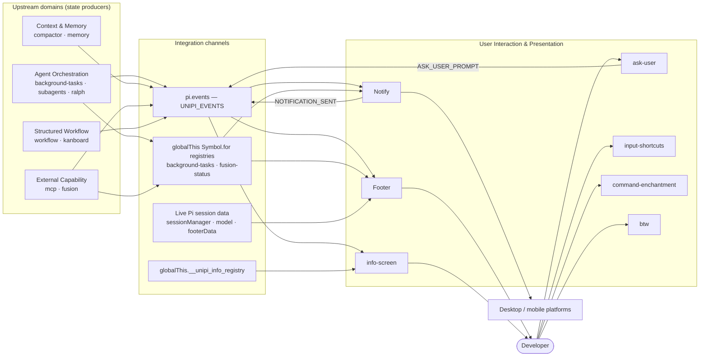
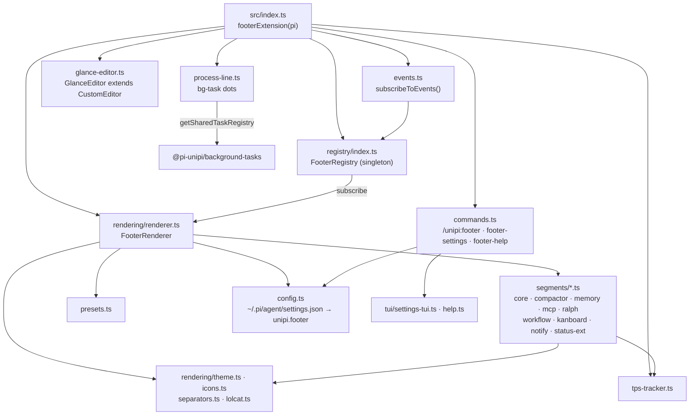
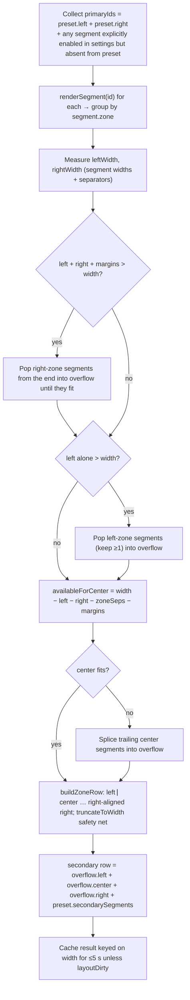
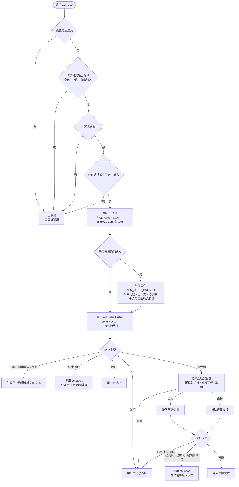
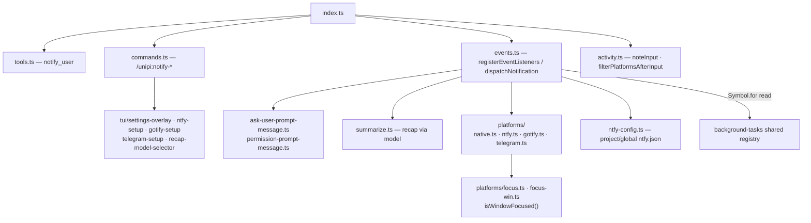
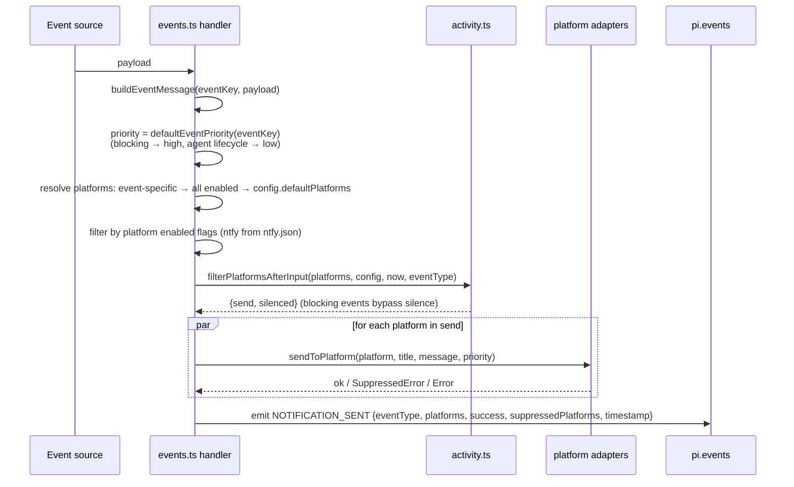
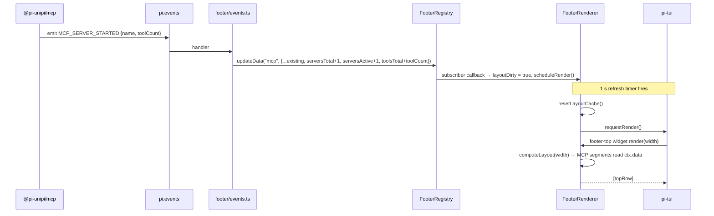
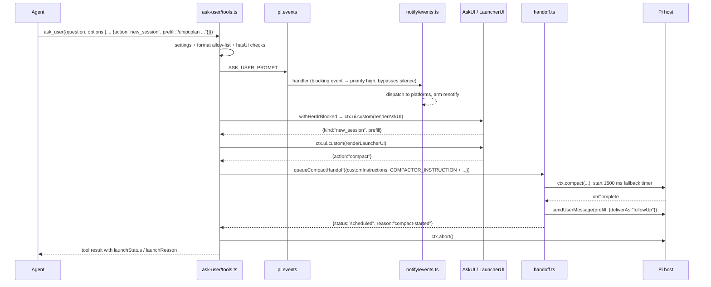
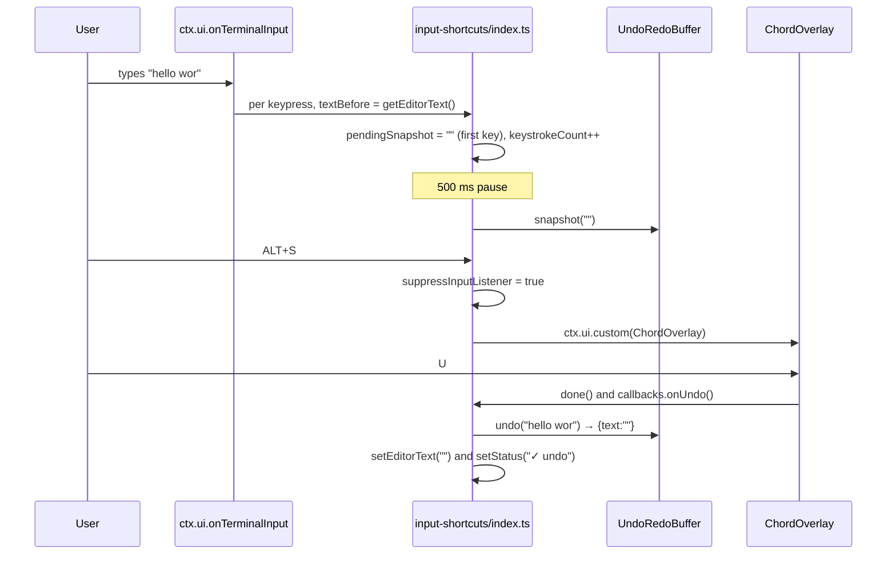

# User Interaction & Presentation (/docs/deep-exploration/user-interaction-and-presentation-domain)


**Project:** Unipi (`@pi-unipi/*` extension suite for the Pi coding agent)
&#x2A;*Domain type:** Presentation / Interaction
&#x2A;*Packages:** `footer`, `ask-user`, `input-shortcuts`, `notify`, `info-screen`, `autocomplete` (published as `@pi-unipi/command-enchantment`), `btw`
&#x2A;*Document date:** 2026-09-16

***

## 1. Domain Overview [#1-domain-overview]

The User Interaction & Presentation domain owns every surface the developer sees or touches in the terminal beyond the raw chat stream. It is a purely *consuming* domain: it reads state produced by the orchestration, context, integration and workflow domains, renders that state into the TUI, and feeds user intent back into the system through tool results, slash commands, and events. No business rules about agents, compaction, or MCP servers live here — only the rules about how to present them and how to collect input.

Seven packages make up the domain. They share three things: the Pi `ExtensionAPI` (tools, commands, hooks, `ctx.ui.custom()` overlays, `setFooter`/`setWidget` slots), the `@pi-unipi/core` event contract (`UNIPI_EVENTS`, `emitEvent`, `MODULE_READY`), and the `@earendil-works/pi-tui` rendering primitives (`visibleWidth`, `truncateToWidth`, `Key`, `matchesKey`, `Editor`, `Container`).

| Sub-module                     | Package                    | Primary responsibility                                                    | Host integration surface                                                              |
| ------------------------------ | -------------------------- | ------------------------------------------------------------------------- | ------------------------------------------------------------------------------------- |
| Footer Status Bar              | `packages/footer`          | Two-row responsive status bar, glance-style input frame, live TPS metrics | `ctx.ui.setFooter`, `ctx.ui.setWidget`, `ctx.ui.setEditorComponent`                   |
| Ask-User Interaction & Handoff | `packages/ask-user`        | `ask_user` tool, single/multi/freeform prompts, new-session handoff       | `pi.registerTool`, `ctx.ui.custom`, `ctx.compact`, `pi.sendUserMessage`               |
| Input Shortcuts & Editing      | `packages/input-shortcuts` | ALT+S chord overlay, undo/redo, registers, clipboard, thinking toggle     | `pi.registerShortcut`, `ctx.ui.getEditorText/setEditorText`, `ctx.ui.onTerminalInput` |
| Notifications                  | `packages/notify`          | Outbound alerts to native OS, ntfy, Gotify, Telegram; `notify_user` tool  | `pi.on(...)`, `pi.events.on(...)`, outbound HTTP / `node-notifier`                    |
| Info Screen                    | `packages/info-screen`     | Cache-first dashboard overlay; global `InfoRegistry`                      | `ctx.ui.custom`, `globalThis.__unipi_info_registry`                                   |
| Command Enchantment            | `packages/autocomplete`    | Colored, grouped, ranked `/unipi:*` autocomplete                          | `ctx.ui.addAutocompleteProvider`                                                      |
| BTW                            | `packages/btw`             | Read-only side-conversation sub-session                                   | `createAgentSession`, `ctx.ui.custom`                                                 |

### 1.1 Position in the overall architecture [#11-position-in-the-overall-architecture]



The footer is the system's primary **read-model consumer**; `notify` is its primary **egress** path. Both consume the same upstream signals but through partially different channels, which is discussed in Section 9.

***

## 2. Footer Status Bar (`@pi-unipi/footer`) [#2-footer-status-bar-pi-unipifooter]

### 2.1 Responsibilities [#21-responsibilities]

The footer paints a persistent, responsive status bar and (by default) replaces Pi's stock input box with a framed "glance" editor. It aggregates data from every other Unipi module into small, iconified segments, tracks live tokens-per-second, and exposes a settings TUI for toggling groups, segments, presets, separators, icons and colour mode.

### 2.2 Component structure [#22-component-structure]



### 2.3 Data model [#23-data-model]

`src/types.ts` defines the contracts every segment adheres to:

* **`FooterSegment`** — `{ id, label, shortLabel, description, zone: "left" | "center" | "right", render: SegmentRenderFn, defaultShow }`.
* **`FooterGroup`** — `{ id, name, segments: FooterSegment[], defaultShow }`; typically one group per upstream package.
* **`FooterSegmentContext`** — passed to each `render()`: `theme`, `colors` (a `ColorScheme` of semantic names such as `model`, `gitDirty`, `tpsBlazing`, `contextWarn`), `data` (cached group data from the registry), `width`, `piContext`, `footerData`, `labelMode`.
* **`RenderedSegment`** — `{ content, visible }`. Segments hide themselves rather than showing placeholder dashes; the MCP segments explicitly document "Never shows `—`".
* **`PresetDef`** — ordered `leftSegments`, `rightSegments`, `secondarySegments`, optional `colors` and `zoneSeparator`.
* **`FooterSettings`** — `enabled`, `preset`, `glanceMode`, `separator`, `iconStyle`, `zoneSeparator`, `showFullLabels`, `colorMode`, and per-group `groups[id] = { show, segments: {...} }`.

`index.ts` declares the canonical group list:

```ts
const ALL_GROUPS: FooterGroup[] = [
  { id: "core",       name: "Core",       segments: CORE_SEGMENTS,       defaultShow: true },
  { id: "compactor",  name: "Compactor",  segments: COMPACTOR_SEGMENTS,  defaultShow: true },
  { id: "memory",     name: "Memory",     segments: MEMORY_SEGMENTS,     defaultShow: true },
  { id: "mcp",        name: "MCP",        segments: MCP_SEGMENTS,        defaultShow: true },
  { id: "ralph",      name: "Ralph",      segments: RALPH_SEGMENTS,      defaultShow: true },
  { id: "workflow",   name: "Workflow",   segments: WORKFLOW_SEGMENTS,   defaultShow: true },
  { id: "kanboard",   name: "Kanboard",   segments: KANBOARD_SEGMENTS,   defaultShow: true },
  { id: "notify",     name: "Notify",     segments: NOTIFY_SEGMENTS,     defaultShow: false },
  { id: "status_ext", name: "Extensions", segments: STATUS_EXT_SEGMENTS, defaultShow: true },
];
```

### 2.4 FooterRegistry — the reactive data cache [#24-footerregistry--the-reactive-data-cache]

`FooterRegistry` is a process-wide singleton (`getFooterRegistry()`) with three concerns:

1. **Group registration** — `registerGroup`, `getGroup`, `getAllGroups`.
2. **Per-group data cache** — `updateData(groupId, data)` stores arbitrary payloads and notifies subscribers only when the reference changes (shallow compare); `getGroupData`, `invalidateAll`.
3. **Subscriptions** — `subscribe(cb)` returns an unsubscribe function; subscriber exceptions are swallowed so a faulty consumer cannot break the update chain.

Debug logging is intentionally a no-op; the source comment notes that writing to stdout previously corrupted TUI rendering.

### 2.5 Event wiring [#25-event-wiring]

`events.ts#subscribeToEvents(pi, registry)` is the bridge between the core event bus and the registry. It returns a composite unsubscribe function that `session_shutdown` calls. Each handler is wrapped in `try/catch` and merges into the existing group payload:

| `UNIPI_EVENTS`                                                 | Target group | Effect on cached data                                                                         |
| -------------------------------------------------------------- | ------------ | --------------------------------------------------------------------------------------------- |
| `COMPACTOR_COMPACTED`                                          | `compactor`  | `lastCompaction`                                                                              |
| `MEMORY_STORED` / `MEMORY_DELETED` / `MEMORY_CONSOLIDATED`     | `memory`     | `lastStored` / `lastDeleted` / `lastConsolidated`                                             |
| `MCP_SERVER_STARTED`                                           | `mcp`        | increments `serversTotal`, `serversActive`, adds `toolCount` to `toolsTotal`                  |
| `MCP_SERVER_STOPPED`                                           | `mcp`        | decrements `serversActive`; subtracts tools if the stopped server matches `lastServerStarted` |
| `MCP_SERVER_ERROR`                                             | `mcp`        | increments `serversTotal`, `serversFailed`                                                    |
| `MCP_TOOLS_REGISTERED` / `MCP_TOOLS_UNREGISTERED`              | `mcp`        | adjusts `toolsTotal` by `toolNames.length`                                                    |
| `RALPH_LOOP_START` / `RALPH_LOOP_END` / `RALPH_ITERATION_DONE` | `ralph`      | `active` flag, `lastIteration`                                                                |
| `WORKFLOW_START` / `WORKFLOW_END`                              | `workflow`   | `active`, `startTime`                                                                         |
| `NOTIFICATION_SENT`                                            | `notify`     | replaces payload                                                                              |
| `MODULE_READY`                                                 | all          | `invalidateAll()` — newly loaded modules may bring fresh data                                 |

Segment renderers read from more than the registry. `segments/mcp.ts` resolves stats in priority order: `globalThis.__unipi_mcp_stats` (direct from the MCP registry if published) → `ctx.data` aggregate fields. `segments/core.ts` derives token/cost totals by walking `piContext.sessionManager.getBranch()` and summing `usage` on non-errored assistant messages. `segments/status-ext.ts` renders `footerData.getExtensionStatuses()` entries, stripping the emoji prefixes packages set on their own statuses and substituting icons from the configured icon style.

### 2.6 FooterRenderer — layout algorithm [#26-footerrenderer--layout-algorithm]

`FooterRenderer.computeLayout(width)` implements a zone-based responsive layout with progressive degradation:



Notable properties:

* **Cache discipline.** Results are memoised by width for up to 5 seconds; any registry update marks the layout dirty via the renderer's subscription. `scheduleRender()` debounces dirtying at `RENDER_DEBOUNCE_MS = 33`.
* **Explicit-enable override.** A segment the user turned on in the settings TUI appears even if the active preset omits it (`isSegmentExplicitlyEnabled`).
* **Width safety.** Every row passes through `truncateToWidth`; the `footer-top` widget further caps output at `width − 1`. The code cites issue #31: a line at *exactly* terminal width trips auto-wrap on some terminals and desynchronises pi-tui's differential renderer.
* **Zone separator** defaults to `│` (dimmed) and can be disabled with `"none"`.

### 2.7 Lifecycle and UI slots [#27-lifecycle-and-ui-slots]

`footerExtension(pi)` registers streaming hooks once at factory time (because `pi.on` has no unsubscribe) and does per-session setup on `session_start`:

1. Load settings; set preset, active flag, `glanceMode` (default **on**).
2. If enabled and `ctx.hasUI`, call `subscribeToEvents`.
3. Defer `installGlanceEditor` by 3.5 seconds — a focus-safety grace period for the boot dashboard and updater prompt; after `setEditorComponent`, any previously focused overlay is re-focused so `q`/Esc are never stranded.
4. Reset the TPS tracker, sync the streaming cursor (`cursorSyncCount`) to the number of persisted assistant messages, and call `setupFooterUI`.

`setupFooterUI` installs three Pi UI slots:

| Slot                            | Placement     | Content (classic mode)                                                    | Content (glance mode)                                                                    |
| ------------------------------- | ------------- | ------------------------------------------------------------------------- | ---------------------------------------------------------------------------------------- |
| `ctx.ui.setFooter(...)`         | footer        | Empty render; owns the **1 s refresh timer** and `onBranchChange` re-sync | same                                                                                     |
| `setWidget("footer-top")`       | `aboveEditor` | Top row from `computeLayout`                                              | Background-process one-liner (`renderProcessLine`)                                       |
| `setWidget("footer-secondary")` | `belowEditor` | —                                                                         | Centered session strip: `n turn · n steps \| wall · tool \| avg ttft · tok/s \| cache %` |

The 1 s timer re-scans the session branch to reconcile TPS records after compactions, branch switches or reloads, computes branch-derived tool wall time by pairing `toolCall` blocks with `toolResult` messages (capped at 600 s per call), then resets the layout cache and requests a render.

`/unipi:footer off` tears down all three slots; `/unipi:footer on` re-invokes the stored `state.setupUI` closure so the footer can be re-enabled live without a restart.

### 2.8 GlanceEditor [#28-glanceeditor]

`glance-editor.ts` subclasses Pi's `CustomEditor`, calls `super.render()` only to obtain editor content lines, and composes a rounded frame:

```
╭─UNIPI │ feat/footer-default-v2 │ ─────────────────────╮
│ Type your prompt here...                              │
╰─ unipi ────────── 42%/1.0M │ Claude Opus 4.5 │ thinking:high ╯
```

The status provider closure (installed from `index.ts`) supplies `workspace`, `branch`, `contextPct`, `contextWindow`, `modelName`, `thinkingLevel`, and the active `fusion` pair read via `getSharedFusionStatus()` from core. `renderFusionStatus` renders `Fusion · <lead> <effort> ◆ <sidekick>` with the lead lit and the sidekick muted, appending call split and `saved $x.xx` when available. `glanceFrameWidth(terminalWidth)` returns `max(8, terminalWidth − 1)` for the same issue-#31 reason. All keybindings, autocomplete, history and paste behaviour are inherited from the base editor; only painting changes.

### 2.9 TPS tracker [#29-tps-tracker]

`tps-tracker.ts` maintains one `MessageTpsRecord` per branch-local assistant message index. Two token sources are used, best-first:

1. **Anchored** — the provider's exact `usage.output` at stream end (`message_end`); replaces any estimate.
2. **Density estimate** — `ceil(chars / 4)` accumulated over streamed `text_delta`, `thinking_delta` and `toolcall_delta` payloads while `usage.output` is still zero.

The timing contract is deliberately narrow: the decode window starts at the **first streamed delta** (excluding TTFT and request overhead) and ends at stream end. Tool execution and idle time are excluded, and records without a hook-measured `decodeMs` are dropped from the session average. `turn_start`/`agent_settled` and `tool_execution_start/end` hooks feed turn count, wall time and tool time for the glance session strip.

### 2.10 Styling layers [#210-styling-layers]

* **`theme.ts`** — capability-aware colour emission. `detectColorMode()` honours `NO_COLOR`/`NODE_DISABLE_COLORS`, `FORCE_COLOR` levels, forces Apple Terminal to 256 colours (it silently drops 24-bit escapes), recognises a list of truecolor terminals, and otherwise sniffs `TERM`. Hex colours are quantised to the nearest xterm-256 index when needed. A manual override via settings (`colorMode: truecolor | 256 | none`) wins over detection.
* **`separators.ts`** — six separator styles (`powerline`, `powerline-thin`, `slash`, `pipe`, `dot`, `ascii`) with Nerd Font glyphs or ASCII fallbacks chosen by `detectNerdFontSupport()` (`POWERLINE_NERD_FONTS` override, `GHOSTTY_RESOURCES_DIR`, known `TERM_PROGRAM` values).
* **`icons.ts`** — `nerd` / `emoji` / `text` glyph tables selected by `setIconStyle`.
* **`lolcat.ts`** — surrogate-aware rainbow gradient used for the brand glyph.
* **`presets.ts`** — `default` (glance-style with `uni` brand, model, thinking level, directory, git on the left; context, tokens, TPS, cost, clock, duration on the right), `classic`, `minimal`, `compact`, `full`, `ascii`. Unknown names fall back to `default`.

### 2.11 Configuration [#211-configuration]

Settings live in `~/.pi/agent/settings.json` (or `$PI_AGENT_DIR/settings.json`) under `[UNIPI_SETTINGS_KEY].footer`. Defaults: `enabled: true`, `preset: "default"`, `glanceMode: true`, `separator: "powerline-thin"`, `iconStyle: "nerd"`, `zoneSeparator: "│"`, `showFullLabels: false`, `colorMode: "auto"`, and all groups shown except `notify`. Loading is defensive — every field is type-checked and falls back individually.

### 2.12 Commands [#212-commands]

| Command                   | Behaviour                                                                                                                                                                                                       |
| ------------------------- | --------------------------------------------------------------------------------------------------------------------------------------------------------------------------------------------------------------- |
| `/unipi:footer [on\|off]` | Toggle (or explicitly set) the footer; persists `enabled`; re-installs or removes all three UI slots                                                                                                            |
| `/unipi:footer-settings`  | Three-category `SettingsList` overlay (Appearance / Segments drill-down / Labels & Help). Preset and glance flag apply live; the editor component swap is deferred until the overlay closes (`applyGlanceMode`) |
| `/unipi:footer-help`      | Zone-ordered overlay listing enabled segments with icons, labels and descriptions                                                                                                                               |

The module announces itself with `MODULE_READY { name: "@pi-unipi/footer", commands: [...], tools: [] }` on `session_start`.

***

## 3. Ask-User Interaction & Handoff (`@pi-unipi/ask-user`) [#3-ask-user-interaction--handoff-pi-unipiask-user]

### 3.1 Responsibilities [#31-responsibilities]

Provides the `ask_user` tool so the agent can pause for a structured human decision — single-select, multi-select or freeform — and, optionally, let the user hand the conversation off to a queued follow-up command (with or without compaction first).

### 3.2 Tool contract [#32-tool-contract]

`tools.ts#registerAskUserTools` registers `ASK_USER_TOOLS.ASK` with a TypeBox schema:

```ts
parameters: Type.Object({
  question: Type.String(),
  context: Type.Optional(Type.String()),
  options: Type.Optional(Type.Array(Type.Object({
    label: Type.String(),
    description: Type.Optional(Type.String()),
    value: Type.Optional(Type.String()),          // defaults to label
    allowCustom: Type.Optional(Type.Boolean()),   // select → text input for a comment
    action: Type.Optional(Type.Union([
      Type.Literal("select"), Type.Literal("input"),
      Type.Literal("end_turn"), Type.Literal("new_session"),
    ])),
    prefill: Type.Optional(Type.String()),        // for new_session
  }))),
  allowMultiple: Type.Optional(Type.Boolean()),   // default false
  allowFreeform: Type.Optional(Type.Boolean()),   // default true
  timeout: Type.Optional(Type.Number()),          // auto-dismiss ms
})
```

The result carries an `AskUserResponse` in `details.response` with `kind ∈ { selection, freeform, combined, cancelled, timed_out, end_turn, new_session }` plus optional `selections`, `text`, `prefill`, `comment`, and — for handoffs — `launchedWith`, `launchStatus`, `launchReason`, `launchError`.

### 3.3 Execution pipeline [#33-execution-pipeline]



Two guard mechanisms wrap the interactive parts:

* **Settings allow-list** (`config.ts`) — `unipi.askUser` in `~/.pi/agent/settings.json` with `enabled`, `allowedFormats.{singleSelect,multiSelect,freeform}` and `notifyOnAsk` (all default `true`). Settings are cached in memory after first read.
* **`withHerdrBlocked`** (from core) — marks the interval during which the prompt is open so that the `herdr:blocked` signal is visible to other extensions.

### 3.4 TUI renderers [#34-tui-renderers]

`ask-ui.ts#renderAskUI` follows Pi's `ctx.ui.custom()` callback pattern and returns `{ render, invalidate, handleInput }`. Behaviour:

* Appends a synthetic &#x2A;*"Custom response"** option (`value: "__freeform__"`) when `allowFreeform` is true.
* Single-select: arrows + Enter. Multi-select: Space toggles, Enter submits. Escape cancels. `timeout` auto-dismisses with `kind: "timed_out"`.
* Freeform and `allowCustom` options open an embedded pi-tui `Editor`; per-option custom text is stored in a `Map` so multi-select can attach comments to individual choices (`kind: "combined"`).
* Line rendering goes through core's `WidthKeyedCache`, `adaptiveInnerWidth`, `contentWidth` and `shouldRenderBorder` so a resize never serves stale, over-wide lines.

`launcher-ui.ts#renderLauncherUI` is a three-option picker (`Compact & run 🧹`, `Run directly ▶`, `Cancel ✕`) returning `SessionLauncherResult { action, prefill }`.

### 3.5 Handoff semantics [#35-handoff-semantics]

`handoff.ts` queues the prefill *without* waiting for an LLM turn:

* **`queueDirectHandoff`** — trims the prefill (`normalizePrefill`; empty → `cancelled / empty-prefill`) and calls `pi.sendUserMessage(prefill, { deliverAs: "followUp" })` → `queued / direct`. If sending throws, `fallbackToEditor` places the text in the editor (`editor_prefill`) and warns the user; if even that fails, status is `failed`.
* **`queueCompactHandoff`** — starts `ctx.compact({ customInstructions, onComplete, onError })` and delivers exactly once via `deliverOnce&#x60;. A &#x2A;*`COMPACT_HANDOFF_FALLBACK_MS = 1500`** timer guarantees delivery (`fallback-timeout`) even if compaction callbacks wait on the tool turn. The custom instructions are prefixed with core's `COMPACTOR_INSTRUCTION` sentinel so `@pi-unipi/compactor`'s zero-LLM pipeline intercepts if installed; otherwise Pi's built-in compaction runs.

Reason codes (`SessionLaunchReason`): `direct`, `compact-started`, `compacted`, `compaction-error`, `fallback-timeout`, `compact-start-failed`, `empty-prefill`, `send-failed`. Every path except `failed` ends with `ctx.abort()` so the queued command runs immediately.

### 3.6 Commands and announcement [#36-commands-and-announcement]

`/unipi:ask-user-settings` opens `settings-tui.ts` (toggle the tool and each allowed format). On `session_start` the package emits `MODULE_READY { name: MODULES.ASK_USER, commands: ["unipi:ask-user-settings"], tools: [ASK_USER_TOOLS.ASK] }`.

***

## 4. Input Shortcuts & Editing (`@pi-unipi/input-shortcuts`) [#4-input-shortcuts--editing-pi-unipiinput-shortcuts]

### 4.1 Responsibilities [#41-responsibilities]

Adds editor-level productivity shortcuts: an ALT+S chord menu (stash/restore, undo, redo, append from register, copy, cut, toggle thinking), ALT+I tab insertion, and a `/unipi:stash-settings` overlay for keybinding customisation.

### 4.2 Architectural rule: overlays select, callers execute [#42-architectural-rule-overlays-select-callers-execute]

The header of `index.ts` states the design constraint that shapes this package:

> The overlay ONLY captures action selection (pure UI, no side effects). All actions execute OUTSIDE the overlay via callbacks after `done()`.

`ChordOverlay` (`chord-overlay.ts`) is a `Container` implementing `Focusable` with two states — `chord_root` (action menu) and `chord_reg` (register list 0–9 + `S`) — and receives a `ChordCallbacks` bundle. When the user picks an action, the overlay calls `done()` and then the callback; the callback runs in the command context where `ctx.ui.getEditorText()` / `setEditorText()` actually work.

| Key             | Action                       | Implementation                                                                                  |
| --------------- | ---------------------------- | ----------------------------------------------------------------------------------------------- |
| `S`             | Stash / Restore              | Non-empty editor → snapshot, save to stash, clear. Empty editor → restore stash.                |
| `U` / `R`       | Undo / Redo                  | `UndoRedoBuffer.undo/redo` with `suppressInputListener` set to avoid self-referencing snapshots |
| `A` → `0–9`/`S` | Append from register / stash | Snapshot current text, append register contents                                                 |
| `Y` / `D`       | Copy / Cut                   | `copyToClipboard` (platform-specific); cut clears after successful copy                         |
| `T`             | Toggle thinking              | Cycles `THINKING_CYCLE = ["off","low","medium","high","xhigh"]` via `pi.setThinkingLevel`       |

Feedback is shown through `ctx.ui.setStatus("input-shortcuts", text)` for 2 s (success) or 3 s (error).

### 4.3 Undo snapshot strategy [#43-undo-snapshot-strategy]

Undo for *typed* text is implemented by observing `ctx.ui.onTerminalInput` and capturing the editor text **before** each edit keypress (printable char, backspace, delete, enter). Three independent triggers commit the pending snapshot:

1. **Pause** — 500 ms since the last keypress (`SNAPSHOT_PAUSE_MS`).
2. **Count** — 20 edit keys since the last snapshot (`SNAPSHOT_COUNT_THRESHOLD`).
3. **Time** — 3 s since the last snapshot even while typing (`SNAPSHOT_TIME_MS`).

`UndoRedoBuffer` (`undo-redo.ts`) keeps at most `MAX_UNDO_SNAPSHOTS = 50`, applies a `UNDO_DEBOUNCE_MS = 500` guard on `snapshot()`, and clears the redo stack on every new snapshot. Both stacks are cleared on `session_shutdown`. Opening the chord overlay suppresses the listener so the ALT+S keypress itself does not create a snapshot that would later "undo the undo".

### 4.4 Registers [#44-registers]

`RegisterStore` (`registers.ts`) persists ten numbered registers plus the stash to `.unipi/config/input-shortcuts.json`, lazily loaded on first access and written atomically (`.tmp` + `renameSync`). Persistence failures are silent — registers are best-effort.

### 4.5 Integration points [#45-integration-points]

* `pi.registerShortcut(Key.alt("s"))` and `Key.alt("i")`; overlay options `width: 42, maxHeight: 20, anchor: "top-center"`.
* Registers an **info-screen group** (`id: "input-shortcuts"`, priority 115) through `globalThis.__unipi_info_registry` exposing chord key, tab key, registers used and stash status.
* Emits `MODULE_READY { name: MODULES.INPUT_SHORTCUTS, commands: ["unipi:stash-settings"] }` at load time (not on `session_start`).

***

## 5. Notifications (`@pi-unipi/notify`) [#5-notifications-pi-unipinotify]

### 5.1 Responsibilities [#51-responsibilities]

Translates Pi lifecycle events and Unipi feature events into out-of-band alerts on native desktop, ntfy, Gotify and Telegram, with priority mapping, optional LLM recap, keyboard-activity suppression, and reminder re-notification for human-blocking prompts. It also exposes the `notify_user` tool so the agent can send ad-hoc messages.

### 5.2 Component structure [#52-component-structure]



### 5.3 Event subscription model [#53-event-subscription-model]

`events.ts#BUILTIN_EVENTS` is a table mapping notify event keys to Pi hooks / core events and display labels:

| Event key             | Hook                                                                  | Label              | Listener API        |
| --------------------- | --------------------------------------------------------------------- | ------------------ | ------------------- |
| `agent_end`           | `agent_end`                                                           | Agent Run Complete | `pi.on` (lifecycle) |
| `agent_settled`       | `agent_settled`                                                       | Agent Complete     | `pi.on` (lifecycle) |
| `session_shutdown`    | `session_shutdown`                                                    | Session End        | `pi.on` (lifecycle) |
| `workflow_end`        | `UNIPI_EVENTS.WORKFLOW_END`                                           | Workflow Done      | `pi.events.on`      |
| `ralph_loop_end`      | `UNIPI_EVENTS.RALPH_LOOP_END`                                         | Ralph Complete     | `pi.events.on`      |
| `mcp_server_error`    | `UNIPI_EVENTS.MCP_SERVER_ERROR`                                       | MCP Error          | `pi.events.on`      |
| `memory_consolidated` | `UNIPI_EVENTS.MEMORY_CONSOLIDATED`                                    | Memory Saved       | `pi.events.on`      |
| `ask_user_prompt`     | `UNIPI_EVENTS.ASK_USER_PROMPT` (+ third-party `rpiv:ask-user:prompt`) | Question Asked     | `pi.events.on`      |
| `permission_request`  | third-party `permissions:ui_prompt`                                   | Permission Request | `pi.events.on`      |

The distinction between `pi.on` and `pi.events.on` matters operationally: lifecycle hooks are stored in the extension's handler table and replaced on reload, whereas `EventBus` listeners persist — so `registerEventListeners` first calls `unregisterAll()` on the accumulated `pi.events.on` unsubscribers to avoid duplicate notifications after a reload. Per-event enablement and platform lists come from `config.events[eventKey]`.

Agent lifecycle events use a dedicated `registerAgentNotification` path that adds two behaviours: **wake-task suppression** and **recap**.

### 5.4 Wake-task suppression via shared registry [#54-wake-task-suppression-via-shared-registry]

`hasPendingWakeTask()` reads `globalThis[Symbol.for("unipi.background-tasks.shared-registry")]` and returns true if any task is `running` with `triggerOnCompletion === true`. The rationale in the source: such a task will wake the agent in a fresh turn that produces its own `agent_end`, so notifying for the intermediate turn would duplicate the message. The symbol is read directly "so notify has zero load-order or dependency coupling to that optional sibling"; any read failure means "no pending wake".

### 5.5 Dispatch pipeline [#55-dispatch-pipeline]



* **Priority mapping** — `mapNotifyPriority`: Gotify `low 2 / normal 5 / high 8`; ntfy `low 2 / normal 3 / high 5`. Native and Telegram ignore numeric priority.
* **Suppression is not failure.** `native.ts` throws `SuppressedError` when `suppressWhenFocused` is on and `isWindowFocused()` (currently implemented on Windows) is true; dispatch records it as `success: true, suppressed: true`.
* **Silence after input** (`activity.ts`) — `noteInput()` is called from `ctx.ui.onTerminalInput`; when `silenceAfterInput.enabled` and the last keypress is within `windowMs`, listed platforms (or all, if the list is empty) are silenced. `ask_user_prompt` and `permission_request` are **blocking events** and always bypass this filter because the keypress that caused them must not mute them.
* **Renotify** — `RenotifyConfig { enabled, intervalMs, maxRepeats }` re-sends unanswered human-blocking prompts; any keypress calls `disarmRenotify()`.
* Message builders: `buildAskUserPromptMessage` accepts both Unipi's flat payload and the rpiv questionnaire projection (`Agent asks: <question> (+n more) — opt1, opt2`); `buildPermissionPromptMessage` handles the permission-system payload.

### 5.6 Recap summarisation [#56-recap-summarisation]

When `config.recap.enabled`, agent-end notifications summarise the last assistant message before sending. The text is taken from the payload or, for `agent_settled` (which carries no messages), from `sessionCtx.sessionManager.getEntries()`. The configured model (`provider/modelId`) is resolved through `sessionCtx.modelRegistry`, credentials fetched with `getApiKeyAndHeaders`, and `summarizeLastMessage` routes to `anthropic-messages` or an OpenAI-compatible endpoint with `MAX_INPUT_CHARS = 2000`, `MAX_TOKENS = 100`, `TIMEOUT_MS = 10 000`. `disableThinking` sends `chat_template_kwargs` to stop llama.cpp/vLLM-style thinking models from spending the budget on reasoning (issue #36). Any failure falls back to a 100-character truncation, then to the plain lifecycle message.

### 5.7 Platform adapters [#57-platform-adapters]

| Platform | File                    | Transport                                                      | Required config                                                                |
| -------- | ----------------------- | -------------------------------------------------------------- | ------------------------------------------------------------------------------ |
| Native   | `platforms/native.ts`   | `node-notifier` (SnoreToast / terminal-notifier / notify-send) | `native.enabled`, optional `windowsAppId`, `suppressWhenFocused`               |
| ntfy     | `platforms/ntfy.ts`     | HTTP publish to topic                                          | project/global `ntfy.json`: `serverUrl`, `topic`, optional `token`, `priority` |
| Gotify   | `platforms/gotify.ts`   | HTTP message API                                               | `serverUrl`, `appToken`, `priority`                                            |
| Telegram | `platforms/telegram.ts` | Bot API                                                        | `botToken`, `chatId`                                                           |

`NotifyPlatform` is the union `"native" | "gotify" | "telegram" | "ntfy"`; `focus.ts`/`focus-win.ts` are helpers for foreground-window detection rather than a delivery platform.

### 5.8 Tool, commands, lifecycle [#58-tool-commands-lifecycle]

* **`notify_user`** tool (`tools.ts`): `{ message, title?, priority?, platforms? }`; dispatches fire-and-forget with `eventType: "agent_tool"` and returns per-platform numeric priorities in `details`.
* **Commands**: `unipi:notify-settings`, `unipi:notify-set-gotify`, `unipi:notify-set-tg`, `unipi:notify-set-ntfy`, `unipi:notify-test`, `unipi:notify-recap-model` — each backed by a setup overlay under `tui/`.
* **Lifecycle**: on `session_start` the package stores the session context, resets input activity, subscribes to terminal input, loads config, registers listeners, and emits `MODULE_READY`. On `session_shutdown` it unsubscribes terminal input, disarms renotify, clears context and unregisters `EventBus` listeners.

***

## 6. Info Screen, Command Enchantment & BTW [#6-info-screen-command-enchantment--btw]

### 6.1 Info Screen (`@pi-unipi/info-screen`) [#61-info-screen-pi-unipiinfo-screen]

**InfoRegistry** (`registry.ts`) is a cache-first reactive store exposed as `globalThis.__unipi_info_registry` so other packages can `registerGroup` without importing the package:

* `registerGroup(group)` stores `{ id, name, icon, priority, config.stats[], dataProvider }` and fires a synthetic update so open overlays re-sync their group list.
* `getGroupData(id)` returns cached data if younger than `cacheTtlMs = 5000`, otherwise awaits `dataProvider()`, deduplicating concurrent fetches through an `inflight` map. Provider errors return the last cached value.
* `refreshGroup`/`refreshAll` are fire-and-forget; `subscribeAll(cb)` delivers `(groupId, data)`; `getVisibleStats` filters by user config; `invalidateCache` drops a group.

**Extension entry** (`index.ts`):

* Registers core groups synchronously and starts load-time tracking.
* Batches `MODULE_READY` announcements with a 150 ms debounce, records module versions, load times and tools (`trackModule`, `trackTool`), invalidates `overview`/`tools`, and only re-fetches when an overlay is actually visible.
* Tracks built-in tool usage via `pi.on("tool_call")`.
* **Boot splash**: if `settings.bootMode !== "off"` and `event.reason === "startup"`, the overlay opens immediately. In `auto-close` mode it is **non-capturing** (never takes keyboard focus), dismisses itself via `handle.hide()` after `bootTimeoutMs`, and only does so while it is the top-most *visible* overlay — dismissing a covered entry would orphan whatever overlay is on top (e.g. a hung `ctx.ui.select` in the updater prompt).
* Commands: `/unipi:info` (interactive overlay, 80 % width, centered) and `/unipi:info-settings`.

### 6.2 Command Enchantment (`packages/autocomplete` → `@pi-unipi/command-enchantment`) [#62-command-enchantment-packagesautocomplete--pi-unipicommand-enchantment]

On `session_start`, if `isAutocompleteEnhanced()` (persisted in `~/.unipi/config/command-enchantment/config.json`, default `true`), the package wraps Pi's base autocomplete provider via `ctx.ui.addAutocompleteProvider((current) => createEnchantedProvider(current, true))`. When disabled it registers nothing.

`createEnchantedProvider` intercepts only slash-command positions:

1. **Argument position** (`isInUnipiArgPosition`) — delegates to the base provider with `force: false` so Tab after a `/unipi:*` command returns argument completions rather than file suggestions; `shouldTriggerFileCompletion` returns `true` in that context to keep the call path open.
2. **Command-name position** — fetches base suggestions, strips Pi's source tags (`[u:npm:@pi-unipi/unipi]`) from `unipi:*` descriptions (`stripPiSourceTag`), then regenerates `unipi:*` items from `COMMAND_REGISTRY` with package-coloured tags (`[workflow]`, `[memory]`, …).
3. **Namespace boost** (`detectNamespaceBoost`) — queries equal to a package name or alias (`mem`, `ms`, `goal`, `util`, `web`, `notification`, …) return *all* of that package's commands first.
4. **Cross-group ranking** (`sorting.ts#sortTaggedItems`) — four tiers: exact full-value match, `unipi:` short-name exact match, prefix match, fuzzy match; within a tier non-unipi (system) commands sort first, and fuzzy ties prefer shorter names. `skill:` items are hidden unless the user explicitly typed `/skill:`.

### 6.3 BTW (`@pi-unipi/btw`) [#63-btw-pi-unipibtw]

`extensions/btw.ts` (\~2 k lines, adapted from pi-btw) opens a genuine Pi sub-session using `createAgentSession` with read-only coding-tool access so the user can ask side questions while the main agent is busy. Key elements:

* **Commands**: `/unipi:btw [--save] <question>` (contextual), `/unipi:btw-tangent [--save] <q>` (contextless), `/unipi:btw-new [question]`, `/unipi:btw-clear`, `/unipi:btw-inject [instructions]`, `/unipi:btw-summarize [instructions]`.
* **System prompt** enforces the read-only aside: the model may read/search files but must never claim to have edited or executed anything, and should direct the user to `btw-inject`/`btw-summarize` for handoff.
* **Transcript state machine** — `BtwTranscriptEntry` variants (`turn-boundary`, `user-message`, `thinking`, `assistant-text`, `tool-call`, `tool-result`) with streaming flags drive the overlay renderer.
* **Persistence into the main session** uses custom message types `btw-note`, `btw-thread-entry`, `btw-thread-reset`.
* **Focus shortcuts** `Alt+/` and `Ctrl+Alt+W` (`matchesBtwFocusShortcut`) bring the overlay into focus.

***

## 7. Cross-Cutting Concerns [#7-cross-cutting-concerns]

### 7.1 Integration channels used by this domain [#71-integration-channels-used-by-this-domain]

| Channel                                                                                                                      | Used by                                                                                                     | Purpose                                                      |
| ---------------------------------------------------------------------------------------------------------------------------- | ----------------------------------------------------------------------------------------------------------- | ------------------------------------------------------------ |
| `pi.events` (`UNIPI_EVENTS`)                                                                                                 | footer (`events.ts`), notify (`events.ts`), info-screen (`MODULE_READY`)                                    | Typed, decoupled updates from upstream modules               |
| `Symbol.for("unipi.background-tasks.shared-registry")`                                                                       | notify (direct symbol read) · footer (`getSharedTaskRegistry` **import** from `@pi-unipi/background-tasks`) | Synchronous, hot-path reads of live task state               |
| `getSharedFusionStatus()` (core)                                                                                             | footer glance frame                                                                                         | Active model pair and savings                                |
| `globalThis.__unipi_info_registry`                                                                                           | info-screen (owner), input-shortcuts and others (registrants)                                               | Dashboard group registration without imports                 |
| `globalThis.__unipi_mcp_stats`                                                                                               | footer MCP segments (optional escape hatch)                                                                 | Direct MCP stats if the registry publishes them              |
| Live Pi session data (`sessionManager.getBranch()`, `getContextUsage()`, `footerData.getGitBranch()/getExtensionStatuses()`) | footer                                                                                                      | Token/cost totals, context %, git branch, extension statuses |

### 7.2 Events emitted by this domain [#72-events-emitted-by-this-domain]

| Event               | Emitter                                                | Payload                                                              |
| ------------------- | ------------------------------------------------------ | -------------------------------------------------------------------- |
| `ASK_USER_PROMPT`   | ask-user (`notifyOnAsk`)                               | `{ question, context, optionCount, allowMultiple, allowFreeform }`   |
| `NOTIFICATION_SENT` | notify                                                 | `{ eventType, platforms, success, suppressedPlatforms?, timestamp }` |
| `MODULE_READY`      | footer, ask-user, input-shortcuts, notify, info-screen | `{ name, version, commands, tools }`                                 |

### 7.3 Configuration persistence [#73-configuration-persistence]

| Package             | Location                                                                          | Key / file                                       |
| ------------------- | --------------------------------------------------------------------------------- | ------------------------------------------------ |
| footer              | `~/.pi/agent/settings.json`                                                       | `[UNIPI_SETTINGS_KEY].footer`                    |
| ask-user            | `~/.pi/agent/settings.json`                                                       | `unipi.askUser`                                  |
| notify              | package settings (`settings.ts`) + `ntfy.json` (project or global)                | platform, event, recap, silence, renotify config |
| input-shortcuts     | `.unipi/config/input-shortcuts.json`, `.unipi/config/input-shortcuts-config.json` | registers/stash · chord/tab keys                 |
| command-enchantment | `~/.unipi/config/command-enchantment/config.json`                                 | `autocompleteEnhanced`                           |
| info-screen         | package config (`config.ts`)                                                      | `bootMode`, `bootTimeoutMs`, per-stat visibility |

### 7.4 Terminal-rendering invariants [#74-terminal-rendering-invariants]

Several files converge on the same defensive rules, which any new UI in this domain should follow:

1. **Never write the last column.** Frame width, process line, session strip and top widget all cap at `width − 1` (issue #31).
2. **Measure with `visibleWidth`, never `String.length`.** ANSI SGR, OSC 133 prompt markers and Pi's APC cursor marker are zero-width and must be skipped by both painting and width math (`glance-editor.ts#ANSI_RE`).
3. **Key caches by width.** `WidthKeyedCache` (core) is used by ask-user and launcher UIs so a resize cannot serve stale lines.
4. **Overlays must be stack-aware.** Popping via `done()` removes the *top-most* overlay; self-dismissing overlays use `handle.hide()` and check they are top-most visible first (info-screen), and the footer restores focus after swapping the editor component.
5. **Never log to stdout from render paths.** `FooterRegistry.log` is a deliberate no-op.

***

## 8. Key Runtime Flows [#8-key-runtime-flows]

### 8.1 Footer update on an upstream event [#81-footer-update-on-an-upstream-event]



### 8.2 Ask-user prompt with remote alert and handoff [#82-ask-user-prompt-with-remote-alert-and-handoff]



### 8.3 Undo of typed text [#83-undo-of-typed-text]



***

## 9. Design Observations and Technical Notes [#9-design-observations-and-technical-notes]

**Strengths**

* **Segment renderers are pure functions** of `FooterSegmentContext`, which keeps the footer extensible: adding a module means adding a `FooterGroup` and, optionally, a handler in `events.ts`.
* **Fail-soft everywhere.** Event handlers, subscriber callbacks, TPS hooks, settings loaders and platform sends are all wrapped so a single bad payload cannot take down the TUI or a lifecycle hook.
* **Guard-rails precede side effects.** `ask_user` validates settings, formats and UI availability before rendering; `notify` resolves and filters platforms before any network call; the chord overlay executes nothing until it has closed.
* **Careful terminal hygiene** (width −1, zero-width sequence stripping, overlay-stack awareness) encoded as reusable helpers and explained in comments with issue references.

**Points to be aware of**

1. **Two strategies for the same registry.** `footer/process-line.ts` imports `getSharedTaskRegistry` from `@pi-unipi/background-tasks` (a hard `package.json` dependency), whereas `notify/events.ts` reads the `Symbol.for` slot directly to avoid coupling. Both work, but only one of them keeps the "core-only internal dependency" rule.
2. **Multiple global registries.** The footer registry is a module singleton, the info registry is a string-keyed `globalThis` property, and fusion/background-tasks use `Symbol.for`. New consumers should prefer typed accessors in core (as `getSharedFusionStatus` does).
3. **MCP tool-count bookkeeping is approximate.** `MCP_SERVER_STOPPED` subtracts tools only when the stopped server matches `lastServerStarted`; the `globalThis.__unipi_mcp_stats` escape hatch exists precisely to allow the MCP package to publish authoritative counts.
4. **`notify/events.ts` header vs. implementation.** The file header advertises "dynamic discovery via MODULE\_READY", but the subscription set observed in `registerEventListeners` is the static `BUILTIN_EVENTS` table (plus two third-party event strings). Operators should treat the table as the source of truth for which events can notify.
5. **`MODULE_READY` timing differs.** Most packages emit it on `session_start`; `input-shortcuts` emits at load time. Consumers that subscribe on `session_start` may therefore miss the latter's announcement.
6. **`footer/src/index.ts` (\~660 lines)** concentrates lifecycle, TPS reconciliation, glance installation and strip rendering; the reconciliation scan in particular re-walks the whole branch every second.
7. **Preset name drift.** Earlier research listed a `nerd` preset; the code defines `default`, `classic`, `minimal`, `compact`, `full`, `ascii`. Nerd-Font behaviour is controlled by `iconStyle` and separator detection rather than a preset.

***

## 10. Reference [#10-reference]

### 10.1 Commands [#101-commands]

| Command                                                                                                                                                   | Package         |
| --------------------------------------------------------------------------------------------------------------------------------------------------------- | --------------- |
| `/unipi:footer [on\|off]`, `/unipi:footer-settings`, `/unipi:footer-help`                                                                                 | footer          |
| `/unipi:ask-user-settings`                                                                                                                                | ask-user        |
| `/unipi:stash-settings`                                                                                                                                   | input-shortcuts |
| `/unipi:notify-settings`, `/unipi:notify-set-gotify`, `/unipi:notify-set-tg`, `/unipi:notify-set-ntfy`, `/unipi:notify-test`, `/unipi:notify-recap-model` | notify          |
| `/unipi:info`, `/unipi:info-settings`                                                                                                                     | info-screen     |
| `/unipi:btw`, `/unipi:btw-tangent`, `/unipi:btw-new`, `/unipi:btw-clear`, `/unipi:btw-inject`, `/unipi:btw-summarize`                                     | btw             |

### 10.2 Tools [#102-tools]

| Tool                                       | Package  | Parameters                                                                           |
| ------------------------------------------ | -------- | ------------------------------------------------------------------------------------ |
| `ask_user` (`ASK_USER_TOOLS.ASK`)          | ask-user | `question`, `context?`, `options?[]`, `allowMultiple?`, `allowFreeform?`, `timeout?` |
| `notify_user` (`NOTIFY_TOOLS.NOTIFY_USER`) | notify   | `message`, `title?`, `priority?`, `platforms?`                                       |

### 10.3 Keyboard shortcuts [#103-keyboard-shortcuts]

| Keys                  | Package         | Action                             |
| --------------------- | --------------- | ---------------------------------- |
| `Alt+S`               | input-shortcuts | Open chord overlay (S/U/R/A/Y/D/T) |
| `Alt+I`               | input-shortcuts | Insert tab character               |
| `Alt+/`, `Ctrl+Alt+W` | btw             | Focus BTW overlay                  |

### 10.4 Key source files [#104-key-source-files]

| Concern                   | Files                                                                                                                 |
| ------------------------- | --------------------------------------------------------------------------------------------------------------------- |
| Footer layout & lifecycle | `packages/footer/src/index.ts`, `src/rendering/renderer.ts`, `src/registry/index.ts`, `src/events.ts`                 |
| Footer segments           | `packages/footer/src/segments/{core,compactor,memory,mcp,ralph,workflow,kanboard,notify,status-ext}.ts`               |
| Footer styling & presets  | `src/rendering/{theme,icons,separators,lolcat}.ts`, `src/presets.ts`, `src/config.ts`                                 |
| Glance frame & metrics    | `src/glance-editor.ts`, `src/tps-tracker.ts`, `src/process-line.ts`                                                   |
| Ask-user                  | `packages/ask-user/{tools,ask-ui,launcher-ui,handoff,config,types,commands,settings-tui}.ts`                          |
| Input shortcuts           | `packages/input-shortcuts/src/{index,chord-overlay,undo-redo,registers,clipboard,settings-overlay,types}.ts`          |
| Notify                    | `packages/notify/{index,events,activity,summarize,tools,types,settings,ntfy-config}.ts`, `platforms/*.ts`, `tui/*.ts` |
| Info screen               | `packages/info-screen/{index,registry,usage-parser}.ts`, `tui/info-overlay.ts`                                        |
| Command enchantment       | `packages/autocomplete/src/{index,provider,sorting,constants,settings}.ts`                                            |
| BTW                       | `packages/btw/extensions/btw.ts`                                                                                      |
