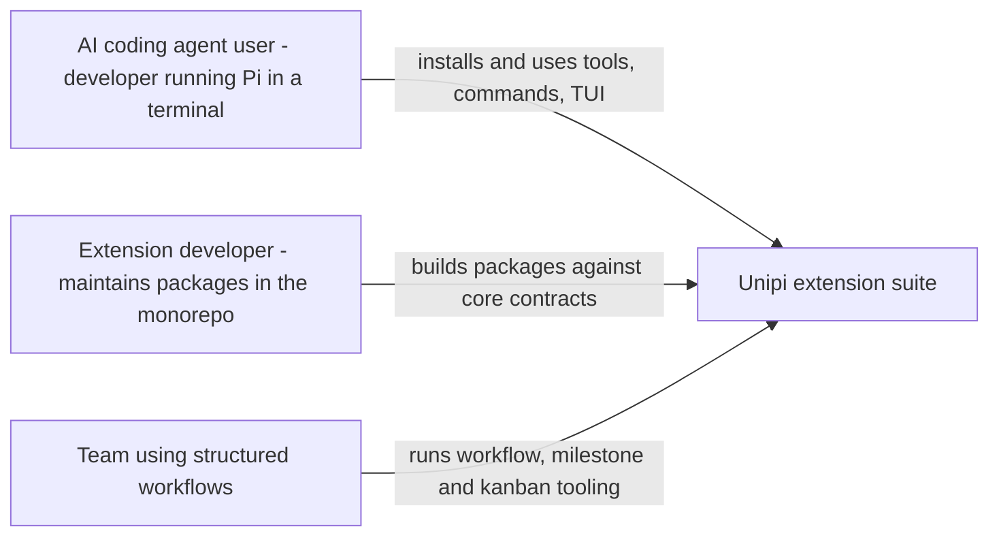
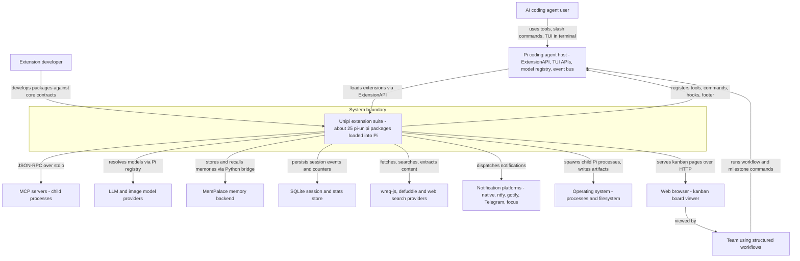
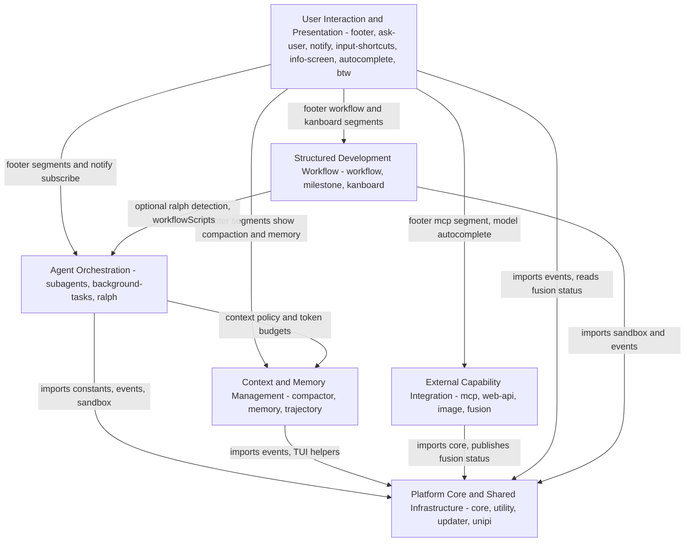
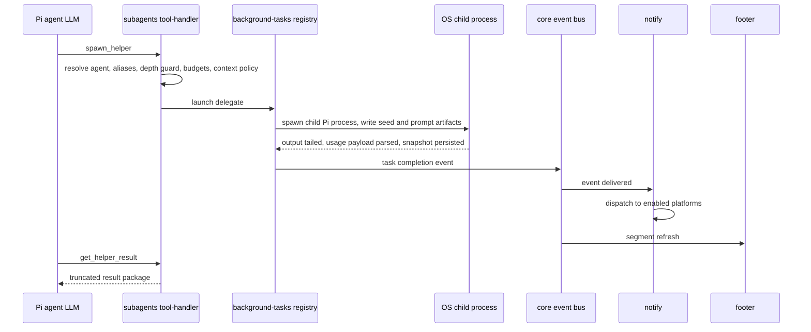

# Overview (/docs/overview)

**System:** Unipi — extension suite for the Pi coding agent\
&#x2A;*C4 Level:** System Context (Level 1)\
&#x2A;*Document generated:** 2026-09-16 06:51:20 (UTC)

***

## 1. Project Introduction [#1-project-introduction]

### 1.1 Project Name and Description [#11-project-name-and-description]

**Unipi** is a TypeScript monorepo containing approximately 25 extension packages, all published under the `@pi-unipi/*` scope, that plug into the **Pi coding agent** — a terminal-based AI coding assistant. Unipi is not a standalone application; it is a set of extensions that load into the Pi host process through Pi's `ExtensionAPI`. Each package registers tools (with TypeBox schemas), slash commands, lifecycle hooks, TUI overlays and footer/widget segments, and the umbrella package `@pi-unipi/unipi` composes them into a single working assistant at runtime.

| Attribute           | Value                                                                |
| ------------------- | -------------------------------------------------------------------- |
| Project name        | Unipi                                                                |
| Project type        | CLI tool extension suite (plugin system)                             |
| Language / platform | TypeScript, Node.js (Python bridge for MemPalace)                    |
| Deployment form     | \~25 `@pi-unipi/*` packages loaded in-process by the Pi coding agent |
| Primary interface   | Terminal UI (TUI) inside Pi; one small HTTP-served kanban UI         |

### 1.2 Core Functionality and Business Value [#12-core-functionality-and-business-value]

Unipi extends a single terminal AI coding agent into a fuller development platform. Its capabilities cluster around five functional areas:

| Area                                | What it delivers                                                                                                                                                                          | Representative packages                                                                 |
| ----------------------------------- | ----------------------------------------------------------------------------------------------------------------------------------------------------------------------------------------- | --------------------------------------------------------------------------------------- |
| **Agent orchestration**             | Delegate work to subagents, run background child processes with budgets and tracked state, execute autonomous "Ralph" loops                                                               | `subagents`, `background-tasks`, `ralph`                                                |
| **Context & memory management**     | Deterministic multi-stage context compaction, SQLite session store with recall on resume, durable memory backed by MemPalace, trajectory capture                                          | `compactor`, `memory`, `trajectory`                                                     |
| **External capability integration** | Bridge MCP servers into Pi tools, web search and smart-fetch extraction, image generation/recognition, model fusion with a sidekick runtime                                               | `mcp`, `web-api`, `image`, `fusion`                                                     |
| **User interaction & presentation** | Responsive footer status bar, interactive `ask_user` prompts and session handoff, keyboard chords with undo/redo, info screen, autocomplete, quick side questions, outbound notifications | `footer`, `ask-user`, `input-shortcuts`, `notify`, `info-screen`, `autocomplete`, `btw` |
| **Structured development workflow** | Workflow commands with sandboxes, milestone tracking, a kanban board rendered from plan/milestone markdown                                                                                | `workflow`, `milestone`, `kanboard`                                                     |

**Business value in one sentence:** developers get longer autonomous agent sessions (less context-window pressure), parallel and long-running task execution, memory that survives across sessions, and access to external tools and data — all without leaving one CLI.

### 1.3 Technical Characteristics [#13-technical-characteristics]

* **Plugin-style, event-driven architecture.** A thin shared kernel (`@pi-unipi/core`) supplies constants, an inter-module event bus (`MODULE_READY` discovery and feature events), sandbox primitives and TUI helpers. Every other package depends on core but remains independently loadable and config-gated.
* **Loose cross-package coupling.** Packages communicate primarily through core events and footer segments rather than direct imports; the notable exception is `kanboard` importing `milestone` types.
* **Process-oriented delegation.** Subagents and MCP servers run as OS child processes; Unipi tails their output, tracks usage, and can terminate whole process trees (including Windows `taskkill`).
* **File- and SQLite-based persistence** with crash-safe atomic writes for task artifacts, session events and compaction statistics.
* **Deterministic compaction pipeline.** A six-stage `compile()` pipeline (normalize → filterNoise → buildSections → formatSummary → merge → ranked brief) produces structured summaries rather than relying solely on model-generated summaries.

***

## 2. Target Users [#2-target-users]

### 2.1 User Roles [#21-user-roles]

| Role                                 | Description                                                                                        | Primary needs                                                                                                                                                         |
| ------------------------------------ | -------------------------------------------------------------------------------------------------- | --------------------------------------------------------------------------------------------------------------------------------------------------------------------- |
| **AI coding agent users**            | Developers who run the Pi coding agent in a terminal and install Unipi extensions.                 | Longer sessions without hitting context limits; parallel and background task execution; persistent memory across sessions; access to external tools and data via MCP. |
| **Extension developers**             | Engineers building or maintaining packages inside the Unipi monorepo.                              | Clear package boundaries and shared core contracts; consistent registration with the Pi extension API; reusable TUI and tooling primitives.                           |
| **Teams using structured workflows** | Groups that adopt the workflow, kanboard and milestone packages to manage disciplined development. | Workflow commands and sandboxes; kanban document parsing and a board UI; milestone and trajectory tracking.                                                           |

### 2.2 Usage Scenarios [#22-usage-scenarios]

| Scenario                               | Actor                    | Unipi behaviour                                                                                                                                                                     |
| -------------------------------------- | ------------------------ | ----------------------------------------------------------------------------------------------------------------------------------------------------------------------------------- |
| Delegating a sub-task                  | Agent user (via the LLM) | `spawn_helper` launches a child Pi process with budgets and policies; result returned through `get_helper_result`; user notified; footer updated.                                   |
| Long session nearing context limit     | Agent user               | Auto-trigger evaluates the token estimate, runs the compaction pipeline, persists statistics to SQLite; prior context is re-injected on resume and recallable via `session_recall`. |
| Using an external MCP tool             | Agent user               | MCP server started as a child process; its tools translated and registered as Pi tools; calls proxied over JSON-RPC stdio.                                                          |
| Reading a web page                     | Agent user (via the LLM) | URL validated, fetched with TLS fingerprinting, routed by content type, extracted with fallbacks, cached and returned as formatted text.                                            |
| Switching model pairing                | Agent user               | `/unipi:model` opens a picker; preset persisted; sidekick runtime started; active pair and savings shown in the footer.                                                             |
| Agent needs a human decision           | Agent user               | `ask_user` renders a TUI prompt (optionally hands off to a new session) and can alert a remote device through notify.                                                               |
| Managing project milestones on a board | Team                     | Workflow commands enforce sandboxes; milestones defined via commands/hooks; kanboard parses markdown into a web UI.                                                                 |
| Adding a new capability                | Extension developer      | New package imports `@pi-unipi/core`, emits `MODULE_READY`, registers tools/commands with the Pi `ExtensionAPI`, optionally contributes a footer segment.                           |

***

## 3. System Boundaries [#3-system-boundaries]

### 3.1 Scope Statement [#31-scope-statement]

The system boundary is **the collection of `@pi-unipi/*` packages that load into the Pi coding agent, plus their on-disk state** (task artifacts, session databases, memory stores). Everything the extensions register, render, persist or spawn is in scope. The Pi host itself, external model providers, third-party MCP server implementations and OS notification services are outside the boundary.

### 3.2 Included Components [#32-included-components]

| Domain                                | Packages / components in scope                                                                                                                                                                                                                                                                                                             |
| ------------------------------------- | ------------------------------------------------------------------------------------------------------------------------------------------------------------------------------------------------------------------------------------------------------------------------------------------------------------------------------------------ |
| Platform Core & Shared Infrastructure | `packages/core` (constants, event bus, sandbox, TUI overlay/width, model cache, fusion status, bounded output), `packages/utility` (lifecycle, cleanup, diagnostics, analytics, skill discovery), `packages/updater` (version check, installer, changelog overlays), `packages/unipi` (umbrella entry), `scripts` (bundle build, pin sync) |
| Agent Orchestration                   | `packages/subagents` (`spawn_helper`, `get_helper_result`, AgentManager, runners, budgets, authority policy, worktree isolation), `packages/background-tasks` (task registry, child-process control, delegate artifact store, result packages), `packages/ralph` (autonomous loops)                                                        |
| Context & Memory Management           | `packages/compactor` (compaction engine, tools, sandbox executor and security policy, SQLite SessionDB, resume injection), `packages/memory` (MemoryStorage, MemPalace bridge, markdown tier, migration), `packages/trajectory` (capture, prefix integrity, server)                                                                        |
| External Capability Integration       | `packages/mcp` (ServerRegistry, McpClient, translator, config), `packages/web-api` (extraction engine, provider registry, cache), `packages/image` (`image_generate`, `image_recognize`, vision gating), `packages/fusion` (model picker, presets, sidekick runtime, savings)                                                              |
| User Interaction & Presentation       | `packages/footer` (FooterRenderer, segment registry, presets), `packages/ask-user`, `packages/input-shortcuts`, `packages/notify` (platform dispatch), `packages/info-screen`, `packages/autocomplete`, `packages/btw`                                                                                                                     |
| Structured Development Workflow       | `packages/workflow` (commands, sandboxes), `packages/milestone` (model, commands, hooks), `packages/kanboard` (parsers, HTTP server, server-rendered UI)                                                                                                                                                                                   |
| Persisted state                       | Task artifacts and snapshots, per-project session SQLite databases, memory stores (MemPalace + markdown), fusion presets, per-package configuration                                                                                                                                                                                        |

### 3.3 Excluded Components [#33-excluded-components]

| Excluded element                                           | Reason                                                                                                                        |
| ---------------------------------------------------------- | ----------------------------------------------------------------------------------------------------------------------------- |
| Pi coding agent host runtime and its built-in tools        | Unipi is a set of extensions loaded into Pi; Pi's own runtime, built-in tools, model registry and TUI framework are external. |
| Third-party MCP server implementations                     | Spawned and consumed by `mcp`, but implemented and maintained externally.                                                     |
| External LLM and image model providers                     | Resolved through Pi's model registry; provider APIs are outside Unipi's control.                                              |
| Operating system notification services and their transport | Notify dispatches to native/ntfy/gotify/telegram/focus platforms but does not implement them.                                 |
| Remote content servers fetched by `web-api`                | Unipi fetches and extracts; the servers themselves are external.                                                              |
| End-user shell, terminal emulator and window manager       | Host environment; Unipi renders through Pi's TUI APIs.                                                                        |

***

## 4. External System Interactions [#4-external-system-interactions]

### 4.1 External System Inventory [#41-external-system-inventory]

| External system                               | Role relative to Unipi                                                                                                          | Interaction type                                        | Unipi packages involved                          |
| --------------------------------------------- | ------------------------------------------------------------------------------------------------------------------------------- | ------------------------------------------------------- | ------------------------------------------------ |
| **Pi coding agent (pi-coding-agent)**         | Host application; provides `ExtensionAPI`, tool registration, TUI APIs (`setFooter`, `setWidget`), model registry and event bus | In-process extension host API                           | All packages (via `@pi-unipi/unipi` composition) |
| **MCP servers**                               | Model Context Protocol servers exposing tools                                                                                   | JSON-RPC over stdio to spawned child processes          | `mcp`                                            |
| **LLM and image model providers**             | Chat and image models resolved through Pi's model registry                                                                      | Model registry / provider API                           | `image`, `fusion`, `compactor`                   |
| **MemPalace**                                 | Primary memory backend, auto-installed and auto-migrated from legacy SQLite/markdown data                                       | Embedded storage backend via Python bridge              | `memory`                                         |
| **SQLite**                                    | Session event and compaction statistics store; legacy memory migration source                                                   | Embedded database                                       | `compactor`, `memory`                            |
| **wreq-js and defuddle**                      | TLS-fingerprinted fetch and content extraction libraries                                                                        | Library calls / outbound HTTP to remote content servers | `web-api`                                        |
| **Web search / reader providers**             | DuckDuckGo, Tavily, SerpAPI, Perplexity, Jina Reader, Firecrawl, Wigolo                                                         | Outbound HTTP API calls                                 | `web-api`                                        |
| **Notification platforms**                    | Native desktop, ntfy, gotify, Telegram, focus                                                                                   | Outbound notification dispatch                          | `notify`                                         |
| **Operating system process and file systems** | Child process spawning and tree termination (incl. Windows `taskkill`), atomic file writes for artifacts                        | OS process control and filesystem                       | `background-tasks`, `subagents`, `mcp`, `fusion` |
| **Web browser (kanban board viewer)**         | Consumer of the kanboard HTTP UI                                                                                                | HTTP (server-rendered pages)                            | `kanboard`                                       |

### 4.2 Interaction Descriptions [#42-interaction-descriptions]

**Pi coding agent (host).** This is the single most important relationship: Unipi has no runtime without Pi. Packages register tools with TypeBox schemas, slash commands (e.g. `/unipi compact`, `/unipi:model`, `/unipi:ralph`), hooks (compaction, lifecycle, milestone), and TUI overlays. The footer package drives Pi's `setFooter`/`setWidget` APIs, and the fusion, image and compactor packages consume Pi's model registry. Pi lifecycle events feed the notify package.

**MCP servers.** `ServerRegistry` loads server configuration, starts each configured server as a child process, and `McpClient` performs the `initialize` handshake and `listTools` over stdio. The translator converts MCP tool definitions into Pi-compatible schemas with unique names and registers them. Partial failures are cleaned up so one broken server does not block others. Agent tool calls are proxied back to the owning server via `callTool`.

**LLM and image model providers.** Unipi never talks to providers directly for chat; it resolves models through Pi's registry (cached in `core/model-cache`). The image package additionally includes an OpenAI-images-style API client and a chat-provider-to-images bridge, with vision gating based on the active model.

**MemPalace and SQLite.** Memory uses MemPalace as its primary backend through a Python bridge, with a markdown durable tier and migration from legacy SQLite. The compactor's `SessionDB` uses SQLite for per-project events, sessions and compaction counters, including schema migration.

**Web fetch stack.** The extraction pipeline validates URLs, fetches via `wreq-js` (TLS fingerprinting), routes by content type, extracts with `defuddle` and fallbacks, detects meta-refresh, and caches results. Search dispatch goes through a provider registry selectable via a TUI.

**Notification platforms.** Notify subscribes to Pi lifecycle events and to feature events discovered dynamically via `MODULE_READY` (task completion, ralph loop start/end, ask-user prompts), builds message text with priority mapping and recap summarization, and dispatches to whichever platforms are enabled.

**Operating system.** Background tasks and subagents spawn child Pi processes, tail output, parse usage payloads, persist snapshots and terminate process trees. The `DelegateArtifactStore` writes seed/prompt/result artifacts with crash-safe atomic writes and manifests.

### 4.3 Dependency Analysis [#43-dependency-analysis]

| Dependency                | Direction                       | Criticality                | Failure impact                                                                                         |
| ------------------------- | ------------------------------- | -------------------------- | ------------------------------------------------------------------------------------------------------ |
| Pi coding agent           | Unipi → Pi                      | Critical                   | Unipi cannot load or run at all.                                                                       |
| OS process/filesystem     | Unipi → OS                      | Critical for orchestration | Subagents, background tasks, MCP servers and sidekick runtime unavailable.                             |
| SQLite                    | Unipi → SQLite                  | High                       | Session store and compaction statistics unavailable; compaction summaries themselves still computable. |
| MemPalace                 | Unipi → MemPalace               | High for memory            | Memory falls back to markdown tier / legacy data per migration logic.                                  |
| Model providers           | Unipi → Pi registry → providers | High                       | Image, fusion and model-dependent compaction features degrade.                                         |
| MCP servers               | Unipi → servers                 | Medium (per server)        | Individual servers fail independently thanks to partial-failure cleanup.                               |
| Web providers / libraries | Unipi → HTTP                    | Medium                     | Fallback extraction and alternate providers mitigate single-provider outages.                          |
| Notification platforms    | Unipi → platforms               | Low                        | Notifications not delivered; core agent function unaffected.                                           |

***

## 5. System Context Diagram [#5-system-context-diagram]

### 5.1 C4 System Context [#51-c4-system-context]

### 5.2 Internal Domain View (context for the next level) [#52-internal-domain-view-context-for-the-next-level]

While the SystemContext level treats Unipi as a single box, the domain analysis reveals six internal domains connected through the core kernel. This view is provided to orient readers toward the Container level.

### 5.3 Key Interaction Flows [#53-key-interaction-flows]

The following flows are ranked by importance in the domain analysis and illustrate how external systems participate.

#### Flow 1 — Subagent Delegation (importance 9.5) [#flow-1--subagent-delegation-importance-95]

#### Flow 2 — Context Compaction and Session Recall (importance 9.0) [#flow-2--context-compaction-and-session-recall-importance-90]

1. A compaction hook, the `/unipi compact` command or the auto-trigger fires; the auto-trigger compares the token estimate against the budget (`compactor/src/compaction/auto-trigger.ts`).
2. `compile()` runs the six-stage pipeline: normalize → filterNoise → buildSections → formatSummary → merge, optionally producing a ranked brief.
3. `SessionDB` records events and compaction counters in SQLite.
4. The compactor footer segment displays compaction statistics.
5. On resume, `resume-inject` and the `session_recall` tool restore prior context.

#### Flow 3 — MCP Server Tool Bridging (importance 8.0) [#flow-3--mcp-server-tool-bridging-importance-80]

1. Configuration is loaded and synced (`mcp/src/config/manager.ts`).
2. `ServerRegistry` prepares and starts servers, handling partial failures.
3. `McpClient` performs the initialize handshake and `listTools` over stdio.
4. The translator converts tools and registers them with Pi's `ExtensionAPI`.
5. The MCP footer segment shows active server and tool counts.

#### Flow 4 — Web Smart-Fetch (importance 6.5) [#flow-4--web-smart-fetch-importance-65]

Tool invoked → provider selected from registry → URL validated, fetched via `wreq-js`, content-type routed, extracted with `defuddle` and fallbacks → result formatted and cached.

#### Flow 5 — Model Fusion Preset (importance 6.5) [#flow-5--model-fusion-preset-importance-65]

`/unipi:model` → model registry resolved, picker overlay mounted → preset persisted, sidekick runtime spawned → fusion status (active pair, savings) published through core → footer core segment renders it.

#### Flow 6 — Structured Workflow with Kanban Board (importance 6.0) [#flow-6--structured-workflow-with-kanban-board-importance-60]

Workflow command dispatched to a skill with sandbox enforcement → milestones created/updated via commands and hooks → `ParserRegistry` parses plan and milestone markdown; HTTP routes render board pages → footer workflow and kanboard segments reflect state.

#### Flow 7 — Interactive Ask-User (importance 6.0) [#flow-7--interactive-ask-user-importance-60]

`ask_user` validates schema against the settings allow-list and normalizes options → prompt notification dispatched to platforms → TUI renderer collects the answer, or the launcher hands off to a new session → `AskUserResponse` returned.

### 5.4 Architecture Decisions Visible at the Context Level [#54-architecture-decisions-visible-at-the-context-level]

| Decision                                                   | Rationale                                                                                                         | Consequence                                                                                    |
| ---------------------------------------------------------- | ----------------------------------------------------------------------------------------------------------------- | ---------------------------------------------------------------------------------------------- |
| Ship as Pi extensions rather than a standalone CLI         | Reuse Pi's agent loop, model registry and TUI; deliver value inside an existing workflow                          | Hard dependency on Pi's `ExtensionAPI` stability; no operation outside Pi                      |
| Run subagents as separate child Pi processes               | Isolation, independent budgets, crash containment, parallelism                                                    | OS process management complexity (tailing, usage parsing, tree termination, Windows specifics) |
| Bridge MCP via stdio child processes with tool translation | Standard protocol gives access to a broad tool ecosystem without bespoke integrations                             | Server lifecycle and partial-failure handling become Unipi responsibilities                    |
| Deterministic compaction pipeline with SQLite persistence  | Predictable summaries and measurable statistics across sessions                                                   | Additional local state to migrate and manage                                                   |
| MemPalace as primary memory backend with markdown tier     | Durable, queryable memory with a human-readable fallback                                                          | Introduces a Python bridge and auto-install/migration logic                                    |
| Event bus with `MODULE_READY` discovery                    | Packages remain independently loadable and config-gated; consumers (notify, footer) discover features dynamically | Implicit coupling via event names; contract lives in core                                      |

***

## 6. Technical Architecture Overview [#6-technical-architecture-overview]

### 6.1 Technology Stack [#61-technology-stack]

| Layer                      | Technology                                                                                                                                                |
| -------------------------- | --------------------------------------------------------------------------------------------------------------------------------------------------------- |
| Language                   | TypeScript (monorepo); Python for the MemPalace bridge and migration script                                                                               |
| Host / runtime             | Node.js inside the Pi coding agent process                                                                                                                |
| Extension contracts        | Pi `ExtensionAPI` — tools with TypeBox schemas, slash commands, hooks, TUI overlays, `setFooter`/`setWidget`                                              |
| Inter-module communication | `@pi-unipi/core` event bus (`MODULE_READY`, feature events such as `RALPH_LOOP_START/END`)                                                                |
| Persistence                | SQLite (session events, compaction statistics), MemPalace + markdown (memory), filesystem with atomic writes (task artifacts, snapshots, presets, config) |
| External protocols         | JSON-RPC over stdio (MCP), HTTP/HTTPS (web providers, notification platforms, kanboard UI)                                                                |
| Web extraction             | `wreq-js` (TLS-fingerprinted fetch), `defuddle` (content extraction)                                                                                      |
| Process control            | Node child processes, Windows `taskkill` tree termination, worktree isolation for subagents                                                               |
| Build tooling              | Bundle build and dependency pin sync scripts (`scripts/build-bundle.mjs`, `scripts/sync-pins.mjs`)                                                        |

### 6.2 Architecture Patterns [#62-architecture-patterns]

* **Plugin / microkernel.** `@pi-unipi/core` is the kernel; all other packages are plugins that register with the host and discover one another through events. The umbrella `@pi-unipi/unipi` package composes them.
* **Event-driven integration.** Cross-domain coupling is deliberately loose — the presentation domain (footer, notify) subscribes to events from orchestration, context and integration domains rather than importing their internals.
* **Registry pattern.** Recurs throughout: background-task registry, MCP `ServerRegistry`, web provider registry, footer segment registry, notify event-subscription registry, kanboard `ParserRegistry`, info-screen registry.
* **Pipeline pattern.** Compaction `compile()` and web `extract()` are explicit staged pipelines with well-defined intermediate representations.
* **Policy objects.** Subagent spawning applies budgets, depth guards, context policy and authority policy as separable libraries; the compactor's sandbox executor is guarded by a security policy scanner/evaluator.
* **Durable, crash-safe state.** `DelegateArtifactStore` and `durable-fs` provide atomic writes and manifests so process crashes do not corrupt artifacts.

### 6.3 Key Design Decisions and Observations [#63-key-design-decisions-and-observations]

**Complexity concentration.** Although coupling between domains is low, complexity inside a few hub files is high: `background-tasks/src/registry.ts`, `subagents/src/tool-handler.ts`, `compactor/src/compaction/summarize.ts` and `tools/register.ts`, `mcp/src/bridge/registry.ts`, and `web-api/src/engine/extract.ts`. These are the natural focus points for review and testing.

**Domain placement versus documentation.** Product documentation groups "structured development" as workflow/kanboard/milestone/trajectory/ralph. In code, `ralph` behaves as orchestration (iterative loops emitting loop events) and `trajectory` as context capture; this document places them with Agent Orchestration and Context & Memory Management respectively. Readers reconciling with earlier documentation should note this refinement.

**Cross-package coupling to watch.** `kanboard/parser` imports `milestone` types directly (strength 7.0 in the domain analysis). This is the strongest direct inter-package dependency outside the core kernel and is worth monitoring if the milestone model evolves.

**Configuration gating.** Every package is independently enableable, which supports incremental adoption but means the effective system context varies per installation — e.g. notify, kanboard's HTTP server or MCP bridging may be absent.

**Platform specifics.** Windows process-tree termination is handled explicitly (`windows-taskkill.ts`); the memory package depends on a Python runtime for the MemPalace bridge. Both are environmental prerequisites that sit at the system boundary.

### 6.4 Summary [#64-summary]

Unipi occupies a clear position in its environment: it lives entirely inside the Pi coding agent as a family of loosely coupled extensions, and it reaches outward to MCP servers, model providers, web content, notification platforms and the operating system to make the agent more capable and its sessions longer. Its boundary is the set of `@pi-unipi/*` packages plus the local state they persist; everything it hosts, bridges or notifies is external. The core kernel and event bus are the architectural linchpin, and the next level of documentation (Container view) should elaborate the six internal domains and their hub components identified here.
