# Workflow (/docs/workflow)


> **Project**: Unipi — a TypeScript monorepo of \~25 `@pi-unipi/*` extension packages for the Pi coding agent
> **Document scope**: End-to-end description of the system's core runtime workflows, their coordination mechanisms, exception handling, and key implementation paths.
> **Generated**: 2026-09-16 (UTC)

***

## 1. Workflow Overview [#1-workflow-overview]

### 1.1 System Positioning [#11-system-positioning]

Unipi does not run as a standalone application. Every workflow described here is triggered from inside the **Pi coding agent host** — via a tool call issued by the LLM, a `/unipi:*` slash command typed by the developer, or a Pi lifecycle hook (`session_start`, `session_before_compact`, `agent_end`, etc.) — and terminates at one of three sinks:

| Sink              | Examples                                                                                                                                               |
| ----------------- | ------------------------------------------------------------------------------------------------------------------------------------------------------ |
| **Agent context** | Tool results (`spawn_helper`, `get_helper_result`, `ask_user`, bridged MCP tools, web fetch), compaction summaries injected into the conversation      |
| **Terminal UI**   | Footer segments, TUI overlays (model picker, settings, fleet view), toasts                                                                             |
| **Durable state** | Delegate artifact directories under `.unipi/`, async run dirs under the temp root, SQLite session DB, MemPalace/markdown memory tier, MCP config files |

### 1.2 Main Workflows [#12-main-workflows]

The system exposes eight workflows that together deliver its value proposition (longer sessions, parallel/background execution, external capability access, richer terminal UX):

| #  | Workflow                                               | Trigger                                                         | Primary Packages                                  | Importance   |
| -- | ------------------------------------------------------ | --------------------------------------------------------------- | ------------------------------------------------- | ------------ |
| W1 | Subagent Delegation                                    | `spawn_helper` tool call                                        | subagents, background-tasks, core, notify, footer | 9.5          |
| W2 | Context Compaction & Session Recall                    | `session_before_compact` hook / `/unipi:compact` / auto-trigger | compactor, footer                                 | 9.0          |
| W3 | MCP Server Tool Bridging                               | Extension load / TUI add-restart                                | mcp, footer                                       | 8.0          |
| W4 | Web Smart-Fetch                                        | web fetch/search tool call                                      | web-api                                           | 6.5          |
| W5 | Model Fusion Preset                                    | `/unipi:model`, `/unipi:fusion-preset`                          | fusion, core, footer                              | 6.5          |
| W6 | Structured Workflow & Kanban                           | `/unipi` workflow commands, kanboard server                     | workflow, milestone, kanboard                     | 6.0          |
| W7 | Interactive Ask-User                                   | `ask_user` tool call                                            | ask-user, notify                                  | 6.0          |
| W8 | Notification Dispatch (cross-cutting)                  | Any Pi lifecycle or `unipi:*` event                             | notify                                            | —            |
| W0 | Extension Bootstrap & Module Discovery (cross-cutting) | Pi host loads the extension                                     | unipi (umbrella), every package, core             | prerequisite |

### 1.3 Core Execution Paths [#13-core-execution-paths]

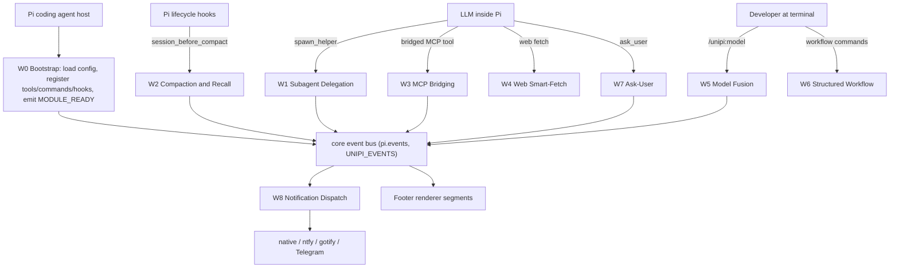

### 1.4 Key Process Nodes [#14-key-process-nodes]

The following hub modules are where most workflow decisions are made. Operators debugging a flow should start from these files:

| Node                                              | File                                                  | Role in workflows                                                                                                          |
| ------------------------------------------------- | ----------------------------------------------------- | -------------------------------------------------------------------------------------------------------------------------- |
| `handleSpawnHelper`                               | `packages/subagents/src/tool-handler.ts`              | Routes every `spawn_helper` call into one of three families: management action, `workflowScript`, or single-child launch   |
| `runAsyncSubagent`                                | `packages/subagents/src/async-runner.ts`              | Spawns `pi --mode json -p` children, streams JSON events, enforces deadlines, retries on EDR kills                         |
| `BackgroundTaskRegistry`                          | `packages/background-tasks/src/registry.ts`           | Owns background task lifecycle: spawn, output tailing, usage normalisation, snapshots, kill tree, completion notifications |
| `DelegateArtifactStore`                           | `packages/background-tasks/src/delegate/artifacts.ts` | Crash-safe artifact persistence with manifest state machine                                                                |
| `registerCompactionHooks`                         | `packages/compactor/src/compaction/hooks.ts`          | Handles `session_before_compact` / `session_compact`, drives `compileRanked()`                                             |
| `decideAutoCompaction`                            | `packages/compactor/src/compaction/auto-trigger.ts`   | Pure decision function for percentage-based auto-compaction                                                                |
| `ServerRegistry.startServers`                     | `packages/mcp/src/bridge/registry.ts`                 | Discovery barrier, unique-name assertion, deterministic tool registration, rollback                                        |
| `defuddleFetch`                                   | `packages/web-api/src/engine/extract.ts`              | URL validation → wreq-js fetch → content-type routing → defuddle → fallback                                                |
| `registerEventListeners` / `dispatchNotification` | `packages/notify/events.ts`                           | Subscribes to lifecycle and `unipi:*` events; parallel fan-out to platforms                                                |

### 1.5 Process Coordination Mechanisms [#15-process-coordination-mechanisms]

Cross-package coordination is deliberately indirect. Four mechanisms account for nearly all inter-module interaction:

1. **Core event bus** — `UNIPI_EVENTS` constants in `packages/core/events.ts` (`unipi:module:ready`, `unipi:mcp:server:started`, `unipi:compactor:compacted`, `unipi:ralph:loop:end`, `unipi:ask-user:prompt`, `unipi:notify:sent`, …) emitted via `pi.events`. Producers never import consumers.
2. **Shared global symbols** — e.g. `Symbol.for("unipi.background-tasks.shared-registry")` lets `notify` read the live background-task registry (`hasPendingWakeTask()`) with zero import coupling.
3. **Footer segment registry** — each package contributes a segment; the footer reads state (fusion status, MCP counts, compactor stats) rather than being pushed to.
4. **Filesystem contracts** — `status.json`, `result.json`, `manifest.json`, `seed.json` in well-known directories allow the parent, child, and later sessions to coordinate without a shared process.

***

## 2. Main Workflows [#2-main-workflows]

### 2.1 W1 — Subagent Delegation Flow [#21-w1--subagent-delegation-flow]

**Business purpose**: Let the primary agent fan out work to helper agents (foreground or background) while keeping its own context window bounded and enforcing guard rails against runaway spawning.

#### 2.1.1 Top-level routing [#211-top-level-routing]

`handleSpawnHelper` in `tool-handler.ts` never throws; it wraps every branch in a `try/catch` and returns a text result with `{ status: "error" }` on failure. Routing order is fixed:

1. `args.action` present → **management action** (`handleAction`)
2. `args.workflowScript` present → **workflow script** (`handleWorkflowScript`, or `handleAsyncWorkflowScript` for process-backed children)
3. otherwise → **single-child launch** (`handleSingleChild`)

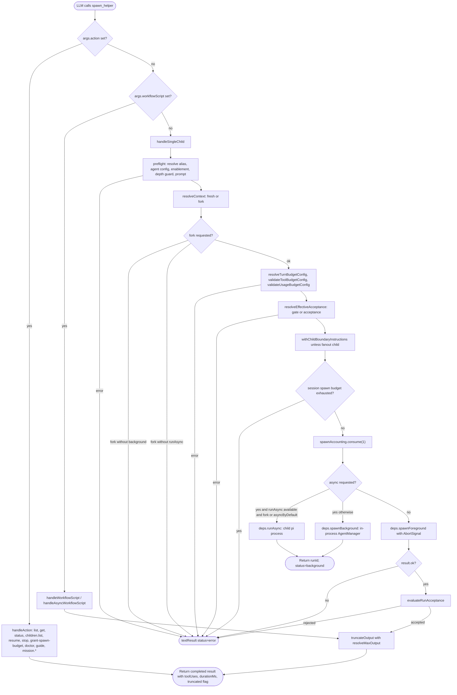

#### 2.1.2 Preflight gating (guard rails before side effects) [#212-preflight-gating-guard-rails-before-side-effects]

`preflight()` executes the full validation chain *before* any process is created:

| Check              | Implementation                                                                            | Failure message (visible to LLM)                              |
| ------------------ | ----------------------------------------------------------------------------------------- | ------------------------------------------------------------- |
| Agent name present | `args.agent ?? args.type`                                                                 | "spawn\_helper requires an agent (or legacy type) parameter." |
| Alias resolution   | `manager.resolveAlias()` → `manager.getAgentConfig()`                                     | "Unknown agent type … Known types: …"                         |
| Enablement         | `manager.isTypeEnabled()`                                                                 | "Agent type … is disabled by configuration."                  |
| Depth guard        | `resolveMaxSubagentDepth()` + `depthExceeded(env, maxDepth)` (depth carried in child env) | "Subagent depth cap reached (maxSubagentDepth N)…"            |
| Prompt present     | `args.task ?? args.prompt`                                                                | "spawn\_helper requires a task (or legacy prompt) parameter." |

Post-preflight, `handleSingleChild` applies:

* **Context policy**: explicit `context: "fork"` never silently downgrades — it requires background mode *and* the process runner; otherwise a typed error is returned.
* **Budgets**: turn budget (appended to the child system prompt via `appendTurnBudgetSystemPrompt`), tool budget, usage budget.
* **Acceptance gates**: `gate` shorthand (single verify command) is mutually exclusive with the `acceptance` object.
* **Session spawn budget**: `spawnAccounting.used() >= cap` → refuse with guidance to use `grant-spawn-budget` from the interactive root session.

#### 2.1.3 Background (process-mode) execution path [#213-background-process-mode-execution-path]

When `runAsync` is chosen, `runAsyncSubagent` in `async-runner.ts` executes the child with a strict status lifecycle recorded in `status.json`:

```
queued → running → { completed | failed | stopped | timedOut }
```

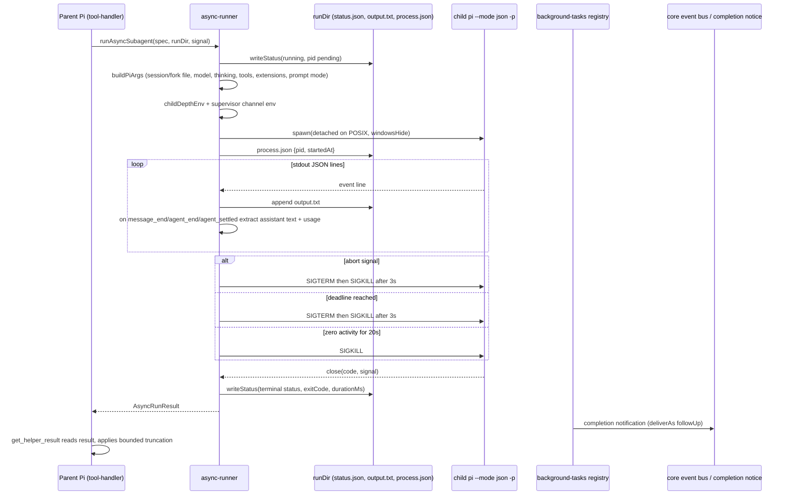

Key implementation properties observed in `runChildProcess`:

* **Process-group kill**: `trySignalChild` sends the signal to `-child.pid` (the detached process group) so grandchild shells are terminated too, falling back to `child.kill()`.
* **Terminal proof**: `pid`, `exitCode`, and `signal` are recorded on the result so the parent can distinguish a real exit from a lost child.
* **Usage extraction**: tolerant to both `input/output/total` and `inputTokens/outputTokens/totalTokens` field naming.
* **stderr heuristics**: the last three lines matching `/Error|FATAL/i` are captured (≤500 chars) as the error string for non-zero exits.

#### 2.1.4 Durable delegate launch (background-tasks delegate subsystem) [#214-durable-delegate-launch-background-tasks-delegate-subsystem]

For registry-managed delegates (`bg_delegate`), `prepareDelegateLaunch` in `delegate/runner.ts` enforces an ordering guarantee: **preflight refusals create nothing**.

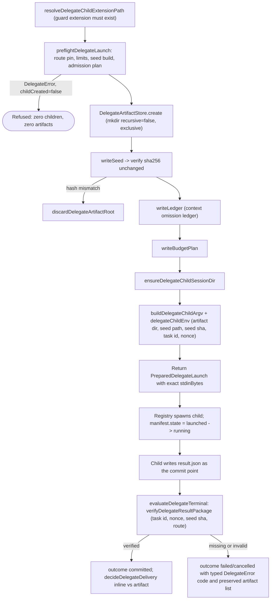

Route pinning (`resolveDelegateRoute` in `launch.ts`) has **no fallback**: an unavailable provider/model pair is a typed `route_unresolved` refusal, because silently answering on a different model is treated as a correctness failure.

#### 2.1.5 Result retrieval and delivery [#215-result-retrieval-and-delivery]

* `get_helper_result` reads the committed result and applies `truncateOutput` (reference default 200 KB / 5000 lines via `resolveMaxOutput`).
* For delegates, `decideDelegateDelivery(answerBytes, requested, cap)` chooses `inline` when the exact serialized answer is within `DELEGATE_INLINE_ANSWER_BYTES`, otherwise degrades explicitly to an **artifact reference** — the answer is never shortened to fit. Requesting inline for an oversized answer raises `result_too_large_for_inline` with remediation steps.

***

### 2.2 W2 — Context Compaction & Session Recall Flow [#22-w2--context-compaction--session-recall-flow]

**Business purpose**: Keep long sessions viable by replacing raw history with a deterministic, zero-LLM structured summary, while persisting statistics and enabling recall.

#### 2.2.1 Trigger sources [#221-trigger-sources]

| Source                                 | Path                                                                                                    |                                                                                       |
| -------------------------------------- | ------------------------------------------------------------------------------------------------------- | ------------------------------------------------------------------------------------- |
| Pi's own threshold/overflow compaction | Pi emits `session_before_compact` with \`reason: "threshold"                                            | "overflow"`; compactor intercepts only if `config.overrideDefaultCompaction\` is true |
| `/unipi:compact` or `compact` tool     | Custom instructions carry the compactor marker (`isCompactor`) and optional `keep:N` / follow-up prompt |                                                                                       |
| UniPi auto-compaction                  | `decideAutoCompaction()` evaluates a context-usage sample and, when it fires, calls `ctx.compact()`     |                                                                                       |

#### 2.2.2 Auto-trigger decision algorithm [#222-auto-trigger-decision-algorithm]

`decideAutoCompaction` is a **pure function** over `(config, usage, state, nowMs)` returning `{ shouldTrigger, reason, state }`. Its decision order embeds loop safeguards:

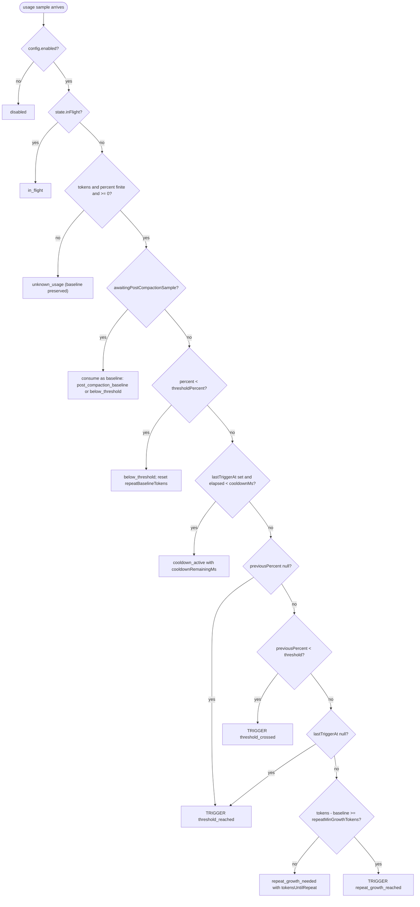

Defaults (`AUTO_COMPACTION_DEFAULTS`): disabled, threshold 80 %, cooldown 60 s, repeat growth 4 000 tokens, notify on. Values are clamped (`thresholdPercent` 1–99, `cooldownMs` ≤ 24 h).

State transitions after a trigger: `markAutoCompactionComplete` sets `inFlight=false, awaitingPostCompactionSample=true`; `markAutoCompactionError` clears in-flight but keeps `lastTriggerAt` so cooldown still applies.

#### 2.2.3 The `session_before_compact` handler [#223-the-session_before_compact-handler]

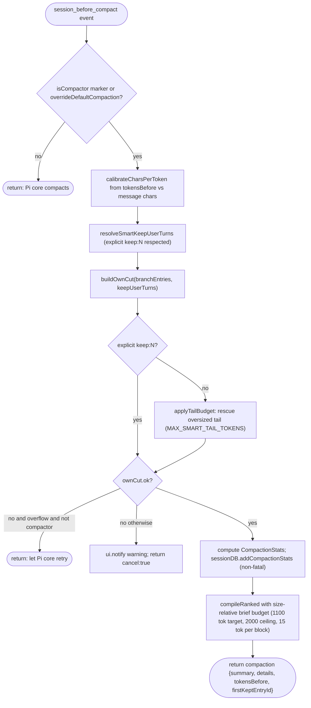

#### 2.2.4 The compile pipeline (`summarize.ts`) [#224-the-compile-pipeline-summarizets]

```
normalizeMessages → filterNoise → [selectRankedBriefBlocks] → buildSections → formatSummary → mergePrevious → + RECALL_NOTE
```

* `compile()` — unranked path, caps the brief transcript.
* `compileRanked()` — used by the hook; passes `briefBlocksFor = selectRankedBriefBlocks(...)`, disables the fresh-brief cap and preserves the fresh brief on merge.
* `mergePrevious` first strips the previous summary's `RECALL_NOTE` (`stripRecallNote`) so the note is never duplicated.
* The budget is **char-based but token-calibrated**: `maxBriefChars = 1100 × charsPerToken` where `charsPerToken` comes from Pi's real `tokensBefore`.

#### 2.2.5 Post-compaction (`session_compact`) [#225-post-compaction-session_compact]

* Ignored unless `event.fromExtension` and not already handled by `/unipi:compact`'s own toast.
* If `willRetry`, nothing is shown.
* Toast via `formatCompactionStats(stats)` after 500 ms.
* If a `followUpPrompt` was parsed, it is sent as a user message; otherwise, for threshold/overflow reasons with `continueAfterThresholdCompact`, an **invisible auto-continue** is scheduled: a `custom` message with `customType: "compactor-auto-continue"`, `display: false`, `triggerTurn: true`, `deliverAs: "followUp"`. The `context` hook filters that message out of the LLM payload so the model simply continues from the summary.

#### 2.2.6 Persistence and recall [#226-persistence-and-recall]

* `SessionDB` (`session/db.ts`) is project-scoped SQLite with worktree/hash suffix handling, schema migrations, and pre-prepared statements; it records events, session metadata, and cumulative compaction counters.
* On `session_start`, `resume-inject` re-injects the prior summary; the `session_recall` tool pulls specific recall blocks on demand.
* The footer compactor segment reads live Pi session data (the `COMPACTOR_STATS_UPDATED` event is retained only for compatibility).

***

### 2.3 W3 — MCP Server Tool Bridging Flow [#23-w3--mcp-server-tool-bridging-flow]

**Business purpose**: Turn external MCP servers into ordinary Pi tools with deterministic naming and clean failure semantics.

#### 2.3.1 Startup with a discovery barrier [#231-startup-with-a-discovery-barrier]

`ServerRegistry.startServers()` prepares all servers **in parallel** and registers tools only after **every** server has either prepared or failed:

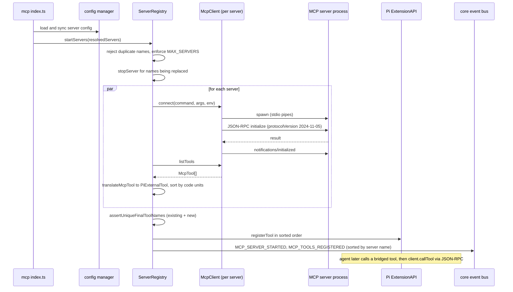

#### 2.3.2 State model per server [#232-state-model-per-server]

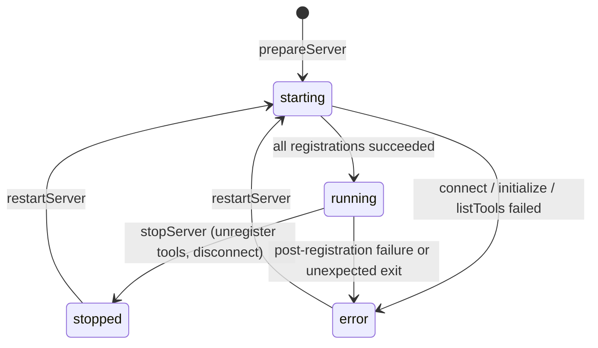

#### 2.3.3 Failure semantics [#233-failure-semantics]

* Any single server failing does **not** block others; its entry stays in `error` state with the message and an `MCP_SERVER_ERROR` event is emitted.
* Duplicate *final* tool names across servers fail the whole batch: `failPreparedServers` disconnects all prepared clients before rethrowing.
* If `registerTool` throws mid-batch and the host supports unregistration, already-registered names are rolled back in reverse order; on Pi 0.80 (no rollback) the partial set is **kept and reported truthfully** with the message "some MCP tools remain registered until Pi restarts".
* `stopServer` refuses to run when tools are registered but the host cannot unregister them, instructing the user to restart Pi.
* `disconnectAll` (extension shutdown) disconnects clients without claiming tools were removed.

`McpClient` details: stderr is capped at 10 000 chars (trimmed to the last 5 000), exit during startup rejects with the stderr tail, and an unexpected exit after connection rejects all pending requests.

***

### 2.4 W4 — Web Smart-Fetch Flow [#24-w4--web-smart-fetch-flow]

**Business purpose**: Give the agent robust access to web content despite bot-detection and messy HTML.

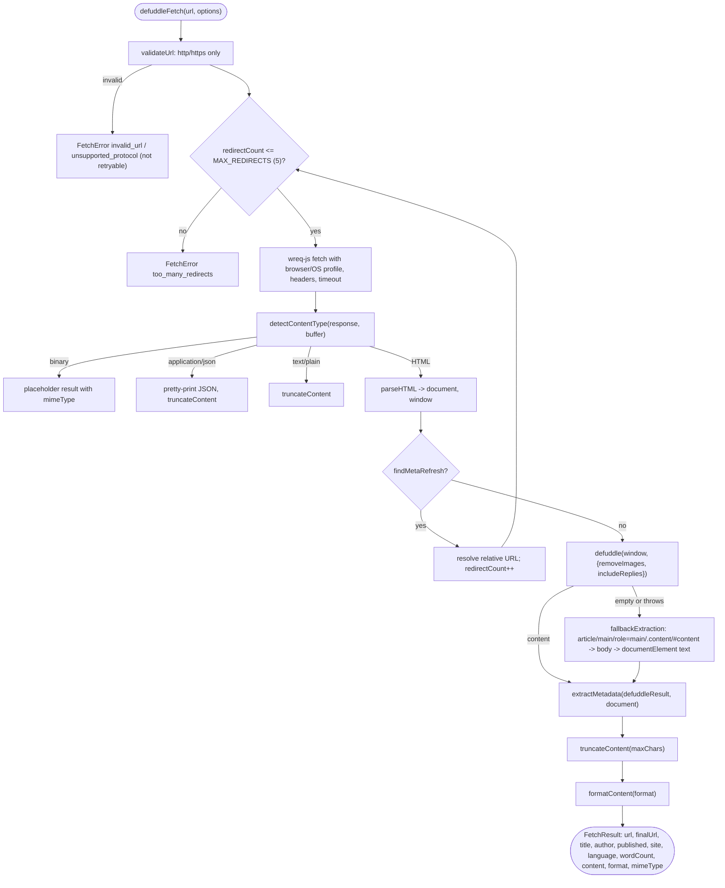

Error classification in the catch block: messages containing `timeout` → `timeout` (phase `waiting`, retryable); `network`/`ECONNREFUSED` → `network_error` (phase `connecting`, retryable); anything else → `unexpected_response` (not retryable). `createError` returns a **real `Error` instance** carrying the `FetchError` fields so boundary catches surface `.message` rather than `[object Object]`.

**Batch fetch** (`defuddleFetchMultiple`) implements a bounded worker pool (`DEFAULT_BATCH_CONCURRENCY`): each worker pulls the next index on completion, results are written positionally, and per-item errors are captured rather than failing the batch. The return value reports `total`, `succeeded`, `failed`, and `items`.

***

### 2.5 W5 — Model Fusion Preset Flow [#25-w5--model-fusion-preset-flow]

**Business purpose**: Pair a primary and a "sidekick" model to reduce cost while surfacing savings in the footer.

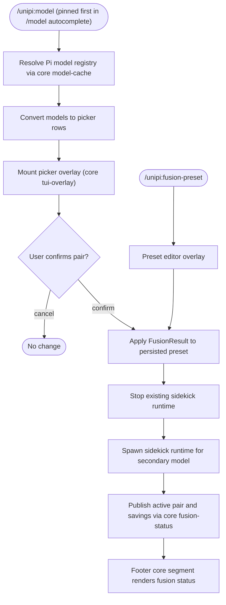

Downstream effects: the active model pair influences vision gating in the image package and the savings telemetry (`savings.ts`) shown in the footer.

***

### 2.6 W6 — Structured Workflow with Kanban Board Flow [#26-w6--structured-workflow-with-kanban-board-flow]

**Business purpose**: Give teams disciplined, sandboxed development steps and a visual board generated from markdown artefacts.

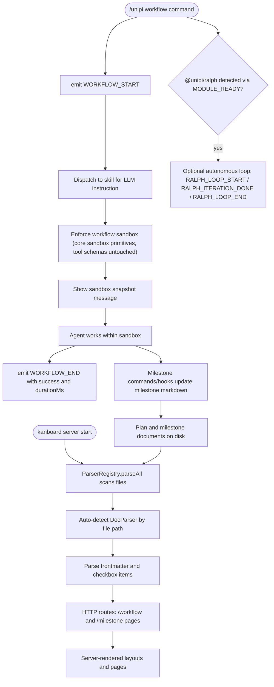

Note: `kanboard/parser` imports milestone types directly — the one hard intra-domain coupling in an otherwise event-driven system.

***

### 2.7 W7 — Interactive Ask-User Flow [#27-w7--interactive-ask-user-flow]

**Business purpose**: Let the agent block for a human decision, optionally alerting a remote device and supporting hand-off to a fresh session.

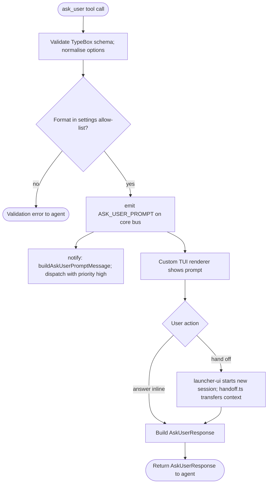

***

### 2.8 W8 — Notification Dispatch Flow (cross-cutting) [#28-w8--notification-dispatch-flow-cross-cutting]

`registerEventListeners` in `notify/events.ts` distinguishes two subscription channels:

* **Pi lifecycle hooks** (`agent_end`, `agent_settled`, `session_shutdown`) must use `pi.on()` — these are replaced automatically on reload.
* **Event-bus events** (`unipi:*`, third-party `rpiv:ask-user:prompt`, `permissions:ui_prompt`) use `pi.events.on()`; unsubscribe functions are collected in `unsubs` and `unregisterAll()` runs before each registration to prevent listener accumulation across reloads.

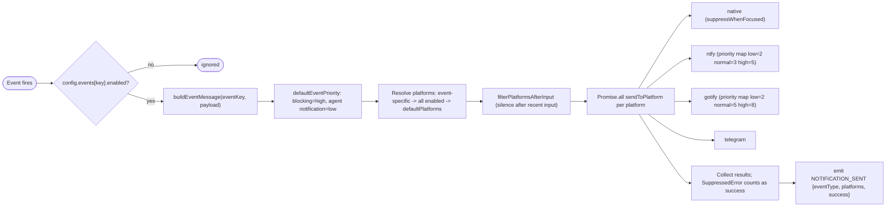

Dispatch is **fire-and-forget** from the handler (`.catch(() => {})`) so a slow or failing platform never blocks the emitter. `hasPendingWakeTask()` reads the shared registry symbol to know whether a running background task will wake the agent, informing whether an "input needed" alert is warranted.

***

### 2.9 W0 — Extension Bootstrap & Module Discovery [#29-w0--extension-bootstrap--module-discovery]

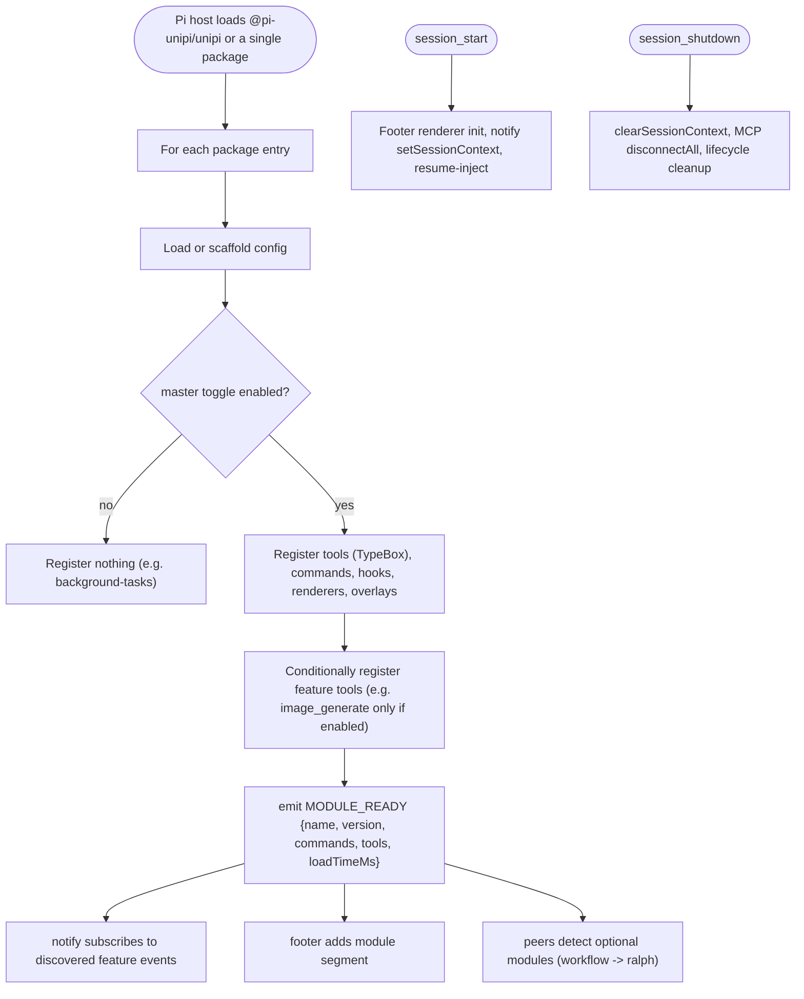

Operational implication: a missing tool or footer segment is usually a **configuration state**, not a defect — check the master toggle and whether `MODULE_READY` was emitted.

***

## 3. Flow Coordination and Control [#3-flow-coordination-and-control]

### 3.1 Multi-module coordination matrix [#31-multi-module-coordination-matrix]

| Producer                  | Signal                                                                                      | Consumer(s)                                     | Coupling type             |
| ------------------------- | ------------------------------------------------------------------------------------------- | ----------------------------------------------- | ------------------------- |
| Every package             | `MODULE_READY`                                                                              | notify, footer, workflow (ralph detection)      | Event bus                 |
| background-tasks registry | completion notification (`customType: background-task-notification`, `deliverAs: followUp`) | Pi turn queue → parent agent                    | Host message API          |
| background-tasks registry | `globalThis[Symbol.for("unipi.background-tasks.shared-registry")]`                          | notify (`hasPendingWakeTask`)                   | Shared symbol             |
| mcp ServerRegistry        | `MCP_SERVER_STARTED/STOPPED/ERROR`, `MCP_TOOLS_REGISTERED/UNREGISTERED`                     | footer mcp segment, notify (`mcp_server_error`) | Event bus                 |
| compactor hooks           | compaction result returned from `session_before_compact`; `COMPACTOR_COMPACTED`             | Pi core (replaces history), footer, notify      | Hook return value + event |
| fusion                    | `fusion-status` publish                                                                     | footer core segment, image vision gating        | Core shared state         |
| ask-user                  | `ASK_USER_PROMPT`                                                                           | notify                                          | Event bus                 |
| ralph                     | `RALPH_LOOP_START/END`, `RALPH_ITERATION_DONE`                                              | notify, footer, workflow                        | Event bus                 |
| workflow                  | `WORKFLOW_START/END`                                                                        | notify (`workflow_end`), footer                 | Event bus                 |
| notify                    | `NOTIFICATION_SENT`                                                                         | info-screen / analytics                         | Event bus                 |

### 3.2 State management and synchronisation [#32-state-management-and-synchronisation]

**Subagent/async runs** — `status.json` per run dir is the source of truth (`writeStatus` merges with the existing record and stamps `updatedAt`). In-process runs are tracked by `AgentManager` records (`queued | running | completed | …`) with an `abortController` per record.

**Delegate tasks** — two independent writers, two files, to avoid races:

* `manifest.json` (parent-owned): `launched → running → committed | failed | cancelled` — records only what the parent observed at launch; never used to decide success.
* `result.json` (child-owned): the single commit point. The parent's adjudicated view is written separately as `outcome.json`.

`DelegateArtifactStore` serialises writes through a `writeChain` promise so concurrent artifact writes for one task never interleave.

**Auto-compaction** — `AutoCompactionState` is an immutable value returned by each decision; the runtime replaces its held state with `decision.state`. `inFlight` acts as a mutex between `ctx.compact()` and Pi's completion report.

**MCP** — `Map<name, McpRegistryEntry>` with an explicit `ServerState.status`; replacements stop the old instance before the new one prepares, so names are released deterministically.

**Notify** — module-level `sessionCtx` set on `session_start` and cleared on `session_shutdown`; `unsubs` array reset on every registration.

### 3.3 Data passing and sharing [#33-data-passing-and-sharing]

| Boundary                              | Mechanism                                                                                      | Integrity control                                                                             |
| ------------------------------------- | ---------------------------------------------------------------------------------------------- | --------------------------------------------------------------------------------------------- |
| Parent → child Pi process (subagents) | CLI argv built by `buildPiArgs`, task via prompt file or stdin (`taskDelivery`), depth via env | `childDepthEnv` increments depth; supervisor channel dir in env                               |
| Parent → delegate child               | `seed.json` path + `UNIPI_BG_*` env (`seedSha256`, `taskId`, `launchNonce`)                    | Child verifies seed hash before first model call                                              |
| Delegate child → parent               | `result.json` result package                                                                   | `verifyDelegateResultPackage` checks task id, nonce, seed sha, route attestation, answer hash |
| Compactor → Pi                        | `{ compaction: { summary, details, tokensBefore, firstKeptEntryId } }`                         | `details.sections` derived from summary headers                                               |
| MCP server ↔ client                   | JSON-RPC 2.0 over stdio, correlated by numeric id                                              | Per-request timer; pending map rejected on exit                                               |
| notify → platforms                    | HTTPS/native APIs                                                                              | Per-platform try/catch; results aggregated                                                    |

### 3.4 Execution control and scheduling [#34-execution-control-and-scheduling]

* **Concurrency caps (subagents)**: `maxConcurrent` (in-process), `maxSubagentSpawnsPerRun` (default 64), `maxSubagentSpawnsPerSession` (session accounting), `maxActiveAsyncRunsPerSession`, `maxSubagentDepth` (env-propagated). `run-fanout-budget.ts` provides `claimRunFanoutBatch` for workflow scripts.
* **Timeouts**: run deadline (`timeoutMs`, default \~30 min), tool timeout, MCP startup timeout (`MCP_DEFAULTS.STARTUP_TIMEOUT_MS`), web fetch `DEFAULT_TIMEOUT_MS`.
* **Kill grace**: `KILL_GRACE_MS = 3000`, `STOP_WAIT_MS = 4500` (registry); async runner SIGTERM → SIGKILL after 3 s; zero-activity SIGKILL at 20 s.
* **Output bounds**: `MAX_OUTPUT_BYTES` (registry, default 20 MiB, env `UNIPI_BG_MAX_OUTPUT_BYTES`), `TELEMETRY_BUFFER_CHARS` 512 KiB, `MAX_RECENT_TASKS` 100, `resolveMaxOutput` for tool results.
* **Batch scheduling**: MCP servers prepared with `Promise.allSettled`; web batch fetch uses a worker pool; notify dispatch uses `Promise.all` per platform.
* **Auto-continue**: scheduled with `setTimeout(…, 0)` and cleared on `before_agent_start` to avoid double turns.

***

## 4. Exception Handling and Recovery [#4-exception-handling-and-recovery]

### 4.1 Error detection and handling by workflow [#41-error-detection-and-handling-by-workflow]

| Workflow           | Detection point                                                                                                                             | Handling                                                                                                   |
| ------------------ | ------------------------------------------------------------------------------------------------------------------------------------------- | ---------------------------------------------------------------------------------------------------------- |
| W1 preflight       | `preflight()` / budget validators / acceptance validators                                                                                   | Return `{ status: "error" }` text result — the LLM sees a precise, actionable message; no process created  |
| W1 child launch    | `child.on("error")`                                                                                                                         | `status: failed`, error "Failed to launch child pi process: …"                                             |
| W1 child runtime   | stderr `/Error\|FATAL/i`, non-zero exit                                                                                                     | `status: failed` with last 3 stderr lines                                                                  |
| W1 timeout         | run deadline timer                                                                                                                          | SIGTERM → SIGKILL; `status: timedOut`                                                                      |
| W1 abort           | `AbortSignal` (ESC in parent, `stop` action)                                                                                                | SIGTERM → SIGKILL; `status: stopped`; ESC propagates to *all* children from `index.ts`                     |
| W1 acceptance      | `evaluateRunAcceptance`                                                                                                                     | Output stripped of report; `rejected` → error result with `failureMessage` and first 2 000 chars of output |
| W1 delegate        | `DelegateError` with typed code (`route_unresolved`, `seed_hash_mismatch`, `child_exited_without_commit`, `result_too_large_for_inline`, …) | Each error carries `childCreated`, `taskId`, `artifactDir`, `preserved[]`, `remediation[]`                 |
| W2                 | `ownCut.ok === false`                                                                                                                       | On overflow (non-compactor): defer to Pi core retry; otherwise `ui.notify` warning and `{ cancel: true }`  |
| W2 persistence     | `sessionDB.addCompactionStats` throws                                                                                                       | Swallowed (non-fatal) — compaction proceeds                                                                |
| W3 connect         | spawn error / startup exit / initialize failure                                                                                             | Entry → `error`, client disconnected, `MCP_SERVER_ERROR` emitted; other servers unaffected                 |
| W3 duplicate names | `assertUniqueFinalToolNames`                                                                                                                | Whole batch failed and cleaned (`failPreparedServers`)                                                     |
| W3 registration    | `registerTool` throws                                                                                                                       | Reverse-order rollback when supported; otherwise partial set kept and truthfully reported                  |
| W4                 | URL, redirect, fetch, extraction                                                                                                            | Typed `FetchError` with `code`, `phase`, `retryable`; defuddle failure → DOM fallback                      |
| W8                 | platform send throws                                                                                                                        | Per-platform `success: false`; `SuppressedError` treated as intentional success                            |

### 4.2 Recovery mechanisms [#42-recovery-mechanisms]

**Crash-safe persistence (delegate artifacts, `durable-fs.ts`)** — every artifact is written to a same-directory temporary file, fsynced, renamed into place, then the directory is fsynced on POSIX. A file under its final name is complete by construction; a crash or full disk cannot leave a truncated artifact that looks whole. `DurableFileError` records `operation`, `path`, `nativeCode`, `cleanupFailures`, and whether the rename completed.

**Zero-activity EDR retry (async runner)** — if the child is SIGKILLed with `code === null` before any stdout/stderr activity, the run is marked `retriedFileDelivery` and `runAsyncSubagent` retries **once** with `taskDelivery: "file"`, writing `retry: "file-delivery"` into `status.json`.

**Delegate terminal evaluation** — when `result.json` is missing, `evaluateDelegateTerminal` reads `child-terminal.json` for the child's own error code/message, lists preserved artifacts (`child-terminal.json`, `runtime-budget.json`, task output), and returns a failed/cancelled outcome with a diagnostic pointer. No partial answer is fabricated.

**Retained children / resume** — completed async runs are retained under the async dir; `spawn_helper { action: "resume", id, message }` relaunches the agent with `resumeSessionFile` so the stored session contract continues.

**Session recall** — after any process crash, `SessionDB` and `resume-inject` restore prior summaries on the next `session_start`.

**Auto-compaction error recovery** — `markAutoCompactionError` clears `inFlight` so a failed `ctx.compact()` cannot wedge the trigger, while preserving `lastTriggerAt` so cooldown still applies.

### 4.3 Fault tolerance strategy design [#43-fault-tolerance-strategy-design]

1. **Fail-closed before side effects** — subagent preflight, delegate preflight (`childCreated: false`), ask-user allow-list, MCP unique-name assertion, and URL validation all refuse before spawning, rendering, or fetching.
2. **Isolation of failure domains** — a failed MCP server, a failed notification platform, or a failed batch-fetch item never fails its siblings (`Promise.allSettled` / per-item try-catch).
3. **Typed, remediable errors** — `DelegateError.code` (over 30 codes), `FetchError.code/phase/retryable`, and human-readable `remediation[]` lists let both the LLM and the operator act without reading logs.
4. **No silent substitution** — route pinning has no fallback; oversized delegate answers become artifact references rather than truncated text; MCP partial registrations are reported rather than hidden.
5. **Defensive event subscription** — `unregisterAll()` before re-registration prevents duplicate notifications across hot reloads.

### 4.4 Failure retry and degradation matrix [#44-failure-retry-and-degradation-matrix]

| Scenario                                   | Retry                      | Degradation                                                                          |
| ------------------------------------------ | -------------------------- | ------------------------------------------------------------------------------------ |
| Child SIGKILL with zero activity           | 1× with file task delivery | Then `failed` with EDR hint                                                          |
| Pi overflow compaction where own cut fails | Defer to Pi core retry     | Pi's default compaction                                                              |
| defuddle returns empty / throws            | —                          | DOM `fallbackExtraction` (article → main → body → text)                              |
| Meta-refresh redirect                      | Up to 5 follow-ups         | `too_many_redirects`                                                                 |
| Delegate answer > inline cap               | —                          | `artifact` delivery mode with path to `result.json`                                  |
| MCP `registerTool` failure on Pi 0.80      | —                          | Keep registered subset, mark servers `error`, explain until restart                  |
| Notification platform failure              | —                          | Recorded per-platform; other platforms still delivered                               |
| Background runner unavailable (test host)  | —                          | `fork` context and `resume` return explicit guidance to use `fresh` / `async: false` |
| Session spawn budget exhausted             | —                          | Refuse; `grant-spawn-budget` requires interactive root-session confirmation          |

***

## 5. Key Process Implementation [#5-key-process-implementation]

### 5.1 Core algorithm: `spawn_helper` decision tree (pseudo-code) [#51-core-algorithm-spawn_helper-decision-tree-pseudo-code]

```text
handleSpawnHelper(deps, ctx, args, signal):
  try
    if args.action        → handleAction(...)          # list/get/status/children.list/resume/stop/grant-spawn-budget/doctor/guide/mission.*
    if args.workflowScript→ handleWorkflowScript(...)  # admit/launch/status callbacks, run-fanout budget, output truncation
    pre = preflight(args)                              # alias → config → enabled → depth guard → prompt
    if !pre.ok → error
    asyncRequested = args.async ?? args.run_in_background ?? agent.runInBackground ?? false
    contextMode = resolveContext(args.context, agent, config)
    if contextMode == fork and explicit:
        require asyncRequested and deps.runAsync else error
    validate turnBudget, toolBudget, usageBudget; decorate prompt with turn budget
    acceptance = resolveEffectiveAcceptance(args)      # gate XOR acceptance
    if !isFanoutChild(agent): prompt = withChildBoundaryInstructions(prompt)
    if session cap reached → error else consume(1)
    if asyncRequested:
        if runAsync and (fork or asyncByDefault) → runAsync(...) → return runId
        else spawnBackground(...) → return id
    result = spawnForeground(..., signal)
    if !result.ok → error
    evaluate acceptance; rejected → error
    truncateOutput(resolveMaxOutput(args.maxOutput, config))
    return completed
  catch e → textResult("spawn_helper failed: …", {status:"error"})
```

### 5.2 Data processing pipeline: compaction [#52-data-processing-pipeline-compaction]

| Stage          | Module                                                                   | Input → Output                                                                   | Notes                                                                                  |
| -------------- | ------------------------------------------------------------------------ | -------------------------------------------------------------------------------- | -------------------------------------------------------------------------------------- |
| Cut            | `cut.ts` (`buildOwnCut`, `resolveSmartKeepUserTurns`, `applyTailBudget`) | `branchEntries` → messages to summarise + `firstKeptEntryId`                     | Smart keep boosts default tail when small; token-budget rescue for autonomous sessions |
| Calibration    | `token-estimate.ts`                                                      | chars + `tokensBefore` → `charsPerToken`                                         | Converts token budgets into char budgets                                               |
| Normalize      | `normalize.ts`                                                           | LLM messages → `NormalizedBlock[]`                                               |                                                                                        |
| Filter noise   | `filter-noise.ts`                                                        | blocks → blocks                                                                  | Removes low-signal content                                                             |
| Rank           | `rank.ts` `selectRankedBriefBlocks`                                      | blocks → brief blocks under `maxBriefChars` (floor/ceiling, per-block allowance) | Only in `compileRanked`                                                                |
| Build sections | `build-sections.ts` + `extract/{commits,files,goals,preferences}.ts`     | blocks → structured section data                                                 | `fileOps` from Pi preparation merged in                                                |
| Format         | `format.ts`                                                              | data → markdown with `[Section]` headers                                         | `RECALL_NOTE` appended once                                                            |
| Merge          | `merge.ts` `mergePrevious`                                               | previous + fresh → merged                                                        | Previous `RECALL_NOTE` stripped first                                                  |

### 5.3 Data processing pipeline: background-task usage normalisation [#53-data-processing-pipeline-background-task-usage-normalisation]

`registry.ts` parses agent output lines (including XML-embedded usage blocks via `parseAgentActivity`) into structured `TaskContextUsage`, `TaskTokenUsage`, and `TaskToolUsage` records; `appendOutputTail`/`boundedRead` keep the tail within `MAX_OUTPUT_BYTES`, and `snapshot()` produces `BgTaskSnapshot` objects persisted via `writeJsonAtomic`. Completion is delivered to the parent as a `background-task-notification` message with `deliverAs: "followUp"` and `triggerTurn` per task configuration (`triggerOnCompletion`).

### 5.4 Business rules executed [#54-business-rules-executed]

| Rule                                                                                               | Where enforced                                    | Rationale                                                  |
| -------------------------------------------------------------------------------------------------- | ------------------------------------------------- | ---------------------------------------------------------- |
| Explicit `fork` never downgrades to `fresh`                                                        | `handleSingleChild`                               | Parent-conversation branching must be honoured or refused  |
| Fanout children get no boundary instructions; all others do                                        | `isFanoutChild` / `withChildBoundaryInstructions` | Keep helper agents inside their assigned scope             |
| `gate` and `acceptance` are mutually exclusive                                                     | `resolveEffectiveAcceptance`                      | Avoid ambiguous verification                               |
| Depth cap is carried in child env                                                                  | `childDepthEnv` / `depthExceeded`                 | Prevent unbounded recursion across processes               |
| Delegate task ids match `^d[0-9a-f]{32}$`; child session ids are random, never derived from parent | `launch.ts`                                       | Collision-free, unguessable identifiers                    |
| Artifact root created with `recursive: false`                                                      | `DelegateArtifactStore.create`                    | Pre-existing directory is a loud failure, not silent reuse |
| MCP tool registration order = sorted final names; event order = sorted server names                | `startServers`                                    | Deterministic system prompt and logs                       |
| Explicit `keep:N` is respected absolutely                                                          | `hooks.ts`                                        | User intent overrides smart-keep and budget cut            |
| Blocking events (ask-user, permission) are `high` priority; agent notifications `low`              | `defaultEventPriority`                            | Remote users see what needs them                           |

### 5.5 Technical implementation details worth knowing [#55-technical-implementation-details-worth-knowing]

* **Process spawning**: async runner uses `detached: process.platform !== "win32"` so POSIX children form their own process group; Windows uses `windowsHide: true` and the registry's `windows-taskkill.ts` for tree termination with soft/force phases and an `assertWindowsCommandLineWithinLimit` check.
* **Supervisor channel**: when a parent session id is known, the child receives `SUPERVISOR_CHANNEL_DIR_ENV` / `SUPERVISOR_PARENT_SESSION_ENV` and a `supervisor-channel.json` is written for the parent-side poller — enabling `contact_supervisor` from children.
* **Invisible auto-continue**: relies on a `context` hook filter keyed **only** on `customType === "compactor-auto-continue"` (an audit finding replaced a dead sanitizer branch).
* **Debug tracing**: compactor writes `/tmp/compactor-debug.json` when `config.debug` is on, lazily importing `node:fs` to keep hot paths clean.
* **JSON-RPC client**: `protocolVersion: "2024-11-05"`, `clientInfo.name = "@pi-unipi/mcp"`; stdout is line-buffered and correlated by id; per-request timers reject on timeout.
* **Web engine**: browser and OS TLS profiles (`profiles.ts`) are resolved per request for `wreq-js`; metadata falls back through `og:title`, `meta[name=author]`, `og:site_name`, and `html[lang]`.

### 5.6 Optimisation opportunities [#56-optimisation-opportunities]

1. **Split hub modules** — `background-tasks/registry.ts` (\~2 000 lines) combines process lifecycle, usage parsing, and persistence; `subagents/tool-handler.ts` (1 144 lines) multiplexes three action families. Extracting usage normalisation and separate action handlers would reduce change risk.
2. **Unify context-budget logic** — delegate seed budgeting (`delegate/budget.ts`) and compactor token calibration (`token-estimate.ts`) model the same concept; a core helper would prevent drift.
3. **Common process-lifecycle primitive** — subagents, background-tasks, mcp and fusion sidekick each spawn and tear down children; `@pi-unipi/utility` (which owns lifecycle cleanup) could standardise timeout, kill-tree and abort handling.
4. **Bootstrap observability** — since notify and footer discover modules via `MODULE_READY`, an info-screen listing which modules announced themselves would make silent feature loss diagnosable.
5. **Provider-level fallback in web-api** — extraction already degrades gracefully; extending fallback to provider selection (rate limits) would help autonomous subagents.

***

## Appendix A — Operational Checklist [#appendix-a--operational-checklist]

| Symptom                                                                  | First place to look                                                                                                            |
| ------------------------------------------------------------------------ | ------------------------------------------------------------------------------------------------------------------------------ |
| `spawn_helper` returns "disabled by configuration" / "depth cap reached" | `subagents.json` agent enablement; `maxSubagentDepth`; run `spawn_helper { action: "doctor" }`                                 |
| Background child never completes                                         | `<temp-root>/async-subagent-runs/<runId>/status.json`, `output.txt`, `process.json`; check `timeoutMs`, zero-activity EDR hint |
| Delegate returns "no committed answer"                                   | `.unipi/…/<taskId>/` — `manifest.json`, `child-terminal.json`, `runtime-budget.json`, `error.json`                             |
| Compaction never fires automatically                                     | `autoCompaction.enabled` (default false), threshold/cooldown; check decision `reason`                                          |
| MCP tools missing                                                        | Server state via settings overlay; `MCP_SERVER_ERROR` payload; duplicate final tool names                                      |
| Web fetch fails                                                          | `FetchError.code/phase/retryable`; redirect count; content type                                                                |
| No notifications                                                         | `config.events[key].enabled`, platform enablement, `filterPlatformsAfterInput` silence window, `NOTIFICATION_SENT` payload     |
| Footer segment absent                                                    | Package master toggle; `MODULE_READY` emitted; preset/segment registry                                                         |
