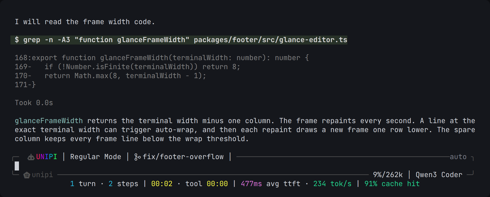

# Footer

Show live session stats and the state of every UniPi package at the bottom of the terminal.

`@pi-unipi/footer` · part of [UniPi](../../README.md)



## What it does

- Puts a frame around the input box. This is **glance mode**, and it is on by default.
- Shows a stats line below the input. It shows turns, steps, model time and tool time. It also shows average time to first token (TTFT), tokens per second, compactions and cache hit rate.
- Shows a line above the input with counts of background tasks: running, stopped, failed and done.
- Shows a status line with segments from each package when glance mode is off. This is the **classic** footer.
- Lets you select a preset, separator, icon style and color mode, and turn each segment on or off.

## Quick start

UniPi installs this package:

```bash
pi install npm:@pi-unipi/unipi
```

To install this package alone:

```bash
pi install npm:@pi-unipi/footer
```

The footer starts with the session. Open `/unipi:settings` → **Footer** to change it.

## Commands

| Command | What it does |
|---|---|
| `/unipi:footer` | Turns the footer on or off. |
| `/unipi:footer on` | Turns the footer on. |
| `/unipi:footer off` | Turns the footer off. |
| `/unipi:footer-help` | Shows each active segment with its icon, label and description. |

## The glance frame

The glance frame has three parts:

- **Top border.** The UNIPI brand, the long-horizon mode, the git branch, and the plan and permission mode. The brand shows a moving rainbow. The frame also shows the rainbow when the thinking level is `xhigh` or `max`.
- **Bottom border.** The workspace name, context use and window size, the model and the thinking level. With a [Fusion](../fusion/README.md) pair, it shows the lead and the sidekick. It also shows Kanboard claims.
- **Stats line.** The line below the input. A part stays hidden until it has data. For example, compactions show only after the first compaction.

The background-task line reads the [Background Tasks](../background-tasks/README.md) registry. It shows nothing when no task exists.

Set **Glance mode** to off to get the classic status line.

## Presets

A preset selects the segments of the classic status line.

| Preset | Segments |
|---|---|
| `default` | brand, mode, model, directory, git, context, compactions, tokens, TPS, cost, clock, duration |
| `classic` | mode, model, API state, tool count, git, TPS, context, cost, compactions, memory, command, loop status, extensions |
| `minimal` | mode, model, git, context, clock |
| `compact` | mode, model, git, TPS, context, cost, clock, duration |
| `full` | all groups, with a second row |
| `ascii` | the same segments as `compact` |

The hub list also shows `dense`, `devops` and `zen`. These names have no preset definition, so the footer uses `default` for them. To select `compact`, `full` or `ascii`, edit the settings file.

## Settings

Open `/unipi:settings` → **Footer**. The file is `~/.unipi/config/footer/config.json`. A project file at `.unipi/config/footer/config.json` overrides it.

| Key | Default | What it does |
|---|---|---|
| `enabled` | `true` | Turns the footer on or off. |
| `glanceMode` | `true` | Uses the glance frame around the input. |
| `preset` | `default` | Selects the segments of the classic status line. |
| `showFullLabels` | `false` | Shows full labels in place of short labels. |
| `separator` | `powerline-thin` | Segment divider: `powerline`, `powerline-thin`, `slash`, `pipe`, `dot`, `ascii`. |
| `zoneSeparator` | `│` | Divider between the left, center and right zones. |
| `iconStyle` | `nerd` | Icon set: `nerd` (needs a Nerd Font), `emoji` or `text`. |
| `colorMode` | `auto` | `auto`, `truecolor`, `256` or `none`. |
| `groups.<group>.show` | `true` (`notify`: `false`) | Shows or hides a segment group. |
| `groups.<group>.segments.<id>` | per segment | Shows or hides one segment. |

`colorMode: auto` uses 24-bit color where the terminal supports it. It uses 256 colors in terminals such as Apple Terminal. It uses no color when the `NO_COLOR` environment variable exists.

The hub **Color mode** list shows `mono`. The footer does not know this value and uses `auto`. Use `none` in the file to turn off color.

For the full list of segments and icons, refer to [Footer customization](../../FOOTER_CUSTOMIZATION.md).

## How it works

The footer listens to UniPi events on the [event bus](../../docs/architecture/event-bus.md). Examples are `MEMORY_STORED`, `MCP_SERVER_STARTED`, `RALPH_LOOP_START`, `WORKFLOW_START`, `COMPACTOR_COMPACTED` and `NOTIFICATION_SENT`. It keeps the last data of each event. Thus a package that loads after the footer still shows its data.

Some segments read data directly: the Pi session, the Kanboard registry and the Info Screen cache. The footer draws again each second.

The classic status line puts segments that do not fit into a second row.

## See also

- [Footer customization](../../FOOTER_CUSTOMIZATION.md)
- [Info Screen](../info-screen/README.md)
- [Settings reference](../../docs/reference/settings.md)
